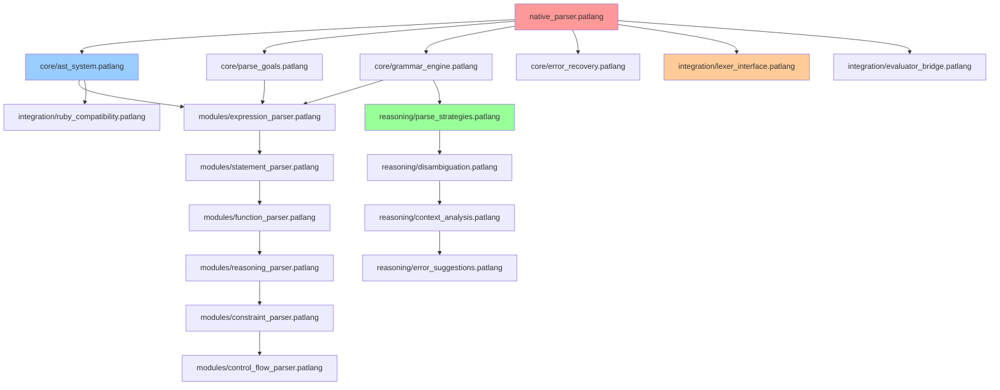

# Native PaTLang Parser Directory Structure Specification

## Overview

This document provides the complete directory structure specification for the Native PaTLang Parser, designed to mirror the successful organization of the [`native_lexer/`](native_lexer/README.md) directory while scaling to accommodate the parser's additional complexity and integration requirements.

## Design Principles

### 1. Modular Architecture
- **Separation of Concerns**: Each directory focuses on a specific aspect of parsing
- **Component Independence**: Modules can be developed and tested independently
- **Clear Dependencies**: Explicit dependency relationships between components

### 2. Scalability
- **Hierarchical Organization**: Logical grouping from core to specialized components
- **Extension Points**: Clear locations for adding new language features
- **Test Integration**: Testing components co-located with implementation

### 3. Documentation-First Approach
- **Self-Documenting Structure**: Directory names clearly indicate purpose
- **Comprehensive Documentation**: Each major component has detailed documentation
- **Example-Driven Learning**: Practical examples demonstrate usage patterns

## Complete Directory Structure

```
native_parser/
├── README.md                           # Main architecture documentation
├── native_parser.patlang               # Primary parser implementation
│
├── core/                               # Foundation Components (1,650 lines)
│   ├── ast_system.patlang             # AST node definitions and factories
│   ├── parse_goals.patlang            # Goal-oriented parsing objectives  
│   ├── grammar_engine.patlang         # Grammar rule processing engine
│   └── error_recovery.patlang         # Error handling and recovery framework
│
├── modules/                            # Specialized Parsers (2,600 lines)
│   ├── expression_parser.patlang      # Arithmetic and logical expressions
│   ├── statement_parser.patlang       # Statement parsing logic
│   ├── function_parser.patlang        # Function definition parsing
│   ├── reasoning_parser.patlang       # Reasoning syntax (facts, rules, goals)
│   ├── constraint_parser.patlang      # Type constraint parsing
│   └── control_flow_parser.patlang    # Control flow structures
│
├── reasoning/                          # Intelligence Layer (1,400 lines)
│   ├── parse_strategies.patlang       # Strategy selection logic
│   ├── disambiguation.patlang         # Ambiguity resolution engine
│   ├── context_analysis.patlang       # Context tracking and inference
│   └── error_suggestions.patlang      # Intelligent error recovery suggestions
│
├── integration/                        # Compatibility Layer (1,000 lines)
│   ├── lexer_interface.patlang        # Native lexer integration
│   ├── ruby_compatibility.patlang     # Ruby parser compatibility bridge
│   └── evaluator_bridge.patlang       # Evaluator integration interface
│
├── tests/                              # Testing Framework (1,400 lines)
│   ├── core_parser_tests.patlang      # Core component validation
│   ├── integration_tests.patlang      # End-to-end parsing tests
│   ├── performance_tests.patlang      # Performance benchmarking
│   ├── compatibility_tests.patlang    # Ruby compatibility validation
│   └── test_utilities.patlang         # Shared testing utilities
│
├── examples/                           # Usage Examples (350 lines)
│   ├── simple_expressions.pat         # Basic parsing examples
│   ├── complex_functions.pat          # Advanced function parsing
│   ├── reasoning_syntax.pat           # Reasoning construct examples
│   └── error_recovery.pat             # Error handling demonstrations
│
└── docs/                               # Technical Documentation
    ├── GRAMMAR_SPECIFICATION.md       # Complete PaTLang grammar
    ├── PARSING_STRATEGIES.md          # Strategy documentation
    ├── INTEGRATION_GUIDE.md           # Ruby integration guide
    ├── PERFORMANCE_ANALYSIS.md        # Performance benchmarking
    └── EXTENSION_GUIDE.md             # Adding new language features
```

**Total Implementation**: ~8,400 lines across 29 files
**Core Logic**: ~6,650 lines in 18 implementation files  
**Testing & Validation**: ~1,400 lines ensuring quality
**Examples & Documentation**: ~350 lines + comprehensive guides

## Detailed Component Specifications

### Core Components (`core/` - 4 files, 1,650 lines)

#### [`core/ast_system.patlang`](native_parser/core/ast_system.patlang:1) - 400 lines
**Purpose**: AST node creation, validation, and type safety
**Key Responsibilities**:
- AST node type definitions using PaTLang constraints
- Goal-oriented AST construction strategies
- Node validation and semantic checking
- Ruby AST compatibility interface

**Component Structure**:
```patlang
# Type-safe AST node definitions (80 lines)
constrain ast_node :: ASTNode where ...
constrain expression_node :: ExpressionNode extends ASTNode where ...

# Goal-oriented construction (120 lines)  
goal create_expression_ast(tokens, context) { ... }
goal validate_ast_tree(ast_node) { ... }

# Node factory logic (100 lines)
rule create_binary_operation_node(left, op, right, result) :- ...
rule create_function_definition_node(name, params, body, result) :- ...

# Validation framework (100 lines)
rule validate_node_structure(node) :- ...
rule validate_node_semantics(node) :- ...
```

#### [`core/parse_goals.patlang`](native_parser/core/parse_goals.patlang:1) - 300 lines
**Purpose**: Goal-oriented parsing framework
**Key Responsibilities**:
- Primary parsing goals and strategies
- Goal decomposition and execution
- Strategy selection logic
- Performance optimization goals

**Component Structure**:
```patlang
# Primary parsing goals (100 lines)
goal parse_program(tokens) { ... }
goal parse_statement(tokens, position) { ... }
goal parse_expression(tokens, position) { ... }

# Strategy definitions (100 lines)
fact parsing_strategy("recursive_descent", properties)
fact parsing_strategy("precedence_climbing", properties)
fact parsing_strategy("reasoning_guided", properties)

# Goal execution framework (100 lines)
rule execute_parsing_goal(goal, context, result) :- ...
rule select_optimal_strategy(goal, context, strategy) :- ...
```

#### [`core/grammar_engine.patlang`](native_parser/core/grammar_engine.patlang:1) - 600 lines
**Purpose**: Logic-based grammar rule processing
**Key Responsibilities**:
- Grammar rule definitions and storage
- Pattern matching and rule application
- Precedence and associativity handling
- Grammar validation and consistency checking

**Component Structure**:
```patlang
# Grammar rule facts (200 lines)
fact grammar_rule("expression", ["logical_or"])
fact grammar_rule("logical_or", ["logical_and", "('or'", "logical_and)*"])
# ... complete grammar definition

# Precedence and associativity (100 lines)
fact operator_precedence("+", 5)
fact operator_associativity("+", "left")
# ... all operators

# Rule application logic (200 lines)
rule apply_grammar_rule(rule_name, tokens, result) :- ...
rule match_token_pattern(tokens, pattern, result) :- ...

# Grammar validation (100 lines)
rule validate_grammar_consistency(rules) :- ...
rule detect_grammar_conflicts(rules, conflicts) :- ...
```

#### [`core/error_recovery.patlang`](native_parser/core/error_recovery.patlang:1) - 350 lines
**Purpose**: Intelligent error handling and recovery
**Key Responsibilities**:
- Error classification and categorization
- Recovery strategy selection
- Error message generation
- Parsing continuation after errors

**Component Structure**:
```patlang
# Error classification (100 lines)
rule classify_parse_error(error_info, error_category) :- ...
fact error_recovery_strategy("missing_token", "insert_placeholder")

# Recovery logic (150 lines)
goal recover_from_parse_error(error_context) { ... }
rule select_recovery_strategy(error_type, context, strategy) :- ...

# Error reporting (100 lines)
rule generate_error_message(error_context, message) :- ...
rule suggest_error_correction(error, suggestions) :- ...
```

### Specialized Parsers (`modules/` - 6 files, 2,600 lines)

#### [`modules/expression_parser.patlang`](native_parser/modules/expression_parser.patlang:1) - 500 lines
**Purpose**: Arithmetic and logical expression parsing
**Key Responsibilities**:
- Precedence-based expression parsing
- Operator associativity handling
- Parentheses and grouping support
- Binary and unary operation parsing

#### [`modules/statement_parser.patlang`](native_parser/modules/statement_parser.patlang:1) - 450 lines
**Purpose**: Statement-level parsing logic
**Key Responsibilities**:
- Assignment statement parsing
- Expression statement handling
- Statement sequencing and blocks
- Statement-level error recovery

#### [`modules/function_parser.patlang`](native_parser/modules/function_parser.patlang:1) - 400 lines
**Purpose**: Function definition and call parsing
**Key Responsibilities**:
- Natural language function syntax: `make a function called...`
- Parameter list parsing with type constraints
- Function body parsing and validation
- Return type inference and validation

#### [`modules/reasoning_parser.patlang`](native_parser/modules/reasoning_parser.patlang:1) - 500 lines
**Purpose**: Reasoning construct parsing (facts, rules, goals)
**Key Responsibilities**:
- Fact definition parsing: `fact parent(john, mary)`
- Rule definition parsing with complex logic
- Goal definition and strategy parsing
- Reasoning mode control: `reasoning mode on/off`

#### [`modules/constraint_parser.patlang`](native_parser/modules/constraint_parser.patlang:1) - 400 lines
**Purpose**: Type constraint and validation parsing
**Key Responsibilities**:
- Type constraint syntax: `constrain x :: Number`
- Complex constraint conditions: `where x > 0`
- Structural constraints for objects
- Constraint validation and inference

#### [`modules/control_flow_parser.patlang`](native_parser/modules/control_flow_parser.patlang:1) - 350 lines
**Purpose**: Control flow structure parsing
**Key Responsibilities**:
- Conditional statements: `if...then...else...end`
- Loop constructs: `while...do...end`
- Block structure handling
- Control flow validation

### Intelligence Layer (`reasoning/` - 4 files, 1,400 lines)

#### [`reasoning/parse_strategies.patlang`](native_parser/reasoning/parse_strategies.patlang:1) - 350 lines
**Purpose**: Intelligent parsing strategy selection
**Key Responsibilities**:
- Input analysis and characterization
- Strategy selection based on complexity
- Performance optimization through strategy choice
- Adaptive parsing behavior

#### [`reasoning/disambiguation.patlang`](native_parser/reasoning/disambiguation.patlang:1) - 400 lines
**Purpose**: Context-aware ambiguity resolution
**Key Responsibilities**:
- Ambiguity detection in token sequences
- Context-based resolution decisions
- Keyword vs identifier disambiguation
- Multi-interpretation conflict resolution

#### [`reasoning/context_analysis.patlang`](native_parser/reasoning/context_analysis.patlang:1) - 350 lines
**Purpose**: Parsing context tracking and inference
**Key Responsibilities**:
- Context state maintenance throughout parsing
- Scope tracking for variables and functions
- Expectation inference for better error messages
- Context history for disambiguation

#### [`reasoning/error_suggestions.patlang`](native_parser/reasoning/error_suggestions.patlang:1) - 300 lines
**Purpose**: Intelligent error recovery suggestions
**Key Responsibilities**:
- Error pattern analysis
- Context-aware suggestion generation
- Similar token identification
- Recovery strategy recommendation

### Compatibility Layer (`integration/` - 3 files, 1,000 lines)

#### [`integration/lexer_interface.patlang`](native_parser/integration/lexer_interface.patlang:1) - 250 lines
**Purpose**: Native lexer integration
**Key Responsibilities**:
- Token stream processing from native lexer
- Token format validation and conversion
- Lookahead buffer management
- Position tracking synchronization

#### [`integration/ruby_compatibility.patlang`](native_parser/integration/ruby_compatibility.patlang:1) - 400 lines
**Purpose**: Ruby parser compatibility bridge
**Key Responsibilities**:
- AST format conversion for Ruby evaluator
- Interface compatibility maintenance
- Error format translation
- Performance compatibility

#### [`integration/evaluator_bridge.patlang`](native_parser/integration/evaluator_bridge.patlang:1) - 350 lines
**Purpose**: Evaluator integration interface
**Key Responsibilities**:
- AST preparation for evaluation
- Semantic information preservation
- Runtime context bridging
- Evaluation readiness validation

### Testing Framework (`tests/` - 5 files, 1,400 lines)

#### [`tests/core_parser_tests.patlang`](native_parser/tests/core_parser_tests.patlang:1) - 400 lines
**Purpose**: Core component validation
**Test Categories**:
- AST system functionality
- Grammar engine accuracy
- Error recovery effectiveness
- Parse goal execution

#### [`tests/integration_tests.patlang`](native_parser/tests/integration_tests.patlang:1) - 350 lines
**Purpose**: End-to-end parsing validation
**Test Categories**:
- Complete program parsing
- Native lexer integration
- Multi-paradigm syntax combinations
- Complex nested structures

#### [`tests/performance_tests.patlang`](native_parser/tests/performance_tests.patlang:1) - 300 lines
**Purpose**: Performance benchmarking
**Test Categories**:
- Parsing speed measurements
- Memory usage analysis
- Scalability testing
- Optimization effectiveness

#### [`tests/compatibility_tests.patlang`](native_parser/tests/compatibility_tests.patlang:1) - 350 lines
**Purpose**: Ruby compatibility validation
**Test Categories**:
- AST output comparison
- Error message compatibility
- Interface behavior matching
- Regression prevention

## File Organization Patterns

### Naming Conventions

**Implementation Files**: `component_name.patlang`
- Clear, descriptive names indicating component purpose
- Consistent suffix pattern for easy identification
- Hierarchical naming for related components

**Test Files**: `component_tests.patlang`
- Direct correspondence to implementation files
- Comprehensive test coverage for each component
- Shared utilities in dedicated files

**Documentation Files**: `COMPONENT_GUIDE.md`
- All caps for major documentation files
- Descriptive names indicating content focus
- Consistent formatting and structure

### Directory Hierarchy Logic

**Level 1**: Functional Categories
- `core/` - Essential parsing infrastructure
- `modules/` - Language-specific parsing logic
- `reasoning/` - Intelligence and optimization
- `integration/` - External system interfaces

**Level 2**: Specific Components
- Single responsibility per file
- Clear dependencies between components
- Logical grouping within directories

**Level 3**: Implementation Details
- Well-structured internal organization
- Consistent patterns across files
- Clear separation of concerns

## Dependencies and Relationships

### Dependency Graph



### Component Interactions

**Core Components** provide foundational services to all other components
**Modules** implement specific parsing logic using core services
**Reasoning** enhances modules with intelligent behavior
**Integration** bridges native parser to external systems

## Scalability and Extension Points

### Adding New Language Features

**Step 1**: Define grammar rules in [`core/grammar_engine.patlang`](native_parser/core/grammar_engine.patlang:1)
**Step 2**: Create specialized parser in `modules/` directory
**Step 3**: Add reasoning logic in `reasoning/` if needed
**Step 4**: Update integration components for compatibility
**Step 5**: Add comprehensive tests in `tests/` directory

### Performance Optimization Points

- **Strategy Selection**: Enhance [`reasoning/parse_strategies.patlang`](native_parser/reasoning/parse_strategies.patlang:1)
- **Caching**: Add memoization in core components
- **Parallelization**: Extend grammar engine for parallel parsing
- **Memory Management**: Optimize AST creation and cleanup

### Testing Extension

- **New Test Categories**: Add to appropriate test files
- **Performance Benchmarks**: Extend performance testing
- **Regression Prevention**: Update compatibility tests
- **Integration Scenarios**: Add complex parsing tests

## Quality Assurance

### Code Organization Standards

**File Size Limits**: 300-600 lines per file for maintainability
**Component Cohesion**: Single responsibility per component
**Interface Clarity**: Well-defined component boundaries
**Documentation Coverage**: Comprehensive documentation for all components

### Testing Standards

**Coverage Requirements**: 95%+ test coverage for all components
**Test Categories**: Unit, integration, performance, compatibility
**Validation Depth**: Thorough testing of error conditions
**Regression Prevention**: Comprehensive baseline test suite

### Documentation Standards

**Architecture Documentation**: Complete system overview
**Component Documentation**: Detailed component specifications
**Integration Guides**: Clear instructions for system integration
**Example Coverage**: Practical usage examples for all features

## Migration Strategy

### From Ruby Parser to Native Parser

**Phase 1**: Parallel implementation with compatibility testing
**Phase 2**: Gradual feature migration with validation
**Phase 3**: Performance optimization and tuning
**Phase 4**: Complete replacement with fallback options

### Integration Testing Strategy

**Compatibility Validation**: Ensure identical behavior to Ruby parser
**Performance Benchmarking**: Match or exceed Ruby parser performance
**Regression Testing**: Prevent functionality degradation
**User Acceptance**: Validate improvements in error handling and extensibility

## Conclusion

This directory structure specification provides a comprehensive foundation for implementing the Native PaTLang Parser, ensuring:

- **Scalable Architecture**: Clear organization supporting growth and extension
- **Quality Assurance**: Comprehensive testing and validation framework
- **Integration Success**: Smooth compatibility with existing systems
- **Developer Experience**: Clear structure for understanding and extending the parser

The structure builds on the proven success of the native lexer while accommodating the additional complexity and integration requirements of a full parser implementation, setting the foundation for PaTLang's continued evolution toward complete self-hosting.