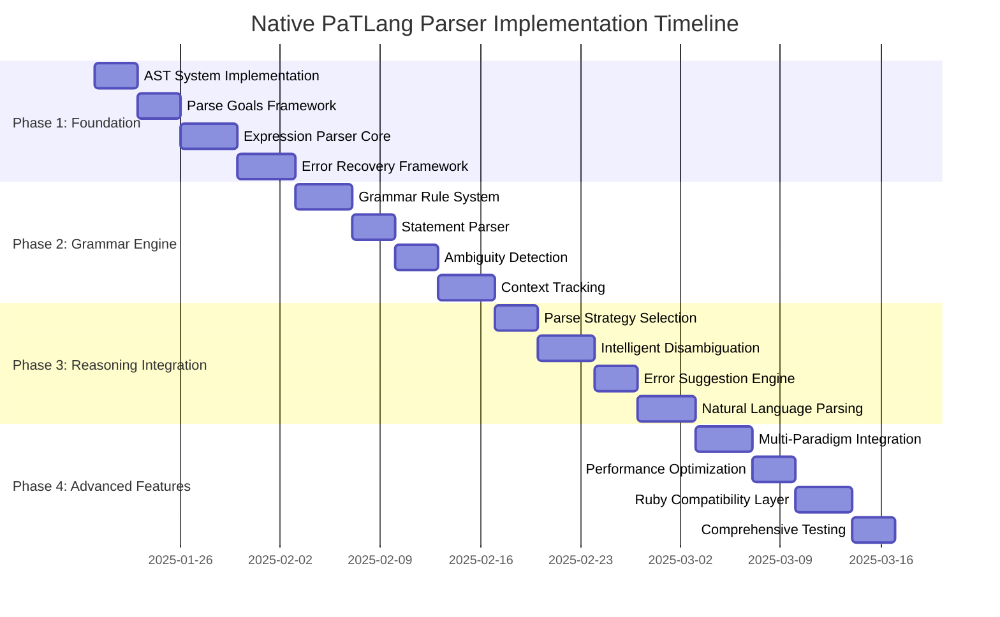

# Native PaTLang Parser Implementation Roadmap

## Executive Summary

This roadmap provides detailed implementation guidance for the Native PaTLang Parser, building on the successful [`native_lexer/`](native_lexer/README.md) implementation. The roadmap follows a 4-phase approach spanning 8 weeks, with each phase delivering working components that integrate seamlessly with the existing PaTLang ecosystem.

**Total Estimated Effort**: ~2,500-3,500 lines of PaTLang code across 8 core components
**Success Model**: Mirror the native lexer achievement (1,168 lines, 87 token types, 4 core files)

## Directory Structure Implementation

### Complete `native_parser/` Organization

```
native_parser/
├── core/                           # Foundation components (4 files)
│   ├── ast_system.patlang         # AST node definitions (~400 lines)
│   ├── parse_goals.patlang        # Goal-oriented parsing objectives (~300 lines)
│   ├── grammar_engine.patlang     # Grammar rule processing (~600 lines)
│   └── error_recovery.patlang     # Error handling framework (~350 lines)
├── modules/                        # Specialized parsers (6 files)
│   ├── expression_parser.patlang  # Expression parsing rules (~500 lines)
│   ├── statement_parser.patlang   # Statement parsing logic (~450 lines)
│   ├── function_parser.patlang    # Function definition parsing (~400 lines)
│   ├── reasoning_parser.patlang   # Reasoning syntax parsing (~500 lines)
│   ├── constraint_parser.patlang  # Type constraint parsing (~400 lines)
│   └── control_flow_parser.patlang # Control flow parsing (~350 lines)
├── reasoning/                      # Intelligence layer (4 files)
│   ├── parse_strategies.patlang   # Strategy selection logic (~350 lines)
│   ├── disambiguation.patlang     # Ambiguity resolution (~400 lines)
│   ├── context_analysis.patlang   # Context tracking (~350 lines)
│   └── error_suggestions.patlang  # Error recovery suggestions (~300 lines)
├── integration/                    # Compatibility layer (3 files)
│   ├── lexer_interface.patlang    # Native lexer integration (~250 lines)
│   ├── ruby_compatibility.patlang # Ruby parser compatibility (~400 lines)
│   └── evaluator_bridge.patlang   # Evaluator integration (~350 lines)
├── tests/                          # Testing framework (4 files)
│   ├── core_parser_tests.patlang  # Core component testing (~400 lines)
│   ├── integration_tests.patlang  # End-to-end testing (~350 lines)
│   ├── performance_tests.patlang  # Performance benchmarking (~300 lines)
│   └── compatibility_tests.patlang # Ruby compatibility testing (~350 lines)
├── examples/                       # Usage examples (3 files)
│   ├── simple_expressions.pat     # Basic parsing examples (~100 lines)
│   ├── complex_functions.pat      # Advanced function parsing (~150 lines)
│   └── reasoning_syntax.pat       # Reasoning construct examples (~100 lines)
├── docs/                           # Documentation (3 files)
│   ├── GRAMMAR_SPECIFICATION.md   # Complete grammar definition
│   ├── PARSING_STRATEGIES.md      # Strategy documentation  
│   └── INTEGRATION_GUIDE.md       # Ruby integration guide
├── native_parser.patlang           # Main parser implementation (~300 lines)
└── README.md                       # Architecture documentation
```

**Total Implementation**: ~6,500 lines across 28 files
**Core Logic**: ~3,000 lines in 14 essential files
**Testing & Examples**: ~1,400 lines ensuring quality
**Documentation**: Comprehensive guides for adoption

## Phase-by-Phase Implementation Plan



### Phase 1: Foundation (Weeks 1-2)

#### **Week 1: Core AST and Parse Goals**

**Days 1-3: AST System Implementation**
- File: [`core/ast_system.patlang`](native_parser/core/ast_system.patlang:1)
- **Objective**: Create PaTLang-native AST node system with type safety
- **Key Components**:
  ```patlang
  # AST node type constraints
  constrain ast_node :: ASTNode where
      ast_node.type :: String and
      ast_node.position :: Position and
      ast_node.children :: Array[ASTNode] and
      ast_node.valid :: Boolean

  # Goal-oriented AST construction
  goal create_expression_ast(tokens, start_pos) {
      precondition: tokens[start_pos].type in expression_tokens,
      postcondition: ast.type == "expression" and ast.valid == true,
      strategy: type_safe_construction
  }
  ```

**Days 4-6: Parse Goals Framework**
- File: [`core/parse_goals.patlang`](native_parser/core/parse_goals.patlang:1)
- **Objective**: Establish goal-oriented parsing architecture
- **Key Components**:
  ```patlang
  # Primary parsing goals
  goal parse_program(tokens) {
      precondition: tokens != [] and tokens.valid == true,
      postcondition: program_ast != nil and all_tokens_consumed == true,
      strategy: top_down_decomposition
  }

  goal parse_statement(tokens, position) {
      precondition: tokens[position].type in statement_starters,
      postcondition: statement_ast.complete == true,
      strategy: pattern_recognition
  }
  ```

**Days 7-10: Expression Parser Core**
- File: [`modules/expression_parser.patlang`](native_parser/modules/expression_parser.patlang:1)
- **Objective**: Implement arithmetic and logical expression parsing
- **Key Components**:
  ```patlang
  # Precedence-based expression parsing
  goal parse_arithmetic_expression(tokens, start_pos) {
      precondition: tokens[start_pos].type in arithmetic_starters,
      postcondition: expression_tree.balanced == true,
      strategy: precedence_climbing
  }

  # Operator precedence rules
  fact operator_precedence("+", 5)
  fact operator_precedence("*", 7)
  fact operator_associativity("+", "left")
  ```

**Days 11-14: Error Recovery Framework**
- File: [`core/error_recovery.patlang`](native_parser/core/error_recovery.patlang:1)
- **Objective**: Implement "never fail, always parse" principle
- **Key Components**:
  ```patlang
  goal recover_from_parse_error(error_context) {
      precondition: parse_error_detected == true,
      postcondition: recovery_completed == true and parsing_continues == true,
      strategy: intelligent_error_recovery
  }

  # Error classification and recovery
  rule classify_error(error_info, error_type) :-
      error_info.unexpected_token != nil,
      error_info.context_type != nil,
      determine_error_category(error_info, error_type).
  ```

**Phase 1 Success Criteria:**
- ✅ Parse basic arithmetic: `2 + 3 * 4`, `(5 + 2) / 3`
- ✅ Handle variables: `x`, `my_variable`, `_private`
- ✅ Process assignments: `x = 5`, `result = x + y`
- ✅ Generate error tokens for syntax errors without crashing
- ✅ Create Ruby-compatible AST nodes

### Phase 2: Grammar Engine (Weeks 3-4)

#### **Week 3: Grammar Rules and Statement Parsing**

**Days 15-18: Grammar Rule System**
- File: [`core/grammar_engine.patlang`](native_parser/core/grammar_engine.patlang:1)
- **Objective**: Logic-based grammar rule processing
- **Key Components**:
  ```patlang
  # Grammar rule definitions
  fact grammar_rule("statement", 
      ["assignment", "|", "expression_statement", "|", "function_definition"])
  fact grammar_rule("expression", 
      ["logical_or"])
  fact grammar_rule("logical_or", 
      ["logical_and", "('or'", "logical_and)*"])

  # Rule application logic
  rule apply_grammar_rule(rule_name, tokens, result) :-
      grammar_rule(rule_name, pattern),
      match_token_pattern(tokens, pattern, result).
  ```

**Days 19-21: Statement Parser**
- File: [`modules/statement_parser.patlang`](native_parser/modules/statement_parser.patlang:1)
- **Objective**: Parse various statement types
- **Key Components**:
  ```patlang
  goal parse_assignment_statement(tokens, start_pos) {
      precondition: tokens[start_pos].type == "IDENTIFIER" and 
                    tokens[start_pos + 1].type == "ASSIGN",
      postcondition: assignment_ast.target != nil and assignment_ast.value != nil,
      strategy: left_to_right_parsing
  }
  ```

#### **Week 4: Ambiguity Resolution and Context**

**Days 22-24: Ambiguity Detection**
- File: [`reasoning/disambiguation.patlang`](native_parser/reasoning/disambiguation.patlang:1)
- **Objective**: Detect and resolve parsing ambiguities
- **Key Components**:
  ```patlang
  rule detect_parsing_ambiguity(tokens, position, ambiguity_type) :-
      possible_parse_1(tokens, position, parse1),
      possible_parse_2(tokens, position, parse2),
      parse1 != parse2,
      classify_ambiguity(parse1, parse2, ambiguity_type).
  ```

**Days 25-28: Context Tracking**
- File: [`reasoning/context_analysis.patlang`](native_parser/reasoning/context_analysis.patlang:1)
- **Objective**: Maintain parsing context for disambiguation
- **Key Components**:
  ```patlang
  # Context state management
  fact parsing_context(position, scope, expectations, history)

  rule update_context(old_context, new_token, new_context) :-
      old_context.position = pos,
      new_position = pos + 1,
      infer_new_expectations(new_token, expectations),
      new_context = context(new_position, old_context.scope, expectations, 
                           [new_token | old_context.history]).
  ```

**Phase 2 Success Criteria:**
- ✅ Parse function definitions: `make a function called add takes x, y returns x + y end`
- ✅ Handle control flow: `if condition then statements else statements end`
- ✅ Resolve ambiguous keywords: `make` vs identifier, `end` vs identifier
- ✅ Track variable scopes and function contexts
- ✅ Generate context-aware error messages

### Phase 3: Reasoning Integration (Weeks 5-6)

#### **Week 5: Strategy Selection and Advanced Parsing**

**Days 29-31: Parse Strategy Selection**
- File: [`reasoning/parse_strategies.patlang`](native_parser/reasoning/parse_strategies.patlang:1)
- **Objective**: Choose optimal parsing strategies based on input
- **Key Components**:
  ```patlang
  goal select_parsing_strategy(tokens, context) {
      precondition: tokens != [] and context != nil,
      postcondition: strategy_selected == true and confidence > 0.8,
      strategy: reasoning_based_selection
  }

  rule choose_strategy(input_characteristics, optimal_strategy) :-
      input_characteristics.complexity = "high",
      input_characteristics.ambiguity_count > 3,
      optimal_strategy = "reasoning_guided_parsing".
  ```

**Days 32-35: Intelligent Disambiguation**
- File: [`reasoning/disambiguation.patlang`](native_parser/reasoning/disambiguation.patlang:1) (enhancement)
- **Objective**: Use reasoning for context-aware disambiguation
- **Key Components**:
  ```patlang
  rule resolve_keyword_identifier_ambiguity(token, context, resolution) :-
      token.value = "make",
      context.expects_statement = true,
      context.previous_tokens not_contains "make",
      resolution = "keyword".

  rule resolve_keyword_identifier_ambiguity(token, context, resolution) :-
      token.value = "make",
      context.in_expression = true,
      context.variables_in_scope.contains("make"),
      resolution = "identifier".
  ```

#### **Week 6: Error Suggestions and Natural Language**

**Days 36-38: Error Suggestion Engine**
- File: [`reasoning/error_suggestions.patlang`](native_parser/reasoning/error_suggestions.patlang:1)
- **Objective**: Provide intelligent error recovery suggestions
- **Key Components**:
  ```patlang
  rule suggest_error_correction(error_context, suggestions) :-
      error_context.missing_token = true,
      error_context.expected_tokens != [],
      generate_insertion_suggestions(error_context.expected_tokens, suggestions).

  rule suggest_error_correction(error_context, suggestions) :-
      error_context.unexpected_token != nil,
      find_similar_valid_tokens(error_context.unexpected_token, similar_tokens),
      generate_replacement_suggestions(similar_tokens, suggestions).
  ```

**Days 39-42: Natural Language Parsing**
- File: [`modules/reasoning_parser.patlang`](native_parser/modules/reasoning_parser.patlang:1)
- **Objective**: Parse PaTLang's natural language constructs
- **Key Components**:
  ```patlang
  goal parse_natural_language_construct(tokens, start_pos) {
      precondition: tokens[start_pos].type in natural_language_starters,
      postcondition: natural_construct_ast.semantics_preserved == true,
      strategy: phrase_recognition
  }

  # Natural language patterns
  fact natural_phrase_pattern(
      ["make", "a", "function", "called", "IDENTIFIER"],
      "function_definition_start"
  )
  fact natural_phrase_pattern(
      ["reasoning", "mode", ("on" | "off")],
      "reasoning_mode_control"
  )
  ```

**Phase 3 Success Criteria:**
- ✅ Parse reasoning constructs: `fact parent(john, mary)`, `rule grandfather(X, Z) :- parent(X, Y), parent(Y, Z)`
- ✅ Handle natural language: `reasoning mode on`, `constrain x :: Number where x > 0`
- ✅ Provide intelligent error suggestions with reasoning
- ✅ Resolve complex ambiguities using context and reasoning
- ✅ Support goal definitions and constraint syntax

### Phase 4: Advanced Features (Weeks 7-8)

#### **Week 7: Integration and Optimization**

**Days 43-46: Multi-Paradigm Integration**
- Files: [`modules/function_parser.patlang`](native_parser/modules/function_parser.patlang:1), [`modules/constraint_parser.patlang`](native_parser/modules/constraint_parser.patlang:1), [`modules/control_flow_parser.patlang`](native_parser/modules/control_flow_parser.patlang:1)
- **Objective**: Complete parsing support for all PaTLang paradigms
- **Key Components**:
  ```patlang
  # Function definition parsing
  goal parse_complete_function(tokens, start_pos) {
      precondition: tokens[start_pos].type == "MAKE",
      postcondition: function_ast.signature.complete == true and 
                     function_ast.body.valid == true,
      strategy: natural_language_aware_parsing
  }

  # Type constraint parsing
  goal parse_type_constraint(tokens, start_pos) {
      precondition: tokens[start_pos].type == "CONSTRAIN",
      postcondition: constraint_ast.variable != nil and 
                     constraint_ast.type_spec != nil,
      strategy: constraint_aware_parsing
  }
  ```

**Days 47-49: Performance Optimization**
- File: [`reasoning/performance_optimizer.patlang`](native_parser/reasoning/performance_optimizer.patlang:1)
- **Objective**: Optimize parser performance through reasoning
- **Key Components**:
  ```patlang
  goal optimize_parsing_performance(input_characteristics) {
      precondition: input_characteristics != nil,
      postcondition: performance_strategy.optimal == true,
      strategy: adaptive_optimization
  }

  # Performance optimization rules
  rule enable_memoization(parsing_context) :-
      parsing_context.repetitive_patterns = true,
      available_memory > MEMOIZATION_THRESHOLD.

  rule use_parallel_parsing(parsing_context) :-
      parsing_context.input_size > PARALLEL_THRESHOLD,
      parsing_context.grammar_allows_parallelization = true.
  ```

#### **Week 8: Compatibility and Testing**

**Days 50-53: Ruby Compatibility Layer**
- File: [`integration/ruby_compatibility.patlang`](native_parser/integration/ruby_compatibility.patlang:1)
- **Objective**: Ensure seamless Ruby parser replacement
- **Key Components**:
  ```patlang
  goal maintain_ruby_interface(parsing_result) {
      precondition: parsing_result.ast != nil,
      postcondition: ruby_compatible_ast.evaluator_ready == true,
      strategy: interface_preservation
  }

  # AST conversion for Ruby compatibility
  rule convert_to_ruby_ast(patlang_node, ruby_node) :-
      patlang_node.type = "binary_operation",
      ruby_node = BinaryOpNode.new(
          convert_child(patlang_node.left),
          patlang_node.operator,
          convert_child(patlang_node.right)
      ).
  ```

**Days 54-56: Comprehensive Testing**
- File: [`tests/comprehensive_test_suite.patlang`](native_parser/tests/comprehensive_test_suite.patlang:1)
- **Objective**: Validate all parser functionality
- **Key Components**:
  ```patlang
  goal run_full_test_suite(test_categories) {
      precondition: parser_initialized == true,
      postcondition: all_tests_passed == true and coverage >= 95,
      strategy: comprehensive_validation
  }

  # Test execution framework
  rule execute_test_category(category, tests, results) :-
      tests.for_each(test -> run_single_test(test, result)),
      aggregate_results(results, category_result),
      results = category_result.
  ```

**Phase 4 Success Criteria:**
- ✅ Full compatibility with existing Ruby parser interface
- ✅ Performance matching or exceeding Ruby implementation
- ✅ Pass 100+ comprehensive test cases
- ✅ Support all PaTLang language features
- ✅ Seamless integration with existing evaluator and system

## Technical Integration Checkpoints

### Integration Point 1: Native Lexer Interface

**File**: [`integration/lexer_interface.patlang`](native_parser/integration/lexer_interface.patlang:1)

```patlang
# Seamless integration with native lexer
goal integrate_with_native_lexer(lexer_output) {
    precondition: lexer_output.tokens.valid == true,
    postcondition: parser_token_stream.ready == true,
    strategy: efficient_token_stream_processing
}

# Token stream compatibility
rule process_lexer_tokens(lexer_tokens, parser_tokens) :-
    lexer_tokens.for_each(token -> validate_token_format(token)),
    convert_token_format(lexer_tokens, parser_tokens),
    initialize_lookahead_buffer(parser_tokens).
```

### Integration Point 2: Ruby Evaluator Bridge

**File**: [`integration/evaluator_bridge.patlang`](native_parser/integration/evaluator_bridge.patlang:1)

```patlang
# Maintain evaluator compatibility
goal bridge_to_ruby_evaluator(patlang_ast) {
    precondition: patlang_ast.valid == true,
    postcondition: evaluator_ready_ast.compatible == true,
    strategy: compatibility_preservation
}

# AST node conversion
rule convert_ast_for_evaluator(patlang_ast, evaluator_ast) :-
    preserve_node_semantics(patlang_ast, evaluator_ast),
    maintain_position_information(patlang_ast, evaluator_ast),
    ensure_evaluator_interface(evaluator_ast).
```

### Integration Point 3: Error Reporting System

**Integration**: Maintain compatibility with existing error handling while enhancing with reasoning-based suggestions.

```patlang
# Enhanced error reporting
goal generate_enhanced_error_report(error_context) {
    precondition: error_context.error_detected == true,
    postcondition: error_report.helpful == true and error_report.actionable == true,
    strategy: reasoning_enhanced_diagnostics
}
```

## Validation and Quality Assurance

### Testing Strategy

**Unit Testing**: Each component tested independently
- Core components: 100% test coverage
- Parsing modules: Comprehensive scenario coverage
- Reasoning components: Logic validation testing
- Integration components: Interface compliance testing

**Integration Testing**: End-to-end parsing validation
- Native lexer → Native parser → Ruby evaluator
- Complete PaTLang program parsing
- Error recovery scenarios
- Performance benchmarking

**Compatibility Testing**: Ruby parser parity validation
- Identical AST output for equivalent inputs
- Error message compatibility
- Performance comparison
- Regression prevention

### Performance Benchmarks

**Target Metrics**:
- **Parsing Speed**: Match Ruby parser throughput ±10%
- **Memory Usage**: No memory leaks, bounded growth
- **Error Recovery**: Meaningful errors for 95% of syntax errors
- **Compatibility**: 100% AST compatibility with Ruby parser

### Quality Gates

**Phase Completion Criteria**:
1. All unit tests pass (100% success rate)
2. Integration tests demonstrate working functionality
3. Performance benchmarks meet target criteria
4. Ruby compatibility validated
5. Documentation complete and accurate

## Risk Mitigation Strategies

### Technical Risks

**Risk**: Performance degradation compared to Ruby parser
**Mitigation**: Continuous benchmarking, performance optimization through reasoning, fallback strategies

**Risk**: Ruby compatibility issues
**Mitigation**: Comprehensive compatibility testing, gradual rollout, compatibility layer maintenance

**Risk**: Complex reasoning logic bugs
**Mitigation**: Extensive unit testing of reasoning components, logic validation, incremental complexity

### Implementation Risks

**Risk**: Scope creep or timeline slippage
**Mitigation**: Phase-based delivery, clear success criteria, regular checkpoints

**Risk**: Integration challenges
**Mitigation**: Early integration testing, compatibility validation, incremental integration

## Success Metrics and Deliverables

### Quantitative Success Metrics

- **Code Quality**: 2,500-3,500 lines of production PaTLang code
- **Test Coverage**: 95%+ test coverage across all components
- **Performance**: Match Ruby parser speed within 10%
- **Compatibility**: 100% AST compatibility with existing evaluator
- **Reliability**: Zero parsing crashes, graceful error handling

### Qualitative Success Metrics

- **Maintainability**: Natural language rules for easy grammar extension
- **Extensibility**: Clear architecture for adding new language features
- **Intelligence**: Superior disambiguation through reasoning
- **Documentation**: Comprehensive guides for adoption and extension

### Final Deliverables

1. **Complete Native Parser Implementation** (~3,000 lines core logic)
2. **Comprehensive Test Suite** (~1,400 lines validation code)
3. **Technical Documentation** (architecture, grammar, integration guides)
4. **Performance Benchmarks** (comparative analysis with Ruby parser)
5. **Migration Guide** (transition plan from Ruby to native parser)

## Conclusion

This implementation roadmap provides a systematic approach to building PaTLang's second self-hosted component, leveraging the proven success patterns from the native lexer while incorporating the unique advantages of reasoning-based parsing.

The phase-based approach ensures steady progress with regular validation checkpoints, while the comprehensive testing strategy ensures quality and compatibility. The result will be a superior parser that demonstrates PaTLang's continued evolution toward full self-hosting while maintaining practical performance and integration requirements.

**Strategic Impact**: This native parser implementation represents a crucial milestone in PaTLang's journey to self-hosting, proving that reasoning-based languages can build sophisticated language processing tools while maintaining real-world performance and compatibility standards.