# PaTLang Native Runtime Optimization Implementation Plan
## Hybrid Transpilation Approach

**Document Version**: 1.0  
**Date**: January 7, 2025  
**Approach**: Hybrid Transpilation (Recommended #1)  
**Timeline**: 12 weeks (84 days)  
**Expected Performance**: 85-95% of hand-optimized C  

---

## Executive Summary

This implementation plan outlines the development of a comprehensive native runtime optimization for PaTLang through Hybrid Transpilation. The approach leverages existing infrastructure including the 574-line native bridge, 744-line core evaluator, and 468-line memory manager to achieve significant performance improvements while maintaining full language compatibility.

**Key Benefits:**
- Optimal balance of development time (1-3 months) and performance (85-95% of hand-optimized C)
- Direct leverage of existing 574-line [`native_bridge.c`](native_evaluator/native_bridge.c) foundation
- Minimal risk with readable C output and maintainable codebase
- Full compatibility with existing PaTLang test suites

---

## 1. Technical Approach Justification

### Why Hybrid Transpilation?

**Leverages Existing Infrastructure:**
- **574-line Native Bridge**: [`native_bridge.c`](native_evaluator/native_bridge.c) provides mature, cross-platform foundation
- **744-line Core Evaluator**: [`core_evaluator.patlang`](native_evaluator/core_evaluator.patlang) contains complete evaluation engine
- **468-line Memory Manager**: [`memory_manager.patlang`](native_evaluator/memory_manager.patlang) implements sophisticated memory management
- **Existing Transpiler Framework**: [`core_transpiler.patlang`](transpiler/core_transpiler.patlang) provides foundation

**Technical Advantages:**
1. **Performance**: 85-95% of hand-optimized C performance
2. **Development Speed**: 1-3 month timeline vs 6-12 months for full rewrite
3. **Risk Mitigation**: Builds on proven, tested components
4. **Maintainability**: Generated C code is readable and debuggable

**Integration Strategy:**
- Transpile [`core_evaluator.patlang`](native_evaluator/core_evaluator.patlang) and [`memory_manager.patlang`](native_evaluator/memory_manager.patlang) to C
- Integrate seamlessly with existing [`native_bridge.h`](native_evaluator/native_bridge.h) API
- Maintain full compatibility with existing test infrastructure

---

## 2. Implementation Timeline and Phases

```mermaid
gantt
    title PaTLang Native Runtime Optimization Timeline (12 Weeks)
    dateFormat X
    axisFormat %d

    section Phase 1: Infrastructure (Weeks 1-2)
    Transpiler Enhancement     :active, p1-1, 0, 7
    Build System Integration   :p1-2, 3, 10
    Testing Framework         :p1-3, 5, 12
    Infrastructure Complete    :milestone, m1, 12, 0

    section Phase 2: Core Transpilation (Weeks 2-5)
    Core Evaluator Transpilation :p2-1, 7, 21
    Memory Manager Transpilation :p2-2, 14, 28
    Integration Testing         :p2-3, 21, 35
    Transpilation Complete      :milestone, m2, 35, 0

    section Phase 3: Optimization (Weeks 4-9)
    Performance Tuning        :p3-1, 28, 49
    Cross-Platform Validation :p3-2, 35, 56
    Production Readiness      :p3-3, 42, 63
    Optimization Complete     :milestone, m3, 63, 0

    section Phase 4: Validation (Weeks 7-12)
    Comprehensive Testing     :p4-1, 49, 70
    Performance Benchmarking :p4-2, 56, 77
    Documentation & Delivery :p4-3, 63, 84
    Project Complete          :milestone, m4, 84, 0
```

### Phase 1: Infrastructure Setup (Days 1-12, Weeks 1-2)

#### Milestone 1.1: Enhanced Transpiler (Days 1-7)
**Objective**: Extend existing transpiler with C-specific code generation

**Tasks:**
1. **Enhance [`core_transpiler.patlang`](transpiler/core_transpiler.patlang)**:
   - Add C backend code generation
   - Implement PaTLang goal construct → C function mapping
   - Create memory management integration patterns
   
2. **Implement C Code Generation**:
   - Goal constructs → C functions with precondition/postcondition validation
   - Rule-based logic → C control flow structures
   - Type system → C type declarations

3. **Create Code Templates**:
   - Function templates for PaTLang constructs
   - Memory management integration patterns
   - Error handling and debugging support

**Success Criteria:**
- [ ] Transpiler generates valid C code for basic PaTLang constructs
- [ ] Goal constructs properly mapped to C functions
- [ ] Generated code compiles without errors

**Deliverables:**
- Enhanced [`core_transpiler.patlang`](transpiler/core_transpiler.patlang) with C backend
- C code generation templates
- Basic transpilation test cases

#### Milestone 1.2: Build System Integration (Days 3-10)
**Objective**: Create automated transpilation and compilation workflow

**Tasks:**
1. **Extend [`Makefile`](native_evaluator/Makefile)**:
   - Add transpilation targets
   - Integrate with existing native bridge compilation
   - Create automated workflow from PaTLang source to native executable

2. **Dependency Management**:
   - Track transpiled file dependencies
   - Implement incremental compilation
   - Cross-platform build support

3. **Integration Testing**:
   - Verify transpiled code links with [`native_bridge.c`](native_evaluator/native_bridge.c)
   - Test cross-platform compilation
   - Validate build automation

**Success Criteria:**
- [ ] One-command build from PaTLang source to native executable
- [ ] Incremental compilation works correctly
- [ ] Cross-platform compilation verified (Linux, Windows, WSL)

**Deliverables:**
- Enhanced [`Makefile`](native_evaluator/Makefile) with transpilation support
- Automated build scripts
- Cross-platform build validation

#### Milestone 1.3: Testing Framework (Days 5-12)
**Objective**: Establish comprehensive testing and validation infrastructure

**Tasks:**
1. **Test Framework Setup**:
   - Adapt existing test suites for transpiled code
   - Create transpilation-specific test cases
   - Implement regression testing pipeline

2. **Performance Benchmarking**:
   - Create performance measurement infrastructure
   - Baseline performance against Ruby implementation
   - Establish performance regression detection

3. **Validation Pipeline**:
   - Automated testing for each transpilation
   - Cross-platform validation
   - Memory leak detection

**Success Criteria:**
- [ ] Comprehensive test coverage for transpilation process
- [ ] Performance benchmarking infrastructure operational
- [ ] Automated regression testing pipeline established

**Deliverables:**
- Transpiled code test framework
- Performance benchmarking suite
- Automated validation pipeline

### Phase 2: Core Transpilation (Days 7-35, Weeks 2-5)

#### Milestone 2.1: Core Evaluator Transpilation (Days 7-21)
**Objective**: Transpile [`core_evaluator.patlang`](native_evaluator/core_evaluator.patlang) to high-performance C code

**Tasks:**
1. **AST Evaluation Engine**:
   - Transpile main evaluation functions
   - Implement goal-oriented evaluation in C
   - Create efficient dispatch mechanisms

2. **Native Bridge Integration**:
   - Integrate with [`nb_allocate()`](native_evaluator/native_bridge.h:23)/[`nb_deallocate()`](native_evaluator/native_bridge.h:31)
   - Use [`nb_event_register()`](native_evaluator/native_bridge.h:62) for event handling
   - Leverage [`nb_file_open()`](native_evaluator/native_bridge.h:95) for I/O operations

3. **Performance Optimization**:
   - Optimize recursive evaluation patterns
   - Implement efficient value representation
   - Minimize memory allocations

**Success Criteria:**
- [ ] Core evaluator functions execute in native C
- [ ] Goal construct evaluation maintains semantics
- [ ] Integration with native bridge APIs functional
- [ ] Performance improvement measurable

**Deliverables:**
- Transpiled core evaluator C code
- Native bridge integration layer
- Performance benchmarking results

#### Milestone 2.2: Memory Manager Transpilation (Days 14-28)
**Objective**: Transpile [`memory_manager.patlang`](native_evaluator/memory_manager.patlang) for native performance

**Tasks:**
1. **Memory Allocation System**:
   - Transpile pool-based allocation strategies
   - Implement efficient reference counting
   - Create garbage collection triggers

2. **Native Integration**:
   - Deep integration with [`native_bridge.c`](native_evaluator/native_bridge.c) memory functions
   - Leverage platform-specific optimizations
   - Maintain memory safety guarantees

3. **Performance Tuning**:
   - Optimize allocation/deallocation paths
   - Implement memory pool management
   - Profile and tune garbage collection

**Success Criteria:**
- [ ] Memory management operates at native performance levels
- [ ] Integration with native bridge seamless
- [ ] Memory safety maintained
- [ ] Garbage collection efficiency preserved

**Deliverables:**
- Transpiled memory manager C code
- Native memory integration layer
- Memory performance benchmarks

#### Milestone 2.3: Integration Testing (Days 21-35)
**Objective**: Validate transpiled components work together effectively

**Tasks:**
1. **Component Integration**:
   - Test core evaluator with transpiled memory manager
   - Validate full evaluation pipeline
   - Stress test integrated system

2. **Compatibility Validation**:
   - Run existing PaTLang test suites
   - Verify semantic equivalence
   - Test edge cases and error conditions

3. **Performance Validation**:
   - Benchmark against Ruby baseline
   - Measure end-to-end performance improvements
   - Identify optimization opportunities

**Success Criteria:**
- [ ] 85%+ performance improvement over current Ruby implementation
- [ ] Full compatibility with existing test suites
- [ ] Stable operation under stress testing
- [ ] Memory usage within acceptable bounds

**Deliverables:**
- Integrated native runtime
- Compatibility test results
- Performance improvement documentation

### Phase 3: Optimization and Production Readiness (Days 28-63, Weeks 4-9)

#### Milestone 3.1: Performance Tuning (Days 28-49)
**Objective**: Achieve 85-95% of hand-optimized C performance

**Tasks:**
1. **Profiling and Analysis**:
   - Profile transpiled code for bottlenecks
   - Identify hot paths and optimization opportunities
   - Analyze memory allocation patterns

2. **Code Optimization**:
   - Implement C-specific optimizations
   - Optimize memory allocation patterns
   - Reduce function call overhead

3. **Algorithm Optimization**:
   - Optimize recursive evaluation strategies
   - Improve data structure efficiency
   - Implement specialized fast paths

**Success Criteria:**
- [ ] 85-95% of hand-optimized C performance achieved
- [ ] Hot path optimizations implemented
- [ ] Memory allocation overhead minimized
- [ ] Profiling confirms optimization effectiveness

**Deliverables:**
- Optimized transpiled code
- Performance analysis reports
- Optimization documentation

#### Milestone 3.2: Cross-Platform Validation (Days 35-56)
**Objective**: Ensure consistent behavior across all target platforms

**Tasks:**
1. **Platform Testing**:
   - Comprehensive testing on Windows, Linux, WSL
   - Validate portable C code generation
   - Test platform-specific optimizations

2. **Compatibility Assurance**:
   - Ensure identical functionality across platforms
   - Test edge cases on each platform
   - Validate cross-platform build system

3. **Performance Consistency**:
   - Benchmark performance on each platform
   - Ensure consistent optimization levels
   - Document platform-specific considerations

**Success Criteria:**
- [ ] Identical functionality on all target platforms
- [ ] Consistent performance characteristics
- [ ] Cross-platform build system reliable
- [ ] Platform-specific issues resolved

**Deliverables:**
- Cross-platform validation report
- Platform-specific documentation
- Verified build system

#### Milestone 3.3: Production Readiness (Days 42-63)
**Objective**: Prepare native runtime for production deployment

**Tasks:**
1. **Robustness Improvements**:
   - Enhance error handling and recovery
   - Implement comprehensive logging
   - Add diagnostic and debugging support

2. **Code Quality Review**:
   - Code review of all transpiled components
   - Documentation review and updates
   - Security review of generated code

3. **Integration Preparation**:
   - Final integration testing
   - Performance regression testing
   - Production deployment preparation

**Success Criteria:**
- [ ] Production-ready error handling
- [ ] Comprehensive documentation complete
- [ ] Security review passed
- [ ] Ready for production deployment

**Deliverables:**
- Production-ready native runtime
- Complete technical documentation
- Deployment guide

### Phase 4: Final Validation and Delivery (Days 49-84, Weeks 7-12)

#### Milestone 4.1: Comprehensive Testing (Days 49-70)
**Objective**: Execute complete validation of native runtime

**Tasks:**
1. **Regression Testing**:
   - Execute full regression test suite
   - Validate against all existing test cases
   - Test edge cases and error conditions

2. **Stress Testing**:
   - Long-running stability tests
   - Memory leak detection
   - Performance under load

3. **Integration Testing**:
   - Test with existing PaTLang applications
   - Validate tool integration
   - Test development workflow

**Success Criteria:**
- [ ] Zero regressions in existing functionality
- [ ] Stable operation under stress testing
- [ ] Memory leaks eliminated
- [ ] Integration with existing tools verified

**Deliverables:**
- Comprehensive test results
- Stability validation report
- Integration verification

#### Milestone 4.2: Performance Benchmarking (Days 56-77)
**Objective**: Document and validate performance achievements

**Tasks:**
1. **Performance Documentation**:
   - Comprehensive performance comparison
   - Document optimization achievements
   - Create performance regression tests

2. **Benchmarking Suite**:
   - Create standardized benchmark suite
   - Compare against Ruby and other baselines
   - Document performance characteristics

3. **Optimization Analysis**:
   - Analyze achieved optimizations
   - Document optimization techniques
   - Identify future optimization opportunities

**Success Criteria:**
- [ ] Documented 85-95% performance improvement
- [ ] Comprehensive benchmark suite created
- [ ] Performance regression tests established
- [ ] Optimization techniques documented

**Deliverables:**
- Performance benchmark report
- Optimization analysis documentation
- Performance regression test suite

#### Milestone 4.3: Documentation and Delivery (Days 63-84)
**Objective**: Complete project delivery with full documentation

**Tasks:**
1. **Technical Documentation**:
   - Complete architecture documentation
   - Transpilation process documentation
   - Performance tuning guide

2. **User Documentation**:
   - Migration guide from Ruby to native runtime
   - User guide for native runtime features
   - Troubleshooting and debugging guide

3. **Development Handoff**:
   - Code walkthrough with development team
   - Knowledge transfer sessions
   - Maintenance documentation

**Success Criteria:**
- [ ] Complete technical documentation
- [ ] User migration guide complete
- [ ] Development team trained
- [ ] Project successfully delivered

**Deliverables:**
- Complete documentation suite
- Migration guide
- Training materials
- Project delivery package

---

## 3. Required Tooling and Dependencies

### Transpiler Enhancement Requirements

**Estimated Lines of Code: 1,500-2,500 lines**

#### Core Components:
1. **PaTLang AST → C AST Transformer** (600-800 lines)
   - AST node mapping
   - Type system translation
   - Semantic preservation

2. **C Code Generator** (500-700 lines)
   - Template-based code generation
   - Optimization pass integration
   - Cross-platform code emission

3. **Goal Construct Handler** (300-400 lines)
   - Goal → C function mapping
   - Precondition/postcondition validation
   - Strategy implementation

4. **Memory Management Integration** (200-300 lines)
   - Native bridge integration
   - Memory safety guarantees
   - Garbage collection coordination

5. **Error Handling & Diagnostics** (200-300 lines)
   - Source location mapping
   - Error message generation
   - Debugging support

### Build System Integration

**Enhanced [`Makefile`](native_evaluator/Makefile) Requirements:**
- Transpilation target definitions
- Dependency tracking for transpiled files
- Cross-platform compilation support
- Integration with existing [`native_bridge.c`](native_evaluator/native_bridge.c) build

**Automation Scripts:**
- Transpilation workflow automation
- Performance benchmarking scripts
- Cross-platform testing automation

### Testing Framework Requirements

**Transpiled Code Testing:**
- Unit test runner for transpiled components
- Integration testing framework
- Performance regression testing

**Validation Infrastructure:**
- Cross-platform validation
- Memory leak detection
- Stress testing framework

### External Dependencies

**Required Tools:**
- **C Compiler**: clang or gcc (already in use)
- **Build System**: make (already configured in [`Makefile`](native_evaluator/Makefile))
- **Native Bridge**: No additional dependencies - self-contained in [`native_bridge.c`](native_evaluator/native_bridge.c)

**Development Dependencies:**
- Profiling tools (valgrind, gprof)
- Memory analysis tools
- Cross-platform testing infrastructure

---

## 4. Resource Allocation and Risk Management

### Development Effort Estimation

**Senior Developer Time Requirements:**

| Phase | Duration | Effort (Hours) | Focus Areas |
|-------|----------|----------------|-------------|
| **Phase 1**: Infrastructure | 2 weeks | 60-80 hours | Transpiler enhancement, build system |
| **Phase 2**: Core Transpilation | 3 weeks | 120-160 hours | Core evaluator, memory manager |
| **Phase 3**: Optimization | 5 weeks | 80-120 hours | Performance tuning, cross-platform |
| **Phase 4**: Validation | 5 weeks | 60-80 hours | Testing, documentation, delivery |
| **Total** | **12 weeks** | **320-440 hours** | **Complete implementation** |

**Skill Requirements:**
- Strong C programming experience
- Familiarity with PaTLang language features
- Compiler/transpiler development experience
- Performance optimization expertise
- Cross-platform development knowledge

### Risk Assessment and Mitigation Strategies

#### High Risk: Goal Construct Transpilation Complexity
**Risk Description**: PaTLang's unique goal constructs may not map cleanly to C functions
- **Probability**: Medium
- **Impact**: High (could delay Phase 2 significantly)

**Mitigation Strategy**:
- Implement goal constructs as C function calls with precondition/postcondition validation
- Create specialized C macros for goal construct patterns
- Extensive testing of goal construct transpilation

**Contingency Plan**:
- Fall back to interpreted goal evaluation within transpiled code
- Hybrid approach: transpile non-goal code, interpret goal constructs
- Accept performance trade-off for functionality preservation

#### Medium Risk: Memory Management Integration
**Risk Description**: Transpiled memory management may not integrate cleanly with [`native_bridge.c`](native_evaluator/native_bridge.c)
- **Probability**: Medium  
- **Impact**: Medium (may affect performance targets)

**Mitigation Strategy**:
- Extensive testing of [`memory_manager.patlang`](native_evaluator/memory_manager.patlang) transpilation against [`native_bridge.c`](native_evaluator/native_bridge.c)
- Incremental integration approach
- Performance validation at each integration step

**Contingency Plan**:
- Use native bridge memory management directly, transpile logic only
- Implement memory management bridge layer
- Accept slight performance reduction for stability

#### Medium Risk: Performance Target Achievement
**Risk Description**: May not achieve 85-95% of hand-optimized C performance
- **Probability**: Low-Medium
- **Impact**: Medium (would require scope adjustment)

**Mitigation Strategy**:
- Iterative optimization with profiling-guided improvements
- Focus on hot path optimization first
- Regular performance benchmarking throughout development

**Contingency Plan**:
- Accept 70-85% performance if functionality is complete
- Identify specific optimization opportunities for future phases
- Document performance trade-offs and optimization potential

#### Low Risk: Cross-Platform Compatibility
**Risk Description**: Generated C code may not be portable across Windows, Linux, WSL
- **Probability**: Low
- **Impact**: Medium (would affect deployment)

**Mitigation Strategy**:
- Leverage existing [`native_bridge.c`](native_evaluator/native_bridge.c) platform abstractions
- Regular testing on all target platforms
- Platform-specific optimization paths where needed

**Contingency Plan**:
- Platform-specific code generation paths
- Extended testing and validation period
- Platform-specific optimization strategies

### Testing and Validation Approach

#### Testing Strategy:
1. **Unit Testing**: Transpile and test individual PaTLang functions
2. **Integration Testing**: Full system testing with transpiled components
3. **Performance Testing**: Benchmark against Ruby and native baselines
4. **Regression Testing**: Automated validation against existing test suites
5. **Cross-Platform Testing**: Validation on Windows, Linux, WSL

#### Validation Criteria:
- **Functionality**: 100% compatibility with existing PaTLang test suites
- **Performance**: 85-95% of hand-optimized C performance
- **Stability**: Zero memory leaks, stable under stress testing
- **Portability**: Identical behavior across all target platforms

---

## 5. Success Criteria and Performance Targets

### Performance Improvements

#### Execution Performance:
- **Target**: 85-95% of hand-optimized C performance
- **Baseline**: Current Ruby-based implementation
- **Measurement**: Comprehensive benchmark suite
- **Validation**: Performance regression testing

#### Memory Performance:
- **Memory Usage**: 90-110% of current Ruby implementation
- **Allocation Overhead**: Minimize transpiled code memory overhead
- **Garbage Collection**: Maintain or improve GC efficiency
- **Memory Safety**: Zero memory leaks, bounds checking preserved

#### Startup and Compilation Performance:
- **Startup Time**: 10x faster than Ruby-based runtime
- **Transpilation Time**: Sub-second for typical PaTLang files
- **Compilation Time**: Reasonable C compilation times
- **Development Workflow**: Minimal impact on development iteration

### Compatibility Requirements

#### Language Feature Compatibility:
- **Complete Feature Support**: All PaTLang language features supported
- **Semantic Preservation**: Identical behavior to Ruby implementation
- **Goal Construct Support**: Full goal-oriented programming support
- **Error Handling**: Equivalent error reporting and handling

#### API and Integration Compatibility:
- **Native Bridge API**: Existing [`native_bridge.h`](native_evaluator/native_bridge.h) API unchanged
- **Test Suite Compatibility**: 100% pass rate on existing test suites
- **Tool Integration**: Compatible with existing development tools
- **Build System**: Integration with existing build workflows

#### Platform Compatibility:
- **Cross-Platform Support**: Windows, Linux, WSL with identical behavior
- **Build Portability**: Consistent build process across platforms
- **Performance Consistency**: Similar performance characteristics across platforms
- **Feature Parity**: No platform-specific feature limitations

### Quality and Maintainability Standards

#### Code Quality:
- **Generated Code Quality**: C code is readable and debuggable
- **Documentation**: Comprehensive technical documentation
- **Code Coverage**: High test coverage for transpiled components
- **Static Analysis**: Generated code passes static analysis tools

#### Error Handling and Diagnostics:
- **Error Reporting**: Comprehensive error reporting with source mapping
- **Debugging Support**: Generated code supports standard debugging tools
- **Logging**: Appropriate logging and diagnostic capabilities
- **Recovery**: Graceful error handling and recovery mechanisms

#### Maintenance and Evolution:
- **Transpiler Architecture**: Clear, extensible transpiler design
- **Documentation**: Complete architectural and maintenance documentation
- **Future Enhancement**: Clear path for future optimizations and features
- **Knowledge Transfer**: Comprehensive knowledge transfer to development team

---

## 6. Implementation Execution Guide

### Week 1 Action Items

#### Day 1-2: Project Setup and Analysis
**Tasks:**
1. **Environment Setup**
   - Set up development environment with transpiler dependencies
   - Validate existing build system functionality
   - Create development branch for transpiler work

2. **Code Analysis**
   - Deep analysis of [`core_evaluator.patlang`](native_evaluator/core_evaluator.patlang) structure
   - Identify key transpilation challenges
   - Map PaTLang constructs to C equivalents

3. **Planning Validation**
   - Review implementation plan with development team
   - Validate timeline and resource allocation
   - Identify any additional dependencies or constraints

**Deliverables:**
- [ ] Development environment ready
- [ ] Code analysis report
- [ ] Validated implementation plan

#### Day 3-4: Transpiler Enhancement Start
**Tasks:**
1. **Enhance [`core_transpiler.patlang`](transpiler/core_transpiler.patlang)**
   - Add C backend infrastructure
   - Implement basic AST → C AST transformation
   - Create initial code generation templates

2. **Goal Construct Mapping**
   - Design goal construct → C function mapping strategy
   - Implement precondition/postcondition validation
   - Create test cases for goal construct transpilation

3. **Build System Integration**
   - Start [`Makefile`](native_evaluator/Makefile) enhancements
   - Add transpilation targets
   - Test basic transpilation workflow

**Deliverables:**
- [ ] Enhanced transpiler with C backend
- [ ] Goal construct mapping design
- [ ] Basic build system integration

#### Day 5-7: Initial Validation and Testing
**Tasks:**
1. **Initial Transpilation Testing**
   - Transpile simple PaTLang functions to C
   - Validate generated C code compilation
   - Test integration with [`native_bridge.c`](native_evaluator/native_bridge.c)

2. **Performance Baseline**
   - Establish performance measurement infrastructure
   - Create initial benchmarks
   - Measure Ruby implementation baseline

3. **Week 1 Review**
   - Review progress against week 1 targets
   - Identify any issues or blockers
   - Plan week 2 activities

**Deliverables:**
- [ ] Working transpilation for simple functions
- [ ] Performance measurement infrastructure
- [ ] Week 1 progress report

### Success Metrics for Week 1

**Technical Achievements:**
- [ ] Transpiler generates valid C code for basic PaTLang constructs
- [ ] Generated C code compiles and links with [`native_bridge.c`](native_evaluator/native_bridge.c)
- [ ] Goal construct mapping strategy validated
- [ ] Build system integration functional

**Quality Metrics:**
- [ ] Initial performance measurements show improvement potential
- [ ] Code quality standards maintained
- [ ] Documentation updated appropriately
- [ ] Team alignment on approach confirmed

**Risk Mitigation:**
- [ ] Major technical risks identified and mitigation started
- [ ] Development environment stable and productive
- [ ] Timeline and resource allocation validated
- [ ] Contingency plans prepared for identified risks

### Ongoing Execution Guidelines

#### Weekly Review Process:
1. **Progress Assessment**: Review milestone completion against timeline
2. **Risk Evaluation**: Assess current risks and mitigation effectiveness
3. **Quality Check**: Validate code quality and testing coverage
4. **Performance Monitoring**: Track performance improvements and regressions
5. **Team Communication**: Regular updates to stakeholders and development team

#### Quality Assurance Process:
1. **Code Review**: All transpiler enhancements undergo code review
2. **Testing Validation**: Comprehensive testing for each milestone
3. **Performance Validation**: Regular performance benchmarking
4. **Documentation Updates**: Keep documentation current with implementation
5. **Cross-Platform Testing**: Regular validation on all target platforms

#### Escalation Procedures:
1. **Technical Issues**: Escalate blocking technical issues within 24 hours
2. **Timeline Concerns**: Early warning for timeline slippage with mitigation plans
3. **Resource Constraints**: Immediate escalation of resource availability issues
4. **Quality Issues**: Escalate quality concerns that could impact delivery
5. **Risk Materialization**: Immediate escalation when identified risks materialize

---

## 7. Conclusion and Next Steps

This implementation plan provides a comprehensive roadmap for optimizing the PaTLang native runtime through Hybrid Transpilation. The approach leverages existing infrastructure, minimizes risk, and provides a clear path to achieving 85-95% of hand-optimized C performance within a 12-week timeline.

### Key Success Factors:
1. **Leverage Existing Infrastructure**: Build upon the solid foundation of [`native_bridge.c`](native_evaluator/native_bridge.c), [`core_evaluator.patlang`](native_evaluator/core_evaluator.patlang), and [`memory_manager.patlang`](native_evaluator/memory_manager.patlang)
2. **Incremental Development**: Phase-based approach with clear milestones and validation
3. **Risk Management**: Proactive risk identification and mitigation strategies
4. **Quality Assurance**: Comprehensive testing and validation throughout development
5. **Performance Focus**: Continuous performance monitoring and optimization

### Immediate Next Steps:
1. **Week 1 Execution**: Begin with enhanced transpiler development and build system integration
2. **Team Alignment**: Ensure development team understands and commits to the plan
3. **Environment Setup**: Prepare development environment for transpiler work
4. **Baseline Establishment**: Create performance and functionality baselines
5. **Risk Monitoring**: Begin tracking and mitigating identified risks

This plan positions PaTLang for significant performance improvements while maintaining full compatibility and minimizing development risk. The structured approach ensures deliverable milestones, comprehensive validation, and successful project completion within the target timeline.

---

**Document Control:**
- **Author**: Technical Architecture Team
- **Review**: Development Team Lead
- **Approval**: Project Stakeholders
- **Next Review**: End of Week 2 (Day 14)