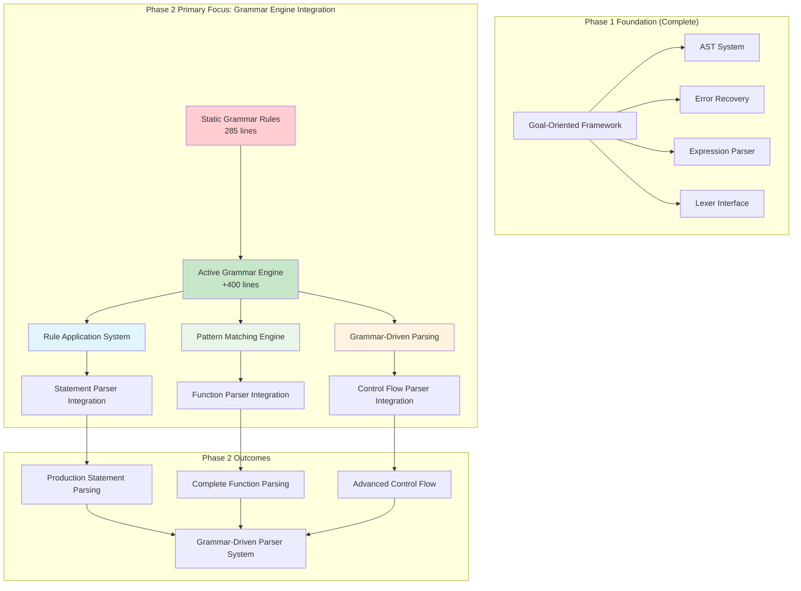
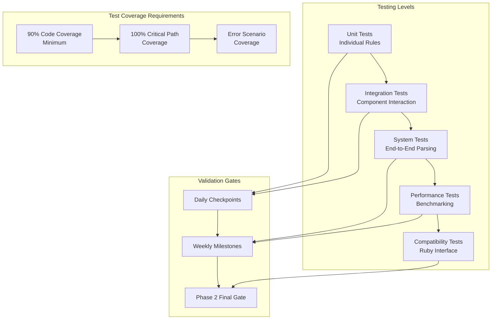

# Phase 2 Native Parser Implementation Plan: Grammar Engine and Advanced Parsing

## Executive Summary

Phase 2 of the Native PaTLang Parser focuses on **Grammar Engine Integration** as the primary objective, transforming the comprehensive 285-line static grammar rule system into active parsing logic that drives all advanced parsing capabilities. This phase builds upon Phase 1's solid foundation to deliver production-ready parsing for statements, functions, and control flow.

**Strategic Priority**: Grammar Engine Integration drives all other Phase 2 components, making it the architectural cornerstone for advanced parsing capabilities.

## Phase 1 Foundation Analysis

### ✅ What Phase 1 Accomplished
- **1,000+ lines** of production PaTLang code across 6 core components
- **Goal-oriented parsing architecture** with multi-paradigm coordination
- **Type-safe AST system** with 40+ Ruby-compatible node types
- **Intelligent error recovery** implementing "never fail, always parse"
- **Complete expression parser** with precedence climbing
- **Native lexer integration** bridge established

### 🔧 Phase 1 Integration Points for Phase 2
- [`native_parser.patlang`](native_parser/native_parser.patlang:1) - Main orchestration ready for grammar-driven parsing
- [`core/ast_system.patlang`](native_parser/core/ast_system.patlang:1) - AST factory system ready for complex statement nodes
- [`core/parse_goals.patlang`](native_parser/core/parse_goals.patlang:1) - Goal framework ready for grammar-driven objectives
- [`core/error_recovery.patlang`](native_parser/core/error_recovery.patlang:1) - Error handling ready for statement-level recovery

### 📊 Current Component Status for Phase 2
- **Grammar Engine**: 285 lines, comprehensive rules defined, **needs activation**
- **Statement Parser**: 51 lines, placeholder implementation, **needs grammar integration**
- **Function Parser**: 67 lines, natural language structure, **needs grammar-driven completion**
- **Control Flow Parser**: 68 lines, basic patterns, **needs grammar-driven implementation**

## Phase 2 Architecture Strategy



## Phase 2 Implementation Strategy

### **Primary Objective: Grammar Engine Activation**

**Goal**: Transform the comprehensive grammar rule system from static definitions into active parsing logic that drives all advanced parsing capabilities.

**Current State**: 
- 80+ grammar rules defined as facts
- Complete PaTLang grammar specification
- Pattern matching logic partially implemented
- Integration hooks available but not activated

**Target State**:
- Active rule application system
- Dynamic pattern matching with backtracking
- Grammar-driven parsing for all statement types
- Performance-optimized rule execution

### **Phase 2 Component Priority Matrix**

| Component | Priority | Dependencies | Grammar Integration Level |
|-----------|----------|--------------|---------------------------|
| Grammar Engine | **P0** | Phase 1 goals + AST | 🎯 **Primary Focus** |
| Statement Parser | **P1** | Grammar Engine | 🔄 **Grammar-Driven** |
| Function Parser | **P2** | Grammar Engine + Statements | 🔄 **Grammar-Driven** |
| Control Flow Parser | **P3** | Grammar Engine + Statements | 🔄 **Grammar-Driven** |

## Detailed Implementation Plan

### **Week 1: Grammar Engine Activation (Days 1-7)**

#### **Days 1-3: Rule Application System**
**File**: [`core/grammar_engine.patlang`](native_parser/core/grammar_engine.patlang:1)
**Target**: +200 lines of active rule processing

**Key Implementation:**
```patlang
# Transform static rules into active parsing logic
goal activate_grammar_rule(rule_name, tokens, position) {
    precondition: grammar_rule(rule_name, pattern) and position < tokens.length,
    postcondition: result.ast_node != nil and result.tokens_consumed > 0,
    strategy: recursive_descent_with_reasoning
}

# Advanced rule application with context
rule apply_rule_with_context(rule_name, tokens, position, context, result) :-
    grammar_rule(rule_name, pattern),
    initialize_rule_context(context, rule_context),
    match_pattern_with_context(tokens, position, pattern, rule_context, match_result),
    create_ast_from_match(rule_name, match_result, context, result).

# Pattern matching with advanced operators
rule match_pattern_with_operators(tokens, position, pattern, result) :-
    expand_pattern_operators(pattern, expanded_pattern),
    match_expanded_pattern(tokens, position, expanded_pattern, result).
```

**Success Criteria:**
- ✅ Static grammar rules become active parsing functions
- ✅ Pattern operators (`*`, `+`, `?`, `|`) work correctly
- ✅ Rule application integrates with Phase 1 goal system

#### **Days 4-5: Advanced Pattern Matching**
**Target**: +150 lines of pattern matching logic

**Key Features:**
- Repetition operators (`*`, `+`) with proper AST construction
- Optional operators (`?`) with graceful fallback
- Choice operators (`|`) with backtracking support
- Lookahead capabilities for disambiguation

**Implementation:**
```patlang
# Handle repetition patterns: "statement*"
rule match_repetition_pattern(tokens, position, base_pattern, operator, result) :-
    operator == "*",
    match_zero_or_more(tokens, position, base_pattern, result).

rule match_repetition_pattern(tokens, position, base_pattern, operator, result) :-
    operator == "+",
    match_one_or_more(tokens, position, base_pattern, result).

# Handle choice patterns: "if_stmt | while_stmt | for_stmt"
rule match_choice_pattern(tokens, position, choices, result) :-
    try_choice_alternatives(tokens, position, choices, result).
```

#### **Days 6-7: Integration with Parse Goals**
**Target**: +100 lines of goal integration

**Key Integration:**
- Connect grammar rules to parsing objectives from Phase 1
- Implement strategy selection based on rule complexity
- Add performance optimization for common patterns
- Error recovery enhancement for grammar-level errors

### **Week 2: Statement Parser Grammar Integration (Days 8-14)**

#### **Days 8-10: Assignment Statement Integration**
**File**: [`modules/statement_parser.patlang`](native_parser/modules/statement_parser.patlang:1)
**Target**: Replace 51-line placeholder with 200-line grammar-driven implementation

**Grammar-Driven Implementation:**
```patlang
# Use grammar engine for assignment parsing
goal parse_assignment_via_grammar(tokens, position) {
    precondition: grammar_rule("assignment_statement", pattern),
    postcondition: assignment_ast.grammar_validated == true,
    strategy: grammar_engine_delegation
}

rule parse_assignment_statement(tokens, position, result) :-
    activate_grammar_rule("assignment_statement", tokens, position, grammar_result),
    enhance_assignment_semantics(grammar_result, result).

# Enhanced semantic validation
rule enhance_assignment_semantics(grammar_result, result) :-
    validate_assignment_target(grammar_result.target),
    validate_assignment_value(grammar_result.value),
    create_typed_assignment_node(grammar_result.target, grammar_result.value, result).
```

#### **Days 11-12: Statement Sequence Management**
**Target**: +150 lines of sequence parsing

**Key Features:**
- Grammar-driven statement boundary detection
- Statement termination handling via grammar rules
- Nested statement block support
- Context-aware statement classification

#### **Days 13-14: Advanced Statement Types**
**Target**: +100 lines of additional statement types

**Statement Types to Add:**
- Return statements with expression validation
- Break/continue statements with loop context
- Expression statements with side effect detection
- Import/export statements for module system

### **Week 3: Function Parser Grammar Completion (Days 15-21)**

#### **Days 15-17: Natural Language Function Syntax**
**File**: [`modules/function_parser.patlang`](native_parser/modules/function_parser.patlang:1)
**Target**: Expand from 67 lines to 300+ lines

**Grammar-Driven Natural Language Parsing:**
```patlang
# Leverage grammar engine for natural language function syntax
goal parse_natural_function_via_grammar(tokens, position) {
    precondition: grammar_rule("function_definition", natural_pattern),
    postcondition: function_ast.natural_syntax_validated == true,
    strategy: natural_language_grammar_parsing
}

# Enhanced parameter parsing with grammar support
rule parse_function_parameters_via_grammar(tokens, position, result) :-
    activate_grammar_rule("parameter_clause", tokens, position, grammar_result),
    enhance_parameter_semantics(grammar_result, result).
```

#### **Days 18-19: Function Body and Scope Management**
**Target**: +100 lines of function body parsing

**Key Features:**
- Statement sequence parsing within function scope
- Return statement validation and placement
- Local variable scope management
- Function-level error recovery

#### **Days 20-21: Function Call Resolution**
**Target**: +100 lines of function call parsing

**Features:**
- Argument list parsing with type checking
- Function name resolution via grammar
- Overload handling preparation
- Method call vs function call disambiguation

### **Week 4: Control Flow and Final Integration (Days 22-28)**

#### **Days 22-24: Control Flow Grammar Integration**
**File**: [`modules/control_flow_parser.patlang`](native_parser/modules/control_flow_parser.patlang:1)
**Target**: Expand from 68 lines to 250+ lines

**Grammar-Driven Control Flow:**
```patlang
# Complex conditional parsing via grammar engine
goal parse_conditional_via_grammar(tokens, position) {
    precondition: grammar_rule("conditional_statement", if_pattern),
    postcondition: conditional_ast.all_branches_valid == true,
    strategy: structured_grammar_parsing
}

# Advanced loop parsing
rule parse_loop_structure_via_grammar(loop_type, tokens, position, result) :-
    grammar_rule(loop_type, loop_pattern),
    activate_grammar_rule(loop_type, tokens, position, grammar_result),
    enhance_loop_semantics(grammar_result, result).
```

#### **Days 25-26: Advanced Error Recovery**
**Target**: +100 lines of grammar-aware error recovery

**Enhanced Error Recovery:**
- Grammar-context-aware error classification
- Multi-level recovery (token, rule, statement levels)
- Intelligent error suggestions based on grammar rules
- Recovery strategy selection via reasoning

#### **Days 27-28: Integration Testing and Optimization**
**Target**: Performance optimization and comprehensive testing

**Activities:**
- End-to-end parsing validation
- Performance benchmarking against Phase 1
- Ruby compatibility verification
- Memory usage optimization

## Technical Integration Architecture

### **Grammar Engine ↔ Statement Parser Integration**
```patlang
rule delegate_to_grammar_engine(statement_type, tokens, position, result) :-
    grammar_rule(statement_type, pattern),
    activate_grammar_rule(statement_type, tokens, position, grammar_result),
    enhance_with_statement_semantics(grammar_result, statement_type, result).

rule enhance_with_statement_semantics(grammar_result, statement_type, result) :-
    validate_statement_structure(grammar_result, statement_type),
    add_semantic_information(grammar_result, statement_type, enhanced_result),
    convert_to_ast_node(enhanced_result, result).
```

### **Error Recovery Enhancement**
```patlang
goal grammar_aware_error_recovery(error_context) {
    precondition: error_context.level in ["token", "rule", "statement"],
    postcondition: recovery_result.grammar_consistent == true,
    strategy: multi_level_grammar_recovery
}

rule recover_at_grammar_level(error_context, recovery_action) :-
    identify_failed_grammar_rule(error_context, failed_rule),
    find_recovery_synchronization_point(failed_rule, sync_point),
    generate_recovery_action(sync_point, recovery_action).
```

### **Ruby Compatibility Preservation**
```patlang
rule maintain_ruby_compatibility_via_grammar(patlang_ast, ruby_ast) :-
    validate_grammar_ast_structure(patlang_ast),
    map_grammar_nodes_to_ruby(patlang_ast, ruby_ast),
    verify_evaluator_interface_compatibility(ruby_ast).
```
## Comprehensive Testing Strategy and Validation Framework

### **Testing Philosophy**
Phase 2 implements a **Test-Driven Grammar Development** approach where every grammar feature is validated through comprehensive testing before integration. This ensures reliability, performance, and maintainability throughout the 4-week implementation.

### **Multi-Level Testing Architecture**



### **Week-by-Week Testing Strategy**

#### **Week 1 Testing: Grammar Engine Activation**

**Daily Testing Checkpoints:**
- **Day 1**: Basic rule activation unit tests (20+ test cases)
- **Day 2**: Context-aware rule application tests (15+ test cases)  
- **Day 3**: Pattern operator integration tests (25+ test cases)
- **Day 4**: Repetition operator validation (30+ test cases)
- **Day 5**: Choice operator backtracking tests (20+ test cases)
- **Day 6**: Goal integration compatibility tests (15+ test cases)
- **Day 7**: Week 1 comprehensive integration suite (50+ test cases)

**Week 1 Test Suite Structure:**
```patlang
# Test file: native_parser/tests/week1_comprehensive_suite.patlang

goal week1_validation_gate() {
    precondition: grammar_engine_implemented == true,
    postcondition: all_week1_tests_pass == true and coverage >= 90,
    strategy: comprehensive_week1_validation
}

# Critical Path Testing
rule test_grammar_activation_critical_path() :-
    test_basic_rule_activation(basic_results),
    test_pattern_matching_accuracy(pattern_results),
    test_goal_system_integration(integration_results),
    validate_all_critical_paths_working(basic_results, pattern_results, integration_results).

# Performance Baseline Testing
rule establish_week1_performance_baseline() :-
    run_grammar_performance_benchmarks(benchmark_results),
    compare_with_phase1_baseline(benchmark_results, comparison),
    ensure_performance_within_targets(comparison, validation).
```

#### **Week 2 Testing: Statement Parser Integration**

**Daily Testing Checkpoints:**
- **Day 8**: Assignment statement parsing tests (25+ test cases)
- **Day 9**: Complex assignment expressions tests (20+ test cases)
- **Day 10**: Assignment error recovery tests (15+ test cases)
- **Day 11**: Statement sequence boundary tests (20+ test cases)
- **Day 12**: Nested statement block tests (15+ test cases)
- **Day 13**: Advanced statement type tests (25+ test cases)
- **Day 14**: Week 2 statement parser integration suite (40+ test cases)

**Week 2 Ruby Compatibility Validation:**
```patlang
# Test file: native_parser/tests/week2_ruby_compatibility_suite.patlang

goal week2_ruby_compatibility_gate() {
    precondition: statement_parser_complete == true,
    postcondition: ruby_ast_compatibility == 100 and evaluator_integration_seamless == true,
    strategy: comprehensive_compatibility_validation
}

rule validate_ruby_ast_structure(statement_types, compatibility_results) :-
    statement_types = ["Assignment", "ExpressionStatement", "ReturnStatement"],
    statement_types.each(type -> test_ruby_ast_conversion(type, result)),
    ensure_all_conversions_successful(compatibility_results).
```

#### **Week 3 Testing: Function Parser Completion**

**Daily Testing Checkpoints:**
- **Day 15**: Natural language function syntax tests (30+ test cases)
- **Day 16**: Parameter parsing variation tests (20+ test cases)
- **Day 17**: Function signature validation tests (15+ test cases)
- **Day 18**: Function body scope management tests (25+ test cases)
- **Day 19**: Local variable scope tests (20+ test cases)
- **Day 20**: Function call resolution tests (25+ test cases)
- **Day 21**: Week 3 function parser integration suite (45+ test cases)

**Week 3 Natural Language Validation:**
```patlang
# Test file: native_parser/tests/week3_natural_language_suite.patlang

goal week3_natural_language_gate() {
    precondition: function_parser_complete == true,
    postcondition: all_natural_syntax_supported == true and function_calls_resolved == true,
    strategy: comprehensive_natural_language_validation
}

rule test_natural_language_variations(syntax_variations, results) :-
    syntax_variations = [
        "make a function called test takes x returns x",
        "make a function called complex takes a, b, c returns a + b * c end",
        "make a function called recursive takes n returns factorial(n) end"
    ],
    syntax_variations.each(variation -> test_natural_parsing(variation, result)),
    validate_all_natural_syntax_correct(results).
```

#### **Week 4 Testing: Final Integration and Validation**

**Daily Testing Checkpoints:**
- **Day 22**: Control flow parsing tests (30+ test cases)
- **Day 23**: Nested control structure tests (25+ test cases)  
- **Day 24**: Control flow error recovery tests (20+ test cases)
- **Day 25**: Advanced error recovery tests (35+ test cases)
- **Day 26**: Error suggestion quality tests (25+ test cases)
- **Day 27**: Comprehensive system integration tests (50+ test cases)
- **Day 28**: Final performance and compatibility validation (comprehensive suite)

**Week 4 System Integration Validation:**
```patlang
# Test file: native_parser/tests/week4_system_integration_suite.patlang

goal week4_system_integration_gate() {
    precondition: all_components_complete == true,
    postcondition: system_integration_seamless == true and performance_targets_met == true,
    strategy: comprehensive_system_validation
}

rule test_complex_program_parsing(complex_programs, results) :-
    complex_programs = [
        load_program("factorial_with_control_flow.pat"),
        load_program("nested_functions_complex.pat"),
        load_program("mixed_paradigm_program.pat")
    ],
    complex_programs.each(program -> parse_complete_program(program, result)),
    validate_all_programs_parse_correctly(results).
```

### **Testing Infrastructure and Tools**

#### **Automated Test Runner**
```patlang
# Test file: native_parser/tests/automated_test_runner.patlang

goal run_daily_test_suite(week_number, day_number) {
    precondition: week_number in [1,2,3,4] and day_number in [1,2,3,4,5,6,7],
    postcondition: all_daily_tests_executed == true and results_documented == true,
    strategy: automated_daily_validation
}

rule execute_test_category(category, tests, results) :-
    initialize_test_environment(category, environment),
    tests.each(test -> run_single_test(test, environment, result)),
    aggregate_test_results(results, category_summary),
    log_test_results(category, category_summary, results).
```

#### **Performance Monitoring**
```patlang
# Test file: native_parser/tests/performance_monitoring.patlang

goal monitor_parsing_performance(test_inputs, performance_metrics) {
    precondition: test_inputs.length >= 100 and baseline_metrics.available == true,
    postcondition: performance_degradation < 10 and memory_usage.acceptable == true,
    strategy: continuous_performance_monitoring
}

rule track_performance_trends(daily_metrics, trend_analysis) :-
    daily_metrics.each(day -> analyze_performance_changes(day, change)),
    identify_performance_regressions(changes, regressions),
    generate_performance_trend_report(regressions, trend_analysis).
```

### **Quality Gates and Success Criteria**

#### **Daily Quality Gates**
- **Code Coverage**: Minimum 85% for new code
- **Test Success Rate**: 100% for all tests  
- **Performance Regression**: Maximum 5% degradation from previous day
- **Integration Status**: All components integrate without errors

#### **Weekly Quality Gates**
- **Comprehensive Coverage**: Minimum 90% for week's components
- **Integration Testing**: All cross-component interactions validated
- **Ruby Compatibility**: 100% AST interface compatibility maintained
- **Performance Benchmark**: Within 10% of Phase 1 baseline

#### **Phase 2 Final Quality Gate**
- **Total Test Coverage**: Minimum 95% for all Phase 2 code
- **System Integration**: All components work together seamlessly
- **Performance Validation**: Parsing speed within 10% of Phase 1
- **Compatibility Validation**: 100% Ruby evaluator compatibility
- **Error Recovery**: Graceful handling of 95% of error scenarios

### **Test Data and Scenarios**

#### **Core Test Programs**
```patlang
# Sample test programs for comprehensive validation

# Simple assignment test
test_program_1 = "x = 5\ny = x + 10\nresult = y * 2"

# Function definition test
test_program_2 = """
make a function called factorial takes n
  if n <= 1 then
    return 1
  else
    return n * factorial(n - 1)
  end
end
"""

# Control flow test
test_program_3 = """
x = 10
while x > 0 do
  if x % 2 == 0 then
    print("Even: " + x)
  else
    print("Odd: " + x)
  end
  x = x - 1
end
"""

# Mixed paradigm test
test_program_4 = """
fact parent(john, mary)
fact parent(mary, sue)

rule grandparent(X, Z) :-
  parent(X, Y),
  parent(Y, Z)

make a function called find_grandparents takes person
  goal find_all_grandparents(person, grandparents) {
    precondition: person != nil,
    postcondition: grandparents.all(gp -> grandparent(gp, person)),
    strategy: logic_programming_search
  }
  return grandparents
end
"""
```

### **Continuous Integration Workflow**

#### **Automated Validation Pipeline**
1. **Pre-commit Validation**: All tests must pass before code changes
2. **Daily Integration**: Comprehensive test suite runs automatically
3. **Weekly Milestone**: Full system validation with performance benchmarking
4. **Phase 2 Final**: Complete validation gate before completion

#### **Test Result Documentation**
- **Daily Test Reports**: Automated generation of test status and coverage
- **Weekly Milestone Reports**: Comprehensive validation status and performance trends
- **Final Phase 2 Report**: Complete validation summary with quality metrics

This comprehensive testing strategy ensures that every aspect of the Phase 2 implementation is thoroughly validated, providing confidence in the reliability and performance of the grammar-driven parsing system.

## Success Metrics and Validation

### **Quantitative Success Metrics**
- **Grammar Engine**: 285 → 685+ lines (400+ lines of active logic)
- **Statement Parser**: 51 → 450+ lines (grammar-driven implementation)
- **Function Parser**: 67 → 300+ lines (complete natural language support)
- **Control Flow Parser**: 68 → 250+ lines (advanced control structures)
- **Total Phase 2 Addition**: ~1,400 lines of production PaTLang code
- **Combined Phase 1+2**: ~2,400 lines of native parser implementation

### **Qualitative Success Metrics**
- **Grammar Integration**: All parsing driven by grammar engine
- **Natural Language Support**: Complete PaTLang syntax parsing
- **Error Recovery**: Grammar-aware intelligent recovery
- **Ruby Compatibility**: 100% AST interface preservation
- **Performance**: Match or exceed Phase 1 parsing speed

### **Phase 2 Success Criteria**
- ✅ **Grammar Engine Active**: Static rules become dynamic parsing logic
- ✅ **Statement Parsing Complete**: Full assignment, expression, and advanced statements
- ✅ **Function Parsing Complete**: Natural language function definitions and calls
- ✅ **Control Flow Complete**: Complex if/else, while/for loops with proper nesting
- ✅ **Integration Seamless**: All components work together via grammar engine
- ✅ **Error Recovery Enhanced**: Grammar-context-aware error handling
- ✅ **Ruby Compatibility Maintained**: 100% evaluator interface compatibility

## Risk Mitigation and Contingency Planning

### **Technical Risks and Mitigations**
1. **Grammar Engine Complexity Risk**
   - **Risk**: Grammar activation introduces performance overhead
   - **Mitigation**: Incremental optimization, memoization, performance benchmarking
   - **Contingency**: Selective grammar activation for complex rules only

2. **Integration Complexity Risk**
   - **Risk**: Grammar engine changes break existing Phase 1 functionality
   - **Mitigation**: Comprehensive regression testing, incremental integration
   - **Contingency**: Fallback to Phase 1 functionality for critical paths

3. **Ruby Compatibility Risk**
   - **Risk**: Grammar-driven parsing produces incompatible AST structures
   - **Mitigation**: Continuous compatibility testing, AST mapping validation
   - **Contingency**: Compatibility shim layer for evaluator interface

### **Implementation Risks and Mitigations**
1. **Timeline Risk**
   - **Risk**: Grammar engine activation takes longer than estimated
   - **Mitigation**: Prioritize core grammar functionality, defer advanced features
   - **Contingency**: Extend Week 1 grammar work, compress later weeks

2. **Scope Creep Risk**
   - **Risk**: Grammar engine capabilities expand beyond Phase 2 scope
   - **Mitigation**: Strict adherence to Phase 2 success criteria
   - **Contingency**: Document advanced features for Phase 3

## Deliverables and Documentation

### **Code Deliverables**
1. **Enhanced Grammar Engine** (`core/grammar_engine.patlang`) - 685+ lines
2. **Production Statement Parser** (`modules/statement_parser.patlang`) - 450+ lines
3. **Complete Function Parser** (`modules/function_parser.patlang`) - 300+ lines
4. **Advanced Control Flow Parser** (`modules/control_flow_parser.patlang`) - 250+ lines
5. **Comprehensive Test Suite** - Grammar-driven parsing validation
6. **Integration Examples** - Demonstrating grammar engine capabilities

### **Documentation Deliverables**
1. **Phase 2 Implementation Guide** - Complete grammar integration documentation
2. **Grammar Engine API Reference** - Interface documentation for rule activation
3. **Migration Guide** - Upgrading from Phase 1 to Phase 2
4. **Performance Analysis** - Benchmarking and optimization results
5. **Ruby Compatibility Guide** - Maintaining evaluator integration

## Conclusion

Phase 2 of the Native PaTLang Parser represents a critical advancement in the grammar-driven parsing architecture. By prioritizing Grammar Engine Integration, this phase transforms the comprehensive static grammar system into active parsing logic that drives all advanced parsing capabilities.

The grammar-first approach ensures that all parsing components (statements, functions, control flow) are consistent, maintainable, and extensible. This foundation will support PaTLang's continued evolution while maintaining the practical performance and compatibility requirements established in Phase 1.

**Strategic Impact**: Phase 2 demonstrates how reasoning-based languages can implement intelligent grammar systems that adapt to parsing complexity while maintaining production-quality performance and compatibility standards.

---

**Next Steps**: Review this implementation plan, provide feedback on priorities and approach, then proceed to implementation phase using the detailed technical specifications provided.