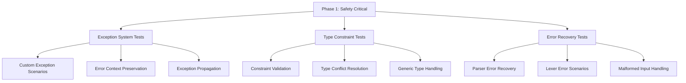
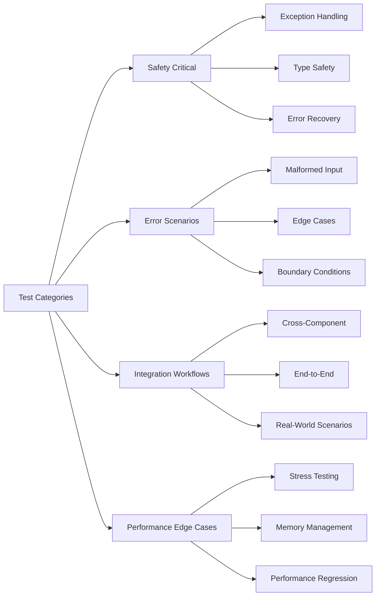

# Comprehensive Test Coverage Improvement Strategy for Patlang

## Executive Summary

This document outlines a systematic strategy for improving test coverage in the Patlang language implementation, prioritizing safety-critical components and following a phased approach to achieve comprehensive coverage across all language features.

**Current State**: 71 tests passing at 100% success rate with 22.68% line coverage and 8.92% branch coverage across 51 source files.

**Strategic Approach**: Focus on safety-critical components first with 90% coverage, then expand systematically to achieve robust language implementation.

---

## Coverage Gap Analysis Report

### Current State Assessment

- **Test Infrastructure**: Mature and well-organized with 71 passing tests
- **Coverage Metrics**: 22.68% line coverage, 8.92% branch coverage across 51 source files
- **Test Categories**: 5 well-defined categories (infrastructure, patlang_language, ruby_implementation, integration, core)
- **Critical Gap**: Safety-critical components severely under-tested

### Major Untested/Under-tested Areas

#### Tier 1: Safety-Critical Components (Priority 1)

1. **Exception Handling System** (`src/exceptions.rb`)
   - **Coverage Gap**: Custom exception classes lack comprehensive error scenario testing
   - **Risk**: Language crashes, poor error messages, debugging difficulties
   - **Test Deficit**: Missing error propagation, context preservation, recovery scenarios

2. **Type Constraint System** (`src/reasoning/type_constraint_system.rb`, `src/reasoning/type_constraint.rb`)
   - **Coverage Gap**: Complex constraint validation and violation handling untested
   - **Risk**: Type safety failures, runtime errors, data corruption
   - **Test Deficit**: Missing constraint conflict resolution, generic type handling

3. **Error Recovery Systems** (Parser error recovery, Lexer error scenarios)
   - **Coverage Gap**: Error recovery paths in `src/parser.rb` and `src/lexer.rb` minimally tested
   - **Risk**: Poor user experience with syntax errors, infinite loops, crashes
   - **Test Deficit**: Missing malformed input handling, recovery state validation

#### Tier 2: Core Language Pipeline (Priority 2)

4. **Advanced Parser Features** (`src/parser/` subdirectory)
   - **Coverage Gap**: Complex parsing scenarios, ambiguous token resolution
   - **Components**: `control_flow_parser.rb`, `token_resolver.rb`, `reasoning_parser_extensions.rb`

5. **Specialized Evaluators** (`src/evaluator/` subdirectory)
   - **Coverage Gap**: Domain-specific evaluation logic under-tested
   - **Components**: `reasoning_evaluator.rb`, `object_evaluator.rb`, `scope_manager.rb`

#### Tier 3: Advanced Features (Priority 3)

6. **Reasoning Systems** (`src/reasoning/` subdirectory)
   - **Coverage Gap**: Complex reasoning coordination and cross-paradigm features
   - **Components**: 11 reasoning-related files with sophisticated logic

7. **Object Model Extensions** (`src/object_model/` subdirectory)
   - **Coverage Gap**: Event system, object integration, specialized object types

---

## Strategic Test Plan with Specific Targets

### Phase 1: Safety-Critical Foundation (Weeks 1-3)
**Target**: 90% line coverage, 85% branch coverage for safety-critical components



**Specific Coverage Targets:**
- `src/exceptions.rb`: 90% line, 85% branch
- `src/reasoning/type_constraint_system.rb`: 90% line, 85% branch
- `src/reasoning/type_constraint.rb`: 90% line, 85% branch
- Parser error recovery paths: 85% line, 80% branch
- Lexer error scenarios: 85% line, 80% branch

### Phase 2: Core Language Pipeline (Weeks 4-6)
**Target**: 80% line coverage, 70% branch coverage for core components

**Priority Components:**
- `src/parser/control_flow_parser.rb`: 80% line, 70% branch
- `src/parser/token_resolver.rb`: 80% line, 70% branch
- `src/evaluator/reasoning_evaluator.rb`: 80% line, 70% branch
- `src/evaluator/scope_manager.rb`: 80% line, 70% branch

### Phase 3: Advanced Features (Weeks 7-10)
**Target**: 70% line coverage, 60% branch coverage for advanced components

**Priority Components:**
- `src/reasoning/reasoning_coordinator.rb`: 70% line, 60% branch
- `src/reasoning/cross_paradigm_coordinator.rb`: 70% line, 60% branch
- `src/reasoning/unification_engine.rb`: 70% line, 60% branch
- `src/object_model/event_system.rb`: 70% line, 60% branch

### Phase 4: Integration & End-to-End (Weeks 11-12)
**Target**: 60% overall line coverage, 45% overall branch coverage

**Focus Areas:**
- Cross-component integration scenarios
- End-to-end language feature workflows
- Performance edge cases and stress testing
- Real-world usage pattern validation

---

## Test Organization and Categorization Strategy

### New Test Categories



### Test File Organization
```
test/
├── safety_critical/
│   ├── test_exception_handling_comprehensive.rb
│   ├── test_type_constraint_validation.rb
│   ├── test_error_recovery_scenarios.rb
│   └── test_safety_integration.rb
├── error_scenarios/
│   ├── test_malformed_input_handling.rb
│   ├── test_boundary_conditions.rb
│   └── test_edge_case_coverage.rb
├── advanced_integration/
│   ├── test_cross_component_workflows.rb
│   ├── test_reasoning_integration_comprehensive.rb
│   └── test_end_to_end_scenarios.rb
└── performance_validation/
    ├── test_stress_scenarios.rb
    ├── test_memory_management.rb
    └── test_performance_regression.rb
```

---

## Implementation Roadmap

### Phase 1: Safety-Critical Foundation (Weeks 1-3)

**Week 1: Exception System Testing**
- Create `test/safety_critical/test_exception_handling_comprehensive.rb`
- Test all custom exception classes with context preservation
- Validate error message formatting and stack trace handling
- Test exception propagation through the evaluation chain

**Week 2: Type Constraint System Testing**
- Create `test/safety_critical/test_type_constraint_validation.rb`
- Test constraint validation, conflict resolution, and error scenarios
- Validate generic type handling and constraint composition
- Test type constraint integration with evaluation system

**Week 3: Error Recovery Testing**
- Create `test/safety_critical/test_error_recovery_scenarios.rb`
- Test parser error recovery with various malformed inputs
- Test lexer error handling and recovery state validation
- Validate graceful degradation and error reporting

### Phase 2: Core Pipeline Enhancement (Weeks 4-6)

**Week 4: Advanced Parser Testing**
- Enhance existing parser tests with complex scenarios
- Test ambiguous token resolution and control flow parsing
- Validate parser timeout protection and resource management

**Week 5: Specialized Evaluator Testing**
- Test reasoning evaluator integration and scope management
- Validate object evaluator with complex object interactions
- Test evaluator error handling and state consistency

**Week 6: Integration Testing**
- Create cross-component integration tests
- Test parser-evaluator interaction scenarios
- Validate error propagation across component boundaries

### Phase 3: Advanced Features (Weeks 7-10)

**Week 7-8: Reasoning Systems**
- Test reasoning coordinator with complex scenarios
- Validate cross-paradigm coordination and unification engine
- Test reasoning performance optimization

**Week 9-10: Object Model & Event System**
- Test event system with complex event scenarios
- Validate object integration and specialized object types
- Test object model performance and memory management

### Phase 4: Comprehensive Integration (Weeks 11-12)

**Week 11: End-to-End Workflows**
- Create comprehensive end-to-end test scenarios
- Test real-world usage patterns and edge cases
- Validate complete language feature integration

**Week 12: Performance & Regression**
- Create performance regression test suite
- Test stress scenarios and memory management
- Validate overall system stability and performance

---

## Tooling and Infrastructure Recommendations

### Enhanced Coverage Analysis

1. **Coverage Gap Detection Tool**
   - Automated identification of untested code paths
   - Branch coverage gap analysis with priority ranking
   - Integration with existing `fixed_comprehensive_coverage_runner.rb`

2. **Safety-Critical Coverage Monitor**
   - Specialized monitoring for safety-critical components
   - Automated alerts for coverage regressions
   - Integration with CI/CD pipeline

3. **Test Impact Analysis**
   - Identification of test coverage impact for code changes
   - Automated test selection based on code modifications
   - Coverage trend analysis and reporting

### Test Development Support

1. **Test Template Generator**
   - Automated generation of test templates for new components
   - Safety-critical test pattern enforcement
   - Integration with existing test infrastructure

2. **Mock and Fixture Framework**
   - Comprehensive mock framework for complex component testing
   - Reusable test fixtures for common scenarios
   - Error injection capabilities for robustness testing

---

## Success Metrics and Validation

### Coverage Targets by Phase

| Phase | Component Type | Line Coverage | Branch Coverage |
|-------|---------------|---------------|-----------------|
| 1 | Safety-Critical | 90% | 85% |
| 2 | Core Pipeline | 80% | 70% |
| 3 | Advanced Features | 70% | 60% |
| 4 | Overall System | 60% | 45% |

### Quality Gates

1. **Phase 1 Gate**: All safety-critical components must achieve 90% line coverage before proceeding
2. **Phase 2 Gate**: Core pipeline components must achieve 80% line coverage with no regressions
3. **Phase 3 Gate**: Advanced features must achieve 70% line coverage with comprehensive integration tests
4. **Phase 4 Gate**: Overall system must achieve 60% line coverage with full end-to-end validation

### Validation Criteria

- **Functional Correctness**: All new tests must pass consistently
- **Performance Impact**: Test execution time must not exceed 10% increase
- **Maintainability**: Test code must follow established patterns and be well-documented
- **Reliability**: Coverage targets must be sustainable with minimal regression risk

---

## Risk Management

### Identified Risks

1. **Test Maintenance Overhead**: Large test suite may become difficult to maintain
   - **Mitigation**: Implement test categorization and selective execution strategies

2. **Performance Impact**: Comprehensive tests may slow development feedback
   - **Mitigation**: Implement tiered testing with fast smoke tests and comprehensive suites

3. **False Confidence**: High coverage may not guarantee quality
   - **Mitigation**: Focus on meaningful test scenarios and edge cases, not just coverage metrics

### Contingency Plans

1. **Timeline Delays**: If phases take longer than expected
   - **Response**: Prioritize safety-critical components and defer advanced features

2. **Coverage Plateaus**: If coverage targets prove unachievable
   - **Response**: Analyze specific barriers and adjust targets based on component criticality

3. **Resource Constraints**: If development resources become limited
   - **Response**: Focus on automated test generation and template-based approaches

---

## Conclusion

This comprehensive test coverage improvement strategy provides a systematic approach to dramatically enhance the reliability and robustness of the Patlang language implementation. By prioritizing safety-critical components and following a phased approach, we can achieve meaningful coverage improvements while maintaining development velocity and code quality.

The strategy balances ambitious coverage targets with practical implementation considerations, ensuring that the resulting test suite provides genuine value in terms of bug prevention, regression detection, and system reliability.

**Next Steps**: 
1. Review and approve this strategy
2. Begin Phase 1 implementation with safety-critical component testing
3. Establish regular coverage monitoring and reporting
4. Iterate and refine based on implementation experience

---

*Document Version: 1.0*  
*Created: 2025-06-17*  
*Author: Roo - Technical Architect*