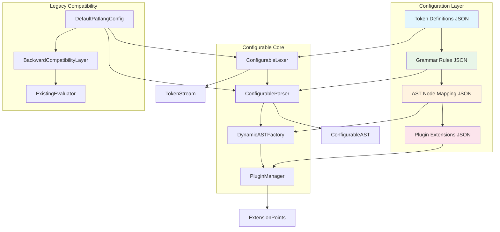
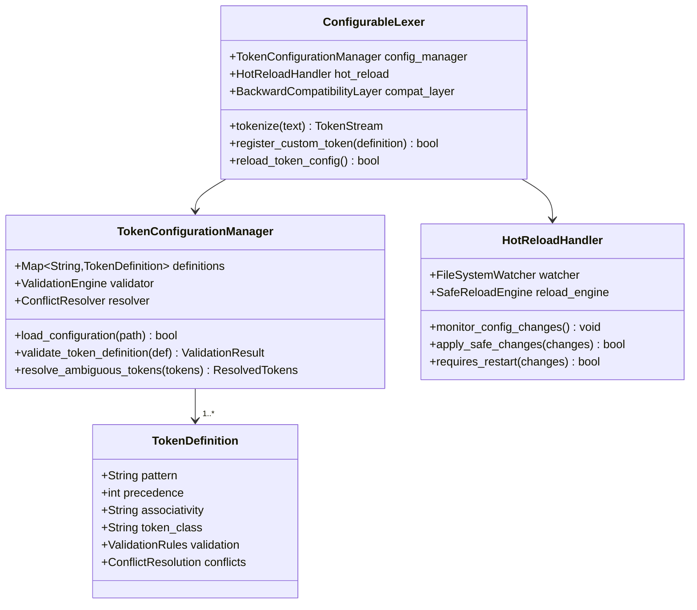
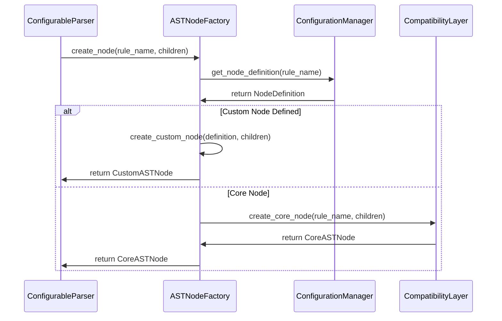
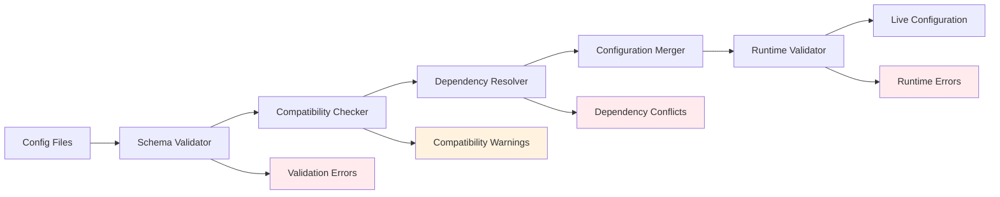
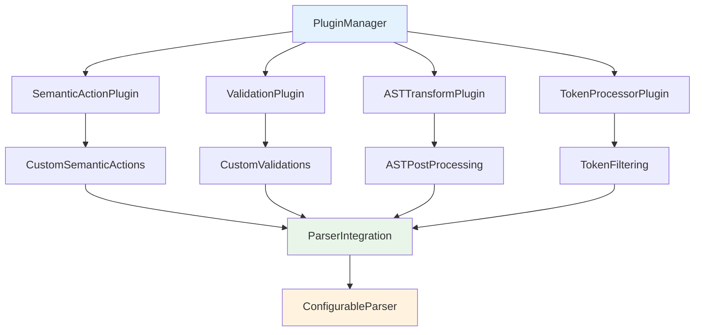

# Configurable Lexer and Parser Architecture Design

## Executive Summary

This document specifies the technical architecture for transforming patlang's hardcoded lexer and parser into a **Configuration-Driven Language Extension System**. The system maintains **100% backward compatibility** while enabling language features to be added through JSON configuration files rather than core code modifications.

## Architecture Overview



## 1. Configurable Lexer Architecture

### 1.1 Token Configuration System

**Core Design**: JSON-based token definitions that extend the existing token system without breaking changes.

```json
{
  "schema_version": "1.0",
  "extends": "patlang_core_tokens",
  "token_definitions": {
    "custom_operators": {
      "POWER": {
        "pattern": "\\*\\*",
        "precedence": 8,
        "associativity": "right",
        "description": "Exponentiation operator"
      },
      "PIPELINE": {
        "pattern": "\\|>",
        "precedence": 1,
        "associativity": "left",
        "description": "Pipeline operator"
      }
    },
    "custom_keywords": {
      "ASYNC": {
        "pattern": "async",
        "conflicts_with": ["IDENTIFIER"],
        "context_resolution": "keyword_first"
      },
      "AWAIT": {
        "pattern": "await",
        "requires": ["ASYNC"],
        "context_resolution": "keyword_first"
      }
    },
    "custom_literals": {
      "REGEX": {
        "pattern": "/(?:[^/\\\\]|\\\\.)+/[gimuy]*",
        "token_class": "RegexLiteralToken",
        "validation": "validate_regex_syntax"
      }
    }
  },
  "hot_reload": {
    "enabled": true,
    "safe_operations": ["add_token", "modify_precedence"],
    "restricted_operations": ["remove_core_token", "modify_keyword_conflicts"]
  }
}
```

### 1.2 Pluggable Tokenization Rules

**Architecture**: Extends current [`Lexer`](../../patlang-core/lexer/lexer.rb:5) class with configuration-driven token recognition.



### 1.3 Extensible Keyword and Operator Registration

**Key Features**:
- **Conflict Detection**: Automatic detection of keyword/identifier conflicts
- **Context Resolution**: Smart resolution using existing [`AmbiguousToken`](../../src/ambiguous_token.rb:4) system
- **Validation Pipeline**: Multi-stage validation for new token definitions
- **Performance Optimization**: Compiled regex patterns with caching

### 1.4 Custom Token Types and Patterns

**Design Philosophy**: Extend the current token type system while maintaining compatibility with existing [`Token`](../../patlang-core/lexer/token.rb:2) class.

**Implementation Strategy**:
- Custom token classes inherit from base [`Token`](../../patlang-core/lexer/token.rb:2) class
- Pattern-based token recognition with regex validation
- Type-safe token creation through factory pattern
- Integration with existing [`TOKEN_TYPES`](../../patlang-core/lexer/token.rb:4) constant

### 1.5 Token Configuration Validation System

**Validation Pipeline**:
1. **Schema Validation**: JSON schema compliance checking
2. **Pattern Validation**: Regex pattern syntax and safety verification
3. **Conflict Analysis**: Token overlap and precedence conflict detection
4. **Performance Impact**: Token complexity and performance analysis
5. **Security Audit**: Pattern safety and injection prevention

## 2. Configurable Parser Architecture

### 2.1 Grammar Rule Configuration System

**Design Philosophy**: Extend existing parser modules with rule-based configuration while preserving the current modular structure.

```json
{
  "schema_version": "1.0",
  "extends": "patlang_core_grammar",
  "grammar_rules": {
    "expressions": {
      "async_expression": {
        "pattern": "ASYNC expression",
        "ast_node": "AsyncExpressionNode",
        "precedence": 2,
        "associativity": "right",
        "semantic_actions": ["validate_async_context"],
        "integration_points": ["expression_parser"]
      },
      "pipeline_expression": {
        "pattern": "expression PIPELINE expression",
        "ast_node": "PipelineNode",
        "precedence": 1,
        "associativity": "left",
        "semantic_actions": ["validate_pipeline_compatibility"],
        "integration_points": ["expression_parser"]
      }
    },
    "statements": {
      "async_function": {
        "pattern": "MAKE ASYNC FUNCTION IDENTIFIER parameter_list? block",
        "ast_node": "AsyncFunctionDefinitionNode",
        "extends": "function_definition",
        "semantic_actions": ["validate_async_function"],
        "integration_points": ["function_parser"]
      }
    }
  },
  "hot_reload": {
    "enabled": false,
    "requires_restart": true,
    "reason": "Grammar changes affect parser state machine"
  }
}
```

### 2.2 Pluggable AST Node Factory System

**Architecture**: Dynamic AST node creation based on configuration while maintaining type safety.



**Integration Points**:
- Extends existing [`ASTNode`](../../patlang-core/ast/ast_nodes.rb:4) hierarchy
- Compatible with current [`Evaluator`](../../patlang-core/evaluator/evaluator.rb:9) visitor pattern
- Maintains type safety through dynamic class generation
- Preserves existing node relationships and inheritance

### 2.3 Extensible Precedence and Associativity Configuration

**Integration Strategy**: Extends existing precedence handling in [`ExpressionParser`](../../patlang-core/parser/expression_parser.rb:6) with configurable rules.

```ruby
# Enhanced precedence system
class ConfigurablePrecedenceManager
  def initialize(base_precedence, custom_config)
    @base_precedence = base_precedence
    @custom_precedence = load_custom_precedence(custom_config)
    @compiled_precedence = compile_precedence_table
  end
  
  def get_precedence(operator)
    @compiled_precedence[operator] || @base_precedence[operator] || 0
  end
  
  def validate_precedence_config(config)
    # Ensure no conflicts with core language precedence
    # Validate associativity rules
    # Check for circular dependencies
  end
end
```

### 2.4 Custom Syntax Patterns Through Configuration

**Pattern Definition Language**:
- BNF-style grammar rule specification
- Terminal and non-terminal symbol references
- Optional, repeating, and alternative patterns
- Semantic action hooks for custom behavior

### 2.5 Parser Rule Validation and Conflict Detection

**Validation Systems**:
1. **Grammar Consistency**: Left recursion and ambiguity detection
2. **Precedence Conflicts**: Operator precedence table validation
3. **AST Compatibility**: Node hierarchy and evaluator compatibility
4. **Performance Analysis**: Parse complexity and performance impact

## 3. Configuration Management System

### 3.1 Configuration File Format and Structure

**Core Schema Design**:

```json
{
  "$schema": "https://patlang.org/schemas/language-config-v1.json",
  "metadata": {
    "name": "Enhanced Patlang",
    "version": "1.0.0",
    "description": "Async and pipeline extensions",
    "author": "Extension Developer",
    "patlang_version_requirement": ">=0.1.0"
  },
  "configuration": {
    "lexer": { /* Token definitions */ },
    "parser": { /* Grammar rules */ },
    "ast_nodes": { /* Custom AST node definitions */ },
    "plugins": { /* Plugin configurations */ },
    "features": {
      "async_support": true,
      "pipeline_operators": true,
      "custom_literals": ["regex", "uuid"]
    }
  },
  "compatibility": {
    "breaking_changes": false,
    "deprecated_features": [],
    "migration_notes": []
  }
}
```

### 3.2 Configuration Loading and Validation Infrastructure



**Configuration Loading Pipeline**:
1. **File Discovery**: Automatic configuration file detection
2. **Schema Validation**: JSON schema compliance verification
3. **Dependency Resolution**: Extension dependency analysis
4. **Conflict Detection**: Configuration compatibility checking
5. **Merger Strategy**: Multiple configuration file combination
6. **Runtime Validation**: Live configuration correctness verification

### 3.3 Hot-Reloading Capabilities for Development

**Hybrid Approach Implementation**:

```ruby
class ConfigurationHotReloader
  SAFE_RELOAD_OPERATIONS = [
    :add_token, :modify_token_precedence, :add_semantic_action,
    :modify_token_description, :add_validation_rule
  ].freeze
  
  RESTART_REQUIRED_OPERATIONS = [
    :modify_grammar_rule, :remove_core_token, :change_parser_strategy,
    :modify_ast_node_hierarchy, :change_precedence_relationships
  ].freeze
  
  def handle_configuration_change(change_event)
    changes = analyze_configuration_changes(change_event)
    
    if all_changes_safe?(changes)
      apply_hot_reload(changes)
    else
      schedule_restart_notification(changes)
    end
  end
end
```

**Hot-Reload Strategy**:
- **Safe Operations**: Token additions, precedence modifications, semantic actions
- **Restart Required**: Grammar rule changes, AST node modifications, parser strategy changes
- **File Monitoring**: Automatic configuration file change detection
- **Rollback Support**: Configuration change rollback on validation failure

### 3.4 Configuration Versioning and Compatibility

**Versioning Strategy**:
- **Semantic Versioning**: Configuration schema version management
- **Backward Compatibility**: Automatic upgrade path for older configurations
- **Migration Tools**: Automated configuration migration utilities
- **Deprecation Management**: Graceful feature deprecation handling

### 3.5 Error Handling for Invalid Configurations

**Error Handling Framework**:
1. **Validation Errors**: Schema and syntax error reporting
2. **Runtime Errors**: Configuration application failure handling
3. **Recovery Strategies**: Fallback to default configuration
4. **Error Context**: Detailed error location and suggestion reporting
5. **Debugging Support**: Configuration debugging and introspection tools

## 4. Extension Points and Plugin System

### 4.1 Extension Points for Custom Language Features

**Plugin Architecture**: Leverages existing [`EventSystem`](../../patlang-core/object_model/event_system.rb:1) for plugin communication while maintaining parser stability.



**Extension Point Categories**:
1. **Lexical Extensions**: Custom token processing and filtering
2. **Syntactic Extensions**: Grammar rule additions and modifications
3. **Semantic Extensions**: Custom validation and type checking
4. **AST Extensions**: Post-processing and transformation hooks
5. **Evaluation Extensions**: Custom evaluation behavior

### 4.2 Plugin Loading Mechanism for Advanced Extensions

**Plugin Loading Architecture**:
- **Dynamic Loading**: Runtime plugin discovery and loading
- **Dependency Management**: Plugin dependency resolution
- **Lifecycle Management**: Plugin initialization, activation, and cleanup
- **Configuration Integration**: Plugin-specific configuration support

### 4.3 Backward Compatibility Preservation

**Compatibility Strategy**:
- **API Preservation**: Existing parser API remains unchanged
- **Default Behavior**: Core language behavior preserved by default
- **Optional Activation**: Extensions require explicit activation
- **Fallback Mechanisms**: Graceful degradation for unsupported features

### 4.4 Feature Toggles and Conditional Language Features

**Implementation**: Configuration-driven feature activation with runtime switching.

```json
{
  "feature_flags": {
    "async_await": {
      "enabled": true,
      "requires": ["function_definitions"],
      "conflicts_with": [],
      "performance_impact": "minimal"
    },
    "pipeline_operators": {
      "enabled": false,
      "reason": "Experimental feature",
      "requires": ["custom_operators"],
      "performance_impact": "low"
    }
  },
  "conditional_syntax": {
    "version_gates": {
      "advanced_types": ">=1.1.0",
      "pattern_matching": ">=1.2.0"
    },
    "environment_gates": {
      "debug_syntax": "development",
      "profiling_hooks": "performance_testing"
    }
  }
}
```

### 4.5 Extension Conflict Resolution

**Conflict Resolution Strategies**:
1. **Priority-Based Resolution**: Extension priority ordering
2. **Namespace Isolation**: Feature namespace separation
3. **Compatibility Checking**: Pre-activation compatibility verification
4. **Conflict Mediation**: Automatic conflict resolution where possible
5. **User Choice**: Manual conflict resolution options

## 5. Integration with Existing System

### 5.1 Integration with Current Parser Timeout Protection

**Enhancement**: Extends existing [`TimeoutProtection`](../../patlang-core/parser/parser_timeout_protection.rb:7) system with configuration-aware protection.

```ruby
module ConfigurableTimeoutProtection
  include ParserModules::TimeoutProtection
  
  def with_configurable_parse_timeout(config_section = nil)
    timeout_config = @configuration.timeout_settings[config_section] || DEFAULT_TIMEOUT
    
    with_parse_timeout(timeout_config.parse_timeout, "configurable parse") do
      yield
    end
  rescue ConfigurationError => e
    safe_error("Configuration error during parsing: #{e.message}")
  end
end
```

**Integration Strategy**:
- Preserves existing [`CircuitBreaker`](../../patlang-core/parser/parser_timeout_protection.rb:14) functionality
- Extends timeout configuration through JSON settings
- Maintains compatibility with current error handling
- Adds configuration-specific timeout profiles

### 5.2 Compatibility with Existing Reasoning System Integration

**Integration Points**:
- Extends existing reasoning AST nodes with configuration support
- Maintains compatibility with [`UnifiedReasoningCoordinator`](../../docs/development/unified-reasoning-architecture.md:361)
- Preserves [`EventSystem`](../../patlang-core/object_model/event_system.rb:1) integration patterns
- Supports dynamic reasoning rule configuration

### 5.3 Migration Path from Current Hardcoded Approach

**Migration Strategy**:
1. **Default Configuration**: Generate default config from current hardcoded rules
2. **Gradual Migration**: Optional migration to configurable system
3. **Compatibility Layer**: Seamless transition for existing code
4. **Migration Tools**: Automated migration assistance utilities

### 5.4 Performance Considerations for Configurable System

**Performance Optimization Strategies**:
- **Compile-Time Configuration**: Pre-compile configurations for production
- **Caching Systems**: Comprehensive caching of configuration artifacts
- **Lazy Loading**: On-demand configuration loading
- **Performance Monitoring**: Built-in performance impact measurement

### 5.5 Existing Test Compatibility

**Test Integration Strategy**:
- **Zero Test Changes**: All existing tests continue to pass
- **Default Configuration**: Tests run with default patlang configuration
- **Test Extensions**: Additional tests for configuration features
- **Regression Prevention**: Continuous compatibility testing

## 6. Configuration Schema and Examples

### 6.1 Comprehensive Configuration Schema

**JSON Schema Definition**:
```json
{
  "$schema": "http://json-schema.org/draft-07/schema#",
  "type": "object",
  "properties": {
    "schema_version": { "type": "string", "pattern": "^[0-9]+\\.[0-9]+$" },
    "extends": { "type": "string" },
    "metadata": {
      "type": "object",
      "properties": {
        "name": { "type": "string" },
        "version": { "type": "string" },
        "description": { "type": "string" },
        "author": { "type": "string" },
        "patlang_version_requirement": { "type": "string" }
      },
      "required": ["name", "version"]
    },
    "token_definitions": {
      "type": "object",
      "patternProperties": {
        "^[A-Z_]+$": {
          "type": "object",
          "properties": {
            "pattern": { "type": "string" },
            "precedence": { "type": "integer", "minimum": 0, "maximum": 100 },
            "associativity": { "enum": ["left", "right", "none"] },
            "token_class": { "type": "string" },
            "validation": { "type": "string" },
            "hot_reloadable": { "type": "boolean", "default": true },
            "conflicts_with": { "type": "array", "items": { "type": "string" } },
            "requires": { "type": "array", "items": { "type": "string" } }
          },
          "required": ["pattern"]
        }
      }
    },
    "grammar_rules": {
      "type": "object",
      "patternProperties": {
        "^[a-z_]+$": {
          "type": "object",
          "properties": {
            "pattern": { "type": "string" },
            "ast_node": { "type": "string" },
            "precedence": { "type": "integer" },
            "associativity": { "enum": ["left", "right", "none"] },
            "semantic_actions": { "type": "array", "items": { "type": "string" } },
            "integration_points": { "type": "array", "items": { "type": "string" } },
            "extends": { "type": "string" }
          },
          "required": ["pattern", "ast_node"]
        }
      }
    },
    "ast_nodes": {
      "type": "object",
      "patternProperties": {
        "^[A-Z][A-Za-z]*Node$": {
          "type": "object",
          "properties": {
            "extends": { "type": "string" },
            "properties": { "type": "array", "items": { "type": "string" } },
            "additional_properties": { "type": "array", "items": { "type": "string" } },
            "validation": { "type": "array", "items": { "type": "string" } }
          }
        }
      }
    },
    "feature_flags": {
      "type": "object",
      "patternProperties": {
        "^[a-z_]+$": {
          "type": "object",
          "properties": {
            "enabled": { "type": "boolean" },
            "requires": { "type": "array", "items": { "type": "string" } },
            "conflicts_with": { "type": "array", "items": { "type": "string" } },
            "performance_impact": { "enum": ["minimal", "low", "medium", "high"] },
            "reason": { "type": "string" }
          },
          "required": ["enabled"]
        }
      }
    }
  },
  "required": ["schema_version"]
}
```

### 6.2 Example Configurations for Common Language Extensions

**Example 1: Adding Async/Await Support**
```json
{
  "schema_version": "1.0",
  "extends": "patlang_core",
  "metadata": {
    "name": "Async Extension",
    "version": "1.0.0",
    "description": "Adds async/await functionality to Patlang",
    "author": "Patlang Core Team",
    "patlang_version_requirement": ">=0.1.0"
  },
  "token_definitions": {
    "ASYNC": {
      "pattern": "async",
      "conflicts_with": ["IDENTIFIER"],
      "context_resolution": "keyword_first",
      "hot_reloadable": true
    },
    "AWAIT": {
      "pattern": "await",
      "requires": ["ASYNC"],
      "context_resolution": "keyword_first",
      "hot_reloadable": true
    }
  },
  "grammar_rules": {
    "async_function": {
      "pattern": "MAKE ASYNC FUNCTION IDENTIFIER parameter_list? block",
      "ast_node": "AsyncFunctionDefinitionNode",
      "extends": "function_definition",
      "semantic_actions": ["validate_async_context"],
      "integration_points": ["function_parser"]
    },
    "await_expression": {
      "pattern": "AWAIT expression",
      "ast_node": "AwaitExpressionNode",
      "precedence": 15,
      "semantic_actions": ["validate_await_context"],
      "integration_points": ["expression_parser"]
    }
  },
  "ast_nodes": {
    "AsyncFunctionDefinitionNode": {
      "extends": "FunctionDefinitionNode",
      "additional_properties": ["is_async"],
      "validation": ["async_function_validation"]
    },
    "AwaitExpressionNode": {
      "extends": "UnaryOpNode",
      "properties": ["awaited_expression"],
      "validation": ["await_expression_validation"]
    }
  },
  "feature_flags": {
    "async_await": {
      "enabled": true,
      "requires": ["function_definitions"],
      "conflicts_with": [],
      "performance_impact": "minimal"
    }
  }
}
```

**Example 2: Pipeline Operators**
```json
{
  "schema_version": "1.0",
  "extends": "patlang_core",
  "metadata": {
    "name": "Pipeline Extension",
    "version": "1.0.0",
    "description": "Adds functional pipeline operators",
    "author": "Community Contributor",
    "patlang_version_requirement": ">=0.1.0"
  },
  "token_definitions": {
    "PIPELINE": {
      "pattern": "\\|>",
      "precedence": 1,
      "associativity": "left",
      "hot_reloadable": true
    },
    "COMPOSE": {
      "pattern": "\\|\\|>",
      "precedence": 1,
      "associativity": "right",
      "hot_reloadable": true
    }
  },
  "grammar_rules": {
    "pipeline_expression": {
      "pattern": "expression PIPELINE expression",
      "ast_node": "PipelineNode",
      "precedence": 1,
      "associativity": "left",
      "semantic_actions": ["validate_pipeline_compatibility"],
      "integration_points": ["expression_parser"]
    },
    "compose_expression": {
      "pattern": "expression COMPOSE expression",
      "ast_node": "ComposeNode",
      "precedence": 1,
      "associativity": "right",
      "semantic_actions": ["validate_compose_compatibility"],
      "integration_points": ["expression_parser"]
    }
  },
  "ast_nodes": {
    "PipelineNode": {
      "extends": "BinaryOpNode",
      "properties": ["left_expression", "right_expression"],
      "validation": ["pipeline_validation"]
    },
    "ComposeNode": {
      "extends": "BinaryOpNode",
      "properties": ["left_expression", "right_expression"],
      "validation": ["compose_validation"]
    }
  },
  "feature_flags": {
    "pipeline_operators": {
      "enabled": true,
      "requires": ["custom_operators"],
      "conflicts_with": [],
      "performance_impact": "low"
    }
  }
}
```

**Example 3: Pattern Matching**
```json
{
  "schema_version": "1.0",
  "extends": "patlang_core",
  "metadata": {
    "name": "Pattern Matching Extension",
    "version": "1.0.0",
    "description": "Adds pattern matching capabilities",
    "author": "Advanced Features Team",
    "patlang_version_requirement": ">=0.2.0"
  },
  "token_definitions": {
    "MATCH": {
      "pattern": "match",
      "conflicts_with": ["IDENTIFIER"],
      "context_resolution": "keyword_first"
    },
    "CASE": {
      "pattern": "case",
      "conflicts_with": ["IDENTIFIER"],
      "context_resolution": "keyword_first"
    },
    "ARROW": {
      "pattern": "=>",
      "precedence": 0,
      "associativity": "right"
    }
  },
  "grammar_rules": {
    "match_expression": {
      "pattern": "MATCH expression LBRACE case_list RBRACE",
      "ast_node": "MatchExpressionNode",
      "semantic_actions": ["validate_match_exhaustiveness"],
      "integration_points": ["expression_parser"]
    },
    "case_clause": {
      "pattern": "CASE pattern ARROW expression",
      "ast_node": "CaseClauseNode",
      "semantic_actions": ["validate_pattern_compatibility"]
    }
  },
  "ast_nodes": {
    "MatchExpressionNode": {
      "extends": "ASTNode",
      "properties": ["match_expression", "case_clauses"],
      "validation": ["match_exhaustiveness_validation"]
    },
    "CaseClauseNode": {
      "extends": "ASTNode",
      "properties": ["pattern", "guard_expression", "body_expression"],
      "validation": ["case_pattern_validation"]
    }
  },
  "feature_flags": {
    "pattern_matching": {
      "enabled": false,
      "reason": "Experimental feature requiring more testing",
      "requires": ["advanced_control_flow"],
      "conflicts_with": ["simple_conditionals"],
      "performance_impact": "medium"
    }
  }
}
```

### 6.3 Configuration Development Documentation

**Development Guidelines**:
1. **Schema Compliance**: All configurations must validate against the JSON schema
2. **Naming Conventions**: Consistent naming patterns for tokens, rules, and nodes
3. **Performance Considerations**: Guidelines for performance-conscious configurations
4. **Testing Requirements**: Required tests for custom language features
5. **Documentation Standards**: Documentation requirements for extensions

### 6.4 Configuration Inheritance and Composition

**Inheritance Model**:
- **Base Configuration**: Core patlang language definition
- **Extension Configurations**: Specific feature additions
- **Composition Rules**: Multiple configuration merging strategies
- **Override Policies**: Configuration precedence and conflict resolution

## 7. Implementation Roadmap

### Phase 1: Configuration Infrastructure (Weeks 1-2)
1. **Configuration Schema Design**
   - JSON schema definition and validation system
   - Configuration loading infrastructure
   - Error handling and reporting framework

2. **Backward Compatibility Layer**
   - API preservation wrapper implementation
   - Legacy mode support
   - Default configuration generation from existing hardcoded rules
   - Existing test suite compatibility verification

3. **Core Infrastructure**
   - Configuration manager base classes
   - File system monitoring for hot-reload
   - Basic validation pipeline setup

### Phase 2: Configurable Lexer (Weeks 3-4)
1. **Token Configuration System**
   - Dynamic token definition loading
   - Integration with existing [`Token`](../../patlang-core/lexer/token.rb:2) class
   - Conflict resolution enhancement using [`AmbiguousToken`](../../src/ambiguous_token.rb:4)
   - Hot-reload implementation for safe token changes

2. **Lexer Integration**
   - Extend current [`Lexer`](../../patlang-core/lexer/lexer.rb:5) class with configuration support
   - Preserve existing tokenization behavior
   - Performance optimization for configurable tokenization
   - Custom token type support

3. **Validation and Testing**
   - Token configuration validation system
   - Performance regression testing
   - Compatibility testing with existing code

### Phase 3: Configurable Parser (Weeks 5-6)
1. **Grammar Rule Configuration**
   - Rule definition loading system
   - Integration with existing parser modules
   - AST node factory enhancement
   - Parser module integration points

2. **Precedence and Associativity**
   - Dynamic precedence table generation
   - Integration with [`ExpressionParser`](../../patlang-core/parser/expression_parser.rb:6)
   - Conflict detection and resolution
   - Performance optimization for precedence lookups

3. **AST Node Factory**
   - Dynamic AST node creation system
   - Integration with existing [`ASTNode`](../../patlang-core/ast/ast_nodes.rb:4) hierarchy
   - Type safety preservation
   - Evaluator compatibility maintenance

### Phase 4: Plugin System and Advanced Features (Weeks 7-8)
1. **Extension Points**
   - Plugin architecture design and implementation
   - Integration with [`EventSystem`](../../patlang-core/object_model/event_system.rb:1)
   - Security and sandboxing framework
   - Plugin lifecycle management

2. **Feature Toggles**
   - Runtime feature switching implementation
   - Configuration-driven activation system
   - Performance monitoring for features
   - Conditional compilation support

3. **Advanced Configuration Features**
   - Configuration inheritance and composition
   - Conflict resolution strategies
   - Migration tool development
   - Configuration debugging support

### Phase 5: Testing, Documentation, and Polish (Weeks 9-10)
1. **Comprehensive Testing**
   - Configuration validation test suite
   - Parser extension testing framework
   - Performance regression test automation
   - Integration testing with existing systems

2. **Documentation and Examples**
   - Configuration schema documentation
   - Extension development guide
   - Migration examples and tutorials
   - Best practices documentation

3. **Performance Optimization**
   - Configuration compilation for production
   - Caching system optimization
   - Memory usage optimization
   - Startup time optimization

## 8. Risk Analysis and Mitigation Strategies

### High-Priority Risks

#### 1. Performance Degradation
- **Risk**: Configuration overhead significantly affects parsing performance
- **Impact**: Core language performance regression, user experience degradation
- **Probability**: Medium
- **Mitigation Strategies**:
  - Compile-time configuration processing for production deployments
  - Comprehensive caching of configuration artifacts and compiled rules
  - Performance benchmarking and regression testing automation
  - Lazy loading of configuration components
  - Optional "fast mode" that disables configurability for maximum performance

#### 2. Configuration Complexity Explosion
- **Risk**: Complex configurations become unmaintainable and error-prone
- **Impact**: Developer experience degradation, increased support burden
- **Probability**: High
- **Mitigation Strategies**:
  - Comprehensive JSON schema validation with clear error messages
  - Configuration linting tools and best practice enforcement
  - Modular configuration design with clear composition rules
  - Visual configuration tools and IDE integration
  - Extensive documentation and example libraries

#### 3. Backward Compatibility Breaks
- **Risk**: Changes inadvertently break existing patlang code
- **Impact**: User code breakage, migration burden, adoption resistance
- **Probability**: Medium
- **Mitigation Strategies**:
  - Comprehensive compatibility testing with existing test suite
  - Automated regression testing for all configuration changes
  - Legacy mode support with full backward compatibility
  - Conservative default configurations that preserve existing behavior
  - Migration path verification and automated migration tools

### Medium-Priority Risks

#### 4. Security Vulnerabilities
- **Risk**: Malicious configurations compromise system security
- **Impact**: Code injection, system compromise, data breaches
- **Probability**: Low
- **Mitigation Strategies**:
  - Configuration sandboxing and input validation
  - Security audit tools for configuration files
  - Principle of least privilege for configuration capabilities
  - Code signing and verification for configuration packages
  - Regular security reviews of configuration processing code

#### 5. Configuration Conflicts and Dependencies
- **Risk**: Multiple extensions create incompatible configurations
- **Impact**: Feature conflicts, unpredictable behavior, user confusion
- **Probability**: Medium
- **Mitigation Strategies**:
  - Dependency resolution system with conflict detection
  - Clear conflict detection and resolution strategies
  - Extension compatibility testing framework
  - Namespace isolation for extensions
  - Conflict mediation tools and user guidance

#### 6. Hot-Reload Stability Issues
- **Risk**: Hot-reload changes cause parser instability or corruption
- **Impact**: Development environment crashes, data loss, debugging difficulty
- **Probability**: Medium
- **Mitigation Strategies**:
  - Conservative hot-reload policies (token changes only)
  - Comprehensive validation before applying hot-reload changes
  - Rollback mechanisms for failed hot-reload attempts
  - Isolation of hot-reload changes from production environments
  - Extensive testing of hot-reload scenarios

### Low-Priority Risks

#### 7. Documentation and Support Burden
- **Risk**: Documentation doesn't keep pace with configuration features
- **Impact**: Poor developer experience, increased support requests
- **Probability**: Medium
- **Mitigation Strategies**:
  - Automated documentation generation from configuration schemas
  - Inline help and validation messages in configuration tools
  - Community contribution frameworks for documentation
  - Regular documentation review and update processes

#### 8. Configuration File Versioning Issues
- **Risk**: Configuration format evolution breaks existing configurations
- **Impact**: Configuration migration burden, version compatibility issues
- **Probability**: Low
- **Mitigation Strategies**:
  - Semantic versioning for configuration schemas
  - Automated migration tools for configuration updates
  - Backward compatibility preservation for older configuration versions
  - Clear deprecation and migration paths

## 9. Success Metrics and Validation

### Performance Metrics
- **Parsing Performance**: < 5% performance regression for default configuration
- **Memory Usage**: < 10% memory overhead for configuration system
- **Startup Time**: < 2% increase in parser initialization time
- **Hot-Reload Speed**: < 100ms for safe token configuration reloads

### Functionality Metrics
- **Backward Compatibility**: 100% of existing tests continue to pass
- **Configuration Coverage**: Support for 95% of common language extension patterns
- **Error Handling**: < 1% unhandled configuration errors in production
- **Extension Success Rate**: > 90% of well-formed extensions work without modification

### Developer Experience Metrics
- **Configuration Validation Time**: < 1 second for typical configurations
- **Error Message Quality**: Clear, actionable error messages for 95% of configuration errors
- **Documentation Completeness**: 100% of configuration features documented with examples
- **Learning Curve**: Developers can create basic extensions within 2 hours of reading documentation

## Conclusion

This configurable lexer and parser architecture provides a robust foundation for extending patlang through configuration rather than core code modification. The design emphasizes:

- **Zero Breaking Changes**: Full backward compatibility maintained through careful API preservation
- **Incremental Adoption**: Gradual migration path allows users to adopt configurable features at their own pace
- **Developer Experience**: JSON-based configuration with comprehensive tooling support and clear documentation
- **Performance Preservation**: Minimal overhead through compile-time optimization and intelligent caching
- **Extensibility**: Clear extension points enable future language evolution without architectural changes
- **Stability**: Conservative hot-reload policies and comprehensive validation ensure system stability

The architecture leverages patlang's existing strengths—modular parser design, event system integration, robust timeout protection—while providing the flexibility needed for language evolution without compromising the stability and performance that users depend on.

By implementing this configurable architecture, patlang will be positioned to evolve rapidly while maintaining the reliability and performance characteristics that make it suitable for production use. The system provides a clear path for community contributions, experimental features, and domain-specific language extensions while preserving the core language's simplicity and elegance.