# Patlang Object Model & Event System Architecture

## Table of Contents
1. [Overview & Philosophy](#overview--philosophy)
2. [High-Level Architecture Overview](#high-level-architecture-overview)
3. [Detailed Class Diagrams](#detailed-class-diagrams)
4. [Event System Deep Dive](#event-system-deep-dive)
5. [Sequence Diagrams](#sequence-diagrams)
6. [Event Scopes & Flow](#event-scopes--flow)
7. [Message Passing System](#message-passing-system)
8. [Test Failure Debugging Guide](#test-failure-debugging-guide)
9. [Implementation Analysis](#implementation-analysis)
10. [Integration Patterns](#integration-patterns)

---

## Overview & Philosophy

Patlang implements a comprehensive "everything is an object" philosophy where all language elements are objects with lifecycle management, event capabilities, and message passing. The architecture consists of three main subsystems:

- **Object Model**: Universal base class hierarchy for all language elements
- **Event System**: Comprehensive event management with multiple scopes
- **Message Passing**: Object-to-object communication infrastructure

### Core Design Principles

1. **Universal Object Model**: All values are wrapped in [`PatlangObject`](../../patlang-core/object_model/patlang_object.rb:8) instances
2. **Event-Driven Architecture**: Every significant operation fires events for observability
3. **Multi-Scope Events**: Instance, class, and global event scopes for different use cases
4. **Message Passing**: Objects communicate through structured message passing
5. **Lifecycle Management**: Complete object lifecycle with creation, modification, and destruction events

---

## High-Level Architecture Overview

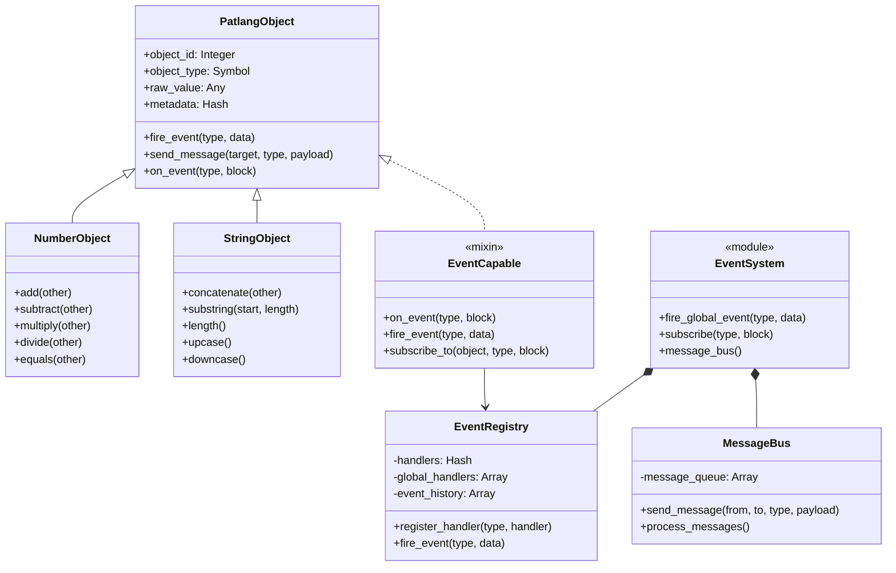

### Object Registry Architecture

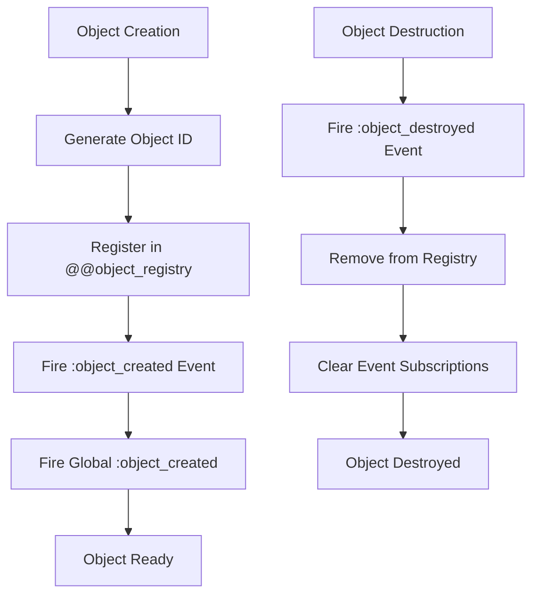

---

## Detailed Class Diagrams

### Complete PatlangObject Hierarchy

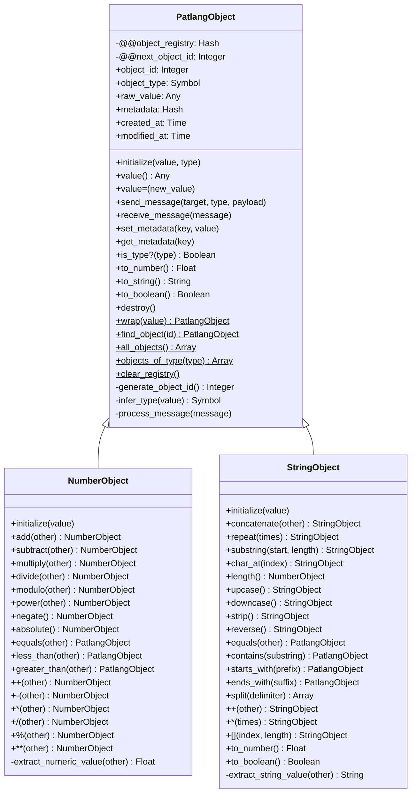

### Event System Components

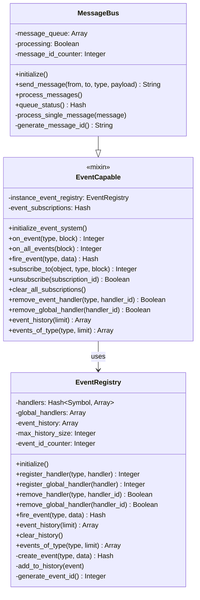

---

## Event System Deep Dive

### Event Scopes Architecture

The event system operates on three distinct scopes, each serving different architectural needs:

#### 1. Instance-Level Events
- **Scope**: Individual object instances
- **Registration**: [`obj.on_event(:event_type, &block)`](../../patlang-core/object_model/event_system.rb:153)
- **Firing**: [`obj.fire_event(:event_type, data)`](../../patlang-core/object_model/event_system.rb:164)
- **Use Case**: Object-specific behaviors and state changes

#### 2. Class-Level Events
- **Scope**: All instances of a specific class
- **Registration**: [`Class.on_event(:event_type, &block)`](../../patlang-core/object_model/event_system.rb:138)
- **Firing**: Automatically fired when instance events occur
- **Use Case**: Class-wide monitoring and statistics

#### 3. Global Events
- **Scope**: System-wide across all objects
- **Registration**: [`EventSystem.subscribe(:event_type, &block)`](../../patlang-core/object_model/event_system.rb:346)
- **Firing**: [`EventSystem.fire_global_event(:event_type, data)`](../../patlang-core/object_model/event_system.rb:351)
- **Use Case**: System monitoring, logging, and cross-cutting concerns

### Event Data Structure

```ruby
event = {
  type: :event_type,
  data: {
    # Event-specific payload
    object_id: 123,
    timestamp: Time.now,
    source: object_instance,
    # Additional event data...
  },
  timestamp: Time.now,
  event_id: 456
}
```

### Standard Event Types

| Event Type | Scope | Description | Data Fields |
|------------|-------|-------------|-------------|
| `:object_created` | Instance + Global | Object instantiation | `object_id`, `type`, `value`, `timestamp` |
| `:value_changed` | Instance | Value modification | `object_id`, `old_value`, `new_value`, `old_type`, `new_type` |
| `:metadata_changed` | Instance | Metadata update | `object_id`, `key`, `old_value`, `new_value` |
| `:object_destroyed` | Instance | Object destruction | `object_id`, `type`, `final_value` |
| `:message_sent` | Instance | Message transmission | `from`, `to`, `type`, `payload` |
| `:message_received` | Instance | Message reception | `from`, `to`, `type`, `payload` |
| `:arithmetic_operation` | Instance + Global | Numeric operations | `operation`, `left_operand`, `right_operand`, `result` |
| `:string_operation` | Instance + Global | String operations | `operation`, `operand`, `result` |
| `:comparison_operation` | Instance + Global | Comparison operations | `operation`, `left_operand`, `right_operand`, `result` |

---

## Sequence Diagrams

### Object Creation Flow

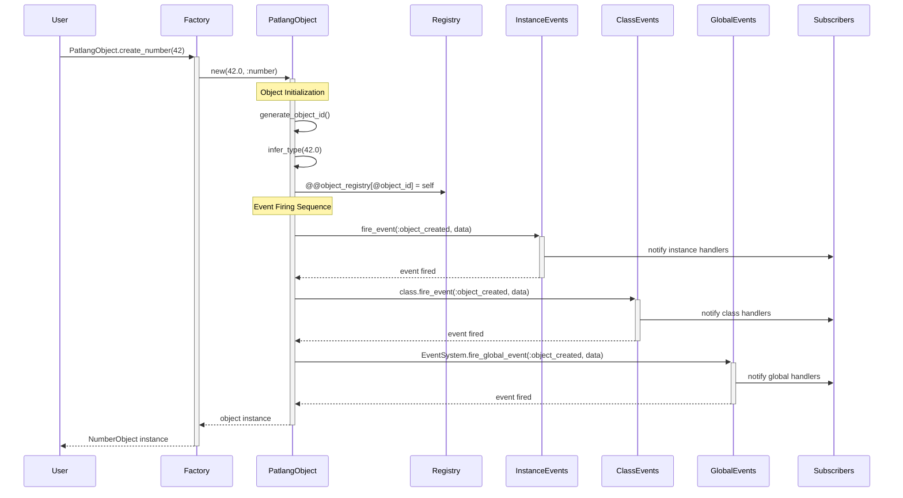

### Event Subscription and Firing

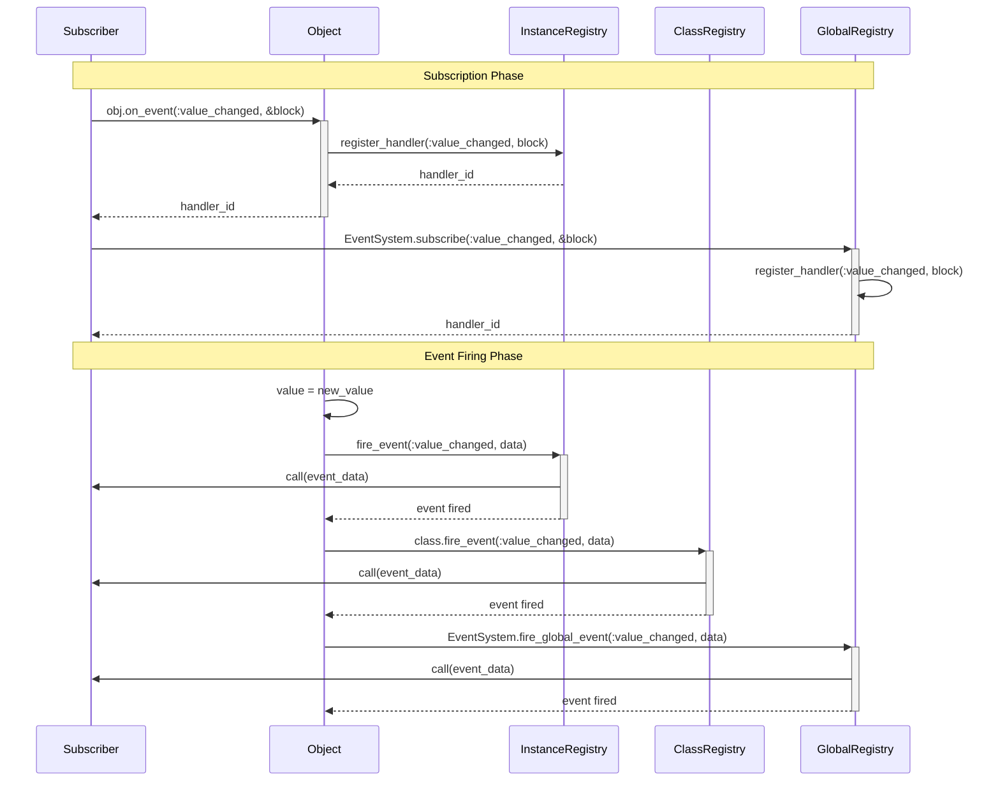

### Message Passing Flow

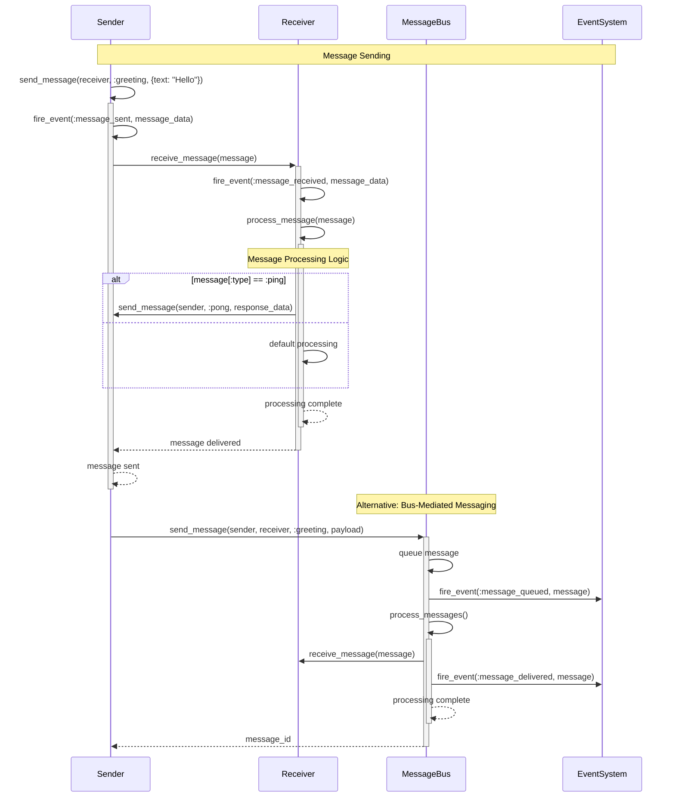

---

## Event Scopes & Flow

### Scope Hierarchy and Propagation

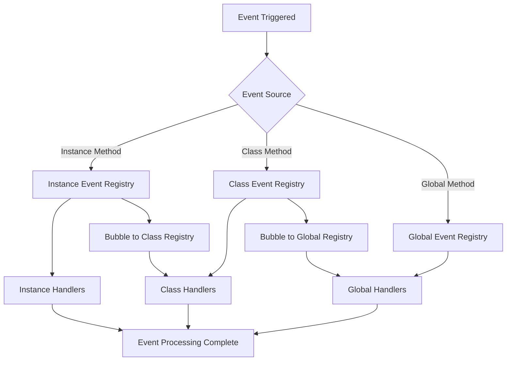

### Event Flow Patterns

#### Pattern 1: Standard Object Event Flow
1. **Instance Event**: [`obj.fire_event(:value_changed, data)`](../../patlang-core/object_model/event_system.rb:164)
2. **Class Event**: Automatically fired via EventCapable mixin
3. **Global Event**: Optional, fired for system-wide monitoring

#### Pattern 2: Global-Only Events
1. **Global Event**: [`EventSystem.fire_global_event(:system_shutdown, data)`](../../patlang-core/object_model/event_system.rb:351)
2. **No Instance/Class Propagation**: Direct global notification

#### Pattern 3: Message Bus Events
1. **Message Events**: Fired during message lifecycle
2. **Queue Events**: `:message_queued`, `:message_processing`, `:message_delivered`, `:message_failed`

---

## Message Passing System

### Message Structure

```ruby
message = {
  id: "msg_123",
  from: sender_object,
  to: receiver_object,
  type: :message_type,
  payload: {
    # Message-specific data
  },
  timestamp: Time.now,
  status: :pending # :pending, :processing, :delivered, :failed
}
```

### Message Bus Architecture

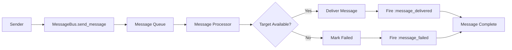

### Message Processing States

1. **`:pending`** - Message queued for processing
2. **`:processing`** - Message being delivered
3. **`:delivered`** - Message successfully delivered
4. **`:failed`** - Message delivery failed

---

## Test Failure Debugging Guide

### Common Test Failure Categories

Based on the failure analysis, the main categories of test failures are:

#### 1. EVENT_SUBSCRIPTION_ISSUE

**Symptoms:**
- Tests expecting event callbacks that never fire
- Event handlers not receiving expected data
- Timing issues between event firing and handler execution

**Common Causes:**
```ruby
# ❌ WRONG: Subscribing after event is fired
obj = PatlangObject.create_number(42)  # Events already fired during creation
obj.on_event(:object_created) { |data| ... }  # Too late!

# ✅ CORRECT: Subscribe to global events for object creation
EventSystem.subscribe(:object_created) { |data| ... }
obj = PatlangObject.create_number(42)  # Events will be caught
```

**Debugging Steps:**
1. Check event firing order vs subscription order
2. Verify correct event scope (instance vs class vs global)
3. Confirm event data structure matches expectations
4. Check for event handler exceptions (silently caught)

**Example Fix:**
```ruby
# Test Setup
events_received = []
EventSystem.subscribe(:object_created) do |data|
  events_received << data
end

# Object Creation
obj = PatlangObject.create_number(42)

# Verification
assert_equal 1, events_received.length
assert_equal 42, events_received.first[:value]
```

#### 2. TYPE_EXPECTATION_MISMATCH

**Symptoms:**
- Tests expecting raw values but receiving PatlangObject instances
- Type assertions failing on object vs primitive comparisons
- Evaluator returning unexpected object types

**Common Causes:**
```ruby
# ❌ WRONG: Expecting raw value when object mode is enabled
evaluator.enable_object_mode
result = evaluator.evaluate("42")
assert_equal 42, result  # Fails! result is NumberObject(42)

# ✅ CORRECT: Account for object mode behavior
evaluator.enable_object_mode
result = evaluator.evaluate("42")
assert_equal 42, result.value  # Access raw value
assert_equal :number, result.object_type  # Verify type
```

**Type Checking Patterns:**
```ruby
def assert_patlang_number(obj, expected_value)
  assert obj.is_a?(NumberObject), "Expected NumberObject, got #{obj.class}"
  assert_equal expected_value, obj.value
  assert_equal :number, obj.object_type
end

def assert_patlang_string(obj, expected_value)
  assert obj.is_a?(StringObject), "Expected StringObject, got #{obj.class}"
  assert_equal expected_value, obj.value
  assert_equal :string, obj.object_type
end
```

**Debugging Steps:**
1. Check if object mode is enabled in evaluator
2. Verify return type expectations vs actual types
3. Use [`obj.value`](../../patlang-core/object_model/patlang_object.rb:40) to access raw values
4. Test both object mode and normal mode behaviors

#### 3. MINITEST_COMPATIBILITY

**Symptoms:**
- Deprecation warnings in test output
- Tests using deprecated MiniTest assertions

**Common Issues:**
```ruby
# ❌ DEPRECATED
assert_equal nil, result

# ✅ CORRECT
assert_nil result
```

### Debugging Workflow

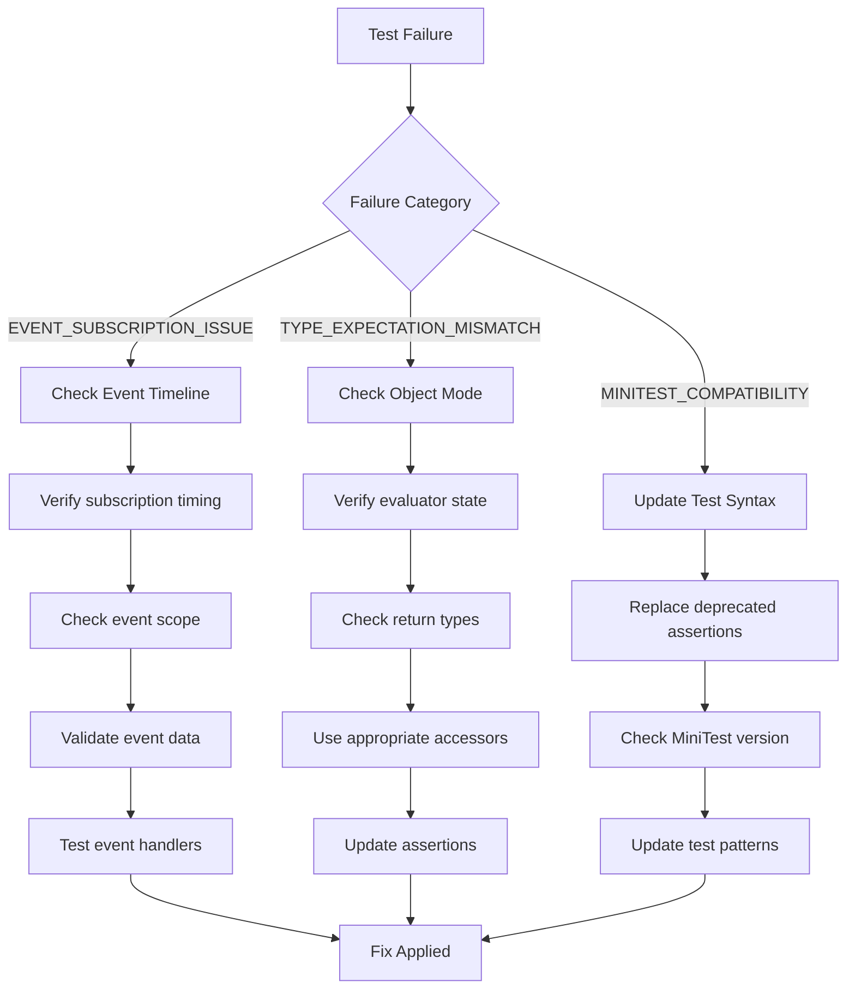

---

## Implementation Analysis

### Architecture Strengths

1. **Comprehensive Event Coverage**: Every significant operation fires events
2. **Multi-Scope Flexibility**: Instance, class, and global event scopes
3. **Rich Event History**: Complete audit trail of system events
4. **Robust Error Handling**: Event firing continues despite handler errors
5. **Message Queuing**: Asynchronous message processing with status tracking
6. **Object Lifecycle**: Complete creation, modification, and destruction tracking

### Identified Implementation Gaps

#### Event System Issues
1. **Event Timing Dependencies**: Object creation events fire during initialization, making subscription timing critical
2. **Event Data Inconsistency**: Different events have varying data structure formats
3. **Handler Error Isolation**: Errors in event handlers are caught but not well-reported

#### Type System Issues
1. **Mixed Type Returns**: Evaluator returns both raw values and object instances
2. **Implicit Object Mode**: Object mode state affects return types but isn't always clear
3. **Type Conversion Complexity**: Multiple paths for type conversion and comparison

#### Integration Issues
1. **Evaluator Coupling**: Tight coupling between object model and evaluator state
2. **Test Environment**: Object registry state can leak between tests
3. **Performance Overhead**: Every operation fires multiple events

### Performance Considerations

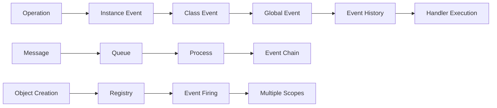

**Event Overhead**: Each operation triggers 3+ event firings (instance + class + global)
**Memory Usage**: Event history grows unbounded without explicit cleanup
**Handler Performance**: Multiple handlers per event can impact performance

---

## Integration Patterns

### Evaluator Integration

The object model integrates with the evaluator through several key patterns:

#### Object Mode Toggle
```ruby
# Normal Mode: Returns raw values
evaluator = Evaluator.new
result = evaluator.evaluate("42")  # Returns 42 (Integer)

# Object Mode: Returns PatlangObject instances
evaluator.enable_object_mode
result = evaluator.evaluate("42")  # Returns NumberObject(42)
```

#### Value Extraction Pattern
```ruby
def extract_value(result)
  if result.is_a?(PatlangObject)
    result.value
  else
    result
  end
end
```

#### Type-Safe Evaluation
```ruby
def evaluate_as_number(expression)
  result = evaluator.evaluate(expression)
  case result
  when NumberObject
    result
  when Numeric
    NumberObject.new(result)
  else
    raise TypeError, "Expected number, got #{result.class}"
  end
end
```

### Testing Integration Patterns

#### Clean Test Setup
```ruby
def setup
  PatlangObject.clear_registry
  EventSystem.clear_global_handlers
  @evaluator = Evaluator.new
end

def teardown
  PatlangObject.clear_registry
  EventSystem.clear_global_handlers
end
```

#### Event Testing Pattern
```ruby
def test_object_creation_events
  events = []
  EventSystem.subscribe(:object_created) { |data| events << data }
  
  obj = PatlangObject.create_number(42)
  
  assert_equal 1, events.length
  assert_equal 42, events.first[:value]
  assert_equal :number, events.first[:type]
end
```

#### Type Assertion Helpers
```ruby
def assert_number_object(obj, expected_value)
  assert obj.is_a?(NumberObject), "Expected NumberObject"
  assert_equal expected_value, obj.value
end

def assert_string_object(obj, expected_value)
  assert obj.is_a?(StringObject), "Expected StringObject"
  assert_equal expected_value, obj.value
end
```

---

## Best Practices & Recommendations

### Event System Usage

1. **Global Subscription for System Events**: Use [`EventSystem.subscribe`](../../patlang-core/object_model/event_system.rb:346) for object creation monitoring
2. **Instance Subscription for Object-Specific Logic**: Use [`obj.on_event`](../../patlang-core/object_model/event_system.rb:153) for object state tracking
3. **Event Handler Error Management**: Always handle potential exceptions in event handlers
4. **Event History Cleanup**: Periodically clear event history to prevent memory leaks

### Object Model Best Practices

1. **Consistent Type Checking**: Always verify object types before operations
2. **Value Access Patterns**: Use [`obj.value`](../../patlang-core/object_model/patlang_object.rb:40) for raw values, object methods for operations
3. **Registry Cleanup**: Clear object registry in test teardown
4. **Factory Method Usage**: Prefer [`PatlangObject.create_*`](../../patlang-core/object_model/patlang_object.rb:207) methods over direct instantiation

### Testing Recommendations

1. **Event Timeline Awareness**: Subscribe to events before creating objects
2. **Type Assertion Clarity**: Use specific type checking methods
3. **Clean Test Environment**: Always clean up registry and event handlers
4. **Object Mode Testing**: Test both object mode and normal mode behaviors

---

## Conclusion

This architecture provides a robust foundation for Patlang's object-oriented features with comprehensive event monitoring and message passing capabilities. The multi-scope event system enables fine-grained observability while the object model ensures consistent behavior across all language elements.

The identified test failure patterns (EVENT_SUBSCRIPTION_ISSUE and TYPE_EXPECTATION_MISMATCH) stem primarily from the timing-sensitive nature of event subscriptions and the dual-mode behavior of the evaluator. Following the debugging guidelines and best practices outlined above should resolve most integration issues.

For ongoing development, focus on:
1. Standardizing event data structures
2. Improving evaluator mode consistency
3. Enhancing error reporting in event handlers
4. Optimizing event system performance

This documentation serves as both architectural reference and practical debugging guide for working with Patlang's object model and event system.