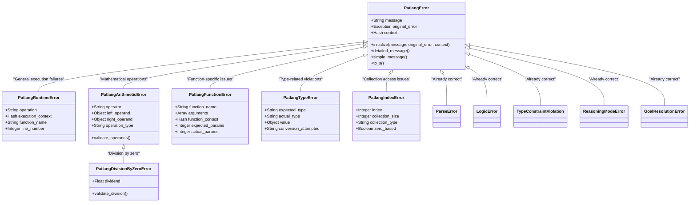
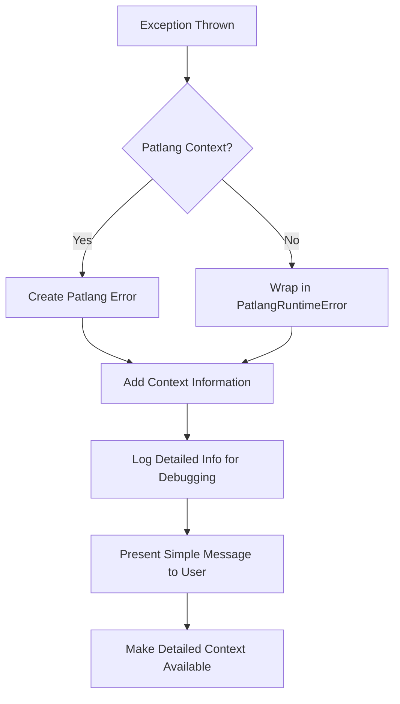

# Patlang Error Handling Strategy Specification

## Executive Summary

This document defines a comprehensive error handling strategy for Patlang that eliminates dependency on Ruby native exceptions and establishes a proper Patlang-specific error hierarchy. The strategy addresses the current inconsistencies in error handling, particularly the division by zero issue in `test/ruby_implementation/test_function_evaluator.rb:475`.

## Current State Analysis

### Problems Identified

1. **Inconsistent Error Hierarchy**: [`PatlangZeroDivisionError`](patlang-core/exceptions.rb:77) inherits from Ruby's `ZeroDivisionError` instead of [`PatlangError`](patlang-core/exceptions.rb:4)
2. **Mixed Error Types**: Evaluators throw mix of strings, `RuntimeError`, and native exceptions
3. **Missing Error Context**: No standardized way to capture operation context, values, or location
4. **Test Mismatch**: Test expects `RuntimeError` but receives `ZeroDivisionError`
5. **Ruby Dependency**: 39 different `raise` statements across evaluators with varying approaches

### Current Error Locations

- [`patlang-core/evaluator/arithmetic_evaluator.rb:35`](patlang-core/evaluator/arithmetic_evaluator.rb:35) - throws `ZeroDivisionError`
- [`patlang-core/object_model/number_object.rb:87`](patlang-core/object_model/number_object.rb:87) - throws `ZeroDivisionError`
- [`test/ruby_implementation/test_function_evaluator.rb:475`](test/ruby_implementation/test_function_evaluator.rb:475) - expects `RuntimeError`

## Proposed Patlang Error Hierarchy



## Error Categories and Usage Guidelines

| Error Class | When to Use | Example Scenarios |
|-------------|-------------|-------------------|
| `PatlangRuntimeError` | General execution failures | Function undefined, variable undefined, general runtime issues |
| `PatlangArithmeticError` | Mathematical operation errors | Invalid operands, overflow, mathematical domain errors |
| `PatlangDivisionByZeroError` | Division by zero specifically | `x / 0`, `x % 0`, division operations with zero denominator |
| `PatlangFunctionError` | Function-specific issues | Wrong parameter count, function redefinition conflicts |
| `PatlangTypeError` | Type-related violations | String used as number, invalid conversions, type mismatches |
| `PatlangIndexError` | Collection access issues | Array/string index out of bounds, negative indices |

## Division by Zero Specific Strategy

### Error Type
- **Class**: `PatlangDivisionByZeroError < PatlangArithmeticError < PatlangError`
- **Simple Message**: `"Division by zero"`
- **Context Properties**: 
  - `operator`: The division operator used (`/`, `%`, etc.)
  - `left_operand`: The dividend value
  - `right_operand`: The divisor (0)
  - `location`: Where the error occurred (function name, line number if available)

### Test Fix Strategy
Update the failing test to expect `PatlangDivisionByZeroError` instead of `RuntimeError`, maintaining backward compatibility through error message matching.

## Layered Error Message Format

### Simple Message (User-Facing)
```ruby
error.simple_message
# => "Division by zero"
```

### Detailed Message (Developer-Facing)
```ruby
error.detailed_message
# => "Division by zero (operator: /, left: 10, right: 0, in function: divide)"
```

### Implementation Pattern
```ruby
class PatlangError
  def simple_message
    @message  # User-friendly message
  end
  
  def detailed_message
    base = simple_message
    context_parts = []
    context_parts << "operator: #{@context[:operator]}" if @context[:operator]
    context_parts << "left: #{@context[:left_operand]}" if @context[:left_operand]
    context_parts << "right: #{@context[:right_operand]}" if @context[:right_operand]
    context_parts << "at #{@context[:location]}" if @context[:location]
    context_parts << "in #{@context[:function]}" if @context[:function]
    
    context_parts.empty? ? base : "#{base} (#{context_parts.join(', ')})"
  end
  
  def to_s
    simple_message  # Default to user-friendly message
  end
end
```

## Error Wrapping Strategy



### Context Capture Pattern
```ruby
def safe_arithmetic_operation(operator, left, right, location: nil)
  # Perform operation...
rescue ZeroDivisionError => e
  raise PatlangDivisionByZeroError.new(
    "Division by zero",
    original_error: e,
    context: {
      operator: operator,
      left_operand: left,
      right_operand: right,
      location: location
    }
  )
rescue => e
  raise PatlangArithmeticError.new(
    "Arithmetic operation failed",
    original_error: e,
    context: {
      operator: operator,
      left_operand: left,
      right_operand: right,
      location: location
    }
  )
end
```

## Implementation Plan

### Phase 1: Update Exception Hierarchy (Priority 1)

1. **Fix [`PatlangZeroDivisionError`](patlang-core/exceptions.rb:77)**
   - Change inheritance from `ZeroDivisionError` to `PatlangArithmeticError`
   - Add context properties for operands and operator

2. **Add New Error Classes**
   - `PatlangRuntimeError` - for general execution failures
   - `PatlangArithmeticError` - base for mathematical errors
   - `PatlangFunctionError` - for function-related issues
   - `PatlangTypeError` - for type violations
   - `PatlangIndexError` - for collection access issues

3. **Enhance [`PatlangError`](patlang-core/exceptions.rb:4) Base Class**
   - Add `simple_message()` and `detailed_message()` methods
   - Improve context handling and formatting
   - Add error code system for programmatic handling

### Phase 2: Update Evaluator Modules (Priority 1)

1. **Arithmetic Evaluator [`patlang-core/evaluator/arithmetic_evaluator.rb`](patlang-core/evaluator/arithmetic_evaluator.rb)**
   - Replace [`ZeroDivisionError`](patlang-core/evaluator/arithmetic_evaluator.rb:35) with `PatlangDivisionByZeroError`
   - Add context capture for all arithmetic operations
   - Standardize error messages

2. **Object Model [`patlang-core/object_model/number_object.rb`](patlang-core/object_model/number_object.rb)**
   - Replace [`ZeroDivisionError`](patlang-core/object_model/number_object.rb:87) with `PatlangDivisionByZeroError`
   - Maintain event system integration
   - Add operation context

3. **Function Evaluator [`patlang-core/evaluator/function_evaluator.rb`](patlang-core/evaluator/function_evaluator.rb)**
   - Replace string raises with `PatlangFunctionError`
   - Add function context to all errors
   - Improve parameter validation error messages

4. **String Evaluator [`patlang-core/evaluator/string_evaluator.rb`](patlang-core/evaluator/string_evaluator.rb)**
   - Replace string raises with `PatlangTypeError`/`PatlangIndexError`
   - Add type and index context
   - Standardize string operation error handling

5. **Object Evaluator [`patlang-core/evaluator/object_evaluator.rb`](patlang-core/evaluator/object_evaluator.rb)**
   - Standardize all error throwing patterns
   - Add operation context for all errors

### Phase 3: Error Context Integration (Priority 2)

1. **Context Capture System**
   - Add location tracking to evaluators
   - Integrate with existing event system
   - Create error context builder utility

2. **Error Reporting Enhancement**
   - Add detailed logging for development
   - Create error summary for production
   - Integrate with debugging tools

### Phase 4: Test Updates (Priority 2)

1. **Fix Failing Test**
   - Update [`test/ruby_implementation/test_function_evaluator.rb:475`](test/ruby_implementation/test_function_evaluator.rb:475)
   - Change from `RuntimeError` to `PatlangDivisionByZeroError`
   - Maintain error message validation

2. **Comprehensive Error Tests**
   - Add tests for all new error types
   - Test error message consistency
   - Verify context capture works correctly

3. **Integration Tests**
   - Test error propagation through evaluator chain
   - Verify backward compatibility where needed
   - Test error wrapping scenarios

## Migration Strategy

### Backward Compatibility Approach

1. **Gradual Migration**
   - Phase out Ruby native exceptions incrementally
   - Provide error wrapping during transition period
   - Log when legacy error handling is used

2. **Error Translation Map**
   ```ruby
   RUBY_TO_PATLANG_ERRORS = {
     ZeroDivisionError => PatlangDivisionByZeroError,
     ArgumentError => PatlangTypeError,
     NoMethodError => PatlangFunctionError,
     RuntimeError => PatlangRuntimeError,
     IndexError => PatlangIndexError
   }
   ```

3. **Feature Flags**
   - Enable new error handling incrementally
   - Allow rollback if issues arise
   - Monitor migration progress

### Validation Strategy

1. **Pre-Migration Testing**
   - Run full test suite with new error types
   - Verify no functionality regressions
   - Test error message consistency

2. **Post-Migration Validation**
   - Monitor error logs for unexpected patterns
   - Verify all evaluators use Patlang errors
   - Confirm test suite passes completely

## Error Message Standards

### Format Guidelines

1. **Simple Messages**
   - Start with verb or error type
   - No technical jargon
   - Under 50 characters when possible
   - Examples: "Division by zero", "Function not found", "Invalid type"

2. **Context Information**
   - Include operation details in context hash
   - Provide actual vs expected values
   - Add location information when available
   - Include suggestions for resolution when appropriate

3. **Consistency Rules**
   - Use consistent terminology across error types
   - Follow standard capitalization (sentence case)
   - Avoid implementation details in simple messages
   - Reserve technical details for context properties

### Example Error Messages

```ruby
# Division by zero
PatlangDivisionByZeroError.new(
  "Division by zero",
  context: {
    operator: "/",
    left_operand: 10,
    right_operand: 0,
    function: "divide"
  }
)
# Simple: "Division by zero"
# Detailed: "Division by zero (operator: /, left: 10, right: 0, in function: divide)"

# Function parameter mismatch
PatlangFunctionError.new(
  "Wrong number of arguments",
  context: {
    function_name: "calculate",
    expected_params: 2,
    actual_params: 1,
    arguments: [42]
  }
)
# Simple: "Wrong number of arguments"
# Detailed: "Wrong number of arguments (function: calculate, expected: 2, got: 1)"

# Type error
PatlangTypeError.new(
  "Invalid type for operation",
  context: {
    expected_type: "Number",
    actual_type: "String",
    value: "hello",
    operation: "arithmetic"
  }
)
# Simple: "Invalid type for operation"
# Detailed: "Invalid type for operation (expected: Number, got: String, value: 'hello')"
```

## Expected Benefits

1. **Consistency**: All Patlang operations use Patlang-specific errors
2. **Context**: Rich debugging information without overwhelming users
3. **Maintainability**: Clear error hierarchy for future extension
4. **Self-Hosting Preparation**: No dependency on Ruby error types
5. **Better UX**: Simple messages for users, detailed context for developers
6. **Debugging**: Improved error tracking and resolution
7. **Testing**: More reliable and specific test assertions

## Success Criteria

1. **Zero Ruby Native Exceptions**: All Patlang operations throw only Patlang errors
2. **Test Suite Passes**: All existing tests pass with new error types
3. **Consistent Messages**: All error messages follow standard format
4. **Rich Context**: All errors include relevant operation context
5. **Backward Compatibility**: Existing error handling patterns still work
6. **Performance**: No significant performance impact from error handling changes

## Future Considerations

1. **Error Codes**: Add numeric error codes for programmatic handling
2. **Internationalization**: Support for localized error messages
3. **Error Recovery**: Enhanced error recovery mechanisms
4. **Debugging Integration**: Better integration with development tools
5. **Performance Monitoring**: Error frequency and pattern tracking
6. **Self-Hosting**: Preparation for Patlang-implemented error handling