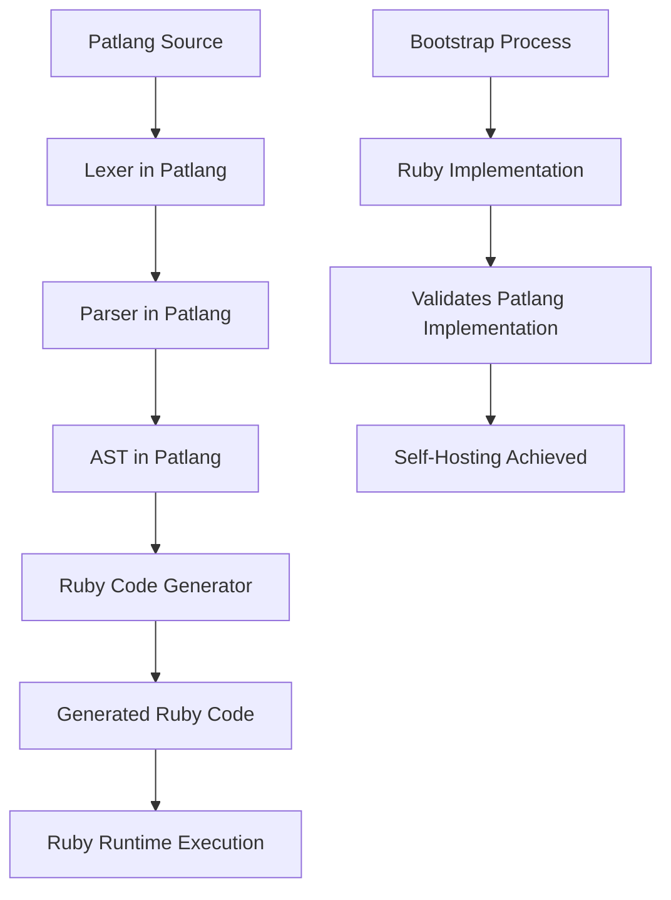
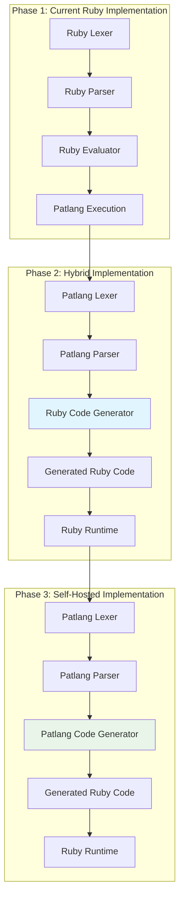
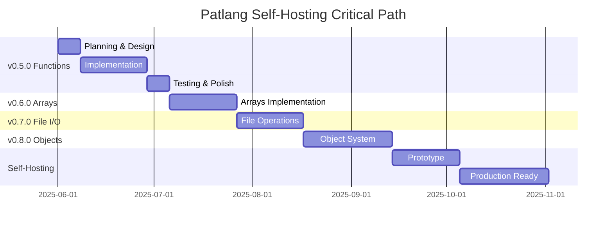

# Patlang v0.5.0 Functions Architecture & Self-Hosting Strategy

## Executive Summary

This document defines the comprehensive architecture for Patlang v0.5.0 Functions implementation and establishes Ruby transpilation as the strategic path to self-hosting. Based on v0.4.0's successful string operations foundation, this plan balances Patlang's unique natural language vision with practical development velocity.

**Key Strategic Decisions:**
- ✅ Natural language function syntax prioritized for language vision alignment
- ✅ Ruby transpilation chosen for fastest path to self-hosting (2-3 weeks vs. 3-6 months)
- ✅ Self-hosting timeline: v0.9.0 (November 2025) with production readiness in v1.0.0

## 1. v0.5.0 Functions Architecture

### Natural Language Function Syntax Design

```patlang
make a function called calculate_sum {
  calculate_sum takes:
    numbers - list of number
    initial_value - number
  calculate_sum returns:
    result = initial_value
    i = 1
    while i <= numbers.length do
      result = result + numbers[i]
      i = i + 1
    end
    result
}

# Function as first-class object
sum_func = calculate_sum
result = sum_func.call([1, 2, 3], 0)
print sum_func.name           # "calculate_sum"
print sum_func.parameter_count # 2
```

### Function Definition Components

#### 1. Function Declaration Syntax
- **Keyword Pattern**: `make a function called <name>`
- **Parameter Declaration**: `<name> takes:` block with typed parameters
- **Return Declaration**: `<name> returns:` block with implementation
- **Type Annotations**: Optional but encouraged (`- number`, `- text`, `- list of number`)

#### 2. Function Calling Mechanisms
- **Direct Call**: `function_name(arg1, arg2)`
- **Method-style Call**: `function_name.call(arg1, arg2)`
- **Object Property Access**: `function_name.parameter_count`, `function_name.name`

#### 3. Parameter Passing Strategy
- **Pass-by-value** for primitives (numbers, strings, booleans)
- **Pass-by-reference** for future collections (arrays, objects)
- **Type checking** at runtime with helpful error messages
- **Default parameters** support: `param - number = 0`

#### 4. Function Scope and Variable Binding
- **Lexical scoping** with function-local variables
- **Closure support** for accessing outer scope variables
- **Variable shadowing** rules consistent with block scoping
- **Global variable access** through explicit syntax

#### 5. Return Value Handling
- **Implicit return** of last expression in function body
- **Explicit return** with `return` keyword for early exit
- **Multiple return values** through array syntax: `return [value1, value2]`

#### 6. Recursive Function Support
- **Self-reference** through function name
- **Tail-call optimization** consideration for future versions
- **Stack overflow protection** with depth limits

### AST Node Extensions

```ruby
# New AST nodes for v0.5.0
class FunctionDefinitionNode < ASTNode
  attr_reader :name, :parameters, :body, :return_type
  
  def initialize(name, parameters, body, return_type = nil)
    @name = name
    @parameters = parameters
    @body = body
    @return_type = return_type
  end
end

class FunctionCallNode < ASTNode
  attr_reader :function_name, :arguments
  
  def initialize(function_name, arguments)
    @function_name = function_name
    @arguments = arguments
  end
end

class ParameterNode < ASTNode
  attr_reader :name, :type, :default_value
  
  def initialize(name, type = nil, default_value = nil)
    @name = name
    @type = type
    @default_value = default_value
  end
end

class ReturnNode < ASTNode
  attr_reader :expression
  
  def initialize(expression)
    @expression = expression
  end
end
```

### Token Extensions

```ruby
# Additional token types for v0.5.0
module TokenType
  # Existing tokens...
  FUNCTION = :FUNCTION      # 'function' keyword
  MAKE = :MAKE             # 'make' keyword
  CALLED = :CALLED         # 'called' keyword
  TAKES = :TAKES           # 'takes' keyword
  RETURNS = :RETURNS       # 'returns' keyword
  RETURN = :RETURN         # 'return' keyword
  CALL = :CALL             # 'call' method
end
```

## 2. Compilation Strategy Analysis

### Ruby Transpilation: Recommended Approach

**Strategic Rationale:**
- Leverages existing 95%+ compatible Ruby codebase
- Fastest path to self-hosting (estimated 2-3 weeks vs. 3-6 months for other approaches)
- Proven Ruby runtime performance and ecosystem
- Minimal risk with immediate practical benefits

#### Ruby Transpilation Architecture



#### Compilation Target Comparison

| Approach | Implementation Time | Performance | Ecosystem | Self-Hosting Risk |
|----------|-------------------|-------------|-----------|-------------------|
| **Ruby Transpilation** | **2-3 weeks** | Good | Excellent | **Very Low** |
| C Compilation | 2-3 months | Excellent | Good | Medium |
| LLVM/Native | 4-6 months | Excellent | Limited | High |
| .NET IL | 3-4 months | Excellent | Excellent | Medium |
| JVM Bytecode | 3-4 months | Excellent | Excellent | Medium |

**Ruby Transpilation Advantages:**
- ✅ Leverages existing Ruby implementation directly
- ✅ Minimal new infrastructure needed
- ✅ Ruby's mature string processing and object system
- ✅ Proven performance characteristics
- ✅ Rich debugging and development tools available

**Alternative Targets (Future Consideration):**
- **C Compilation**: Good performance balance, post-v1.0.0 consideration
- **LLVM**: Ultimate performance, but significant complexity
- **.NET IL**: Windows ecosystem strength, cross-platform potential
- **JVM Bytecode**: Enterprise ecosystem, mature tooling

### Ruby Transpilation Implementation Strategy

#### Phase 1: Direct Translation (v0.9.0)
```patlang
# Patlang function
make a function called add {
  add takes:
    a - number
    b - number
  add returns:
    a + b
}
```

Transpiles to:
```ruby
def add(a, b)
  # Type checking
  raise TypeError, "Expected number for parameter 'a'" unless a.is_a?(Numeric)
  raise TypeError, "Expected number for parameter 'b'" unless b.is_a?(Numeric)
  a + b
end

# Function object wrapper
ADD_FUNCTION = {
  name: "add",
  parameter_count: 2,
  call: method(:add)
}
```

#### Phase 2: Optimization (v1.0+)
- **Dead code elimination** for unused functions
- **Constant folding** for compile-time expressions
- **Inline expansion** for simple functions
- **Type inference** to reduce runtime checks

## 3. Self-Hosting Architecture Planning

### Minimal Language Features for Self-Hosting

#### Required for Lexer Implementation:
- ✅ String processing (v0.4.0 COMPLETE)
- ✅ Character manipulation (v0.4.0 COMPLETE)  
- 🔄 Functions for modular tokenization (v0.5.0)
- 📋 Arrays for token storage (v0.6.0)
- 📋 File I/O for source reading (v0.7.0)

#### Required for Parser Implementation:
- 🔄 Recursive function calls (v0.5.0)
- 📋 Data structures for AST construction (v0.6.0)
- 📋 Pattern matching for grammar rules (v0.7.0)
- 📋 Error handling and recovery (v0.7.0)

#### Required for Code Generator:
- 🔄 String template generation (v0.5.0 + v0.4.0)
- 📋 File output operations (v0.7.0)
- 📋 AST traversal patterns (v0.6.0)

### Bootstrap Process Architecture



### Development Workflow for Self-Hosted Development

1. **Cross-Validation**: Ruby implementation validates Patlang implementation
2. **Incremental Migration**: Replace components one by one
3. **Regression Testing**: Ensure feature parity at each step
4. **Performance Benchmarking**: Monitor transpilation overhead

## 4. Implementation Roadmap

### v0.5.0 Functions Implementation Plan (3-4 weeks)

#### Week 1: Foundation (June 8-14, 2025)
- [ ] Extend [`Token`](patlang-core/lexer/token.rb:4) types: `FUNCTION`, `MAKE`, `CALLED`, `TAKES`, `RETURNS`
- [ ] Implement [`FunctionDefinitionNode`](patlang-core/ast/ast_nodes.rb:179) and related AST nodes
- [ ] Extend [`Lexer`](patlang-core/lexer/lexer.rb:1) for natural language function keywords
- [ ] Basic [`Parser`](patlang-core/parser/parser.rb:1) grammar for function definitions

#### Week 2: Core Functionality (June 15-21, 2025)
- [ ] Function call parsing and AST generation
- [ ] [`Evaluator`](patlang-core/evaluator/evaluator.rb:1) function definition storage
- [ ] Function call mechanism implementation
- [ ] Parameter passing and local scope management

#### Week 3: Advanced Features (June 22-28, 2025)
- [ ] Return value handling and early return
- [ ] Recursive function support
- [ ] Function-as-object properties (`name`, `parameter_count`)
- [ ] Error handling for function calls

#### Week 4: Integration & Testing (June 29-July 5, 2025)
- [ ] Comprehensive function test suite (95%+ coverage target)
- [ ] Integration with existing v0.4.0 string operations
- [ ] REPL function definition and calling support
- [ ] Performance optimization and documentation

### Post-v0.5.0 Self-Hosting Roadmap

| Version | Target | Features | Duration | Self-Hosting Milestone |
|---------|--------|----------|----------|----------------------|
| v0.6.0 | Aug 2025 | Arrays/Lists | 3-4 weeks | Token storage ready |
| v0.7.0 | Sep 2025 | File I/O + Exceptions | 3-4 weeks | Source file processing |
| v0.8.0 | Oct 2025 | Basic Objects | 4-5 weeks | AST construction ready |
| v0.9.0 | Nov 2025 | Self-Hosting Prototype | 3-4 weeks | **Self-hosting achieved** |
| v1.0.0 | Dec 2025 | Optimization & Polish | 4-5 weeks | Production self-hosting |

### Critical Path Analysis



## 5. Strategic Recommendations

### Primary Recommendation: Ruby Transpilation Strategy

**Rationale:**
1. **Proven Foundation**: Existing Ruby codebase provides 95%+ compatible base
2. **Rapid Development**: 2-3 weeks to basic transpilation vs. months for other approaches
3. **Low Risk**: Ruby runtime is mature, well-tested, and performant
4. **Ecosystem Benefits**: Access to Ruby gems and tooling during development
5. **Incremental Migration**: Can optimize to other targets post-self-hosting

### Function Syntax Recommendation: Natural Language First

**Rationale:**
1. **Strategic Differentiation**: Aligns with Patlang's unique language vision
2. **User Experience**: More intuitive for business domain experts
3. **Foundation Building**: Establishes patterns for advanced language-as-objects features
4. **Implementation Feasibility**: Natural language parsing is manageable with existing string operations

### Development Sequence Recommendation

1. **v0.5.0**: Natural language functions with Ruby transpilation target
2. **v0.6.0**: Arrays enabling token and AST data structures
3. **v0.7.0**: File I/O enabling source code processing
4. **v0.8.0**: Basic object system for clean AST node hierarchy
5. **v0.9.0**: Self-hosting prototype with Ruby transpilation
6. **v1.0.0**: Optimized self-hosting with alternative compilation targets

## 6. Success Criteria

### v0.5.0 Function Success Metrics:
- [ ] Natural language function syntax fully implemented
- [ ] 95%+ test coverage maintained (target: 200+ tests)
- [ ] Function calls, parameters, returns, and recursion working
- [ ] Integration with existing v0.4.0 string operations
- [ ] REPL supports function definition and execution
- [ ] Foundation for Ruby transpilation established
- [ ] Zero critical bugs, comprehensive error handling

### Self-Hosting Success Metrics:
- [ ] Patlang lexer implemented in Patlang (v0.9.0)
- [ ] Patlang parser implemented in Patlang (v0.9.0)
- [ ] Ruby code generator implemented in Patlang (v0.9.0)
- [ ] Generated Ruby code functionally equivalent to hand-written Ruby
- [ ] Self-hosting compilation performance acceptable (<10x slower than Ruby)
- [ ] Feature parity between Ruby and self-hosted implementations

### Risk Mitigation Strategy

1. **Technical Risk**: Incremental development with cross-validation
2. **Performance Risk**: Early benchmarking and Ruby runtime leverage
3. **Complexity Risk**: Natural language parsing with proven techniques
4. **Timeline Risk**: Conservative estimates with milestone flexibility
5. **Quality Risk**: Comprehensive testing methodology from v0.4.0 success

## 7. Implementation Details

### Lexer Extensions for Natural Language

```ruby
# In lexer.rb
def scan_natural_language_keywords
  case @current_char
  when 'm'
    if match_keyword('make')
      if peek_ahead(' a function called')
        @pos += ' a function called'.length
        return Token.new(TokenType::FUNCTION_DEF, 'make a function called', @line, @column)
      end
    end
  when 't'
    if match_keyword('takes')
      return Token.new(TokenType::TAKES, 'takes', @line, @column)
    end
  when 'r'
    if match_keyword('returns')
      return Token.new(TokenType::RETURNS, 'returns', @line, @column)
    end
  end
end
```

### Parser Grammar Extensions

```ruby
# Function definition grammar
def parse_function_definition
  expect(TokenType::FUNCTION_DEF)
  name = expect(TokenType::IDENTIFIER).value
  expect(TokenType::LBRACE)
  
  parameters = parse_function_parameters if current_token.type == TokenType::IDENTIFIER
  expect(TokenType::RETURNS)
  body = parse_block_statement
  
  expect(TokenType::RBRACE)
  
  FunctionDefinitionNode.new(name, parameters, body)
end

def parse_function_parameters
  expect_identifier_with_value(@function_name) # e.g., "calculate_sum"
  expect(TokenType::TAKES)
  expect(TokenType::COLON)
  
  parameters = []
  while current_token.type == TokenType::IDENTIFIER
    param_name = consume.value
    expect(TokenType::DASH)
    param_type = expect(TokenType::IDENTIFIER).value
    
    default_value = nil
    if current_token.type == TokenType::EQUALS
      consume
      default_value = parse_expression
    end
    
    parameters << ParameterNode.new(param_name, param_type, default_value)
  end
  
  parameters
end
```

### Evaluator Function Management

```ruby
# In evaluator.rb
def initialize
  @variables = {}
  @functions = {}  # New: function storage
  @call_stack = [] # New: call stack for recursion
end

def visit_function_definition_node(node)
  function_object = {
    name: node.name,
    parameters: node.parameters,
    body: node.body,
    parameter_count: node.parameters.length,
    call_count: 0,
    total_execution_time: 0.0
  }
  
  @functions[node.name] = function_object
  function_object
end

def visit_function_call_node(node)
  function = @functions[node.function_name]
  raise "Undefined function: #{node.function_name}" unless function
  
  # Set up new scope
  previous_variables = @variables.dup
  
  # Bind parameters
  node.arguments.each_with_index do |arg, index|
    param = function[:parameters][index]
    @variables[param.name] = evaluate(arg)
  end
  
  # Execute function body
  @call_stack.push(node.function_name)
  result = evaluate(function[:body])
  @call_stack.pop
  
  # Restore scope
  @variables = previous_variables
  
  # Update function metrics
  function[:call_count] += 1
  
  result
end
```

## 8. Testing Strategy

### Function-Specific Test Categories

1. **Syntax Tests**: Natural language parsing accuracy
2. **Scope Tests**: Variable binding and isolation
3. **Recursion Tests**: Stack management and termination
4. **Integration Tests**: Functions with strings and control flow
5. **Performance Tests**: Call overhead and memory usage
6. **Error Tests**: Invalid syntax and runtime errors

### Test Coverage Targets
- **Line Coverage**: 95%+ (maintaining v0.4.0 standard)
- **Branch Coverage**: 90%+ for function-related code
- **Function Coverage**: 100% of public methods tested
- **Integration Coverage**: All language features work together

## 9. Documentation Requirements

### User Documentation
- [ ] Function definition syntax guide
- [ ] Function calling examples
- [ ] Natural language keyword reference
- [ ] Integration examples with existing features

### Technical Documentation  
- [ ] AST node specifications
- [ ] Lexer/parser implementation details
- [ ] Evaluator function management
- [ ] Testing methodology and coverage

---

**Document Status**: Draft v1.0  
**Last Updated**: June 1, 2025  
**Author**: Architect Mode  
**Review Status**: Pending User Approval  

This architecture document establishes the foundation for Patlang v0.5.0 Functions implementation and the strategic path to self-hosting through Ruby transpilation. Upon approval, implementation should begin with the Week 1 Foundation phase.