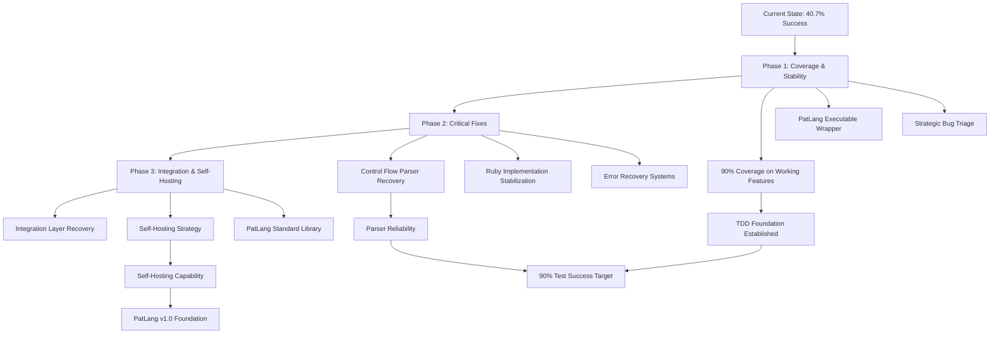
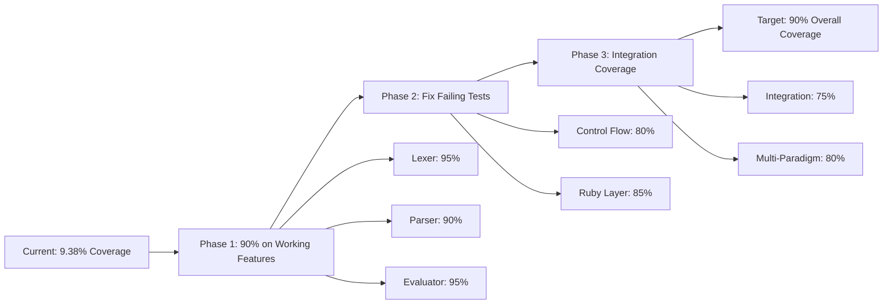

# PatLang Development Roadmap
## Comprehensive Technical Strategy for Next Phase Development

**Generated:** June 17, 2025  
**Current Status:** 40.7% test success rate, solid infrastructure foundation  
**Development Model:** Solo + AI Support with TDD Approach  
**Target:** 90% test coverage, strategic bug reduction, incremental self-hosting  

---

## Executive Summary

PatLang has achieved a solid foundation with working arithmetic interpreter, lexer, and parser infrastructure (56% passing tests). The next phase focuses on strategic stabilization using Test-Driven Development to achieve 90% coverage, reduce critical errors systematically, and build toward incremental self-hosting capabilities.

**Key Metrics:**
- Current: 40.7% test success (24/59 files)
- Target Phase 1: 70% test success, 90% coverage on working features
- Target Phase 2: 85% test success, stable control flow
- Target Phase 3: Self-hosting foundation with PatLang-implemented components

---

## Current State Analysis

### ✅ Strengths (Build Upon These)
- **Core Infrastructure (56% passing):** Lexer, Parser, AST processing
- **Branch Coverage Testing (100% passing):** Comprehensive validation framework
- **Working Interpreter:** Arithmetic evaluation with REPL
- **Architecture:** Well-designed multi-paradigm foundation
- **IS Keyword & Flexible Functions:** Partial implementation exists

### 🚧 Strategic Issues (Address Systematically)
- **Control Flow Parser Errors:** "Missing 'end'" blocking 60% of failures
- **Ruby Implementation Layer:** 60% error rate needs stabilization
- **Integration Layer:** 0% success rate (complete failure)
- **Test Coverage:** 9.38% too low for reliable TDD

### 🎯 Critical Success Factors
1. Achieve 90% test coverage on working features first
2. Fix parser error recovery for control flow constructs
3. Stabilize Ruby implementation layer systematically
4. Build executable wrapper for practical usage
5. Plan incremental self-hosting strategy

---

## Phase 1: Test Coverage & Stabilization (Weeks 1-4)

### Priority 1.1: Achieve 90% Coverage on Working Features
**Rationale:** Establish reliable TDD foundation before fixing complex bugs

**Week 1-2: Core Infrastructure Coverage**
- [ ] **Lexer Coverage to 95%**
  - Add tests for edge cases in tokenization
  - Cover error handling paths in lexer
  - Test Unicode and special character handling
  - Current: Some coverage exists, target: 95%

- [ ] **Parser Coverage to 90% (Working Parts)**
  - Focus on arithmetic expression parsing (known working)
  - Test operator precedence thoroughly
  - Cover parentheses grouping and nesting
  - Skip control flow tests until Phase 2

- [ ] **AST Node Coverage to 95%**
  - Test all node types for arithmetic expressions
  - Cover node creation, traversal, and properties
  - Test node serialization/representation

**Week 3-4: Evaluator and Integration Coverage**
- [ ] **Arithmetic Evaluator to 95%**
  - Test all arithmetic operations exhaustively
  - Cover edge cases: division by zero, overflow, etc.
  - Test variable assignment (IS keyword)
  - Test REPL functionality

- [ ] **Function System Coverage to 80%**
  - Test flexible function syntax (already partially working)
  - Cover function definition and basic calls
  - Skip complex control flow in functions until Phase 2

**Deliverable:** Test coverage report showing 90% coverage on working features

### Priority 1.2: Create PatLang Executable Wrapper
**Rationale:** Enable practical usage and testing of .pat files

- [ ] **Simple Executable Script (`bin/patlang`)**
  ```bash
  #!/usr/bin/env ruby
  # Simple wrapper that calls ruby ruby-host/bootstrap/patlang_bootstrap.rb with arguments
  # Handles .pat file execution, REPL mode, and help
  ```

- [ ] **File Association Support**
  - Support for `.pat` file extension
  - Command-line argument handling
  - Error reporting for file not found, syntax errors

- [ ] **Integration with Current System**
  - Use existing `ruby-host/bootstrap/patlang_bootstrap.rb` infrastructure
  - Maintain backward compatibility
  - Add simple usage documentation

**Deliverable:** Working `patlang` command that can execute .pat files

### Priority 1.3: Strategic Bug Triage
**Rationale:** Identify which bugs are worth fixing vs. architectural issues

- [ ] **Error Classification System**
  - Categorize failing tests by root cause
  - Identify "quick wins" vs. "architectural changes needed"
  - Prioritize fixes that enable the most other tests to pass

- [ ] **Parser Error Analysis**
  - Analyze all "Missing 'end'" errors systematically
  - Identify patterns in control flow parsing failures
  - Create minimal reproduction cases for each issue

**Deliverable:** Categorized bug report with fix priorities

---

## Phase 2: Critical Parser Fixes (Weeks 5-8)

### Priority 2.1: Control Flow Parser Recovery
**Strategy:** Fix parser error recovery rather than rewrite entire parser

**Week 5-6: End-Token Matching System**
- [ ] **Implement Balanced Delimiter Tracking**
  - Track if/then/end, while/do/end, function/end pairs
  - Add recovery mechanism when delimiters are unbalanced
  - Provide helpful error messages with context

- [ ] **Error Recovery Strategies**
  - Continue parsing after errors to find more issues
  - Suggest missing delimiters in error messages
  - Add synchronization points for parser recovery

**Week 7-8: Control Flow Integration**
- [ ] **If/Then/Else/End Statements**
  - Fix parser to properly handle nested conditionals
  - Integrate with evaluator for execution
  - Add comprehensive tests

- [ ] **While/Do/End Loops**
  - Fix parser loop construct handling
  - Add loop termination safety mechanisms
  - Test nested loops and complex conditions

**Alternative Approach (If Needed):**
- [ ] **Parser Generator Evaluation**
  - Research Ruby parser generator tools (Racc, Parslet)
  - Create proof-of-concept with current grammar
  - Compare complexity vs. fixing current recursive descent

**Deliverable:** Control flow constructs working reliably

### Priority 2.2: Ruby Implementation Layer Stabilization
**Strategy:** Fix Ruby integration systematically

- [ ] **Object Model Integration**
  - Fix event system integration issues
  - Stabilize Ruby-PatLang object bridging
  - Add tests for cross-language object access

- [ ] **String Operations Stability**
  - Fix string literal handling
  - Implement string methods properly
  - Add comprehensive string operation tests

- [ ] **Type Constraint System**
  - Fix type constraint parsing and validation
  - Integrate with assignment operations
  - Add constraint violation handling

**Deliverable:** Ruby implementation layer with <10% error rate

---

## Phase 3: Integration & Self-Hosting Foundation (Weeks 9-12)

### Priority 3.1: Integration Layer Recovery
**Strategy:** Build integration tests that actually work

- [ ] **Reasoning Integration**
  - Fix reasoning coordinator integration
  - Test goal system with simple examples
  - Integrate facts database functionality

- [ ] **Multi-Paradigm Integration**
  - Test combinations of OOP, functional, goal-oriented code
  - Ensure event system works across paradigms
  - Add integration examples and tests

**Deliverable:** Integration tests passing reliably

### Priority 3.2: Self-Hosting Strategy Development
**Strategy:** Identify components that can be implemented in PatLang itself

**Week 9-10: Self-Hosting Analysis**
- [ ] **Component Analysis**
  - Identify Ruby components that could be written in PatLang
  - Start with simple utilities (string processing, data structures)
  - Plan incremental migration strategy

- [ ] **PatLang Standard Library Foundation**
  - Implement basic data structures in PatLang
  - Create utility functions for common operations
  - Build testing framework in PatLang itself

**Week 11-12: Proof-of-Concept Implementation**
- [ ] **Simple PatLang Components**
  - Implement basic string utilities in PatLang
  - Create data structure classes (List, Hash) in PatLang
  - Test performance vs. Ruby implementation

- [ ] **Self-Hosting Roadmap**
  - Document migration path for each component
  - Identify dependencies and prerequisites
  - Create timeline for incremental self-hosting

**Deliverable:** Working PatLang components and self-hosting plan

---

## Technical Architecture Decisions

### Mermaid Diagram: Development Flow Strategy



### Testing Strategy Evolution



### AI Development Support Strategy

**Code Mode Training Approach:**
- Use working tests as training examples for AI
- Provide clear patterns for test writing
- Establish consistent coding standards
- Create templates for common test patterns

**Quality Assurance with AI:**
- AI writes initial implementation
- Human reviews for architectural consistency
- AI fixes based on feedback
- Iterate until tests pass

**Reducing AI Development Time Loss:**
- Provide clear requirements and examples
- Use working code as reference patterns
- Implement incremental validation
- Maintain consistent coding style guides

---

## Success Metrics & Milestones

### Phase 1 Success Criteria (Week 4)
- [ ] 90% test coverage on arithmetic interpreter
- [ ] 90% test coverage on lexer functionality
- [ ] 90% test coverage on basic parser operations
- [ ] Working `patlang` executable wrapper
- [ ] Categorized bug report with priorities

### Phase 2 Success Criteria (Week 8)
- [ ] Control flow constructs (if/while) working reliably
- [ ] Ruby implementation layer <10% error rate
- [ ] Parser error recovery functional
- [ ] Overall test success rate >70%

### Phase 3 Success Criteria (Week 12)
- [ ] Integration tests passing >75%
- [ ] Multi-paradigm examples working
- [ ] Self-hosting components implemented
- [ ] Overall test success rate >85%
- [ ] PatLang standard library foundation

### Long-term Goals (6+ months)
- [ ] Self-hosting compiler written in PatLang
- [ ] Production-ready language capabilities
- [ ] Full multi-paradigm language features
- [ ] Performance optimization and tooling

---

## Risk Mitigation Strategies

### Technical Risks
1. **Parser Complexity:** If recursive descent becomes too complex, evaluate parser generators
2. **Ruby Integration:** If integration issues persist, consider cleaner separation boundaries
3. **Performance:** Monitor performance impact of comprehensive testing

### Development Risks
1. **AI Code Quality:** Establish review processes and quality gates
2. **Scope Creep:** Focus on test-driven incremental progress
3. **Time Estimation:** Use weekly checkpoints and adjust scope as needed

### Architectural Risks
1. **Self-Hosting Complexity:** Start with simple components, build complexity gradually
2. **Multi-Paradigm Integration:** Ensure each paradigm works individually before integration
3. **Backward Compatibility:** Maintain existing working features during refactoring

---

## Implementation Notes

### Development Environment Setup
- Ruby 2.7+ with minitest for testing
- SimpleCov for coverage reporting
- Git workflow with feature branches
- Automated testing on commits

### Coding Standards
- Follow existing PatLang code style
- Comprehensive test coverage for new features
- Clear documentation for API changes
- Error handling with informative messages

### Quality Assurance Process
1. Write tests first (TDD approach)
2. Implement minimal functionality to pass tests
3. Refactor for clarity and performance
4. Review with architectural consistency
5. Update documentation as needed

---

This roadmap provides a systematic approach to stabilizing PatLang while building toward its ambitious multi-paradigm vision. The focus on test coverage first ensures a reliable foundation for future development, while the incremental self-hosting strategy provides a clear path toward the project's ultimate goals.