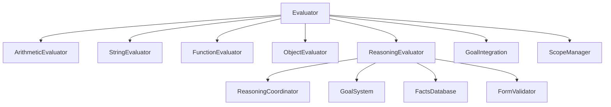

# Core Evaluator Module

## Overview

The **Core Evaluator** is the central execution engine of the Patlang runtime. It traverses and interprets the Abstract Syntax Tree (AST) generated by the parser, executing Patlang programs by delegating to specialized submodules for arithmetic, string, function, object, reasoning, and goal-oriented evaluation. The Core Evaluator manages runtime context, variable scope, and supports advanced features such as reasoning, constraint solving, and modular extension.

---

## Responsibilities

- **AST Traversal & Execution:** Interprets AST nodes and dispatches them to appropriate handlers.
- **Modular Delegation:** Delegates evaluation to specialized modules (arithmetic, string, function, object, reasoning, goal integration).
- **Context Management:** Manages variable scope, function environments, and runtime state.
- **Mode Management:** Supports toggling between object mode and reasoning mode.
- **Integration:** Interfaces with reasoning systems, goal databases, and external modules.
- **File Operations:** Provides built-in support for loading, reading, and writing files.

---

## API Reference

### Initialization

```ruby
Evaluator.new
```
Creates a new evaluator instance, initializing all submodules and built-in classes.

---

### Mode Management

| Method | Description |
|--------|-------------|
| `enable_object_mode` | Enables object-based evaluation. |
| `disable_object_mode` | Disables object mode (legacy mode). |
| `object_mode_enabled?` | Returns true if object mode is enabled. |
| `enable_reasoning_mode` | Enables reasoning mode for advanced logic. |
| `disable_reasoning_mode` | Disables reasoning mode. |
| `reasoning_mode_enabled?` | Returns true if reasoning mode is enabled. |

**Example:**
```ruby
evaluator.enable_object_mode
evaluator.enable_reasoning_mode
```

---

### Evaluation

| Method | Description |
|--------|-------------|
| `evaluate(node)` | Evaluates an AST node, dispatching to the correct handler. |

**Example:**
```ruby
result = evaluator.evaluate(ast_root)
```

---

### Variable & Scope Management

| Method | Description |
|--------|-------------|
| `set_variable(name, value)` | Sets a variable in the current scope. |
| `get_variable(name)` | Retrieves a variable or built-in function. |
| `push_scope` | Enters a new variable scope. |
| `pop_scope` | Exits the current variable scope. |

**Example:**
```ruby
evaluator.set_variable("x", 42)
value = evaluator.get_variable("x")
evaluator.push_scope
evaluator.pop_scope
```

---

### Goal & Reasoning Integration

| Method | Description |
|--------|-------------|
| `declare_goal(name, definition)` | Declares a new goal in the reasoning system. |
| `pursue_goal(name, context = {})` | Attempts to achieve a goal with optional context. |
| `assert_fact(fact)` | Asserts a fact into the knowledge base. |
| `query_facts(query)` | Queries the facts database. |
| `define_rule(rule)` | Defines a logic rule. |
| `create_constraint(variable, type, data, **options)` | Adds a constraint to a variable. |
| `validate_assignment(variable, value)` | Validates an assignment against constraints. |
| `variable_satisfies_constraints?(variable, value)` | Checks if a variable satisfies constraints. |
| `reasoning_statistics` | Returns reasoning system statistics. |

**Advanced Usage Example:**
```ruby
evaluator.enable_reasoning_mode
evaluator.declare_goal("reach_target", { precondition: ..., postcondition: ... })
evaluator.assert_fact({ type: "location", value: "start" })
evaluator.create_constraint("x", :greater_than, 10)
result = evaluator.pursue_goal("reach_target", context: { x: 15 })
```

---

### File Operations

| Method | Description |
|--------|-------------|
| `load(filename)` | Loads and executes a Patlang file. |
| `read_file(filename)` | Reads file contents as a string. |
| `write_json_file(filename, data)` | Writes data as JSON to a file. |

**Example:**
```ruby
evaluator.load("program.pat")
content = evaluator.read_file("data.txt")
evaluator.write_json_file("output.json", { result: 123 })
```

---

### Error Handling

The evaluator raises exceptions for file errors, unknown node types, and failed assignments. Errors can be caught and handled by the host environment.

**Example:**
```ruby
begin
  evaluator.load("missing_file.pat")
rescue => e
  puts "Error: #{e.message}"
end
```

---

## API Summary Table

| Method | Signature | Description |
|--------|-----------|-------------|
| `initialize` | `Evaluator.new` | Create evaluator instance |
| `evaluate` | `evaluate(node)` | Evaluate AST node |
| `set_variable` | `set_variable(name, value)` | Set variable |
| `get_variable` | `get_variable(name)` | Get variable or built-in |
| `push_scope` | `push_scope` | Enter new scope |
| `pop_scope` | `pop_scope` | Exit scope |
| `enable_object_mode` | `enable_object_mode` | Enable object mode |
| `disable_object_mode` | `disable_object_mode` | Disable object mode |
| `object_mode_enabled?` | `object_mode_enabled?` | Check object mode |
| `enable_reasoning_mode` | `enable_reasoning_mode` | Enable reasoning mode |
| `disable_reasoning_mode` | `disable_reasoning_mode` | Disable reasoning mode |
| `reasoning_mode_enabled?` | `reasoning_mode_enabled?` | Check reasoning mode |
| `declare_goal` | `declare_goal(name, definition)` | Declare goal |
| `pursue_goal` | `pursue_goal(name, context={})` | Pursue goal |
| `assert_fact` | `assert_fact(fact)` | Assert fact |
| `query_facts` | `query_facts(query)` | Query facts |
| `define_rule` | `define_rule(rule)` | Define logic rule |
| `create_constraint` | `create_constraint(variable, type, data, **options)` | Add constraint |
| `validate_assignment` | `validate_assignment(variable, value)` | Validate assignment |
| `variable_satisfies_constraints?` | `variable_satisfies_constraints?(variable, value)` | Check constraints |
| `reasoning_statistics` | `reasoning_statistics` | Get reasoning stats |
| `load` | `load(filename)` | Load and execute file |
| `read_file` | `read_file(filename)` | Read file contents |
| `write_json_file` | `write_json_file(filename, data)` | Write JSON file |

---

## Dependencies

- **Submodules:** ArithmeticEvaluator, StringEvaluator, FunctionEvaluator, ObjectEvaluator, ReasoningEvaluator, GoalIntegration, ScopeManager.
- **Reasoning System:** ReasoningCoordinator, GoalSystem, FactsDatabase, FormValidator.
- **AST Nodes:** Requires AST node classes for dispatch.
- **File System:** Uses Ruby's File and FileUtils for file operations.

---

## Extension Points

- **Custom Evaluators:** Add new evaluator modules by extending the Evaluator and registering new handlers.
- **Reasoning/Goal Integration:** Integrate new reasoning engines or goal systems by implementing compatible interfaces and registering with the ReasoningCoordinator.
- **Built-in Functions:** Extend or override built-in functions by modifying the `functions` hash or adding new methods.
- **Event Handling:** Register custom event handlers for reasoning, goal achievement, or fact assertion events.

---

## Mermaid Diagram



---

## Advanced Usage Examples

### 1. Dynamic Goal Pursuit with Constraints

```ruby
evaluator.enable_reasoning_mode
evaluator.declare_goal("find_path", {
  precondition: { location: "A" },
  postcondition: { location: "B" }
})
evaluator.assert_fact({ type: "location", value: "A" })
evaluator.create_constraint("steps", :less_than, 10)
result = evaluator.pursue_goal("find_path", context: { steps: 5 })
```

### 2. Custom Event Handling

```ruby
evaluator.set_reasoning_coordinator(MyCustomCoordinator.new)
evaluator.reasoning_coordinator.on_event(:goal_achieved) do |event|
  puts "Goal achieved: #{event[:goal]}"
end
```

### 3. Extending with a Custom Evaluator

```ruby
class MyCustomEvaluator
  def visit_custom_node(node)
    # Custom logic here
  end
end

evaluator = Evaluator.new
evaluator.extend(MyCustomEvaluator)
# Now evaluator can handle custom nodes
```

---

## See Also

- [`docs/runtime/CoreModules/CoreModule1.md`](docs/runtime/CoreModules/CoreModule1.md:1)
- [`docs/runtime/Overview.md`](docs/runtime/Overview.md:1)
- [`patlang-core/evaluator/evaluator.rb`](patlang-core/evaluator/evaluator.rb:1)
