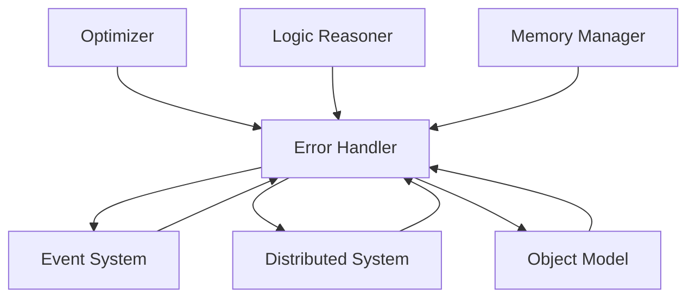

# Error Handling System Module

## Overview

The **Error Handling System** is a core module in the Patlang runtime, responsible for detecting, reporting, and managing errors across all runtime components. It provides structured error types, propagation, recovery mechanisms, and integrates with the Object Model, Event System, Distributed System, Optimizer, Logic Reasoner, and other modules to ensure robust, observable, and recoverable execution.

---

## Core Responsibilities

- **Error Detection:** Identifies errors in execution, type checking, memory, logic, and distributed operations.
- **Structured Error Types:** Defines a hierarchy of error classes for all subsystems.
- **Error Propagation:** Propagates errors through the call stack and across distributed nodes.
- **Recovery & Handling:** Supports custom error handlers, recovery strategies, and fallback logic.
- **Event Emission:** Emits error events for monitoring, logging, and analytics.
- **Integration:** Links with the Object Model, Event System, Distributed System, Optimizer, and Logic Reasoner.
- **Extensibility:** Allows custom error types, handlers, and integration with optional modules.

---

## API Reference

### Initialization

```ruby
ErrorHandler.new
```
Creates a new Error Handler instance.

---

### Error Operations

| Method | Description |
|--------|-------------|
| `raise_error(type, message, context = {})` | Raises a structured error with context. |
| `handle_error(error, context = {})` | Handles an error, optionally with recovery logic. |
| `register_handler(type, &block)` | Registers a custom handler for a specific error type. |
| `emit_error_event(error, context = {})` | Emits an error event to the Event System. |
| `log_error(error, context = {})` | Logs error details for auditing and analytics. |
| `error_types` | Returns all registered error types. |

**Example:**
```ruby
eh = ErrorHandler.new
eh.register_handler(:TypeError) { |err| puts "Type error: #{err.message}" }
begin
  eh.raise_error(:TypeError, "Expected Int, got String", var: "x")
rescue => e
  eh.handle_error(e)
end
```

---

### Integration with Core Modules

- **Object Model:** Errors can be attached to objects for stateful error tracking.
- **Event System:** All errors emit events for monitoring and distributed propagation.
- **Distributed System:** Errors are serialized and transmitted across nodes; supports distributed recovery.
- **Optimizer:** Optimization passes can register and handle optimization-specific errors.
- **Logic Reasoner:** Logic and inference errors are structured and can trigger fallback strategies.
- **Memory Manager:** Handles memory errors, leaks, and invalid accesses.

---

### Advanced Usage

#### Distributed Error Propagation

```ruby
# On node A
begin
  # ... distributed operation ...
rescue => e
  eh.emit_error_event(e, node: "A")
  mq.enqueue_message({type: "error", error: e, source: "A"})
end

# On node B (receiver)
mq.on_message do |msg|
  if msg[:type] == "error"
    eh.handle_error(msg[:error], source: msg[:source])
  end
end
```

#### Custom Error Types

```ruby
class MyCustomError < StandardError; end
eh.register_handler(:MyCustomError) { |err| puts "Custom: #{err.message}" }
eh.raise_error(:MyCustomError, "Something went wrong")
```

#### Integration with Optimizer

```ruby
optimizer.on_error do |error|
  eh.handle_error(error, phase: :optimization)
end
```

---

## Dependencies

- **Object Model:** For attaching errors to objects and stateful tracking.
- **Event System:** For emitting and handling error events.
- **Distributed System:** For propagating errors across nodes.
- **Optimizer:** For handling optimization-specific errors.
- **Logic Reasoner:** For logic and inference error handling.
- **Memory Manager:** For memory-related errors.

---

## Extension Points

- **Custom Error Types:** Define new error classes for domain-specific errors.
- **Custom Handlers:** Register handlers for new or existing error types.
- **Event Hooks:** Integrate with monitoring, analytics, or alerting systems.
- **Distributed Recovery:** Implement custom distributed recovery strategies.

---

## Module Interaction



---

## Selective Inclusion & Extension

- **Core Module:** Always included in the runtime.
- **Extension:** Optional modules (e.g., advanced analytics, distributed recovery) may extend the Error Handler via extension points.
- **Selective Inclusion:** Optional modules depend on the Error Handler but not vice versa.

---

## Security & Distributed Execution

- **Auditing:** All errors are logged and auditable for compliance.
- **Secure Propagation:** Errors are securely transmitted across distributed nodes.
- **Isolation:** Ensures error contexts are isolated between concurrent and distributed environments.

---

## Future Directions

- **Self-Healing:** Automated recovery and self-healing strategies.
- **Federated Error Analytics:** Cross-runtime error analytics and visualization.
- **Enhanced Alerting:** Real-time alerting and notification integration.

---

## Appendix

- **Error Types:** TypeError, MemoryError, LogicError, DistributedError, OptimizationError, ObjectError, etc.
- **Event Types:** error_raised, error_handled, error_logged, error_propagated, etc.

---

## API Summary Table

| Method | Signature | Description | Dependencies | Extensible |
|--------|-----------|-------------|--------------|------------|
| `initialize` | `ErrorHandler.new` | Create instance | - | Yes |
| `raise_error` | `raise_error(type, message, context)` | Raise error | - | Yes |
| `handle_error` | `handle_error(error, context)` | Handle error | - | Yes |
| `register_handler` | `register_handler(type, &block)` | Register handler | - | Yes |
| `emit_error_event` | `emit_error_event(error, context)` | Emit event | ES | Yes |
| `log_error` | `log_error(error, context)` | Log error | - | Yes |
| `error_types` | `error_types` | List error types | - | Yes |

---

## See Also

- [`docs/runtime/CoreModules/ObjectModel.md`](docs/runtime/CoreModules/ObjectModel.md:1)
- [`docs/runtime/CoreModules/ScopeManager.md`](docs/runtime/CoreModules/ScopeManager.md:1)
- [`docs/runtime/CoreModules/MemoryManager.md`](docs/runtime/CoreModules/MemoryManager.md:1)
- [`docs/runtime/CoreModules/GoalSystem.md`](docs/runtime/CoreModules/GoalSystem.md:1)
- [`docs/runtime/CoreModules/InferencingEngine.md`](docs/runtime/CoreModules/InferencingEngine.md:1)
- [`docs/runtime/ModuleInteraction.md`](docs/runtime/ModuleInteraction.md:1)
