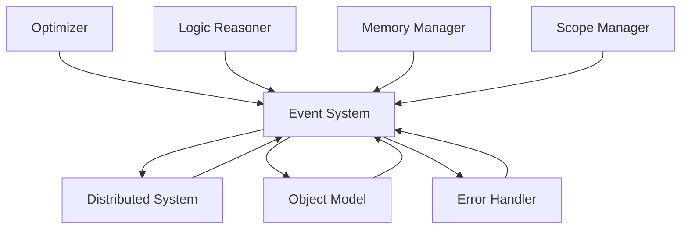

# Event System Module

## Overview

The **Event System** is a core module in the Patlang runtime, providing a unified mechanism for emitting, handling, and propagating events across all runtime components. It enables decoupled communication, monitoring, and extensibility, integrating with the Object Model, Error Handler, Distributed System, Optimizer, Logic Reasoner, and other modules.

---

## Core Responsibilities

- **Event Emission:** Allows modules to emit events for state changes, errors, and significant actions.
- **Event Handling:** Supports registration of handlers for specific event types or patterns.
- **Propagation:** Propagates events across local and distributed environments.
- **Monitoring & Analytics:** Enables real-time monitoring, logging, and analytics of runtime activity.
- **Integration:** Links with the Object Model, Error Handler, Distributed System, Optimizer, Logic Reasoner, and all core modules.
- **Extensibility:** Allows custom event types, handlers, and integration with optional modules.

---

## API Reference

### Initialization

```ruby
EventSystem.new
```
Creates a new Event System instance.

---

### Event Operations

| Method | Description |
|--------|-------------|
| `emit(event_type, data = {})` | Emits an event with type and data payload. |
| `on(event_type, &block)` | Registers a handler for a specific event type. |
| `off(event_type, &block)` | Unregisters a handler for an event type. |
| `broadcast(event_type, data = {})` | Broadcasts an event to all listeners, including distributed nodes. |
| `log_event(event_type, data = {})` | Logs an event for auditing and analytics. |
| `event_types` | Returns all registered event types. |

**Example:**
```ruby
es = EventSystem.new
es.on(:object_created) { |data| puts "Object created: #{data[:object]}" }
es.emit(:object_created, object: obj)
```

---

### Integration with Core Modules

- **Object Model:** Emits events for object lifecycle (creation, mutation, destruction).
- **Error Handler:** Emits and handles error events.
- **Distributed System:** Propagates events across nodes for coordination and monitoring.
- **Optimizer:** Emits events for optimization passes and performance metrics.
- **Logic Reasoner:** Emits events for reasoning steps, inference, and goal achievement.
- **Memory Manager:** Emits events for allocation, deallocation, and GC.
- **Scope Manager:** Emits events for scope changes and variable assignments.

---

### Advanced Usage

#### Distributed Event Propagation

```ruby
# On node A
es.broadcast(:goal_achieved, goal: "sync_data", node: "A")

# On node B (receiver)
es.on(:goal_achieved) do |data|
  puts "Goal achieved on #{data[:node]}: #{data[:goal]}"
end
```

#### Custom Event Types and Handlers

```ruby
es.on(:custom_event) { |data| puts "Custom event: #{data.inspect}" }
es.emit(:custom_event, foo: 42)
```

#### Monitoring and Analytics

```ruby
es.on(:error_raised) { |data| analytics.log_error(data) }
es.on(:optimization_pass) { |data| analytics.log_optimization(data) }
```

---

## Dependencies

- **All Core Modules:** For emitting and handling events.
- **Distributed System:** For event propagation across nodes.
- **Analytics/Monitoring (optional):** For logging and real-time analytics.

---

## Extension Points

- **Custom Event Types:** Define new event types for domain-specific actions.
- **Custom Handlers:** Register handlers for new or existing event types.
- **Distributed Extensions:** Integrate with distributed event brokers or message queues.
- **Monitoring Plugins:** Extend with analytics, alerting, or visualization modules.

---

## Module Interaction



---

## Selective Inclusion & Extension

- **Core Module:** Always included in the runtime.
- **Extension:** Optional modules (e.g., analytics, distributed brokers) may extend the Event System via extension points.
- **Selective Inclusion:** Optional modules depend on the Event System but not vice versa.

---

## Security & Distributed Execution

- **Auditing:** All events are logged and auditable for compliance.
- **Secure Propagation:** Events are securely transmitted across distributed nodes.
- **Isolation:** Ensures event contexts are isolated between concurrent and distributed environments.

---

## Future Directions

- **Federated Event Brokers:** Support for multi-runtime, federated event propagation.
- **Real-Time Analytics:** Enhanced real-time monitoring and visualization.
- **Self-Healing:** Automated responses to critical events.

---

## Appendix

- **Event Types:** object_created, error_raised, goal_achieved, optimization_pass, memory_allocated, scope_entered, etc.
- **Error Codes:** See Error Handler documentation for event-related errors.

---

## API Summary Table

| Method | Signature | Description | Dependencies | Extensible |
|--------|-----------|-------------|--------------|------------|
| `initialize` | `EventSystem.new` | Create instance | - | Yes |
| `emit` | `emit(event_type, data)` | Emit event | - | Yes |
| `on` | `on(event_type, &block)` | Register handler | - | Yes |
| `off` | `off(event_type, &block)` | Unregister handler | - | Yes |
| `broadcast` | `broadcast(event_type, data)` | Distributed event | DS | Yes |
| `log_event` | `log_event(event_type, data)` | Log event | - | Yes |
| `event_types` | `event_types` | List event types | - | Yes |

---

## See Also

- [`docs/runtime/CoreModules/ObjectModel.md`](docs/runtime/CoreModules/ObjectModel.md:1)
- [`docs/runtime/CoreModules/ErrorHandler.md`](docs/runtime/CoreModules/ErrorHandler.md:1)
- [`docs/runtime/CoreModules/MemoryManager.md`](docs/runtime/CoreModules/MemoryManager.md:1)
- [`docs/runtime/CoreModules/GoalSystem.md`](docs/runtime/CoreModules/GoalSystem.md:1)
- [`docs/runtime/CoreModules/InferencingEngine.md`](docs/runtime/CoreModules/InferencingEngine.md:1)
- [`docs/runtime/CoreModules/ScopeManager.md`](docs/runtime/CoreModules/ScopeManager.md:1)
- [`docs/runtime/ModuleInteraction.md`](docs/runtime/ModuleInteraction.md:1)
