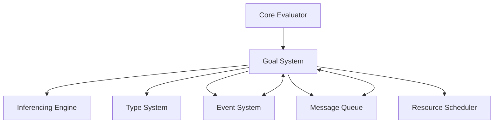

# Goal System Module

## Overview

The **Goal System** is a core module in the Patlang runtime, providing declarative, goal-oriented programming capabilities. It enables the definition, pursuit, monitoring, and resolution of goals, supporting advanced features such as custom execution strategies, distributed goal execution, integration with the Inferencing Engine and Type System, and event-driven extensions.

---

## Core Responsibilities

- **Goal Declaration:** Define goals with preconditions, postconditions, and strategies.
- **Goal Pursuit:** Execute and resolve goals, validating pre/postconditions.
- **Concurrent & Distributed Execution:** Pursue multiple goals concurrently or across distributed nodes.
- **Monitoring & Scheduling:** Track goal progress, monitor execution, and schedule resources.
- **Integration:** Interface with the Inferencing Engine, Type System, Event System, and Message Queue.
- **Event Handling:** Emit and handle events for goal lifecycle (declared, pursued, achieved, failed).
- **Extensibility:** Support custom strategies, event hooks, and distributed extensions.

---

## API Reference

### Initialization

```ruby
GoalSystem.new(evaluator = nil, *args)
```
Creates a new Goal System instance, optionally linked to an evaluator.

---

### Goal Management

| Method | Description |
|--------|-------------|
| `declare_goal(name, definition)` | Defines a new goal with preconditions, postconditions, and strategy. |
| `pursue_goal(name, context = {})` | Attempts to achieve a goal, validating pre/postconditions. |
| `pursue_goals_concurrently(goal_names, **shared_context)` | Pursues multiple goals in parallel threads. |
| `on_event(event_type, &block)` | Registers a callback for goal events (declared, pursued, achieved, failed). |
| `set_reasoning_coordinator(coordinator)` | Integrates with the reasoning/inferencing engine. |

**Example:**
```ruby
gs = GoalSystem.new
gs.declare_goal("reach_target", {
  precondition: { location: "A" },
  postcondition: { location: "B" },
  strategy: :shortest_path
})
result = gs.pursue_goal("reach_target", location: "A")
```

---

### Advanced Usage

#### Custom Goal Strategies

```ruby
gs = GoalSystem.new
gs.declare_goal("custom_goal", {
  precondition: { ready: true },
  postcondition: { done: true },
  strategy: :custom_strategy
})
gs.on_event(:strategy_executed) do |event|
  puts "Strategy executed: #{event[:strategy]}"
end
def gs.execute_goal_strategy(goal, strategy, context)
  # Custom logic for :custom_strategy
  if strategy == :custom_strategy
    # ... custom resolution logic ...
    return :custom_result
  else
    super
  end
end
result = gs.pursue_goal("custom_goal", ready: true)
```

#### Distributed Goal Execution

```ruby
# Example assumes integration with Message Queue and distributed runtime
gs = GoalSystem.new
gs.declare_goal("sync_data", {
  precondition: { node_ready: true },
  postcondition: { data_synced: true },
  strategy: :distributed_sync
})
gs.on_event(:goal_pursued) do |event|
  # Send goal pursuit request to remote node via Message Queue
  mq.enqueue_message({
    type: "pursue_goal",
    goal: event[:goal].name,
    context: event[:context],
    target_node: "node-2"
  })
end
# On remote node, receive message and pursue goal
# mq.on_message { |msg| gs.pursue_goal(msg[:goal], msg[:context]) }
```

#### Integration with Inferencing Engine and Type System

```ruby
gs.set_reasoning_coordinator(inferencing_engine)
gs.declare_goal("typed_goal", {
  precondition: { x: "Int" },
  postcondition: { y: "String" },
  strategy: :type_conversion
})
result = gs.pursue_goal("typed_goal", x: 42)
```

#### Event-Driven Extensions and Monitoring

```ruby
gs.on_event(:goal_achieved) do |event|
  puts "Goal achieved: #{event[:name]}, result: #{event[:result]}"
end
gs.on_event(:goal_failed) do |event|
  puts "Goal failed: #{event[:name]}, reason: #{event[:reason]}"
end
```

---

## Dependencies

- **Core Evaluator:** For executing goal-related logic and context.
- **Inferencing Engine:** For advanced reasoning and constraint solving.
- **Type System:** For type-aware goal validation and conversion.
- **Event System:** For emitting and handling goal lifecycle events.
- **Message Queue:** For distributed goal execution and coordination.
- **Resource Scheduler:** For managing concurrent and distributed resources.

---

## Extension Points

- **Custom Strategies:** Override `execute_goal_strategy` to implement new resolution methods.
- **Distributed Execution:** Integrate with Message Queue and distributed runtime for remote goal pursuit.
- **Event Hooks:** Register callbacks for any goal lifecycle event.
- **Monitoring:** Extend `GoalMonitor` for advanced tracking and analytics.
- **Resource Scheduling:** Extend `ResourceScheduler` for custom allocation and scheduling logic.

---

## Module Interaction



---

## Selective Inclusion & Extension

- **Core Module:** Always included in the runtime.
- **Extension:** Optional modules (e.g., advanced analytics, distributed backends) may extend the Goal System via documented extension points.
- **Selective Inclusion:** Optional modules depend on the Goal System but not vice versa.

---

## Security & Distributed Execution

- **Secure Goal Pursuit:** Supports secure, auditable distributed goal execution.
- **Isolation:** Ensures goals are executed in isolated, context-aware environments.
- **Auditing:** Emits events for all goal lifecycle changes for compliance and monitoring.

---

## Future Directions

- **Adaptive Strategies:** Pluggable, learning-based goal resolution.
- **Cross-Module Reasoning:** Deeper integration with Type System and Inferencing Engine.
- **Federated Goal Systems:** Multi-runtime, federated goal pursuit and monitoring.
- **Enhanced Analytics:** Real-time goal analytics and visualization.

---

## Appendix

- **Event Types:** goal_declared, goal_pursued, goal_achieved, goal_failed, strategy_executed, concurrent_goals_completed, monitoring_started, etc.
- **Error Codes:** See Error Handler documentation for goal-related errors.

---

## API Summary Table

| Method | Signature | Description | Dependencies | Extensible |
|--------|-----------|-------------|--------------|------------|
| `initialize` | `GoalSystem.new(evaluator = nil, *args)` | Create instance | - | Yes |
| `declare_goal` | `declare_goal(name, definition)` | Define goal | - | Yes |
| `pursue_goal` | `pursue_goal(name, context = {})` | Pursue goal | Evaluator | Yes |
| `pursue_goals_concurrently` | `pursue_goals_concurrently(goal_names, **shared_context)` | Concurrent pursuit | Resource Scheduler | Yes |
| `on_event` | `on_event(event_type, &block)` | Register event | Event System | Yes |
| `set_reasoning_coordinator` | `set_reasoning_coordinator(coordinator)` | Integrate reasoning | Inferencing Engine | Yes |
| `execute_goal_strategy` | `execute_goal_strategy(goal, strategy, context)` | Custom strategies | - | Yes |

---

## See Also

- [`docs/runtime/CoreModules/CoreEvaluator.md`](docs/runtime/CoreModules/CoreEvaluator.md:1)
- [`docs/runtime/CoreModules/MemoryManager.md`](docs/runtime/CoreModules/MemoryManager.md:1)
- [`docs/runtime/ModuleInteraction.md`](docs/runtime/ModuleInteraction.md:1)
- [`docs/runtime/SecurityDistributedExecution.md`](docs/runtime/SecurityDistributedExecution.md:1)
