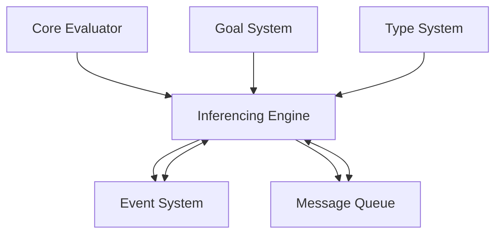

# Inferencing Engine Module

## Overview

The **Inferencing Engine** is a core module in the Patlang runtime, providing advanced logical inference, constraint solving, distributed reasoning, and meta-reasoning capabilities. It enables expressive, scalable, and extensible inferencing for programs, supporting SLD resolution, unification, optimization, and integration with the Goal System and Type System.

---

## Core Responsibilities

- **Logical Inference:** Performs SLD resolution, constraint satisfaction, and advanced logic queries.
- **Unification:** Supports complex and partial unification for variables and structures.
- **Distributed Reasoning:** Executes queries and manages knowledge bases across distributed nodes.
- **Meta-Reasoning:** Enables reasoning about rules, queries, and inference strategies.
- **Optimization:** Applies query and rule optimizations for performance and scalability.
- **Knowledge Base Management:** Loads, partitions, and manages local and distributed knowledge bases.
- **Event Handling:** Emits events for all inferencing operations, supporting monitoring and debugging.
- **Extensibility:** Supports custom strategies, distributed backends, and integration with other modules.

---

## API Reference

### Initialization

```ruby
ComplexLogicEngine.new(evaluator)
```
Creates a new Inferencing Engine instance, linked to an evaluator.

---

### Knowledge Base Operations

| Method | Description |
|--------|-------------|
| `load_knowledge_base(knowledge_base)` | Loads a local knowledge base. |
| `load_distributed_knowledge_base(knowledge_base)` | Loads a distributed knowledge base across nodes. |
| `add_fact(fact)` | Adds a fact to the knowledge base. |
| `add_distributed_fact(partition, fact)` | Adds a fact to a distributed partition. |
| `add_rules(rules)` | Adds rules to the knowledge base. |

**Example:**
```ruby
ie = ComplexLogicEngine.new(evaluator)
ie.load_knowledge_base("facts: ... rules: ...")
ie.add_fact("parent(alice, bob).")
ie.add_rules(["ancestor(X, Y) :- parent(X, Y)."])
```

---

### Query & Inference

| Method | Description |
|--------|-------------|
| `query_with_advanced_sld(query)` | Performs SLD resolution for a query. |
| `query_with_constraints(query)` | Solves queries with constraint satisfaction. |
| `query_with_termination_detection(query)` | Detects termination in recursive queries. |
| `query_with_tail_recursion_optimization(query)` | Optimizes tail-recursive queries. |
| `query_with_complex_unification(query)` | Performs complex unification for queries. |
| `query_with_partial_unification(query)` | Supports partial unification. |
| `query_distributed(query)` | Executes a query across distributed knowledge bases. |
| `query_with_optimization(query)` | Applies query optimization strategies. |
| `query_with_meta_reasoning(query)` | Enables meta-reasoning about rules and queries. |

**Advanced Usage Example:**
```ruby
result = ie.query_with_advanced_sld("ancestor(alice, X)")
distributed_result = ie.query_distributed("find_path(A, B)")
meta_result = ie.query_with_meta_reasoning("analyze_rules")
```

---

### Distributed & Large-Scale Processing

| Method | Description |
|--------|-------------|
| `configure_large_scale_processing(config)` | Configures engine for large-scale/distributed processing. |
| `analyze_query_partitions(query)` | Analyzes which partitions are needed for a query. |
| `execute_across_partitions(query, partition_analysis)` | Executes a query across required partitions. |
| `merge_distributed_results(partition_results)` | Merges results from distributed partitions. |

**Distributed Execution Example:**
```ruby
ie.load_distributed_knowledge_base("partition1: ... partition2: ...")
analysis = ie.analyze_query_partitions("route(A, B)")
results = ie.execute_across_partitions("route(A, B)", analysis)
final = ie.merge_distributed_results(results)
```

---

### Event Handling & Monitoring

| Method | Description |
|--------|-------------|
| `on_event(event_type, &block)` | Registers a callback for inferencing events. |
| `fire_event(event_type, data = {})` | Emits an event (internal use). |

**Example:**
```ruby
ie.on_event(:sld_resolution_started) do |event|
  puts "SLD resolution started: #{event[:query]}"
end
```

---

## Dependencies

- **Core Evaluator:** For executing logic and integrating with runtime.
- **Goal System:** For goal-driven inference and resolution.
- **Type System:** For type-aware inference and constraint solving.
- **Event System:** For emitting and handling inferencing events.
- **Message Queue:** For distributed query execution and coordination.

---

## Extension Points

- **Custom Strategies:** Override query and resolution methods for new inference strategies.
- **Distributed Backends:** Integrate new distributed storage or processing backends.
- **Event Hooks:** Register for inferencing events for monitoring or debugging.
- **Optimization Plugins:** Extend query optimization and meta-reasoning capabilities.

---

## Module Interaction



---

## Selective Inclusion & Extension

- **Core Module:** Always included in the runtime.
- **Extension:** Optional modules (e.g., advanced analytics, distributed backends) may extend the Inferencing Engine via extension points.
- **Selective Inclusion:** Optional modules depend on the Inferencing Engine but not vice versa.

---

## Security & Distributed Execution

- **Secure Reasoning:** Supports secure, auditable distributed inference.
- **Isolation:** Ensures queries are executed in isolated, context-aware environments.
- **Auditing:** Emits events for all inferencing operations for compliance and monitoring.

---

## Future Directions

- **Learning-Based Inference:** Integration with machine learning for adaptive strategies.
- **Federated Inferencing:** Multi-runtime, federated inference and knowledge sharing.
- **Real-Time Analytics:** Enhanced real-time monitoring and optimization.
- **Semantic Partitioning:** Smarter partitioning for distributed knowledge bases.

---

## Appendix

- **Event Types:** sld_resolution_started, constraint_satisfaction, recursive_rule_applied, distributed_query_executed, optimization, meta_reasoning, etc.
- **Error Codes:** See Error Handler documentation for inferencing-related errors.

---

## API Summary Table

| Method | Signature | Description | Dependencies | Extensible |
|--------|-----------|-------------|--------------|------------|
| `initialize` | `ComplexLogicEngine.new(evaluator)` | Create instance | - | Yes |
| `load_knowledge_base` | `load_knowledge_base(knowledge_base)` | Load KB | - | Yes |
| `load_distributed_knowledge_base` | `load_distributed_knowledge_base(knowledge_base)` | Load distributed KB | MQ | Yes |
| `add_fact` | `add_fact(fact)` | Add fact | - | Yes |
| `add_distributed_fact` | `add_distributed_fact(partition, fact)` | Add distributed fact | MQ | Yes |
| `add_rules` | `add_rules(rules)` | Add rules | - | Yes |
| `query_with_advanced_sld` | `query_with_advanced_sld(query)` | SLD resolution | - | Yes |
| `query_with_constraints` | `query_with_constraints(query)` | Constraint solving | TS | Yes |
| `query_with_termination_detection` | `query_with_termination_detection(query)` | Termination detection | - | Yes |
| `query_with_tail_recursion_optimization` | `query_with_tail_recursion_optimization(query)` | Tail recursion | - | Yes |
| `query_with_complex_unification` | `query_with_complex_unification(query)` | Complex unification | TS | Yes |
| `query_with_partial_unification` | `query_with_partial_unification(query)` | Partial unification | TS | Yes |
| `query_distributed` | `query_distributed(query)` | Distributed query | MQ | Yes |
| `query_with_optimization` | `query_with_optimization(query)` | Query optimization | - | Yes |
| `query_with_meta_reasoning` | `query_with_meta_reasoning(query)` | Meta-reasoning | - | Yes |
| `configure_large_scale_processing` | `configure_large_scale_processing(config)` | Large-scale config | MQ | Yes |
| `analyze_query_partitions` | `analyze_query_partitions(query)` | Partition analysis | MQ | Yes |
| `execute_across_partitions` | `execute_across_partitions(query, analysis)` | Partition execution | MQ | Yes |
| `merge_distributed_results` | `merge_distributed_results(results)` | Merge results | MQ | Yes |
| `on_event` | `on_event(event_type, &block)` | Register event | ES | Yes |
| `fire_event` | `fire_event(event_type, data)` | Emit event | ES | Yes |

---

## See Also

- [`docs/runtime/CoreModules/GoalSystem.md`](docs/runtime/CoreModules/GoalSystem.md:1)
- [`docs/runtime/CoreModules/TypeSystem.md`](docs/runtime/CoreModules/TypeSystem.md:1)
- [`docs/runtime/ModuleInteraction.md`](docs/runtime/ModuleInteraction.md:1)
