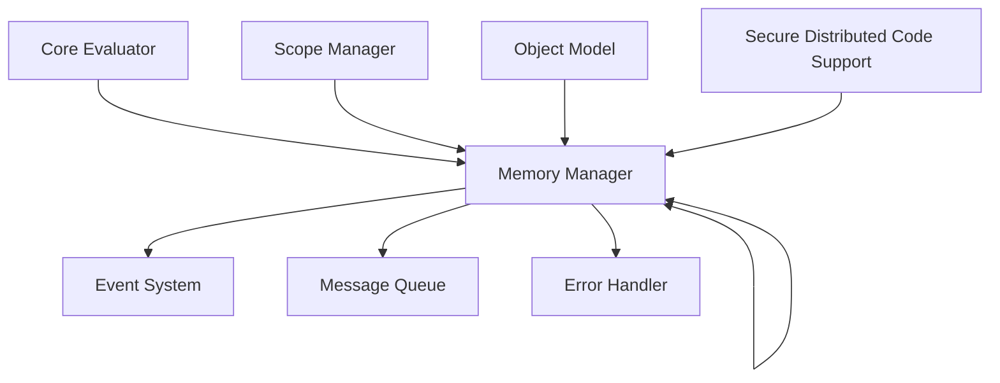

# Memory Manager Module

## Overview

The **Memory Manager** is a core, always-included module in the Patlang runtime. It is responsible for dynamic memory allocation, object lifecycle management, garbage collection, and providing a unified interface for memory operations across all runtime components. The Memory Manager ensures efficient, safe, and scalable memory usage, supporting both local and distributed execution environments.

---

## Core Responsibilities

- **Program Execution Support:** Allocates and manages memory for all runtime objects, variables, and data structures.
- **Memory Management:** Handles allocation, deallocation, and garbage collection for all managed objects.
- **Distributed Memory:** Supports secure, distributed memory operations for code running across multiple nodes.
- **Object Model Integration:** Manages memory for objects, arrays, and user-defined structures.
- **Scope & Environment Management:** Coordinates with the Scope Manager to manage variable lifetimes and environments.
- **Error Handling:** Detects and reports memory errors, leaks, and invalid accesses.
- **Event System Integration:** Emits memory-related events for monitoring and debugging.
- **Message Queue Support:** Interfaces with the Message Queue for distributed memory events and synchronization.

---

## API Reference

### Initialization

```ruby
MemoryManager.new(config = {})
```
Creates a new memory manager instance with optional configuration.

---

### Memory Operations

| Method | Description |
|--------|-------------|
| `allocate(size, type = :generic)` | Allocates a memory block of given size and type. Returns a memory handle or pointer. |
| `deallocate(handle)` | Frees the memory associated with the given handle. |
| `read(handle, offset = 0, length = nil)` | Reads data from memory at the specified handle and offset. |
| `write(handle, data, offset = 0)` | Writes data to memory at the specified handle and offset. |
| `gc_collect` | Triggers garbage collection. |
| `stats` | Returns memory usage statistics. |
| `register_object(obj)` | Registers a runtime object for memory tracking. |
| `unregister_object(obj)` | Removes an object from memory tracking. |
| `snapshot` | Returns a snapshot of current memory state (for debugging or persistence). |

**Example:**
```ruby
mm = MemoryManager.new
h = mm.allocate(128, :object)
mm.write(h, "hello world")
data = mm.read(h, 0, 5) # => "hello"
mm.deallocate(h)
mm.gc_collect
```

---

### Distributed & Secure Memory

| Method | Description |
|--------|-------------|
| `allocate_remote(node_id, size, type = :generic)` | Allocates memory on a remote node. |
| `sync_memory(handle, target_node)` | Synchronizes memory state with a remote node. |
| `secure_allocate(size, security_context)` | Allocates memory with security constraints. |
| `audit_log` | Returns a log of memory operations for security auditing. |

**Advanced Usage Example:**
```ruby
h = mm.secure_allocate(256, user_context)
mm.sync_memory(h, "node-2")
log = mm.audit_log
```

---

### Event & Message Queue Integration

| Method | Description |
|--------|-------------|
| `on_event(event_type, &block)` | Registers a callback for memory events (e.g., allocation, deallocation, gc). |
| `emit_event(event_type, data)` | Emits a memory event to the event system. |
| `enqueue_message(message)` | Sends a memory-related message to the Message Queue. |

---

## Dependencies

- **Core Evaluator:** Requests memory for AST execution and object instantiation.
- **Scope Manager:** Coordinates variable lifetimes and environment memory.
- **Object Model:** All objects are tracked and managed by the Memory Manager.
- **Event System:** Receives and emits memory events.
- **Message Queue:** Used for distributed memory synchronization and event propagation.
- **Error Handler:** Handles memory errors and exceptions.

---

## Extension Points

- **Custom Allocators:** Plug in custom allocation strategies (e.g., pool, arena, region-based).
- **Garbage Collection:** Extend or replace the GC algorithm.
- **Distributed Backends:** Add new distributed memory backends or protocols.
- **Security Policies:** Integrate custom security or auditing modules.
- **Event Hooks:** Register additional event handlers for monitoring or debugging.

---

## Module Interaction

The Memory Manager interacts with other core modules as follows:



---

## Selective Inclusion & Extension

- **Core Module:** Always included in the runtime.
- **Extension:** Optional modules (e.g., Optimizer, Persistence Layer) may extend the Memory Manager via documented extension points.
- **Selective Inclusion:** Optional modules depend on the Memory Manager but not vice versa.

---

## Security & Distributed Execution

- **Secure Allocation:** Supports security contexts and auditing for sensitive data.
- **Distributed Memory:** Enables memory operations across trusted nodes, with synchronization and event propagation via the Message Queue.
- **Isolation:** Enforces memory isolation between execution contexts.

---

## Future Directions

- **Advanced GC:** Pluggable, adaptive garbage collection strategies.
- **Persistent Memory:** Integration with persistence layers for stateful applications.
- **Fine-Grained Auditing:** Enhanced security and compliance features.
- **Optimized Distributed Memory:** Improved protocols for low-latency distributed execution.

---

## Appendix

- **Configuration Options:** Documented in runtime configuration guide.
- **Error Codes:** See Error Handler documentation for memory error codes.
- **Event Types:** Allocation, deallocation, GC, sync, security violation, etc.

---

## API Summary Table

| Method | Signature | Description | Dependencies | Extensible |
|--------|-----------|-------------|--------------|------------|
| `initialize` | `MemoryManager.new(config = {})` | Create instance | - | Yes |
| `allocate` | `allocate(size, type = :generic)` | Allocate memory | - | Yes |
| `deallocate` | `deallocate(handle)` | Free memory | - | Yes |
| `read` | `read(handle, offset = 0, length = nil)` | Read memory | - | No |
| `write` | `write(handle, data, offset = 0)` | Write memory | - | No |
| `gc_collect` | `gc_collect` | Run GC | - | Yes |
| `stats` | `stats` | Memory stats | - | Yes |
| `register_object` | `register_object(obj)` | Track object | Object Model | Yes |
| `unregister_object` | `unregister_object(obj)` | Untrack object | Object Model | Yes |
| `snapshot` | `snapshot` | Memory snapshot | - | Yes |
| `allocate_remote` | `allocate_remote(node_id, size, type)` | Remote alloc | Message Queue | Yes |
| `sync_memory` | `sync_memory(handle, target_node)` | Sync memory | Message Queue | Yes |
| `secure_allocate` | `secure_allocate(size, context)` | Secure alloc | Secure Distributed Code | Yes |
| `audit_log` | `audit_log` | Security log | Secure Distributed Code | Yes |
| `on_event` | `on_event(event_type, &block)` | Register event | Event System | Yes |
| `emit_event` | `emit_event(event_type, data)` | Emit event | Event System | Yes |
| `enqueue_message` | `enqueue_message(message)` | MQ message | Message Queue | Yes |

---

## See Also

- [`docs/runtime/CoreModules/CoreEvaluator.md`](docs/runtime/CoreModules/CoreEvaluator.md:1)
- [`docs/runtime/ModuleInteraction.md`](docs/runtime/ModuleInteraction.md:1)
- [`docs/runtime/SecurityDistributedExecution.md`](docs/runtime/SecurityDistributedExecution.md:1)
