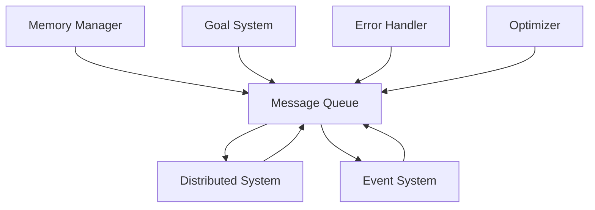

# Message Queue Module

## Overview

The **Message Queue** is a core, independent module in the Patlang runtime, providing asynchronous, decoupled communication between runtime components and across distributed nodes. It enables reliable message delivery, coordination, and event propagation, integrating with the Event System, Distributed System, Memory Manager, Goal System, and other modules.

---

## Core Responsibilities

- **Asynchronous Messaging:** Enables modules to send and receive messages without blocking.
- **Decoupled Communication:** Facilitates loose coupling between components and services.
- **Distributed Coordination:** Supports message delivery and synchronization across distributed nodes.
- **Event Propagation:** Works with the Event System to propagate events via messages.
- **Reliability & Ordering:** Ensures reliable, ordered, and optionally transactional message delivery.
- **Integration:** Links with the Event System, Distributed System, Memory Manager, Goal System, and all core modules.
- **Extensibility:** Allows custom message types, handlers, and integration with optional modules.

---

## API Reference

### Initialization

```ruby
MessageQueue.new(config = {})
```
Creates a new Message Queue instance with optional configuration.

---

### Message Operations

| Method | Description |
|--------|-------------|
| `enqueue(message)` | Adds a message to the queue for delivery. |
| `dequeue` | Retrieves and removes the next message from the queue. |
| `on_message(&block)` | Registers a handler for incoming messages. |
| `broadcast(message)` | Sends a message to all nodes or listeners. |
| `acknowledge(message_id)` | Acknowledges receipt and processing of a message. |
| `pending_messages` | Returns all messages currently in the queue. |
| `configure(options)` | Updates queue configuration (e.g., reliability, ordering). |

**Example:**
```ruby
mq = MessageQueue.new
mq.enqueue({type: "sync", data: {foo: 42}})
mq.on_message { |msg| puts "Received: #{msg.inspect}" }
msg = mq.dequeue
```

---

### Integration with Core Modules

- **Event System:** Propagates events as messages for distributed delivery.
- **Distributed System:** Handles inter-node communication and coordination.
- **Memory Manager:** Synchronizes memory state and propagates memory events.
- **Goal System:** Coordinates distributed goal execution and result collection.
- **Error Handler:** Transmits error messages and supports distributed recovery.
- **Optimizer:** Coordinates distributed optimization passes and analytics.

---

### Advanced Usage

#### Distributed Message Delivery

```ruby
# On node A
mq.broadcast({type: "goal_pursued", goal: "sync_data", node: "A"})

# On node B (receiver)
mq.on_message do |msg|
  if msg[:type] == "goal_pursued"
    puts "Goal pursued on #{msg[:node]}: #{msg[:goal]}"
  end
end
```

#### Reliable and Transactional Messaging

```ruby
mq.configure(reliability: :high, transactional: true)
mq.enqueue({type: "update", data: {...}})
mq.acknowledge(msg_id)
```

#### Integration with Event System

```ruby
es.on(:memory_allocated) { |data| mq.enqueue({type: "event", event: :memory_allocated, data: data}) }
```

---

## Dependencies

- **All Core Modules:** For sending and receiving messages.
- **Distributed System:** For inter-node communication.
- **Event System:** For event propagation.
- **Memory Manager:** For memory synchronization.
- **Goal System:** For distributed goal coordination.
- **Error Handler:** For error propagation and recovery.

---

## Extension Points

- **Custom Message Types:** Define new message formats for domain-specific communication.
- **Custom Handlers:** Register handlers for new or existing message types.
- **Distributed Backends:** Integrate with external message brokers or distributed queues.
- **Monitoring Plugins:** Extend with analytics, alerting, or visualization modules.

---

## Module Interaction



---

## Selective Inclusion & Extension

- **Core Module:** Always included in the runtime.
- **Extension:** Optional modules (e.g., analytics, distributed brokers) may extend the Message Queue via extension points.
- **Selective Inclusion:** Optional modules depend on the Message Queue but not vice versa.

---

## Security & Distributed Execution

- **Secure Messaging:** Supports encrypted and authenticated message delivery.
- **Auditing:** All messages are logged and auditable for compliance.
- **Isolation:** Ensures message contexts are isolated between concurrent and distributed environments.

---

## Future Directions

- **Federated Queues:** Support for multi-runtime, federated message delivery.
- **Real-Time Analytics:** Enhanced real-time monitoring and visualization.
- **Self-Healing:** Automated recovery from message delivery failures.

---

## Appendix

- **Message Types:** event, sync, goal_pursued, error, update, etc.
- **Error Codes:** See Error Handler documentation for message-related errors.

---

## API Summary Table

| Method | Signature | Description | Dependencies | Extensible |
|--------|-----------|-------------|--------------|------------|
| `initialize` | `MessageQueue.new(config = {})` | Create instance | - | Yes |
| `enqueue` | `enqueue(message)` | Add message | - | Yes |
| `dequeue` | `dequeue` | Get next message | - | Yes |
| `on_message` | `on_message(&block)` | Register handler | - | Yes |
| `broadcast` | `broadcast(message)` | Distributed message | DS | Yes |
| `acknowledge` | `acknowledge(message_id)` | Ack message | - | Yes |
| `pending_messages` | `pending_messages` | List messages | - | Yes |
| `configure` | `configure(options)` | Update config | - | Yes |

---

## See Also

- [`docs/runtime/CoreModules/EventSystem.md`](docs/runtime/CoreModules/EventSystem.md:1)
- [`docs/runtime/CoreModules/MemoryManager.md`](docs/runtime/CoreModules/MemoryManager.md:1)
- [`docs/runtime/CoreModules/GoalSystem.md`](docs/runtime/CoreModules/GoalSystem.md:1)
- [`docs/runtime/CoreModules/ErrorHandler.md`](docs/runtime/CoreModules/ErrorHandler.md:1)
- [`docs/runtime/CoreModules/InferencingEngine.md`](docs/runtime/CoreModules/InferencingEngine.md:1)
- [`docs/runtime/ModuleInteraction.md`](docs/runtime/ModuleInteraction.md:1)
