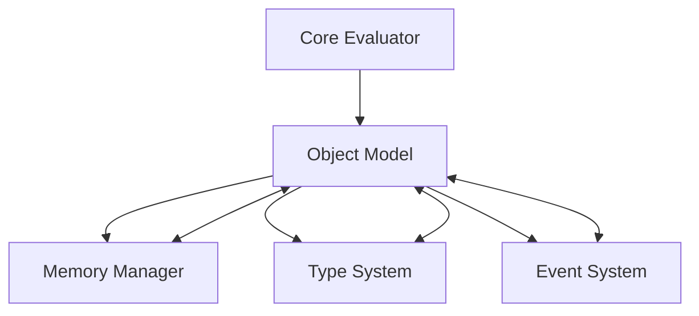

# Object Model Module

## Overview

The **Object Model** is a core module in the Patlang runtime, providing the foundation for all runtime objects, including user-defined types, numbers, strings, and system objects. It defines object structure, behavior, inheritance, and integrates with memory management, type checking, and the evaluator for dynamic and static operations.

---

## Core Responsibilities

- **Object Representation:** Defines the structure and metadata for all runtime objects.
- **Inheritance & Composition:** Supports inheritance, composition, and prototype-based extensions.
- **Dynamic Dispatch:** Enables method invocation and property access at runtime.
- **Type Integration:** Works with the Type System for type checking and inference.
- **Memory Management:** Coordinates with the Memory Manager for object allocation and lifecycle.
- **Evaluator Integration:** Supports object operations within the evaluator (arithmetic, string, function, etc.).
- **Event Handling:** Emits events for object creation, mutation, and destruction.
- **Extensibility:** Allows custom object types, behaviors, and integration with optional modules.

---

## API Reference

### Initialization

```ruby
PatlangObject.new(type: "CustomType", properties: {}, methods: {})
```
Creates a new object with specified type, properties, and methods.

---

### Object Operations

| Method | Description |
|--------|-------------|
| `get_property(name)` | Retrieves a property value. |
| `set_property(name, value)` | Sets a property value. |
| `call_method(name, *args)` | Invokes a method with arguments. |
| `type` | Returns the object's type. |
| `properties` | Returns all properties. |
| `methods` | Returns all methods. |
| `clone` | Creates a shallow copy of the object. |
| `equals(other)` | Checks object equality. |

**Example:**
```ruby
obj = PatlangObject.new(type: "Point", properties: {x: 1, y: 2})
obj.set_property("x", 10)
val = obj.get_property("x") # => 10
obj.call_method("move", 5, 5)
```

---

### Inheritance & Composition

| Method | Description |
|--------|-------------|
| `inherit_from(parent)` | Inherits properties and methods from a parent object. |
| `compose_with(other)` | Composes this object with another, merging properties/methods. |

**Example:**
```ruby
child = PatlangObject.new(type: "Child")
parent = PatlangObject.new(type: "Parent", properties: {foo: 1})
child.inherit_from(parent)
child.get_property("foo") # => 1
```

---

### Integration with Core Modules

- **Memory Manager:** All objects are registered and tracked for allocation and GC.
- **Type System:** Objects expose type metadata and participate in type inference.
- **Evaluator:** Supports dynamic dispatch for arithmetic, string, and function operations.
- **Event System:** Emits events for object lifecycle and mutation.

---

### Advanced Usage

#### Dynamic Method Addition

```ruby
obj = PatlangObject.new(type: "Dynamic")
obj.methods["greet"] = ->(name) { "Hello, #{name}!" }
puts obj.call_method("greet", "Patlang") # => "Hello, Patlang!"
```

#### Custom Object Types

```ruby
class Matrix < PatlangObject
  def initialize(rows, cols)
    super(type: "Matrix", properties: {rows: rows, cols: cols, data: []})
  end
  def set_element(row, col, value)
    # Custom logic
  end
end
matrix = Matrix.new(3, 3)
```

---

## Dependencies

- **Memory Manager:** For object allocation, tracking, and GC.
- **Type System:** For type metadata and checking.
- **Core Evaluator:** For runtime operations and dispatch.
- **Event System:** For emitting object lifecycle events.

---

## Extension Points

- **Custom Object Types:** Subclass or extend PatlangObject for new behaviors.
- **Dynamic Properties/Methods:** Add or override properties and methods at runtime.
- **Event Hooks:** Register for object events for monitoring or debugging.
- **Integration:** Connect with optional modules (e.g., persistence, serialization).

---

## Module Interaction



---

## Selective Inclusion & Extension

- **Core Module:** Always included in the runtime.
- **Extension:** Optional modules (e.g., persistence, serialization) may extend the Object Model via extension points.
- **Selective Inclusion:** Optional modules depend on the Object Model but not vice versa.

---

## Security & Distributed Execution

- **Object Isolation:** Ensures objects are isolated between concurrent and distributed environments.
- **Auditing:** Emits events for all object operations for compliance and monitoring.

---

## Future Directions

- **Persistent Objects:** Support for persistent and distributed object storage.
- **Advanced Dispatch:** Optimized dynamic dispatch and method resolution.
- **Object Analytics:** Real-time analytics and visualization of object graphs.

---

## Appendix

- **Event Types:** object_created, object_mutated, object_destroyed, property_changed, method_invoked, etc.
- **Error Codes:** See Error Handler documentation for object-related errors.

---

## API Summary Table

| Method | Signature | Description | Dependencies | Extensible |
|--------|-----------|-------------|--------------|------------|
| `initialize` | `PatlangObject.new(type:, properties:, methods:)` | Create object | - | Yes |
| `get_property` | `get_property(name)` | Get property | - | Yes |
| `set_property` | `set_property(name, value)` | Set property | - | Yes |
| `call_method` | `call_method(name, *args)` | Call method | - | Yes |
| `type` | `type` | Get type | TS | Yes |
| `properties` | `properties` | Get properties | - | Yes |
| `methods` | `methods` | Get methods | - | Yes |
| `clone` | `clone` | Shallow copy | MM | Yes |
| `equals` | `equals(other)` | Equality check | - | Yes |
| `inherit_from` | `inherit_from(parent)` | Inheritance | - | Yes |
| `compose_with` | `compose_with(other)` | Composition | - | Yes |

---

## See Also

- [`docs/runtime/CoreModules/MemoryManager.md`](docs/runtime/CoreModules/MemoryManager.md:1)
- [`docs/runtime/CoreModules/TypeSystem.md`](docs/runtime/CoreModules/TypeSystem.md:1)
- [`docs/runtime/CoreModules/CoreEvaluator.md`](docs/runtime/CoreModules/CoreEvaluator.md:1)
- [`docs/runtime/ModuleInteraction.md`](docs/runtime/ModuleInteraction.md:1)
