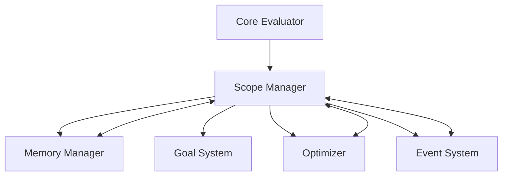

# Scope Manager Module

## Overview

The **Scope Manager** is a core module in the Patlang runtime, responsible for managing variable scopes, symbol tables, and environment lifecycles. It ensures correct variable visibility, supports nested and dynamic scopes, and coordinates with the Memory Manager, Optimizer, and other core modules to provide efficient and safe execution.

---

## Core Responsibilities

- **Scope Management:** Handles creation, nesting, and destruction of variable scopes.
- **Symbol Table:** Maintains mappings of variable names to values and metadata.
- **Environment Lifecycle:** Manages the entry and exit of execution environments (functions, blocks, modules).
- **Variable Resolution:** Resolves variable lookups, supporting shadowing and dynamic scoping.
- **Goal & Optimization Integration:** Supports goal-specific variables and exposes hooks for optimization passes.
- **Memory Coordination:** Works with the Memory Manager to allocate and release memory for scoped variables.
- **Event Handling:** Emits events for scope changes, variable assignments, and environment transitions.
- **Extensibility:** Allows custom scope strategies and integration with advanced optimization modules.

---

## API Reference

### Initialization

```ruby
ScopeManager.new
```
Creates a new Scope Manager instance.

---

### Scope Operations

| Method | Description |
|--------|-------------|
| `push_scope` | Enters a new scope (e.g., function, block). |
| `pop_scope` | Exits the current scope, releasing variables. |
| `set_variable(name, value)` | Sets a variable in the current scope. |
| `get_variable(name)` | Retrieves a variable, searching from innermost to outermost scope. |
| `goal_variable?(name)` | Checks if a variable is goal-specific. |
| `register_goal_variable(name)` | Registers a variable as goal-specific. |
| `scope_stack` | Returns the current stack of scopes. |
| `variables` | Returns all variables in the current environment. |

**Example:**
```ruby
sm = ScopeManager.new
sm.push_scope
sm.set_variable("x", 10)
val = sm.get_variable("x") # => 10
sm.pop_scope
```

---

### Advanced Usage

#### Dynamic Scoping and Shadowing

```ruby
sm.push_scope
sm.set_variable("x", 1)
sm.push_scope
sm.set_variable("x", 2) # Shadows outer "x"
val = sm.get_variable("x") # => 2
sm.pop_scope
val = sm.get_variable("x") # => 1
```

#### Goal-Specific Variables

```ruby
sm.register_goal_variable("goal_var")
if sm.goal_variable?("goal_var")
  # Special handling for goal variables
end
```

#### Integration with Optimizer

```ruby
# Optimizer can analyze scope_stack for variable lifetimes
optimizer.analyze_scope(sm.scope_stack)
```

---

## Dependencies

- **Memory Manager:** For allocation and release of scoped variables.
- **Core Evaluator:** For runtime variable access and environment transitions.
- **Goal System:** For managing goal-specific variables and environments.
- **Optimizer (optional):** For analyzing and optimizing variable lifetimes and scope usage.
- **Event System:** For emitting and handling scope-related events.

---

## Extension Points

- **Custom Scope Strategies:** Implement alternative scoping models (e.g., lexical, dynamic, module-based).
- **Event Hooks:** Register for scope and variable events for monitoring or debugging.
- **Optimizer Integration:** Expose scope data for optimization passes.
- **Environment Extensions:** Support custom environment types (e.g., transactional, persistent).

---

## Module Interaction



---

## Selective Inclusion & Extension

- **Core Module:** Always included in the runtime.
- **Extension:** Optional modules (e.g., advanced optimizers, persistent environments) may extend the Scope Manager via extension points.
- **Selective Inclusion:** Optional modules depend on the Scope Manager but not vice versa.

---

## Security & Distributed Execution

- **Scope Isolation:** Ensures variables are isolated between concurrent and distributed environments.
- **Auditing:** Emits events for all scope and variable operations for compliance and monitoring.

---

## Future Directions

- **Persistent Scopes:** Support for persistent and transactional environments.
- **Advanced Optimization:** Deeper integration with Optimizer for lifetime analysis and memory reuse.
- **Distributed Scopes:** Support for distributed and federated scope management.

---

## Appendix

- **Event Types:** scope_entered, scope_exited, variable_assigned, goal_variable_registered, etc.
- **Error Codes:** See Error Handler documentation for scope-related errors.

---

## API Summary Table

| Method | Signature | Description | Dependencies | Extensible |
|--------|-----------|-------------|--------------|------------|
| `initialize` | `ScopeManager.new` | Create instance | - | Yes |
| `push_scope` | `push_scope` | Enter new scope | - | Yes |
| `pop_scope` | `pop_scope` | Exit scope | MM | Yes |
| `set_variable` | `set_variable(name, value)` | Set variable | - | Yes |
| `get_variable` | `get_variable(name)` | Get variable | - | Yes |
| `goal_variable?` | `goal_variable?(name)` | Check goal variable | GS | Yes |
| `register_goal_variable` | `register_goal_variable(name)` | Register goal variable | GS | Yes |
| `scope_stack` | `scope_stack` | Get scope stack | - | Yes |
| `variables` | `variables` | Get variables | - | Yes |

---

## See Also

- [`docs/runtime/CoreModules/MemoryManager.md`](docs/runtime/CoreModules/MemoryManager.md:1)
- [`docs/runtime/CoreModules/GoalSystem.md`](docs/runtime/CoreModules/GoalSystem.md:1)
- [`docs/runtime/CoreModules/CoreEvaluator.md`](docs/runtime/CoreModules/CoreEvaluator.md:1)
- [`docs/runtime/ModuleInteraction.md`](docs/runtime/ModuleInteraction.md:1)
