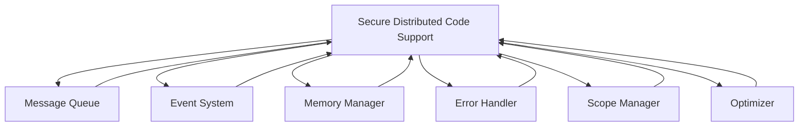

# Secure Distributed Code Support Module

## Overview

The **Secure Distributed Code Support** module is a core component of the Patlang runtime, enabling secure, auditable, and efficient execution of code across distributed nodes. It provides mechanisms for code distribution, secure communication, sandboxing, authentication, and integrates with the Message Queue, Event System, Memory Manager, Error Handler, and other modules to ensure robust and compliant distributed execution.

---

## Core Responsibilities

- **Code Distribution:** Enables secure deployment and execution of code across multiple nodes.
- **Authentication & Authorization:** Ensures only trusted code and users can participate in distributed execution.
- **Sandboxing:** Isolates code execution environments for security and resource control.
- **Secure Messaging:** Uses the Message Queue for encrypted, authenticated communication.
- **Auditing & Compliance:** Logs all distributed operations for auditability and compliance.
- **Event Integration:** Emits and handles events for distributed operations, failures, and security incidents.
- **Error Handling:** Integrates with the Error Handler for distributed error propagation and recovery.
- **Resource Coordination:** Works with the Memory Manager and Scope Manager for distributed resource management.
- **Extensibility:** Allows custom security policies, distributed protocols, and integration with optional modules.

---

## API Reference

### Initialization

```ruby
SecureDistributedCodeSupport.new(config = {})
```
Creates a new Secure Distributed Code Support instance with optional configuration.

---

### Distributed Operations

| Method | Description |
|--------|-------------|
| `deploy_code(node_id, code, options = {})` | Securely deploys code to a remote node. |
| `execute_remote(node_id, function, args = [], options = {})` | Executes a function remotely with secure context. |
| `authenticate_node(node_id, credentials)` | Authenticates a node for participation. |
| `authorize_action(node_id, action, context = {})` | Checks if a node is authorized for an action. |
| `audit_log` | Returns a log of all distributed operations. |
| `sandbox_context(context, &block)` | Executes code in a secure, isolated context. |
| `on_event(event_type, &block)` | Registers a handler for distributed events. |

**Example:**
```ruby
sdcs = SecureDistributedCodeSupport.new
sdcs.authenticate_node("node-2", creds)
sdcs.deploy_code("node-2", "def foo; ...; end")
result = sdcs.execute_remote("node-2", :foo, [1,2,3])
log = sdcs.audit_log
```

---

### Integration with Core Modules

- **Message Queue:** All distributed communication uses the Message Queue for secure delivery.
- **Event System:** Emits and handles distributed events (deploy, execute, failure, security).
- **Memory Manager:** Coordinates distributed memory allocation and synchronization.
- **Error Handler:** Handles distributed errors, propagates and recovers from failures.
- **Scope Manager:** Manages distributed execution environments and variable scopes.
- **Optimizer:** Supports distributed optimization and resource allocation.

---

### Advanced Usage

#### Secure Remote Execution

```ruby
sdcs.sandbox_context(user_context) do
  sdcs.execute_remote("node-3", :compute, [42], options: {timeout: 10})
end
```

#### Auditing and Compliance

```ruby
log = sdcs.audit_log
log.each { |entry| puts "Operation: #{entry[:operation]}, Node: #{entry[:node]}" }
```

#### Custom Security Policies

```ruby
sdcs.authorize_action("node-2", :deploy, context: {role: "admin"})
```

---

## Dependencies

- **Message Queue:** For all distributed communication.
- **Event System:** For event emission and handling.
- **Memory Manager:** For distributed memory management.
- **Error Handler:** For error propagation and recovery.
- **Scope Manager:** For distributed environment management.
- **Optimizer:** For distributed optimization and scheduling.

---

## Extension Points

- **Custom Security Policies:** Implement new authentication and authorization strategies.
- **Distributed Protocols:** Integrate with external distributed systems or protocols.
- **Event Hooks:** Register for distributed events for monitoring or analytics.
- **Sandbox Extensions:** Extend sandboxing for new resource or security models.

---

## Module Interaction



---

## Selective Inclusion & Extension

- **Core Module:** Always included in the runtime.
- **Extension:** Optional modules (e.g., federated security, advanced auditing) may extend Secure Distributed Code Support via extension points.
- **Selective Inclusion:** Optional modules depend on Secure Distributed Code Support but not vice versa.

---

## Security & Distributed Execution

- **Encryption & Authentication:** All communication is encrypted and authenticated.
- **Sandboxing:** All remote code runs in isolated, resource-controlled environments.
- **Auditing:** All operations are logged for compliance and monitoring.
- **Recovery:** Supports distributed error recovery and failover.

---

## Future Directions

- **Federated Security:** Support for federated authentication and cross-runtime trust.
- **Adaptive Sandboxing:** Dynamic sandboxing based on workload and risk.
- **Real-Time Compliance:** Continuous compliance monitoring and alerting.

---

## Appendix

- **Event Types:** code_deployed, remote_executed, authentication_failed, authorization_denied, sandbox_violation, etc.
- **Error Codes:** See Error Handler documentation for distributed and security errors.

---

## API Summary Table

| Method | Signature | Description | Dependencies | Extensible |
|--------|-----------|-------------|--------------|------------|
| `initialize` | `SecureDistributedCodeSupport.new(config = {})` | Create instance | - | Yes |
| `deploy_code` | `deploy_code(node_id, code, options)` | Deploy code | MQ | Yes |
| `execute_remote` | `execute_remote(node_id, function, args, options)` | Remote exec | MQ | Yes |
| `authenticate_node` | `authenticate_node(node_id, credentials)` | Authenticate | - | Yes |
| `authorize_action` | `authorize_action(node_id, action, context)` | Authorize | - | Yes |
| `audit_log` | `audit_log` | Audit log | - | Yes |
| `sandbox_context` | `sandbox_context(context, &block)` | Sandbox exec | - | Yes |
| `on_event` | `on_event(event_type, &block)` | Register event | ES | Yes |

---

## See Also

- [`docs/runtime/CoreModules/MessageQueue.md`](docs/runtime/CoreModules/MessageQueue.md:1)
- [`docs/runtime/CoreModules/EventSystem.md`](docs/runtime/CoreModules/EventSystem.md:1)
- [`docs/runtime/CoreModules/MemoryManager.md`](docs/runtime/CoreModules/MemoryManager.md:1)
- [`docs/runtime/CoreModules/ErrorHandler.md`](docs/runtime/CoreModules/ErrorHandler.md:1)
- [`docs/runtime/CoreModules/ScopeManager.md`](docs/runtime/CoreModules/ScopeManager.md:1)
- [`docs/runtime/CoreModules/Optimizer.md`](docs/runtime/CoreModules/Optimizer.md:1)
- [`docs/runtime/ModuleInteraction.md`](docs/runtime/ModuleInteraction.md:1)
