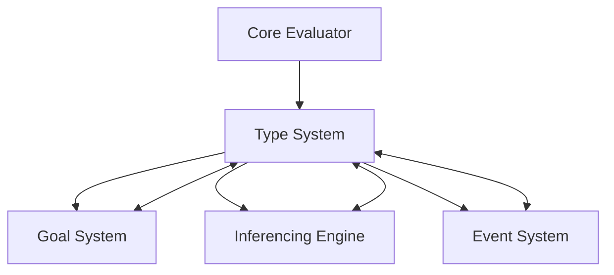

# Type System Module

## Overview

The **Type System** is a core module in the Patlang runtime, responsible for type checking, type inference, constraint management, and type-driven goal resolution. It enables expressive, safe, and extensible type semantics, supporting both static and dynamic typing, advanced inferencing, and integration with the Goal System and Inferencing Engine.

---

## Core Responsibilities

- **Type Checking:** Enforces type correctness for variables, expressions, and function calls.
- **Type Inference:** Automatically deduces types using constraints, unification, and propagation.
- **Constraint Management:** Supports creation, validation, and propagation of type, range, pattern, and structural constraints.
- **Goal Integration:** Enables type-driven goals and leverages the Goal System for type resolution.
- **Conflict Detection:** Detects and reports type conflicts and ambiguities.
- **Event Handling:** Emits events for constraint creation, validation, propagation, and violations.
- **Extensibility:** Supports custom constraints, unification strategies, and integration with other modules.

---

## API Reference

### Initialization

```ruby
TypeConstraintSystem.new
```
Creates a new Type System instance.

---

### Constraint Management

| Method | Description |
|--------|-------------|
| `create_constraint(variable, constraint_type, constraint_data, **options)` | Adds a constraint to a variable (type, range, pattern, structural, custom). |
| `remove_constraints(variable)` | Removes all constraints from a variable. |
| `satisfies_all_constraints?(variable, value)` | Checks if a value satisfies all constraints for a variable. |
| `validate_constraint_inputs(variable, constraint_type, constraint_data)` | Validates constraint inputs before creation. |
| `propagate_constraints` | Propagates constraints across related variables. |
| `add_equality_relationship(var1, var2)` | Links variables for unification and propagation. |
| `unify_variables(var1, var2)` | Attempts to unify two variables' constraints. |
| `detect_conflicts(variable)` | Returns a list of detected type conflicts for a variable. |

**Example:**
```ruby
ts = TypeConstraintSystem.new
ts.create_constraint("x", :type, "Int")
ts.create_constraint("x", :range, 0..10)
ts.satisfies_all_constraints?("x", 5) # => true
conflicts = ts.detect_conflicts("x")
```

---

### Type Inference & Unification

| Method | Description |
|--------|-------------|
| `propagate_between_variables(var1, var2)` | Propagates constraints and types between variables. |
| `unify_variables(var1, var2)` | Unifies constraints, supporting type inference and goal resolution. |
| `ranges_conflict?(ranges)` | Checks for conflicts between multiple range constraints. |

**Advanced Usage Example:**
```ruby
ts.create_constraint("a", :type, "Int")
ts.create_constraint("b", :type, "Int")
ts.add_equality_relationship("a", "b")
ts.unify_variables("a", "b")
# Both "a" and "b" are now inferred as Int
```

---

### Event Handling & Monitoring

| Method | Description |
|--------|-------------|
| `on_all_events(&block)` | Registers a callback for all type system events. |
| `fire_event(event_type, event_data = {})` | Emits a custom event (internal use). |

**Example:**
```ruby
ts.on_all_events do |event|
  puts "Type event: #{event[:event_type]}, data: #{event[:event_data]}"
end
```

---

### Validation & Results

| Class | Description |
|-------|-------------|
| `ValidationResult` | Encapsulates the result of constraint validation (success, errors). |
| `UnificationResult` | Encapsulates the result of unification (success, error message). |

---

## Dependencies

- **Goal System:** For type-driven goals and resolution.
- **Inferencing Engine:** For advanced constraint solving and propagation.
- **Core Evaluator:** For runtime type checks and enforcement.
- **Event System:** For emitting and handling type-related events.

---

## Extension Points

- **Custom Constraints:** Implement new constraint types by extending `TypeConstraint`.
- **Unification Strategies:** Override unification logic for advanced inference.
- **Event Hooks:** Register for type system events for monitoring or debugging.
- **Integration:** Connect with Goal System and Inferencing Engine for cross-module reasoning.

---

## Module Interaction



---

## Selective Inclusion & Extension

- **Core Module:** Always included in the runtime.
- **Extension:** Optional modules (e.g., advanced type analytics, custom constraint libraries) may extend the Type System via extension points.
- **Selective Inclusion:** Optional modules depend on the Type System but not vice versa.

---

## Security & Distributed Execution

- **Type Isolation:** Ensures type constraints are enforced in distributed and concurrent environments.
- **Auditing:** Emits events for all constraint and unification operations for compliance and monitoring.

---

## Future Directions

- **Pluggable Inference Engines:** Support for alternative or learning-based inference.
- **Type-Driven Optimization:** Use type information for runtime and compile-time optimizations.
- **Federated Type Systems:** Support for multi-runtime, federated type reasoning.
- **Enhanced Analytics:** Real-time type analytics and visualization.

---

## Appendix

- **Constraint Types:** type, range, pattern, structural, custom.
- **Event Types:** constraint_created, constraint_validated, constraint_violated, propagation_started, propagation_completed, type_refined, etc.
- **Error Codes:** See Error Handler documentation for type-related errors.

---

## API Summary Table

| Method | Signature | Description | Dependencies | Extensible |
|--------|-----------|-------------|--------------|------------|
| `initialize` | `TypeConstraintSystem.new` | Create instance | - | Yes |
| `create_constraint` | `create_constraint(variable, type, data, **options)` | Add constraint | - | Yes |
| `remove_constraints` | `remove_constraints(variable)` | Remove constraints | - | Yes |
| `satisfies_all_constraints?` | `satisfies_all_constraints?(variable, value)` | Check constraints | - | Yes |
| `validate_constraint_inputs` | `validate_constraint_inputs(variable, type, data)` | Validate inputs | - | Yes |
| `propagate_constraints` | `propagate_constraints` | Propagate constraints | - | Yes |
| `add_equality_relationship` | `add_equality_relationship(var1, var2)` | Link variables | - | Yes |
| `unify_variables` | `unify_variables(var1, var2)` | Unify constraints | Goal System | Yes |
| `detect_conflicts` | `detect_conflicts(variable)` | Detect conflicts | - | Yes |
| `propagate_between_variables` | `propagate_between_variables(var1, var2)` | Propagate types | - | Yes |
| `ranges_conflict?` | `ranges_conflict?(ranges)` | Check range conflicts | - | Yes |
| `on_all_events` | `on_all_events(&block)` | Register event | Event System | Yes |
| `fire_event` | `fire_event(event_type, data)` | Emit event | Event System | Yes |

---

## See Also

- [`docs/runtime/CoreModules/GoalSystem.md`](docs/runtime/CoreModules/GoalSystem.md:1)
- [`docs/runtime/CoreModules/CoreEvaluator.md`](docs/runtime/CoreModules/CoreEvaluator.md:1)
- [`docs/runtime/ModuleInteraction.md`](docs/runtime/ModuleInteraction.md:1)
