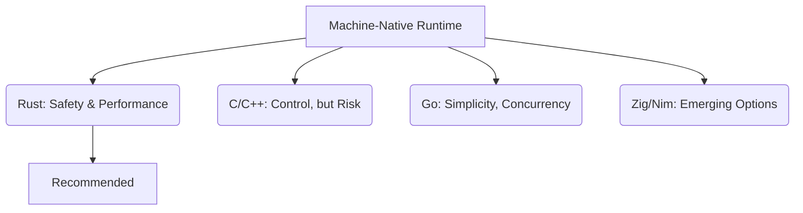

# Language Recommendation for Patlang Native Runtime

## Overview

Selecting the right implementation language is foundational for building a secure, performant, and trustworthy machine-native distributed runtime. This section provides a detailed analysis and recommendation, considering security, concurrency, performance, ecosystem, and long-term maintainability.

---

## Candidate Languages

| Language | Pros | Cons |
|----------|------|------|
| **Rust** | Memory safety, zero-cost abstractions, strong concurrency, modern tooling, no GC, excellent for security-critical systems | Steep learning curve, smaller ecosystem for some domains |
| **C** | Maximum control, portability, mature toolchain, widely used for runtimes | Manual memory management, prone to security bugs, no built-in concurrency safety |
| **C++** | Performance, OOP and generic programming, large ecosystem | Complex, manual memory management, potential for subtle bugs |
| **Go** | Simplicity, built-in concurrency, good networking, fast compile times | GC overhead, less control over memory, weaker low-level features |
| **Zig** | Simplicity, safety features, cross-compilation, no hidden control flow | Young ecosystem, less mature tooling |
| **Nim** | Expressive syntax, compiles to C, memory safety options | Smaller community, less proven for runtimes |

---

## Rationale

### Security-by-Design

- **Rust** provides strong compile-time guarantees against memory safety bugs (buffer overflows, use-after-free, data races), which are critical for trustworthy, distributed, and secure systems.
- **C/C++** offer maximum control but require extreme discipline to avoid vulnerabilities.
- **Go** and **Nim** offer some safety, but with trade-offs in low-level control or ecosystem maturity.

### Performance & Concurrency

- **Rust** and **C/C++** deliver near-maximum performance.
- **Rust** offers modern concurrency primitives with safety guarantees.
- **Go** is strong for networked concurrency but less suitable for low-level runtime internals.

### Ecosystem & Tooling

- **Rust** has a rapidly growing ecosystem, excellent tooling (cargo, clippy, rustfmt), and is increasingly used for language runtimes and security-focused systems.
- **C/C++** have mature ecosystems but are more error-prone.
- **Zig** and **Nim** are promising but less proven for large-scale runtimes.

---

## Recommendation

**Rust** is the recommended language for implementing the Patlang native runtime. It offers the best balance of safety, performance, concurrency, and modern tooling, making it ideal for a secure, distributed, and maintainable system.

---

## Decision Diagram

---

## Summary Table

| Language | Security | Performance | Concurrency | Ecosystem | Suitability |
|----------|----------|-------------|-------------|-----------|------------|
| Rust     | ⭐⭐⭐⭐⭐    | ⭐⭐⭐⭐⭐      | ⭐⭐⭐⭐⭐      | ⭐⭐⭐⭐     | ⭐⭐⭐⭐⭐     |
| C        | ⭐        | ⭐⭐⭐⭐⭐      | ⭐⭐         | ⭐⭐⭐⭐⭐    | ⭐⭐⭐       |
| C++      | ⭐⭐       | ⭐⭐⭐⭐⭐      | ⭐⭐⭐        | ⭐⭐⭐⭐⭐    | ⭐⭐⭐       |
| Go       | ⭐⭐⭐      | ⭐⭐⭐        | ⭐⭐⭐⭐       | ⭐⭐⭐⭐     | ⭐⭐⭐       |
| Zig      | ⭐⭐⭐      | ⭐⭐⭐⭐       | ⭐⭐⭐        | ⭐⭐       | ⭐⭐        |
| Nim      | ⭐⭐⭐      | ⭐⭐⭐        | ⭐⭐⭐        | ⭐⭐       | ⭐⭐        |

---

## Conclusion

Rust is the leading choice for a secure, trustworthy, and high-performance distributed runtime. Its safety guarantees, concurrency model, and modern ecosystem make it the best fit for Patlang’s goals.
