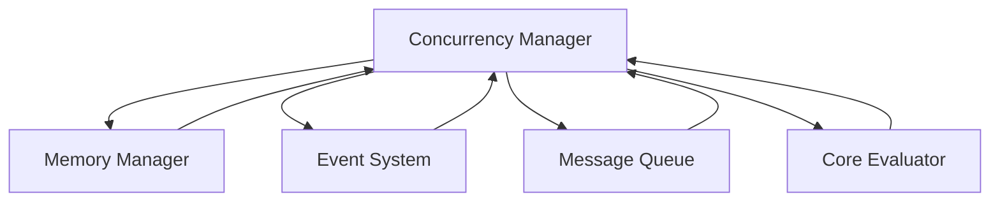

# Concurrency Manager Module

## Overview

The **Concurrency Manager** is an optional module in the Patlang runtime, providing primitives and abstractions for concurrent and parallel execution. It enables safe, efficient, and scalable concurrency, integrating with the Memory Manager, Event System, Message Queue, and other modules to coordinate threads, tasks, and distributed processes.

---

## Core Responsibilities

- **Thread & Task Management:** Manages creation, scheduling, and synchronization of threads and tasks.
- **Synchronization Primitives:** Provides locks, semaphores, barriers, and atomic operations.
- **Parallel Execution:** Enables parallel execution of code blocks and data processing.
- **Distributed Coordination:** Integrates with Message Queue and Event System for distributed concurrency.
- **Resource Management:** Coordinates with Memory Manager for safe concurrent access.
- **Extensibility:** Allows custom concurrency strategies and integration with optional modules.

---

## API Reference

### Initialization

```ruby
ConcurrencyManager.new(config = {})
```
Creates a new Concurrency Manager instance with optional configuration.

---

### Concurrency Operations

| Method | Description |
|--------|-------------|
| `spawn(&block)` | Spawns a new thread or task to execute a block. |
| `join(thread_or_task)` | Waits for a thread or task to complete. |
| `lock(resource, &block)` | Acquires a lock on a resource for the duration of a block. |
| `semaphore(name, permits)` | Creates or retrieves a semaphore. |
| `barrier(count)` | Creates a barrier for synchronizing threads or tasks. |
| `atomic(&block)` | Executes a block atomically. |
| `on_event(event_type, &block)` | Registers for concurrency-related events. |

**Example:**
```ruby
cm = ConcurrencyManager.new
t1 = cm.spawn { do_work(1) }
t2 = cm.spawn { do_work(2) }
cm.join(t1)
cm.join(t2)
cm.lock("resource") { critical_section }
```

---

## Dependencies

- **Memory Manager:** For safe concurrent memory access.
- **Event System:** For emitting and handling concurrency events.
- **Message Queue:** For distributed coordination.
- **Core Evaluator:** For integrating concurrency into program execution.

---

## Extension Points

- **Custom Strategies:** Implement new scheduling or synchronization strategies.
- **Event Hooks:** Monitor concurrency events and state changes.
- **Distributed Extensions:** Integrate with distributed concurrency frameworks.

---

## Module Interaction



---

## Selective Inclusion & Extension

- **Optional Module:** Can be included or omitted at runtime.
- **Extension:** Other modules may extend the Concurrency Manager via extension points.

---

## Security & Distributed Execution

- **Isolation:** Ensures thread and task isolation for safety.
- **Auditing:** Logs all concurrency operations for compliance.
- **Distributed Concurrency:** Supports distributed and federated concurrency models.

---

## Future Directions

- **Adaptive Scheduling:** Learning-based and workload-adaptive scheduling.
- **Federated Concurrency:** Multi-runtime, federated concurrency and coordination.

---

## Appendix

- **Event Types:** thread_spawned, task_completed, lock_acquired, semaphore_wait, barrier_reached, atomic_executed, etc.

---

## API Summary Table

| Method | Signature | Description | Dependencies | Extensible |
|--------|-----------|-------------|--------------|------------|
| `initialize` | `ConcurrencyManager.new(config = {})` | Create instance | - | Yes |
| `spawn` | `spawn(&block)` | Spawn thread/task | - | Yes |
| `join` | `join(thread_or_task)` | Wait for completion | - | Yes |
| `lock` | `lock(resource, &block)` | Lock resource | MM | Yes |
| `semaphore` | `semaphore(name, permits)` | Semaphore | - | Yes |
| `barrier` | `barrier(count)` | Barrier | - | Yes |
| `atomic` | `atomic(&block)` | Atomic block | MM | Yes |
| `on_event` | `on_event(event_type, &block)` | Register event | ES | Yes |

---

## See Also

- [`docs/runtime/CoreModules/MemoryManager.md`](docs/runtime/CoreModules/MemoryManager.md:1)
- [`docs/runtime/CoreModules/EventSystem.md`](docs/runtime/CoreModules/EventSystem.md:1)
- [`docs/runtime/CoreModules/MessageQueue.md`](docs/runtime/CoreModules/MessageQueue.md:1)
- [`docs/runtime/CoreModules/CoreEvaluator.md`](docs/runtime/CoreModules/CoreEvaluator.md:1)
