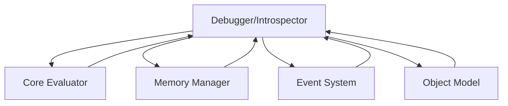

# Debugger/Introspector Module

## Overview

The **Debugger/Introspector** is an optional module in the Patlang runtime, providing interactive debugging, runtime inspection, and introspection capabilities. It enables developers to trace execution, inspect state, set breakpoints, and analyze program behavior, integrating with the Core Evaluator, Event System, Memory Manager, and other modules.

---

## Core Responsibilities

- **Interactive Debugging:** Supports breakpoints, step execution, and call stack inspection.
- **Runtime Introspection:** Allows inspection of variables, objects, memory, and execution context.
- **Tracing & Logging:** Provides execution traces and logs for analysis.
- **Integration:** Works with Core Evaluator, Memory Manager, Event System, and Object Model.
- **Extensibility:** Allows custom debug commands, visualizations, and integration with IDEs.

---

## API Reference

### Initialization

```ruby
DebuggerIntrospector.new(config = {})
```
Creates a new Debugger/Introspector instance with optional configuration.

---

### Debugging Operations

| Method | Description |
|--------|-------------|
| `set_breakpoint(location)` | Sets a breakpoint at a code location. |
| `remove_breakpoint(location)` | Removes a breakpoint. |
| `step` | Executes the next instruction. |
| `continue` | Continues execution until next breakpoint or end. |
| `inspect_variable(name)` | Inspects the value of a variable. |
| `inspect_object(obj)` | Inspects an object's properties and methods. |
| `inspect_memory(address)` | Inspects memory at a given address. |
| `get_call_stack` | Returns the current call stack. |
| `trace_execution(&block)` | Registers a trace handler for execution events. |
| `on_event(event_type, &block)` | Registers for debug/introspection events. |

**Example:**
```ruby
dbg = DebuggerIntrospector.new
dbg.set_breakpoint("main:42")
dbg.step
val = dbg.inspect_variable("x")
dbg.trace_execution { |event| puts event }
```

---

## Dependencies

- **Core Evaluator:** For execution control and state inspection.
- **Memory Manager:** For memory inspection and tracking.
- **Event System:** For emitting and handling debug events.
- **Object Model:** For object introspection.

---

## Extension Points

- **Custom Debug Commands:** Add new commands for interactive debugging.
- **Trace Handlers:** Register for execution and state change events.
- **IDE Integration:** Connect with external IDEs or visualization tools.

---

## Module Interaction



---

## Selective Inclusion & Extension

- **Optional Module:** Can be included or omitted at runtime.
- **Extension:** Other modules may extend the Debugger/Introspector via extension points.

---

## Security & Distributed Execution

- **Access Control:** Restricts debugging and introspection to authorized users.
- **Distributed Debugging:** Supports debugging across distributed nodes.

---

## Future Directions

- **Time-Travel Debugging:** Support for reverse execution and state replay.
- **Advanced Visualization:** Real-time visualizations of program state and execution.

---

## Appendix

- **Event Types:** breakpoint_hit, step_executed, variable_inspected, object_inspected, memory_inspected, etc.

---

## API Summary Table

| Method | Signature | Description | Dependencies | Extensible |
|--------|-----------|-------------|--------------|------------|
| `initialize` | `DebuggerIntrospector.new(config = {})` | Create instance | - | Yes |
| `set_breakpoint` | `set_breakpoint(location)` | Set breakpoint | CE | Yes |
| `remove_breakpoint` | `remove_breakpoint(location)` | Remove breakpoint | CE | Yes |
| `step` | `step` | Step execution | CE | Yes |
| `continue` | `continue` | Continue execution | CE | Yes |
| `inspect_variable` | `inspect_variable(name)` | Inspect variable | CE | Yes |
| `inspect_object` | `inspect_object(obj)` | Inspect object | OM | Yes |
| `inspect_memory` | `inspect_memory(address)` | Inspect memory | MM | Yes |
| `get_call_stack` | `get_call_stack` | Get call stack | CE | Yes |
| `trace_execution` | `trace_execution(&block)` | Trace execution | ES | Yes |
| `on_event` | `on_event(event_type, &block)` | Register event | ES | Yes |

---

## See Also

- [`docs/runtime/CoreModules/CoreEvaluator.md`](docs/runtime/CoreModules/CoreEvaluator.md:1)
- [`docs/runtime/CoreModules/MemoryManager.md`](docs/runtime/CoreModules/MemoryManager.md:1)
- [`docs/runtime/CoreModules/EventSystem.md`](docs/runtime/CoreModules/EventSystem.md:1)
- [`docs/runtime/CoreModules/ObjectModel.md`](docs/runtime/CoreModules/ObjectModel.md:1)
