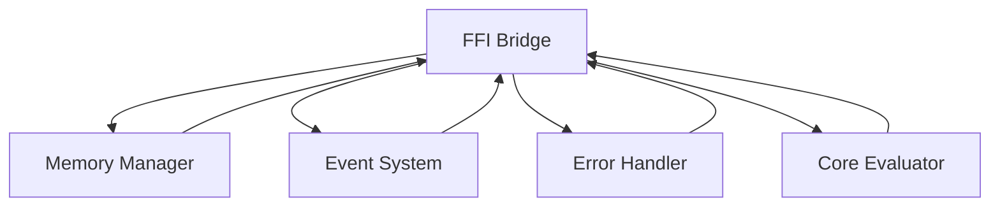

# FFI Bridge Module

## Overview

The **FFI Bridge** is an optional module in the Patlang runtime, enabling interoperability with external libraries and systems written in other languages (e.g., C, C++, Rust, Python). It provides a Foreign Function Interface (FFI) for calling native functions, sharing data, and integrating with external runtimes, supporting both synchronous and asynchronous operations.

---

## Core Responsibilities

- **Native Interoperability:** Allows Patlang code to call functions in external libraries.
- **Data Marshalling:** Handles conversion between Patlang and native data types.
- **Resource Management:** Manages memory and resources shared with external code.
- **Asynchronous Integration:** Supports async FFI calls and callbacks.
- **Security:** Enforces sandboxing and access control for FFI operations.
- **Integration:** Works with Memory Manager, Event System, Error Handler, and Core Evaluator.
- **Extensibility:** Allows custom FFI adapters and integration with new runtimes.

---

## API Reference

### Initialization

```ruby
FFIBridge.new(config = {})
```
Creates a new FFI Bridge instance with optional configuration.

---

### FFI Operations

| Method | Description |
|--------|-------------|
| `load_library(path)` | Loads an external library for FFI calls. |
| `bind_function(name, signature, options = {})` | Binds a native function for use in Patlang. |
| `call_function(name, *args)` | Calls a bound native function. |
| `marshal_data(data, type)` | Converts data between Patlang and native types. |
| `on_event(event_type, &block)` | Registers for FFI-related events. |

**Example:**
```ruby
ffi = FFIBridge.new
ffi.load_library("libmath.so")
ffi.bind_function("add", "int(int, int)")
result = ffi.call_function("add", 2, 3) # => 5
```

---

## Dependencies

- **Memory Manager:** For managing shared memory and resources.
- **Event System:** For emitting and handling FFI events.
- **Error Handler:** For handling FFI errors and exceptions.
- **Core Evaluator:** For integrating FFI calls into program execution.

---

## Extension Points

- **Custom Adapters:** Add support for new languages or runtimes.
- **Event Hooks:** Monitor FFI operations and errors.
- **Security Policies:** Enforce custom sandboxing and access control.

---

## Module Interaction



---

## Selective Inclusion & Extension

- **Optional Module:** Can be included or omitted at runtime.
- **Extension:** Other modules may extend the FFI Bridge via extension points.

---

## Security & Distributed Execution

- **Sandboxing:** Restricts FFI access to authorized libraries and functions.
- **Auditing:** Logs all FFI operations for compliance and monitoring.
- **Distributed FFI:** Supports FFI calls in distributed environments.

---

## Future Directions

- **Automatic Binding Generation:** Generate bindings from library headers or metadata.
- **Cross-Language Debugging:** Integrated debugging across Patlang and native code.

---

## Appendix

- **Event Types:** ffi_call, ffi_error, library_loaded, function_bound, etc.

---

## API Summary Table

| Method | Signature | Description | Dependencies | Extensible |
|--------|-----------|-------------|--------------|------------|
| `initialize` | `FFIBridge.new(config = {})` | Create instance | - | Yes |
| `load_library` | `load_library(path)` | Load library | - | Yes |
| `bind_function` | `bind_function(name, signature, options)` | Bind function | - | Yes |
| `call_function` | `call_function(name, *args)` | Call function | - | Yes |
| `marshal_data` | `marshal_data(data, type)` | Marshal data | MM | Yes |
| `on_event` | `on_event(event_type, &block)` | Register event | ES | Yes |

---

## See Also

- [`docs/runtime/CoreModules/MemoryManager.md`](docs/runtime/CoreModules/MemoryManager.md:1)
- [`docs/runtime/CoreModules/EventSystem.md`](docs/runtime/CoreModules/EventSystem.md:1)
- [`docs/runtime/CoreModules/ErrorHandler.md`](docs/runtime/CoreModules/ErrorHandler.md:1)
- [`docs/runtime/CoreModules/CoreEvaluator.md`](docs/runtime/CoreModules/CoreEvaluator.md:1)
