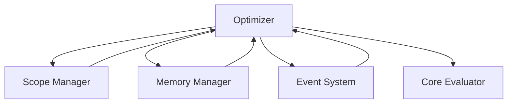

# Optimizer Module

## Overview

The **Optimizer** is an optional module in the Patlang runtime, providing analysis and transformation capabilities to improve program performance, memory usage, and execution efficiency. It integrates with the Scope Manager, Memory Manager, Event System, and other modules to perform static and dynamic optimizations.

---

## Core Responsibilities

- **Code Analysis:** Analyzes code for optimization opportunities.
- **Transformation:** Applies optimizations such as inlining, dead code elimination, and loop unrolling.
- **Resource Optimization:** Improves memory and resource usage.
- **Integration:** Works with Scope Manager, Memory Manager, Event System, and Core Evaluator.
- **Extensibility:** Allows custom optimization passes and integration with analytics.

---

## API Reference

### Initialization

```ruby
Optimizer.new(config = {})
```
Creates a new Optimizer instance with optional configuration.

---

### Optimization Operations

| Method | Description |
|--------|-------------|
| `analyze_scope(scope_stack)` | Analyzes variable lifetimes and scope usage. |
| `optimize_code(ast)` | Applies optimization passes to the AST. |
| `register_pass(name, &block)` | Registers a custom optimization pass. |
| `on_event(event_type, &block)` | Registers for optimization events. |
| `log_optimization(data)` | Logs optimization results for analytics. |

**Example:**
```ruby
opt = Optimizer.new
opt.register_pass(:inline_functions) { |ast| ... }
optimized_ast = opt.optimize_code(ast)
```

---

## Dependencies

- **Scope Manager:** For variable lifetime analysis.
- **Memory Manager:** For memory optimization.
- **Event System:** For emitting optimization events.
- **Core Evaluator:** For runtime integration.

---

## Extension Points

- **Custom Passes:** Add new optimization strategies.
- **Event Hooks:** Monitor optimization events.
- **Analytics Integration:** Connect with monitoring and analytics modules.

---

## Module Interaction



---

## Selective Inclusion & Extension

- **Optional Module:** Can be included or omitted at runtime.
- **Extension:** Other modules may extend the Optimizer via extension points.

---

## Security & Distributed Execution

- **Auditing:** Logs all optimization actions for compliance.
- **Distributed Optimization:** Supports distributed optimization passes.

---

## Future Directions

- **Adaptive Optimization:** Learning-based and runtime-adaptive optimization.
- **Cross-Module Optimization:** Deeper integration with other modules for holistic optimization.

---

## Appendix

- **Event Types:** optimization_pass, optimization_applied, optimization_failed, etc.

---

## API Summary Table

| Method | Signature | Description | Dependencies | Extensible |
|--------|-----------|-------------|--------------|------------|
| `initialize` | `Optimizer.new(config = {})` | Create instance | - | Yes |
| `analyze_scope` | `analyze_scope(scope_stack)` | Analyze scopes | SM | Yes |
| `optimize_code` | `optimize_code(ast)` | Optimize AST | CE | Yes |
| `register_pass` | `register_pass(name, &block)` | Register pass | - | Yes |
| `on_event` | `on_event(event_type, &block)` | Register event | ES | Yes |
| `log_optimization` | `log_optimization(data)` | Log result | ES | Yes |

---

## See Also

- [`docs/runtime/CoreModules/ScopeManager.md`](docs/runtime/CoreModules/ScopeManager.md:1)
- [`docs/runtime/CoreModules/MemoryManager.md`](docs/runtime/CoreModules/MemoryManager.md:1)
- [`docs/runtime/CoreModules/EventSystem.md`](docs/runtime/CoreModules/EventSystem.md:1)
- [`docs/runtime/CoreModules/CoreEvaluator.md`](docs/runtime/CoreModules/CoreEvaluator.md:1)
