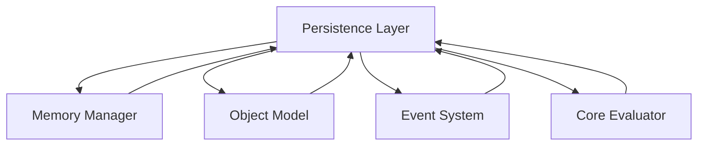

# Persistence Layer Module

## Overview

The **Persistence Layer** is an optional module in the Patlang runtime, providing durable storage and retrieval of program state, objects, and data. It enables checkpointing, state recovery, and long-term storage, integrating with the Memory Manager, Object Model, Event System, and other modules for seamless persistence and restoration.

---

## Core Responsibilities

- **Durable Storage:** Saves and restores program state, objects, and memory.
- **Checkpointing:** Supports periodic and on-demand state snapshots.
- **Recovery:** Enables recovery from failures or restarts.
- **Integration:** Works with Memory Manager, Object Model, Event System, and Core Evaluator.
- **Extensibility:** Allows custom storage backends and serialization formats.

---

## API Reference

### Initialization

```ruby
PersistenceLayer.new(config = {})
```
Creates a new Persistence Layer instance with optional configuration.

---

### Persistence Operations

| Method | Description |
|--------|-------------|
| `save_state(snapshot_name = nil)` | Saves the current program state. |
| `load_state(snapshot_name = nil)` | Loads a previously saved state. |
| `persist_object(obj, options = {})` | Persists an object to storage. |
| `restore_object(id, options = {})` | Restores an object from storage. |
| `list_snapshots` | Lists available state snapshots. |
| `configure(options)` | Updates persistence configuration. |
| `on_event(event_type, &block)` | Registers for persistence events. |

**Example:**
```ruby
pl = PersistenceLayer.new
pl.save_state("checkpoint1")
pl.load_state("checkpoint1")
pl.persist_object(obj)
restored = pl.restore_object(obj.id)
```

---

## Dependencies

- **Memory Manager:** For saving and restoring memory state.
- **Object Model:** For object serialization and deserialization.
- **Event System:** For emitting and handling persistence events.
- **Core Evaluator:** For integrating persistence into program execution.

---

## Extension Points

- **Custom Storage Backends:** Add support for databases, filesystems, or cloud storage.
- **Serialization Formats:** Implement new serialization/deserialization strategies.
- **Event Hooks:** Monitor persistence operations and errors.

---

## Module Interaction



---

## Selective Inclusion & Extension

- **Optional Module:** Can be included or omitted at runtime.
- **Extension:** Other modules may extend the Persistence Layer via extension points.

---

## Security & Distributed Execution

- **Encrypted Storage:** Supports encrypted state and object storage.
- **Auditing:** Logs all persistence operations for compliance.
- **Distributed Persistence:** Supports distributed and federated storage backends.

---

## Future Directions

- **Incremental Checkpointing:** Efficient, incremental state saving.
- **Federated Persistence:** Multi-runtime, federated storage and recovery.

---

## Appendix

- **Event Types:** state_saved, state_loaded, object_persisted, object_restored, snapshot_created, etc.

---

## API Summary Table

| Method | Signature | Description | Dependencies | Extensible |
|--------|-----------|-------------|--------------|------------|
| `initialize` | `PersistenceLayer.new(config = {})` | Create instance | - | Yes |
| `save_state` | `save_state(snapshot_name)` | Save state | MM, OM | Yes |
| `load_state` | `load_state(snapshot_name)` | Load state | MM, OM | Yes |
| `persist_object` | `persist_object(obj, options)` | Persist object | OM | Yes |
| `restore_object` | `restore_object(id, options)` | Restore object | OM | Yes |
| `list_snapshots` | `list_snapshots` | List snapshots | - | Yes |
| `configure` | `configure(options)` | Update config | - | Yes |
| `on_event` | `on_event(event_type, &block)` | Register event | ES | Yes |

---

## See Also

- [`docs/runtime/CoreModules/MemoryManager.md`](docs/runtime/CoreModules/MemoryManager.md:1)
- [`docs/runtime/CoreModules/ObjectModel.md`](docs/runtime/CoreModules/ObjectModel.md:1)
- [`docs/runtime/CoreModules/EventSystem.md`](docs/runtime/CoreModules/EventSystem.md:1)
- [`docs/runtime/CoreModules/CoreEvaluator.md`](docs/runtime/CoreModules/CoreEvaluator.md:1)
