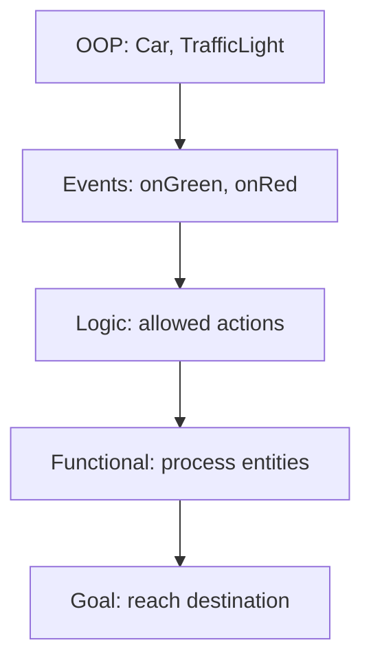

# Advanced Patterns and Best Practices in Patlang

Combining paradigms in Patlang enables expressive, maintainable, and efficient code. This section provides guidance on when and how to mix paradigms, and how to write robust multi-paradigm programs.

## When and Why to Combine Paradigms

- **Expressiveness:** Use the best paradigm for each part of a problem.
- **Maintainability:** Encapsulate logic using OOP, express rules with logic, and handle events cleanly.
- **Performance:** Use imperative code for critical sections, functional for transformations.
- **Scalability:** Build complex systems by composing simple, well-defined parts.

## Best Practices

- **Keep Functions Pure:** Minimize side effects in functional code for easier testing and reuse.
- **Encapsulate State:** Use classes/objects to manage state and hide implementation details.
- **Separate Concerns:** Use events and handlers to decouple logic and improve modularity.
- **Use Goals and Rules:** For declarative and knowledge-driven logic, combine goal-oriented and logic paradigms.
- **Document Paradigm Usage:** Comment on why a paradigm is chosen for clarity and maintainability.
- **Test in Isolation:** Test each paradigm's logic separately before integrating.

## Tips

- Prefer composition over inheritance for flexibility.
- Avoid deep nesting of paradigms unless necessary.
- Profile performance if mixing heavy logic and imperative code.
- Use clear naming conventions to indicate paradigm boundaries.
- Refactor code regularly to keep abstractions clean.

## Example: Multi-Paradigm Design

Suppose you are building a simulation:

- Use OOP to model entities (e.g., `Car`, `TrafficLight`).
- Use events to signal state changes (`onGreen`, `onRed`).
- Use logic rules to determine allowed actions.
- Use functional code to process collections of entities.
- Use goals to express high-level objectives (e.g., "all cars reach destination").

## Diagram

## Next Steps

- Review your code for paradigm clarity.
- Share patterns and best practices with your team.
- Continue learning by exploring the reference and further reading section.