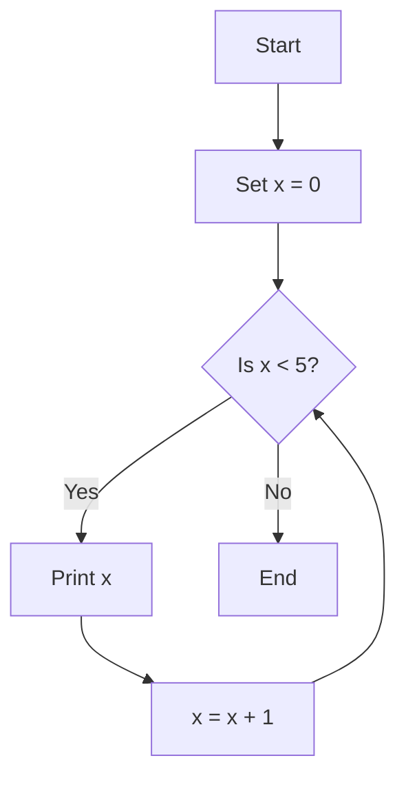

# Imperative Programming in Patlang

Imperative programming in Patlang uses variables, statements, and control flow to describe computations step by step. This style is familiar to users of languages like C, Python, or JavaScript.

## Concepts

- **Variables:** Store and update values.
- **Statements:** Perform actions in sequence.
- **Control Flow:** Use conditionals and loops to direct execution.

## Syntax Overview

- Assignment: `var x = 10`
- If statement: 
  ```patlang
  if x > 5 {
    print("x is greater than 5")
  }
  ```
- While loop:
  ```patlang
  while x < 10 {
    x = x + 1
  }
  ```

## Example: Counting Loop

```patlang
var x = 0
while x < 5 {
  print(x)
  x = x + 1
}
```

This program prints numbers 0 to 4.

## Example: Conditional Branch

```patlang
var y = 7
if y % 2 == 0 {
  print("Even")
} else {
  print("Odd")
}
```

## Running the Example

Save the code to `imperative_example.patlang` and run:

```sh
patlang run imperative_example.patlang
```

## Diagram



## Tips

- Use clear variable names.
- Keep loops simple and avoid infinite loops.
- Use comments to explain logic for future readers.

## Next Steps

Explore object-oriented programming in Patlang to organize code into reusable components.