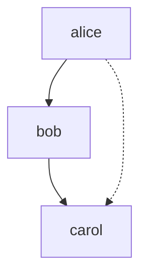

# Logic Programming in Patlang

Logic programming in Patlang uses facts, rules, and queries to express knowledge and reasoning. This paradigm is ideal for building knowledge bases, expert systems, and declarative logic.

## Concepts

- **Facts:** State information about the world.
- **Rules:** Define relationships and logic, often using pattern matching.
- **Queries:** Ask questions based on facts and rules, returning results.

## Syntax Overview

- Fact definition:
  ```patlang
  fact parent(alice, bob)
  fact parent(bob, carol)
  ```
- Rule definition:
  ```patlang
  rule grandparent(X, Y) {
    parent(X, Z) and parent(Z, Y)
  }
  ```
- Query:
  ```patlang
  query grandparent(alice, Who)
  ```

## Example: Family Tree

```patlang
fact parent(alice, bob)
fact parent(bob, carol)

rule grandparent(X, Y) {
  parent(X, Z) and parent(Z, Y)
}

query grandparent(alice, Who)
```

This code defines a small family tree and queries for Alice's grandchildren.

## Example: Transitive Closure

```patlang
fact connected(a, b)
fact connected(b, c)
fact connected(c, d)

rule path(X, Y) {
  connected(X, Y)
}
rule path(X, Y) {
  connected(X, Z) and path(Z, Y)
}

query path(a, d)
```

## Running the Example

Save the code to `logic_example.patlang` and run:

```sh
patlang run logic_example.patlang
```

## Diagram



## Tips

- Use facts for static knowledge, rules for logic, and queries for answers.
- Combine with goals for advanced reasoning.
- Document your rules for maintainability.

## Next Steps

Explore functional programming in Patlang for data transformation and pure computation.