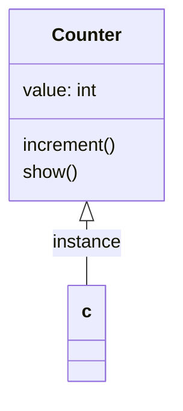

# Object-Oriented Programming in Patlang

Patlang supports object-oriented programming (OOP) with classes, objects, encapsulation, and (if supported) inheritance. OOP helps organize code into reusable, modular components.

## Concepts

- **Classes:** Define blueprints for objects, grouping data and behavior.
- **Objects:** Instances of classes with their own state.
- **Encapsulation:** Group related data and methods, hiding internal details.
- **Inheritance:** (If supported) Share behavior between classes.

## Syntax Overview

- Class definition:
  ```patlang
  class Counter {
    var value = 0

    method increment() {
      value = value + 1
    }

    method show() {
      print(value)
    }
  }
  ```
- Object instantiation and method calls:
  ```patlang
  var c = Counter()
  c.increment()
  c.show()
  ```

## Example: Counter Class

```patlang
class Counter {
  var value = 0

  method increment() {
    value = value + 1
  }

  method show() {
    print(value)
  }
}

var c = Counter()
c.increment()
c.show()
```

This code defines a `Counter` class, creates an object, increments its value, and prints it.

## Example: Encapsulation

```patlang
class BankAccount {
  var balance = 0

  method deposit(amount) {
    balance = balance + amount
  }

  method get_balance() {
    return balance
  }
}

var acct = BankAccount()
acct.deposit(100)
print(acct.get_balance())
```

## Running the Example

Save the code to `oop_example.patlang` and run:

```sh
patlang run oop_example.patlang
```

## Diagram



## Tips

- Use classes to encapsulate related data and behavior.
- Prefer composition over inheritance for flexibility.
- Document methods and class responsibilities.

## Next Steps

Explore goal-oriented programming in Patlang to express intent-driven logic.