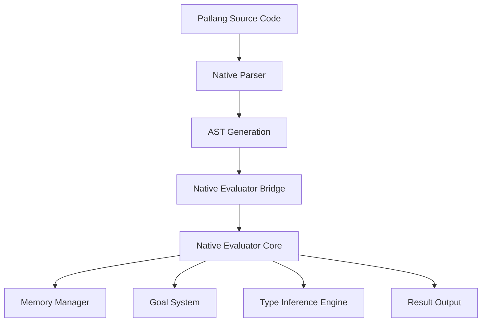
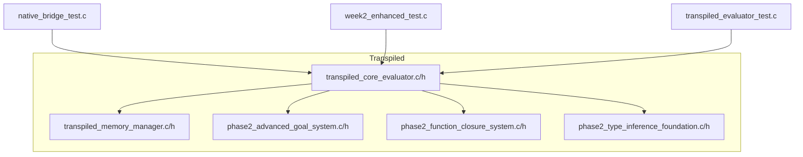
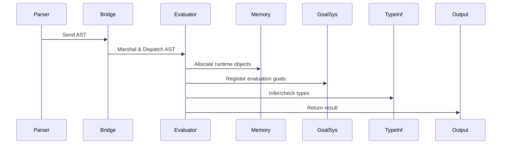
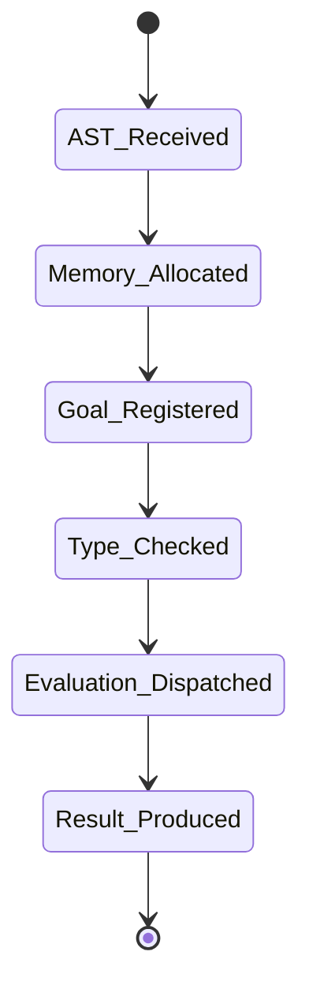

# Native Evaluator Component Documentation

## Overview

The `native_evaluator` is a high-performance, C-based evaluation engine for Patlang, designed to execute parsed ASTs natively. It bridges the gap between the Patlang parser and runtime, providing efficient execution, memory management, and extensibility for advanced language features.

---

## Architecture

### Component Responsibilities

- **Native Evaluator Bridge**: Receives ASTs from the parser, marshals data, and invokes native evaluation routines.
- **Core Evaluator**: Traverses AST nodes, dispatches evaluation logic, and coordinates with subsystems.
- **Memory Manager**: Handles allocation, deallocation, and safety for runtime objects.
- **Goal System**: Manages evaluation goals, supports advanced reasoning and deferred computations.
- **Type Inference Engine**: Performs type checks and inference during evaluation for correctness and optimization.

---

## Module Structure

- **transpiled_core_evaluator.c/h**: Main evaluation logic, AST traversal, dispatch.
- **transpiled_memory_manager.c/h**: Custom heap, reference counting, GC stubs.
- **phase2_advanced_goal_system.c/h**: Goal management, deferred execution.
- **phase2_function_closure_system.c/h**: Closure creation, environment capture.
- **phase2_type_inference_foundation.c/h**: Type inference and checking.
- **native_bridge_test.c**, **week2_enhanced_test.c**, **transpiled_evaluator_test.c**: Test harnesses.

---

## Timing and Flow

### High-Level Flow

### Timing Considerations

- **AST Marshalling**: Minimal overhead via direct memory structures.
- **Evaluation Dispatch**: O(n) with respect to AST node count.
- **Memory Management**: Allocation/deallocation is constant time; GC (if enabled) is periodic.
- **Goal Resolution**: Deferred goals may introduce latency, but are managed asynchronously.
- **Type Inference**: Inline during evaluation, negligible impact for most programs.

---

## Integration Points

- **Parser Integration**: Expects ASTs in a defined C structure, with bridge code for conversion.
- **Runtime Hooks**: Exposes C APIs for runtime introspection, debugging, and extension.
- **Testing**: Test files validate correctness, memory safety, and performance.

---

## Extensibility

- **Adding New AST Node Types**: Extend `transpiled_core_evaluator.c` with new handlers.
- **Custom Goals**: Implement in `phase2_advanced_goal_system.c`.
- **Memory Policies**: Swap or enhance in `transpiled_memory_manager.c`.

---

## Example: Evaluation Flow

---

## File Map

- `native_evaluator/transpiled/`: Core C source and headers.
- `native_evaluator/native_bridge_test.c`: Bridge and integration tests.
- `native_evaluator/week2_enhanced_test.c`: Advanced feature tests.

---

## Summary

The native_evaluator component is a modular, extensible, and high-performance evaluation engine for Patlang, integrating advanced memory management, goal-oriented execution, and type inference. Its architecture supports robust integration with the parser and runtime, and is validated by comprehensive test suites.
