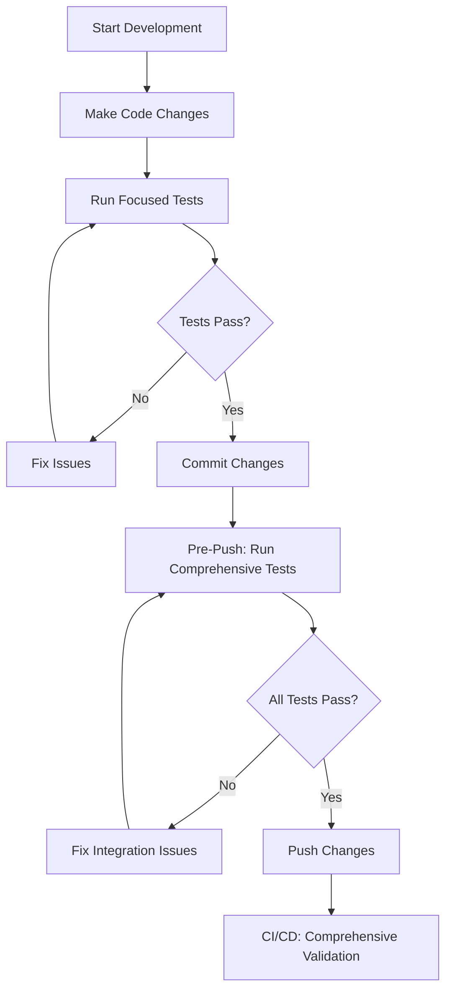

# Test Runner Usage Guide
## Developer Guide for Comprehensive and Focused Testing

---

### **Overview**

This guide provides comprehensive instructions for using the PatLang project's dual test runner system. The system includes both comprehensive test discovery for full validation and focused runners for rapid development feedback.

### **Quick Reference**

```bash
# Comprehensive Testing (All 70 Test Files)
ruby test/enhanced_comprehensive_test_suite_runner.rb

# Focused Testing (Phase-Specific)
ruby test/phase_1_test_runner.rb

# Health Check Only
ruby test/enhanced_comprehensive_test_suite_runner.rb --health-check

# Dry Run (Discovery Only)
ruby test/enhanced_comprehensive_test_suite_runner.rb --dry-run
```

---

## **Comprehensive Test Runner**

### **Purpose and Use Cases**

The [`enhanced_comprehensive_test_suite_runner.rb`](test/enhanced_comprehensive_test_suite_runner.rb) provides complete test coverage across all discovered test files.

#### **When to Use Comprehensive Runner**
✅ **Pre-release validation**: Complete system verification before releases  
✅ **Weekly health checks**: Regular comprehensive test suite validation  
✅ **CI/CD pipeline integration**: Automated full test coverage  
✅ **Post-deployment verification**: Ensuring system integrity after deployments  
✅ **Maintenance audits**: Regular test discovery and execution validation  
✅ **Investigation and debugging**: Complete picture of test suite health  

#### **When NOT to Use Comprehensive Runner**
❌ **Rapid development iterations**: Too slow for quick feedback loops  
❌ **Component-specific development**: Unnecessary overhead for focused work  
❌ **Quick validation**: Over-comprehensive for small changes  
❌ **Performance-sensitive environments**: Resource-intensive execution  

### **Basic Usage**

#### **Standard Execution**
```bash
# Run all discovered tests with full reporting
ruby test/enhanced_comprehensive_test_suite_runner.rb

# Expected Output:
# ================================================================================
#                     🚀 ENHANCED COMPREHENSIVE TEST SUITE RUNNER
# ================================================================================
# [14:15:45] Started at: 2025-06-17 14:15:45
# [14:15:45] Coverage tracking enabled with branch analysis
# [14:15:45] Individual test timeout: 30s
# [14:15:45] Total suite timeout: 600s
# [14:15:45] Enhanced dynamic test discovery enabled
```

#### **Command Line Options**
```bash
# Health Check Mode (Discovery + Quick Validation)
ruby test/enhanced_comprehensive_test_suite_runner.rb --health-check

# Dry Run Mode (Discovery Only, No Execution)
ruby test/enhanced_comprehensive_test_suite_runner.rb --dry-run

# Verbose Output Mode
ruby test/enhanced_comprehensive_test_suite_runner.rb --verbose

# Silent Mode (Minimal Output)
ruby test/enhanced_comprehensive_test_suite_runner.rb --silent
```

### **Understanding Output**

#### **Discovery Phase Output**
```bash
[14:15:45] 🔍 Enhanced dynamic test discovery...
[14:15:45]    Found 73 total test_*.rb files
[14:15:45]    Excluded 3 non-test files:
[14:15:45]      - test_helper.rb
[14:15:45]      - temp_test_runner.rb
[14:15:45]      - debug_test_analysis.rb
[14:15:45]    Legitimate test files: 70
[14:15:45] 📊 Dynamic categorization complete:
[14:15:45]    infrastructure: 16 test files
[14:15:45]    ruby_implementation: 15 test files
[14:15:45]    patlang_language: 20 test files
[14:15:45]    integration: 1 test files
[14:15:45]    helpers: 1 test files
[14:15:45]    branch_coverage: 2 test files
[14:15:45]    root_level: 4 test files
[14:15:45]    core: 11 test files
[14:15:45] 📊 Total test files to execute: 70
```

#### **Execution Results**
```bash
[14:15:52] 📊 ENHANCED COMPREHENSIVE TEST SUITE SUMMARY
[14:15:52] 📅 Completed: 2025-06-17T14:15:52+01:00
[14:15:52] ⏱️  Total Execution Time: 37.6s
[14:15:52] 🔍 Discovery Method: enhanced_dynamic
[14:15:52] 📁 Total Test Files: 70 (was 59)
[14:15:52] ✅ Passed: 28 (40.0%)
[14:15:52] ❌ Failed: 19
[14:15:52] 🚨 Errors: 23
```

#### **Coverage Analysis Output**
```bash
[14:15:52] 📊 ENHANCED COVERAGE ANALYSIS:
[14:15:52]    Line Coverage: 0.0%
[14:15:52]    Branch Coverage: N/A (Branch coverage data not available in this SimpleCov version)
[14:15:52]    Files with Low Coverage: 51
```

### **Generated Reports**

#### **JSON Report**
```bash
# Location: test/ENHANCED_COMPREHENSIVE_TEST_SUITE_REPORT.json
# Machine-readable detailed results for automation
{
  "summary": {
    "timestamp": "2025-06-17T14:15:52+01:00",
    "total_files": 70,
    "total_passed": 28,
    "total_failed": 19,
    "total_errors": 23,
    "success_rate": 40.0,
    "execution_time": 37.6
  },
  "discovery_stats": {
    "total_files_found": 73,
    "excluded_files": 3,
    "legitimate_test_files": 70,
    "categories_discovered": 8,
    "discovery_method": "enhanced_dynamic"
  }
}
```

#### **Markdown Report**
```bash
# Location: test/ENHANCED_COMPREHENSIVE_TEST_SUITE_REPORT.md
# Human-readable comprehensive analysis
```

#### **Coverage Report**
```bash
# Location: test/coverage/index.html
# Visual coverage analysis (when coverage integration is working)
```

---

## **Focused Test Runner**

### **Purpose and Use Cases**

The [`phase_1_test_runner.rb`](test/phase_1_test_runner.rb) provides rapid feedback for development iterations with focused test subsets.

#### **When to Use Focused Runner**
✅ **Development iterations**: Quick feedback during feature development  
✅ **Component testing**: Focus on specific areas of functionality  
✅ **Bug fix validation**: Targeted testing for issue resolution  
✅ **Performance-sensitive testing**: Faster execution for time-critical scenarios  
✅ **Debugging sessions**: Focused testing for investigation  
✅ **Local development**: Quick validation before committing  

#### **When NOT to Use Focused Runner**
❌ **Release validation**: Insufficient for comprehensive verification  
❌ **CI/CD pipelines**: Should use comprehensive testing  
❌ **Integration testing**: May miss cross-component issues  
❌ **Coverage analysis**: Limited scope for meaningful coverage metrics  

### **Basic Usage**

#### **Standard Execution**
```bash
# Run phase-specific test subset
ruby test/phase_1_test_runner.rb

# Expected Output:
# ================================================================================
#                           🚀 PHASE 1 TEST RUNNER
# ================================================================================
# [14:20:00] Started at: 2025-06-17 14:20:00
# [14:20:00] Running Phase 1 foundation tests
# [14:20:00] Individual test timeout: 30s
```

#### **Category-Specific Testing**
```bash
# Run tests from specific category
ruby test/run_category_tests.rb infrastructure
ruby test/run_category_tests.rb patlang_language
ruby test/run_category_tests.rb ruby_implementation
```

### **Performance Comparison**

```yaml
# Execution Time Comparison
comprehensive_runner:
  execution_time: ~37.6s
  test_files: 70
  coverage: Full project scope
  use_case: "Complete validation"

focused_runner:
  execution_time: ~5-15s
  test_files: 15-25 (subset)
  coverage: Component-specific
  use_case: "Development iteration"
```

---

## **Development Workflow Integration**

### **Recommended Development Workflow**



### **Git Integration**

#### **Pre-commit Hook**
```bash
#!/bin/bash
# .git/hooks/pre-commit

echo "Running focused test validation..."
ruby test/phase_1_test_runner.rb

if [ $? -ne 0 ]; then
    echo "❌ Focused tests failed. Commit aborted."
    exit 1
fi

echo "✅ Focused tests passed. Checking test discovery..."
ruby test/enhanced_comprehensive_test_suite_runner.rb --health-check

if [ $? -ne 0 ]; then
    echo "⚠️  Test discovery issues detected. Review before pushing."
fi
```

#### **Pre-push Hook**
```bash
#!/bin/bash
# .git/hooks/pre-push

echo "Running comprehensive test validation..."
ruby test/enhanced_comprehensive_test_suite_runner.rb

if [ $? -ne 0 ]; then
    echo "❌ Comprehensive tests failed. Push aborted."
    echo "Run: ruby test/enhanced_comprehensive_test_suite_runner.rb"
    echo "Review: test/ENHANCED_COMPREHENSIVE_TEST_SUITE_REPORT.md"
    exit 1
fi

echo "✅ All tests passed. Push approved."
```

### **IDE Integration**

#### **VS Code Tasks**
```json
// .vscode/tasks.json
{
  "version": "2.0.0",
  "tasks": [
    {
      "label": "Run Comprehensive Tests",
      "type": "shell",
      "command": "ruby",
      "args": ["test/enhanced_comprehensive_test_suite_runner.rb"],
      "group": "test",
      "presentation": {
        "echo": true,
        "reveal": "always",
        "focus": false,
        "panel": "shared"
      }
    },
    {
      "label": "Run Focused Tests",
      "type": "shell",
      "command": "ruby",
      "args": ["test/phase_1_test_runner.rb"],
      "group": "test",
      "presentation": {
        "echo": true,
        "reveal": "always",
        "focus": false,
        "panel": "shared"
      }
    },
    {
      "label": "Test Discovery Health Check",
      "type": "shell",
      "command": "ruby",
      "args": ["test/enhanced_comprehensive_test_suite_runner.rb", "--health-check"],
      "group": "test"
    }
  ]
}
```

#### **Keyboard Shortcuts**
```json
// .vscode/keybindings.json
[
  {
    "key": "ctrl+shift+t",
    "command": "workbench.action.tasks.runTask",
    "args": "Run Focused Tests"
  },
  {
    "key": "ctrl+shift+alt+t",
    "command": "workbench.action.tasks.runTask",
    "args": "Run Comprehensive Tests"
  }
]
```

---

## **Test File Organization**

### **Directory Structure Standards**

```
test/
├── infrastructure/          # Core system components (16 files)
│   ├── test_ast_nodes.rb
│   ├── test_lexer.rb
│   ├── test_parser.rb
│   └── ...
├── ruby_implementation/     # Ruby-specific implementations (15 files)
│   ├── test_object_model.rb
│   ├── test_string_operations.rb
│   └── ...
├── patlang_language/        # Language features (20 files)
│   ├── test_evaluator.rb
│   ├── test_function_syntax.rb
│   └── ...
├── integration/            # Cross-component tests (1 file)
│   └── test_unified_reasoning_integration.rb
├── helpers/                # Test utilities (1 file)
│   └── test_helper.rb
├── branch_coverage/        # Coverage validation (2 files)
│   └── ...
├── core/                   # Core functionality (11 files)
│   ├── test_ast_nodes_comprehensive.rb
│   └── test_lexer_comprehensive.rb
└── test_*.rb              # Root level tests (4 files)
```

### **Naming Conventions**

#### **Approved Patterns**
```yaml
# Standard Test Files
approved_patterns:
  - "test_*.rb"              # Primary test file pattern
  - "test_*_comprehensive.rb" # Comprehensive test variants
  - "test_*_edge_cases.rb"   # Edge case testing
  - "test_*_integration.rb"  # Integration testing
  - "test_*_stress.rb"       # Stress testing

# Helper and Utility Files
utility_patterns:
  - "test_helper.rb"         # Main test helper
  - "*_helper.rb"           # Specific helpers
  - "test_constants.rb"      # Test constants
```

#### **Prohibited Patterns**
```yaml
# Files Excluded from Test Discovery
excluded_patterns:
  - "*_runner.rb"           # Test runners
  - "*_analysis.rb"         # Analysis scripts
  - "diagnostic_*.rb"       # Diagnostic tools
  - "temp_*.rb"            # Temporary files
  - "debug_*.rb"           # Debug scripts
```

### **Adding New Tests**

#### **Test Creation Checklist**
- [ ] **Naming**: Use `test_*.rb` pattern
- [ ] **Location**: Place in appropriate category directory
- [ ] **Independence**: Ensure test can run in isolation
- [ ] **Cleanup**: Clean up any temporary resources
- [ ] **Documentation**: Include clear test descriptions
- [ ] **Discovery**: Verify discovered by enhanced runner

#### **Test Template**
```ruby
# test/category/test_new_feature.rb
require_relative '../helpers/test_helper'

class TestNewFeature < Minitest::Test
  def setup
    # Initialize test environment
  end

  def teardown
    # Clean up test resources
  end

  def test_basic_functionality
    # Test implementation
    assert_equal expected, actual
  end

  def test_edge_cases
    # Edge case testing
  end

  def test_error_handling
    # Error handling validation
  end
end
```

---

## **Troubleshooting**

### **Common Issues and Solutions**

#### **Test Discovery Problems**
```bash
# Issue: Tests not being discovered
# Solution: Verify file naming and location

# Check file discovery manually
find test/ -name "test_*.rb" | sort

# Run discovery diagnostic
ruby test/enhanced_comprehensive_test_suite_runner.rb --dry-run

# Validate exclusion patterns
ruby test/test_discovery_diagnostic.rb
```

#### **Execution Failures**
```bash
# Issue: Tests failing to execute
# Solution: Check load paths and dependencies

# Run single test in isolation
ruby -I. test/path/to/test_file.rb

# Check load path configuration
ruby -e "puts $LOAD_PATH"

# Validate test helper loading
ruby -r test/helpers/test_helper -e "puts 'Helper loaded successfully'"
```

#### **Performance Issues**
```bash
# Issue: Slow test execution
# Solution: Identify and optimize slow tests

# Profile test execution
ruby test/enhanced_comprehensive_test_suite_runner.rb --profile

# Identify slow tests
ruby test/slow_test_analyzer.rb

# Run subset for faster feedback
ruby test/phase_1_test_runner.rb
```

#### **Coverage Integration Problems**
```yaml
# Current Known Issue: 0.0% coverage despite test execution
coverage_troubleshooting:
  symptoms:
    - "Tests execute successfully"
    - "Coverage shows 0.0%"
    - "No source code coverage tracking"
  
  investigation_steps:
    - Check SimpleCov configuration
    - Verify load paths include source directories
    - Validate require statements in tests
    - Debug test-to-source connectivity
  
  workaround:
    - Focus on test execution health
    - Monitor test discovery and execution
    - Plan separate coverage integration investigation
```

### **Getting Help**

#### **Diagnostic Commands**
```bash
# Test suite health check
ruby test/enhanced_comprehensive_test_suite_runner.rb --health-check

# Discovery diagnostic
ruby test/test_discovery_diagnostic.rb

# Performance analysis
ruby test/test_performance_analyzer.rb

# Error pattern analysis
ruby test/error_pattern_analyzer.rb
```

#### **Support Resources**
- **Investigation Report**: [`TEST_SUITE_INVESTIGATION_REPORT.md`](TEST_SUITE_INVESTIGATION_REPORT.md)
- **Maintenance Guide**: [`TEST_SUITE_MAINTENANCE_GUIDE.md`](TEST_SUITE_MAINTENANCE_GUIDE.md)
- **Baseline Metrics**: [`TEST_SUITE_BASELINE_METRICS.md`](TEST_SUITE_BASELINE_METRICS.md)
- **Team Slack**: #test-suite-support
- **Documentation**: [`TEST_SUITE_DOCUMENTATION_AND_MAINTENANCE_PLAN.md`](TEST_SUITE_DOCUMENTATION_AND_MAINTENANCE_PLAN.md)

---

## **Best Practices**

### **Development Best Practices**
1. **Start with Focused**: Use focused runner during development iterations
2. **Validate Comprehensively**: Run comprehensive tests before pushing changes
3. **Monitor Discovery**: Check test discovery health regularly
4. **Follow Conventions**: Adhere to established naming and organization standards
5. **Clean Up**: Remove temporary test files and clean up resources

### **Test Organization Best Practices**
1. **Category Placement**: Place tests in appropriate category directories
2. **Descriptive Naming**: Use clear, descriptive test file names
3. **Independence**: Ensure tests can run independently
4. **Resource Management**: Clean up temporary files and state
5. **Documentation**: Include clear test purpose and methodology

### **Performance Best Practices**
1. **Appropriate Runner**: Choose appropriate runner for the task
2. **Resource Efficiency**: Design tests for efficient resource usage
3. **Timeout Awareness**: Keep individual tests under performance thresholds
4. **Parallel-Safe**: Design tests to be safe for parallel execution
5. **Profile Regularly**: Monitor and optimize test performance

---

## **Advanced Usage**

### **Custom Test Selection**
```ruby
# Custom test file selection
# File: test/custom_test_selector.rb

class CustomTestSelector
  def select_by_pattern(pattern)
    all_tests = Dir.glob("test/**/*test_*.rb")
    all_tests.select { |file| file.match?(pattern) }
  end

  def select_by_category(category)
    Dir.glob("test/#{category}/*test_*.rb")
  end

  def select_by_performance(max_time)
    # Select tests under performance threshold
    load_performance_data.select { |test| test.time < max_time }
  end
end
```

### **Test Result Analysis**
```ruby
# Analyze test results for patterns
# File: test/result_analyzer.rb

class ResultAnalyzer
  def analyze_failure_patterns(results)
    patterns = Hash.new(0)
    
    results.failures.each do |failure|
      error_type = classify_error(failure.error)
      patterns[error_type] += 1
    end
    
    patterns
  end

  def identify_flaky_tests(historical_results)
    # Identify tests with inconsistent results
    flaky_tests = []
    
    historical_results.group_by(&:test_name).each do |name, results|
      if results.map(&:status).uniq.length > 1
        flaky_tests << name
      end
    end
    
    flaky_tests
  end
end
```

---

## **Summary**

This guide provides comprehensive instructions for effectively using the PatLang project's dual test runner system. The key to success is choosing the appropriate runner for your specific use case:

- **Comprehensive Runner**: For complete validation, CI/CD integration, and release readiness
- **Focused Runner**: For rapid development feedback and component-specific testing

Following the established conventions for test organization and naming ensures that the enhanced test discovery system continues to work effectively, maintaining the comprehensive test coverage that was restored through the investigation and solution implementation.

---

**Document Author**: Code Mode Specialist  
**Last Updated**: June 17, 2025  
**Next Review**: September 17, 2025  
**Related Documents**:
- [`TEST_SUITE_INVESTIGATION_REPORT.md`](TEST_SUITE_INVESTIGATION_REPORT.md)
- [`TEST_SUITE_MAINTENANCE_GUIDE.md`](TEST_SUITE_MAINTENANCE_GUIDE.md)
- [`TEST_SUITE_BASELINE_METRICS.md`](TEST_SUITE_BASELINE_METRICS.md)
- [`enhanced_comprehensive_test_suite_runner.rb`](test/enhanced_comprehensive_test_suite_runner.rb)