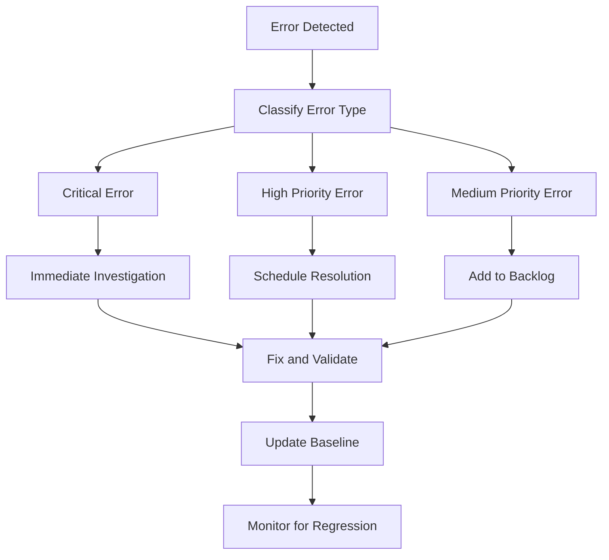

# Test Suite Maintenance Guide
## Long-term Strategy for Robust Test Coverage

---

### **Purpose**

This guide establishes comprehensive procedures and best practices for maintaining robust test suite coverage in the PatLang project. It ensures the test discovery solution remains effective and prevents recurrence of test coverage regression issues.

---

## **Maintenance Philosophy**

### **Core Principles**
1. **Proactive Monitoring**: Detect issues before they impact development
2. **Sustainable Automation**: Minimize manual intervention while maintaining control
3. **Continuous Improvement**: Regular assessment and enhancement of test processes
4. **Clear Accountability**: Defined roles and responsibilities for test suite health

### **Success Metrics**
- **Discovery Stability**: <2% variance in test file count week-over-week
- **Execution Health**: >60% test pass rate target (current baseline: 40%)
- **Response Time**: <1 hour average response to critical test suite alerts
- **Coverage Integrity**: Meaningful coverage metrics once integration is restored

---

## **Daily Maintenance Procedures**

### **Morning Health Check (Automated - 09:00)**
```yaml
# Daily Health Check Automation
daily_checks:
  file_discovery_validation:
    - Verify 70 test files discovered (±5% tolerance)
    - Check category distribution matches baseline
    - Validate exclusion patterns working correctly
  
  execution_health_assessment:
    - Monitor pass/fail rates vs. baseline
    - Identify new error patterns
    - Track performance regression indicators
  
  alert_status_review:
    - Review active alerts from previous 24 hours
    - Validate alert resolution status
    - Update alert thresholds if needed
```

#### **Health Check Script**
```bash
#!/bin/bash
# File: test_suite_daily_health_check.rb

# Execute comprehensive test discovery
ruby test/enhanced_fixed_comprehensive_coverage_runner.rb --health-check

# Generate daily report
ruby test/test_suite_health_reporter.rb --daily-summary

# Check against baseline metrics
ruby test/baseline_metric_validator.rb --validate-daily
```

### **Developer Integration Checks**
- **Pre-commit**: Validate new tests follow naming conventions
- **Pull Request**: Verify test discovery count doesn't decrease unexpectedly
- **Post-merge**: Confirm test suite health maintained after integration

---

## **Weekly Maintenance Procedures**

### **Monday Deep Analysis (10:00)**
```yaml
# Weekly Deep Analysis Tasks
weekly_analysis:
  discovery_effectiveness_audit:
    - Compare discovered files vs. manual filesystem analysis
    - Validate exclusion patterns haven't over-excluded
    - Check for new test directories or reorganization
  
  performance_trend_analysis:
    - Track execution time trends
    - Identify performance regression patterns
    - Assess resource usage optimization opportunities
  
  error_pattern_investigation:
    - Analyze recurring error types
    - Identify systematic issues requiring attention
    - Prioritize error resolution efforts
```

#### **Weekly Analysis Deliverables**
1. **Discovery Audit Report**: Test file discovery effectiveness assessment
2. **Performance Trend Summary**: Execution time and resource usage analysis
3. **Error Pattern Analysis**: Systematic error identification and prioritization
4. **Maintenance Recommendations**: Action items for upcoming week

### **Pattern Exclusion Review**
```ruby
# Weekly Exclusion Pattern Validation
# File: test/weekly_exclusion_audit.rb

def validate_exclusion_patterns
  # Find all test_*.rb files manually
  all_files = Dir.glob("test/**/*test_*.rb")
  
  # Run enhanced discovery
  discovered_files = EnhancedTestDiscovery.discover_files
  
  # Identify discrepancies
  missed_files = all_files - discovered_files
  
  # Generate audit report
  generate_exclusion_audit_report(missed_files)
end
```

---

## **Monthly Maintenance Procedures**

### **First Monday Strategic Review (14:00)**
```yaml
# Monthly Strategic Review Agenda
monthly_review:
  baseline_metric_updates:
    - Assess whether current baselines reflect project state
    - Update monitoring thresholds based on operational data
    - Adjust alert sensitivity for optimal signal-to-noise ratio
  
  discovery_algorithm_optimization:
    - Evaluate discovery algorithm effectiveness
    - Consider enhancements based on project evolution
    - Assess exclusion pattern refinement opportunities
  
  maintenance_procedure_effectiveness:
    - Review maintenance task completion rates
    - Assess procedure efficiency and accuracy
    - Identify automation enhancement opportunities
```

#### **Baseline Metric Review Process**
1. **Current State Analysis**: Comprehensive assessment of test suite health
2. **Trend Evaluation**: Review 30-day trends in key metrics
3. **Threshold Adjustment**: Update alert thresholds based on operational experience
4. **Documentation Update**: Revise baseline documentation to reflect current state

### **Infrastructure Health Assessment**
- **CI/CD Integration**: Verify test runners working properly in pipeline
- **Monitoring System**: Validate alert system functioning correctly
- **Dashboard Accuracy**: Ensure monitoring dashboard reflects actual state
- **Report Generation**: Confirm automated reports generating correctly

---

## **Test Discovery Maintenance**

### **File Naming Standards Enforcement**
```yaml
# Approved Test File Standards
naming_conventions:
  primary_pattern: "test_*.rb"
  directory_organization:
    infrastructure: "test/infrastructure/test_*.rb"
    ruby_implementation: "test/ruby_implementation/test_*.rb"
    patlang_language: "test/patlang_language/test_*.rb"
    integration: "test/integration/test_*.rb"
    helpers: "test/helpers/test_*.rb"
    branch_coverage: "test/branch_coverage/test_*.rb"
    root_level: "test/test_*.rb"
    core: "test/core/test_*.rb"
  
  prohibited_patterns:
    - "*_runner.rb" (use test/runners/ directory)
    - "*_analysis.rb" (use test/analysis/ directory)
    - "debug_*.rb" (use test/debug/ directory)
    - "temp_*.rb" (clean up temporary files)
```

### **New Test Integration Checklist**
- [ ] **File Naming**: Follows `test_*.rb` convention
- [ ] **Directory Placement**: Located in appropriate category directory
- [ ] **Discovery Validation**: Confirmed discovered by enhanced runner
- [ ] **Execution Verification**: Test runs successfully in isolation
- [ ] **Category Assignment**: Properly categorized by discovery algorithm

### **Exclusion Pattern Management**
```ruby
# Exclusion Pattern Change Control Process
# File: test/exclusion_pattern_manager.rb

class ExclusionPatternManager
  CURRENT_PATTERNS = [
    /test_helper\.rb$/,           # Helper files only
    /.*_runner\.rb$/,             # Test runners only  
    /.*_analysis\.rb$/,           # Analysis scripts only
    /diagnostic.*\.rb$/,          # Diagnostic scripts
    /temp_.*\.rb$/,               # Temporary files
    /debug_.*\.rb$/               # Debug scripts (not actual tests)
  ].freeze

  def validate_pattern_changes(new_patterns)
    # Test against known test files
    known_test_files = load_known_test_files
    
    # Ensure no legitimate tests excluded
    excluded_files = apply_exclusions(known_test_files, new_patterns)
    validate_no_legitimate_exclusions(excluded_files)
    
    # Generate impact report
    generate_pattern_change_report(new_patterns, excluded_files)
  end
end
```

---

## **Performance Monitoring and Optimization**

### **Performance Baseline Management**
```yaml
# Performance Baseline Metrics
performance_baselines:
  total_execution_time:
    current: 37.6s
    target: <45s
    critical: >60s
  
  per_test_average:
    current: 0.537s
    target: <1.0s
    critical: >2.0s
  
  slowest_test_threshold:
    current: 1.945s
    warning: >5.0s
    critical: >10.0s
  
  timeout_tolerance:
    acceptable: 0 timeouts/week
    warning: >1 timeout/week
    critical: >3 timeouts/week
```

### **Performance Optimization Procedures**
1. **Trend Monitoring**: Track execution time trends over time
2. **Regression Detection**: Alert on >20% execution time increases
3. **Optimization Identification**: Identify tests consistently exceeding thresholds
4. **Resource Analysis**: Monitor CPU and memory usage during test execution

### **Slow Test Management**
```ruby
# Slow Test Identification and Management
# File: test/slow_test_manager.rb

def identify_slow_tests(threshold = 5.0)
  test_results = load_latest_test_results
  
  slow_tests = test_results.select do |test|
    test.execution_time > threshold
  end
  
  generate_slow_test_report(slow_tests)
  recommend_optimization_strategies(slow_tests)
end
```

---

## **Error Management and Resolution**

### **Error Classification System**
```yaml
# Error Type Classification and Priorities
error_classification:
  critical_errors:
    - syntax_error: "Immediate fix required"
    - load_error: "High priority - affects test execution"
    - timeout: "Infrastructure issue - investigate immediately"
  
  high_priority_errors:
    - undefined_method: "Missing implementation - development priority"
    - uninitialized_constant: "Architecture issue - design review needed"
    - argument_error: "API compatibility issue - fix required"
  
  medium_priority_errors:
    - unknown_error: "Requires investigation and classification"
    - name_error: "Naming consistency issue - refactoring opportunity"
```

### **Error Resolution Workflow**


### **Error Resolution Tracking**
- **Error Database**: Maintain record of all identified errors
- **Resolution Status**: Track progress on error fixes
- **Pattern Analysis**: Identify recurring error patterns
- **Prevention Strategies**: Develop procedures to prevent error recurrence

---

## **Coverage Integration Maintenance**

### **Current Coverage Issues (Follow-up Required)**
```yaml
# Coverage Integration Status
coverage_status:
  current_state: "0.0% coverage despite test execution"
  identified_issues:
    - SimpleCov configuration problems
    - Load path integration issues
    - Test-to-source connectivity problems
  
  maintenance_procedures:
    - Weekly coverage integration status check
    - Monitoring for coverage system restoration
    - Alert when coverage metrics become available
```

### **Future Coverage Maintenance (Post-Integration)**
Once coverage integration is restored, implement:
- **Coverage Threshold Monitoring**: Alert on coverage decreases
- **File-level Coverage Tracking**: Monitor individual file coverage
- **Branch Coverage Analysis**: Ensure comprehensive logical path testing
- **Coverage Trend Analysis**: Track coverage improvements over time

---

## **Monitoring and Alerting Maintenance**

### **Alert Threshold Management**
```yaml
# Alert Threshold Configuration Management
alert_thresholds:
  discovery_alerts:
    file_count_critical: 65  # 70 baseline - 7% tolerance
    file_count_warning: 67   # 70 baseline - 4% tolerance
    
  execution_alerts:
    pass_rate_critical: 30   # Current baseline: 40%
    pass_rate_warning: 35
    
  performance_alerts:
    execution_time_warning: 45s   # Current: 37.6s
    execution_time_critical: 60s
```

### **Alert System Maintenance**
- **Weekly Alert Review**: Assess alert frequency and accuracy
- **Threshold Calibration**: Adjust thresholds based on operational experience
- **False Positive Reduction**: Minimize noise while maintaining sensitivity
- **Escalation Path Validation**: Ensure alerts reach appropriate personnel

### **Dashboard Maintenance**
- **Data Accuracy Validation**: Verify dashboard reflects actual test suite state
- **Metric Relevance Review**: Ensure displayed metrics provide actionable insights
- **User Experience Optimization**: Streamline dashboard for effective monitoring
- **Historical Data Retention**: Maintain appropriate historical data for trend analysis

---

## **Team Integration and Training**

### **Developer Onboarding**
```yaml
# New Developer Test Suite Training
onboarding_checklist:
  - Understanding dual runner system (comprehensive vs. focused)
  - Test file naming and organization standards
  - Using enhanced comprehensive test suite runner
  - Interpreting test results and reports
  - Following maintenance procedures
  - Understanding monitoring and alerting system
```

### **Ongoing Team Education**
- **Monthly Training Sessions**: Keep team updated on test suite enhancements
- **Best Practice Sharing**: Share effective test development practices
- **Tool Updates**: Train team on new tools and capabilities
- **Process Improvements**: Communicate maintenance procedure updates

### **Role Responsibilities**
```yaml
# Team Role Definitions
roles:
  test_suite_maintainer:
    - Execute weekly deep analysis
    - Manage exclusion pattern updates
    - Coordinate error resolution efforts
    - Maintain monitoring thresholds
  
  development_team:
    - Follow test naming conventions
    - Monitor daily health check results
    - Report test suite issues promptly
    - Participate in error resolution
  
  tech_leads:
    - Review monthly strategic assessments
    - Approve baseline metric updates
    - Coordinate infrastructure improvements
    - Oversee maintenance effectiveness
```

---

## **Continuous Improvement Process**

### **Quarterly Assessment Cycle**
1. **Effectiveness Review**: Assess maintenance procedure effectiveness
2. **Process Optimization**: Identify automation and efficiency opportunities
3. **Tool Evaluation**: Consider new tools and technologies
4. **Strategy Refinement**: Update maintenance strategy based on lessons learned

### **Innovation and Enhancement**
- **Discovery Algorithm Improvements**: Enhance test discovery capabilities
- **Performance Optimization**: Continuous test execution performance improvement
- **Monitoring Enhancement**: Expand monitoring capabilities and insights
- **Integration Expansion**: Better CI/CD and development workflow integration

### **Feedback Loop Implementation**
- **Developer Feedback**: Regular collection of team feedback on test processes
- **Process Refinement**: Continuous improvement based on operational experience
- **Documentation Updates**: Keep maintenance procedures current and accurate
- **Best Practice Evolution**: Develop and share improved practices

---

## **Emergency Procedures**

### **Test Suite Failure Response**
```yaml
# Emergency Response Procedures
emergency_response:
  discovery_failure:
    immediate_action: "Run diagnostic discovery audit"
    escalation_threshold: "File count drop >10%"
    recovery_procedure: "Restore to last known good configuration"
  
  execution_failure:
    immediate_action: "Isolate failing components"
    escalation_threshold: "Pass rate drop >20%"
    recovery_procedure: "Rollback recent changes if necessary"
  
  performance_degradation:
    immediate_action: "Performance profiling activation"
    escalation_threshold: "Execution time increase >100%"
    recovery_procedure: "Identify and resolve performance bottlenecks"
```

### **Escalation Contacts**
- **Primary**: Test Suite Maintainer
- **Secondary**: Tech Lead
- **Final**: Engineering Manager
- **Communication**: Team Slack channel + email notifications

---

## **Documentation Maintenance**

### **Documentation Update Schedule**
- **Weekly**: Update current state metrics in baseline documentation
- **Monthly**: Refresh maintenance procedure effectiveness assessment
- **Quarterly**: Comprehensive documentation review and updates
- **As Needed**: Update procedures when processes change

### **Documentation Quality Standards**
- **Accuracy**: All procedures tested and validated
- **Completeness**: Comprehensive coverage of maintenance scenarios
- **Clarity**: Clear, actionable instructions for all team members
- **Currency**: Regular updates to reflect current state and practices

---

## **Success Measurement**

### **Key Performance Indicators**
```yaml
# Maintenance Success Metrics
kpis:
  reliability:
    - Test discovery stability: >98%
    - Alert system uptime: >99.5%
    - False positive rate: <5%
  
  efficiency:
    - Mean time to resolution: <4 hours
    - Automated task percentage: >70%
    - Manual intervention frequency: <5/month
  
  effectiveness:
    - Issue prevention rate: >80%
    - Team satisfaction: >4.0/5.0
    - Process adherence: >95%
```

### **Quarterly Review Process**
1. **Metric Collection**: Gather KPI data for assessment period
2. **Trend Analysis**: Identify improvement or degradation trends
3. **Action Planning**: Develop specific improvement actions
4. **Goal Setting**: Establish targets for next quarter

---

## **Conclusion**

This maintenance guide provides comprehensive procedures for ensuring long-term test suite health and preventing recurrence of test coverage regression issues. Regular adherence to these procedures will maintain the effectiveness of the enhanced test discovery solution and support continuous improvement of the test suite infrastructure.

**Key Success Factors:**
- Consistent execution of maintenance procedures
- Proactive monitoring and early issue detection
- Continuous improvement based on operational experience
- Strong team collaboration and clear role accountability

**Strategic Value:**
- Sustainable test suite health with minimal manual intervention
- Early detection and prevention of test coverage issues
- Continuous optimization of test processes and performance
- Foundation for scaling test infrastructure as project grows

---

**Document Owner**: Code Mode Specialist  
**Last Updated**: June 17, 2025  
**Next Review**: September 17, 2025  
**Related Documents**:
- [`TEST_SUITE_INVESTIGATION_REPORT.md`](TEST_SUITE_INVESTIGATION_REPORT.md)
- [`TEST_SUITE_DOCUMENTATION_AND_MAINTENANCE_PLAN.md`](TEST_SUITE_DOCUMENTATION_AND_MAINTENANCE_PLAN.md)
- [`TEST_RUNNER_USAGE_GUIDE.md`](TEST_RUNNER_USAGE_GUIDE.md)