# PATLang Systems Architecture

## Executive Summary

PATLang is a sophisticated multi-paradigm programming language that combines object-oriented programming, event-driven architecture, and advanced reasoning systems. This document provides a comprehensive overview of the current implementation architecture and the planned unified reasoning system that will integrate Type Inference, Goal-Oriented Programming, and Logic Programming paradigms.

## Table of Contents

1. [Current Implementation Architecture](#current-implementation-architecture)
2. [Planned Unified Reasoning Architecture](#planned-unified-reasoning-architecture)
3. [Component Specifications](#component-specifications)
4. [Integration Patterns](#integration-patterns)
5. [Future Roadmap](#future-roadmap)

## Current Implementation Architecture

### Overview

The current PATLang architecture follows a traditional compiler pipeline with modern modular design principles. The system is built around a core object model with event-driven coordination and reasoning capabilities.

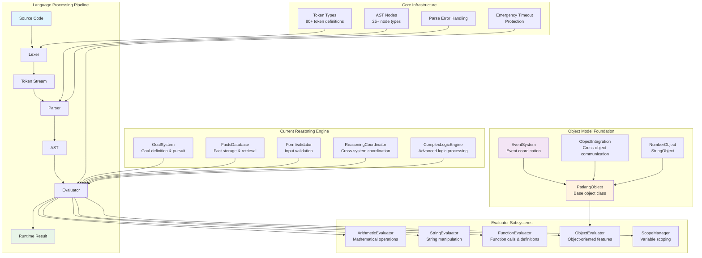

### Lexical Analysis Layer

The [`Lexer`](../../patlang-core/lexer/lexer.rb:1) component provides comprehensive tokenization with support for:

- **80+ Token Types**: Complete coverage from basic arithmetic to advanced reasoning constructs
- **Position Tracking**: Line and column information for error reporting
- **Comment Handling**: Single-line comments with `#` syntax
- **Number Recognition**: Both integer and floating-point literals
- **String Literals**: Quoted string support with escape sequences
- **Keyword Recognition**: Natural language keywords like `make`, `call`, `with`

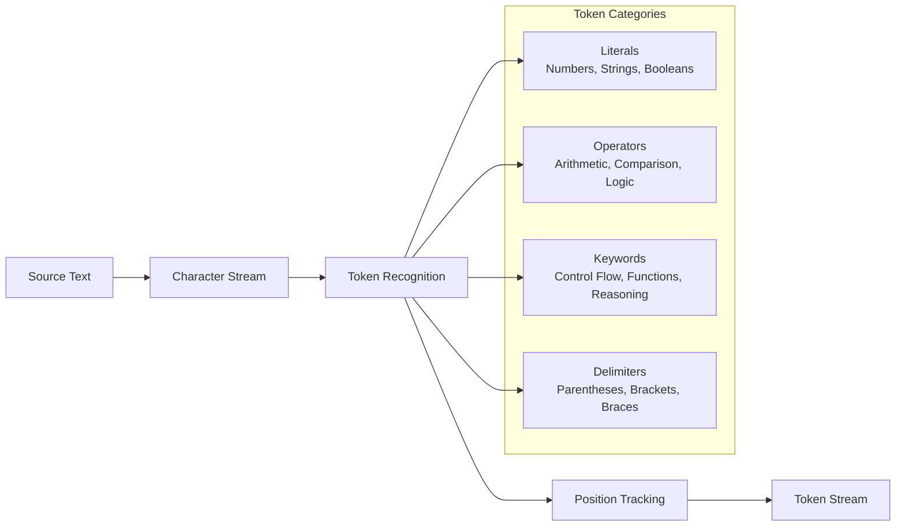

### Parsing Architecture

The [`Parser`](../../patlang-core/parser/parser.rb:1) implements a modular recursive descent parser with specialized sub-parsers:

- **TokenResolver**: Handles ambiguous token resolution
- **ExpressionParser**: Arithmetic and boolean expressions
- **FunctionParser**: Function definition and call parsing
- **ControlFlowParser**: If/while/return statement parsing

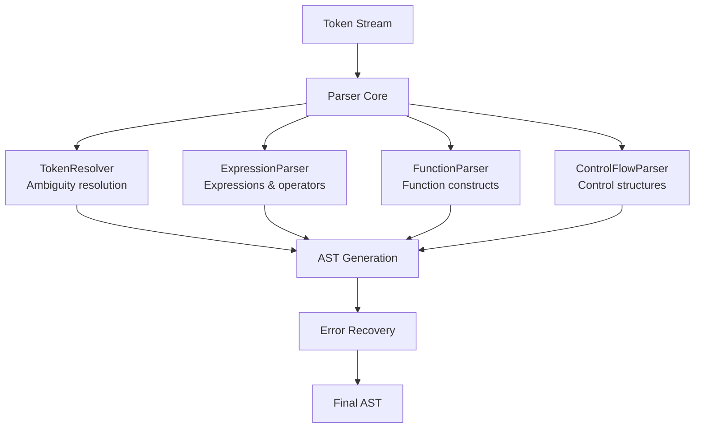

### Abstract Syntax Tree (AST)

The AST system provides 25+ node types covering all language constructs:

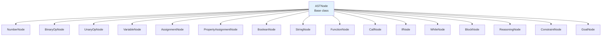

### Evaluation Engine

The [`Evaluator`](../../patlang-core/evaluator/evaluator.rb:1) orchestrates execution through specialized modules:

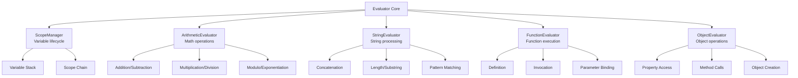

## Planned Unified Reasoning Architecture

### Vision

The unified reasoning system will integrate three paradigms into a cohesive framework:

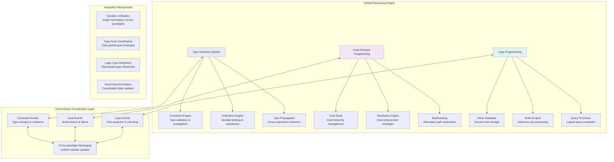

### Type Inference System

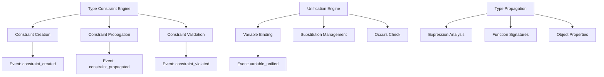

### Goal-Oriented Programming

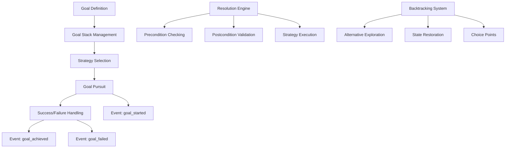

### Logic Programming

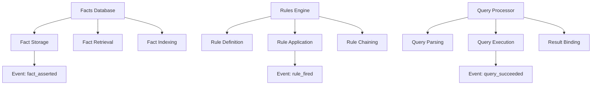

## Component Specifications

### EventSystem Architecture

The [`EventSystem`](../../patlang-core/object_model/event_system.rb:1) provides the coordination backbone:

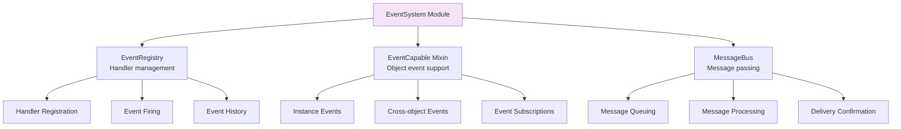

### Object Model Foundation

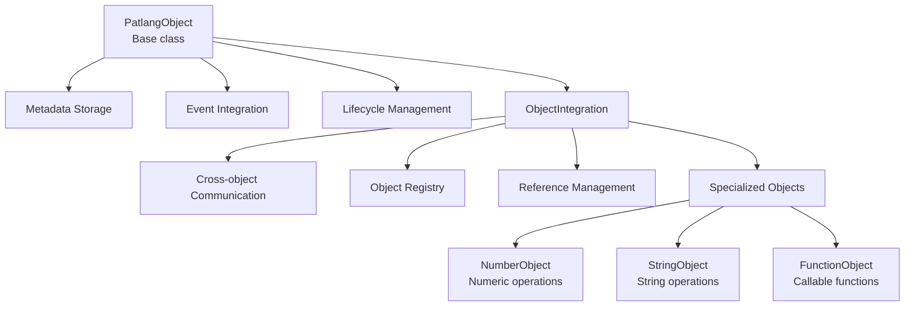

### Parser Modules

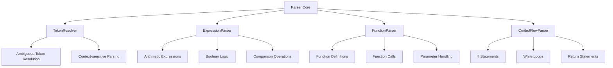

## Integration Patterns

### Event-Driven Coordination

The system uses events for loose coupling between components:

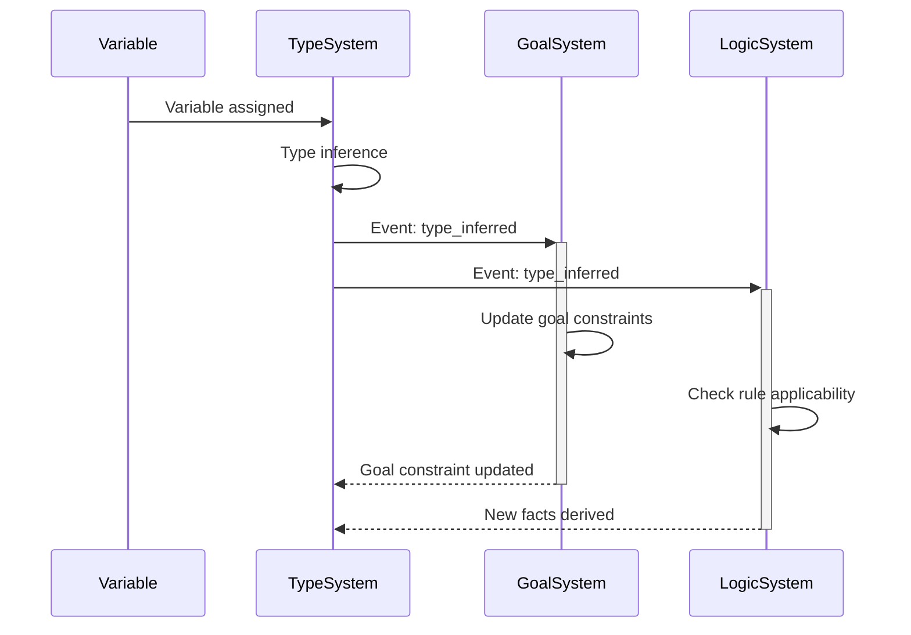

### Cross-Paradigm Communication

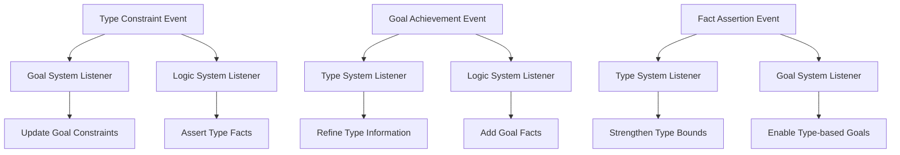

### Unified Variable Management

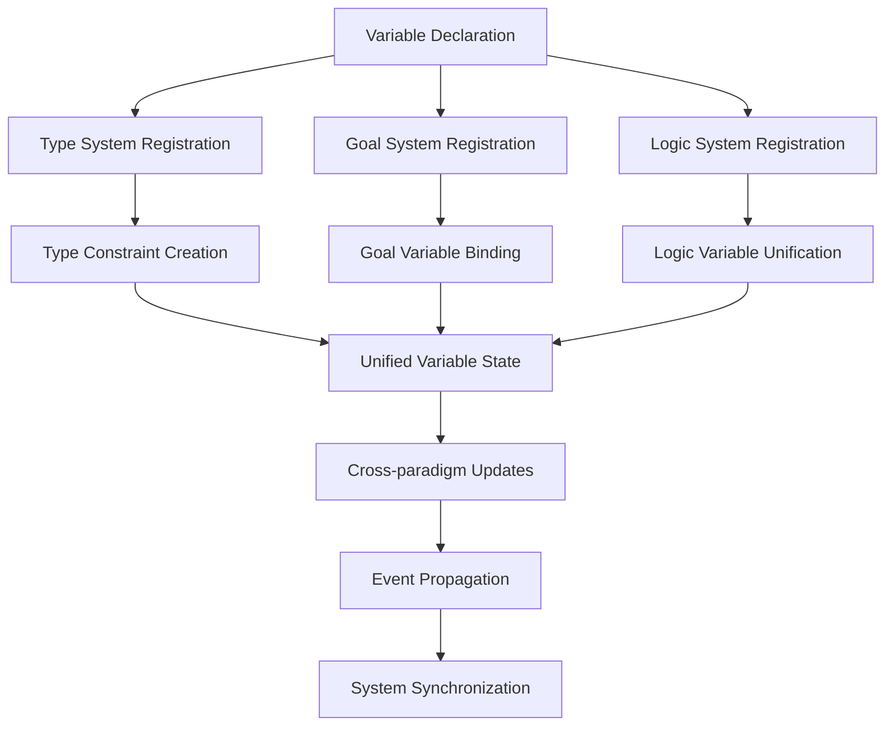

## Performance Considerations

### Timeout Protection

The system includes comprehensive timeout protection:

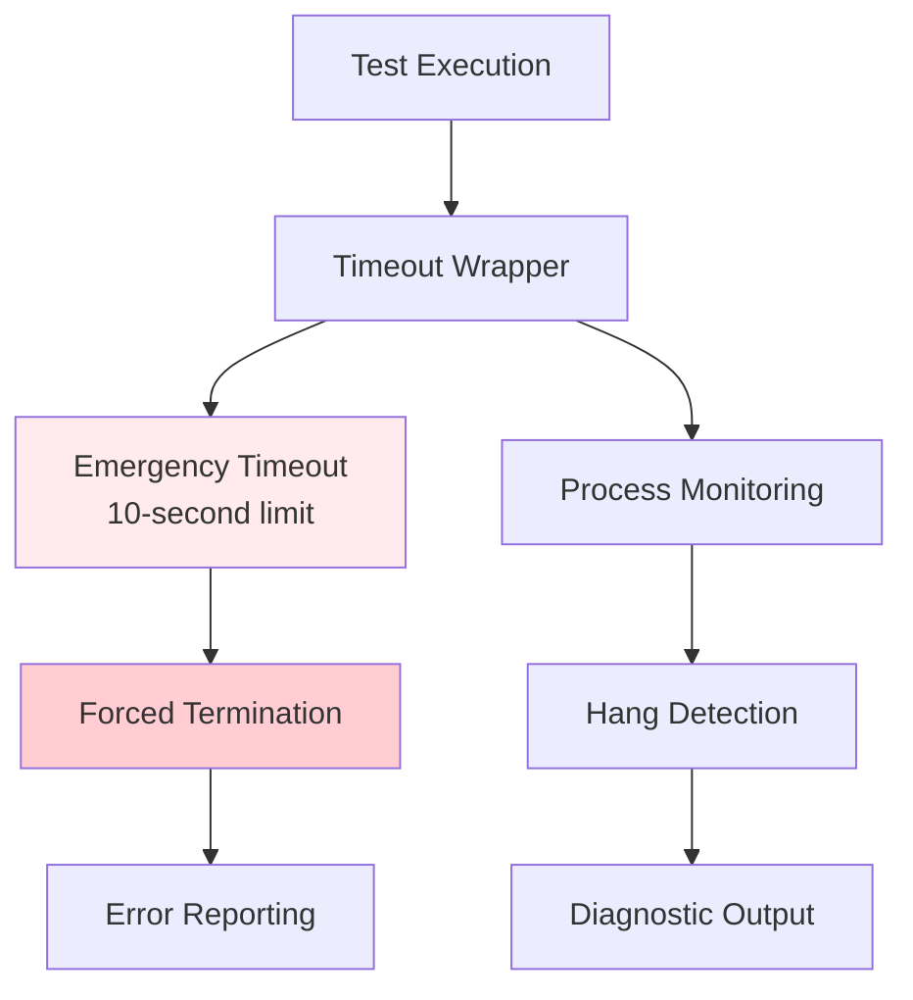

### Memory Management

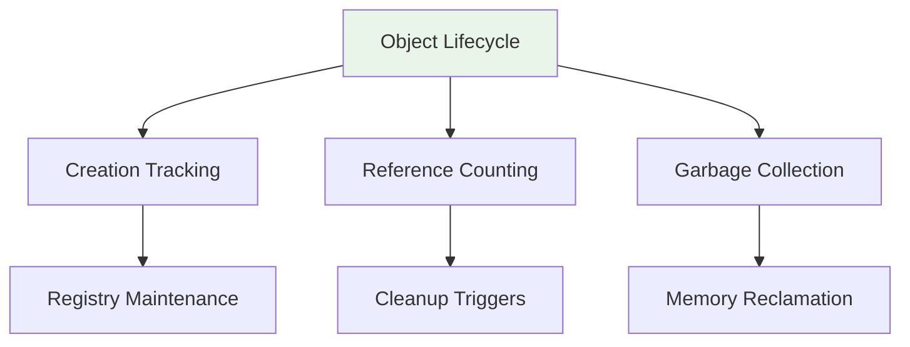

## Future Roadmap

### Phase 1: Enhanced Type System
- Complete type constraint implementation
- Unification engine deployment
- Type inference integration

### Phase 2: Goal System Integration
- Goal stack implementation
- Strategy pattern deployment
- Backtracking mechanism

### Phase 3: Logic Programming Foundation
- Enhanced facts database
- Rules engine completion
- Query processor optimization

### Phase 4: Unified Coordination
- Cross-paradigm event system
- Performance optimization
- Production deployment

## Component Cross-References

- **Lexer Implementation**: [`patlang-core/lexer/lexer.rb`](../../patlang-core/lexer/lexer.rb:1)
- **Parser Core**: [`patlang-core/parser/parser.rb`](../../patlang-core/parser/parser.rb:1)
- **AST Definitions**: [`patlang-core/ast/ast_nodes.rb`](../../patlang-core/ast/ast_nodes.rb:1)
- **Evaluator Engine**: [`patlang-core/evaluator/evaluator.rb`](../../patlang-core/evaluator/evaluator.rb:1)
- **Object Model**: [`patlang-core/object_model/patlang_object.rb`](../../patlang-core/object_model/patlang_object.rb:1)
- **Event System**: [`patlang-core/object_model/event_system.rb`](../../patlang-core/object_model/event_system.rb:1)
- **Reasoning Coordinator**: [`patlang-core/reasoning/reasoning_coordinator.rb`](../../patlang-core/reasoning/reasoning_coordinator.rb:1)
- **Goal System**: [`patlang-core/reasoning/goal_system.rb`](../../patlang-core/reasoning/goal_system.rb:1)

## Conclusion

PATLang's architecture represents a sophisticated integration of multiple programming paradigms with a strong foundation in object-oriented design and event-driven coordination. The planned unified reasoning system will position PATLang as a leading platform for multi-paradigm programming with advanced reasoning capabilities.

The modular design ensures maintainability and extensibility while the event-driven architecture provides the flexibility needed for complex reasoning operations. The comprehensive timeout protection and error handling systems ensure robust production deployment.