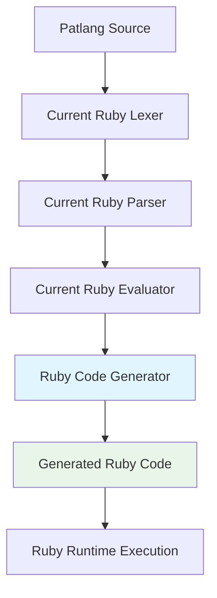
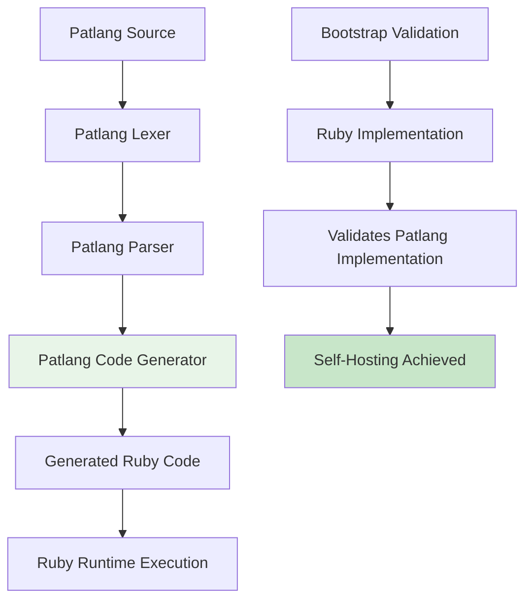
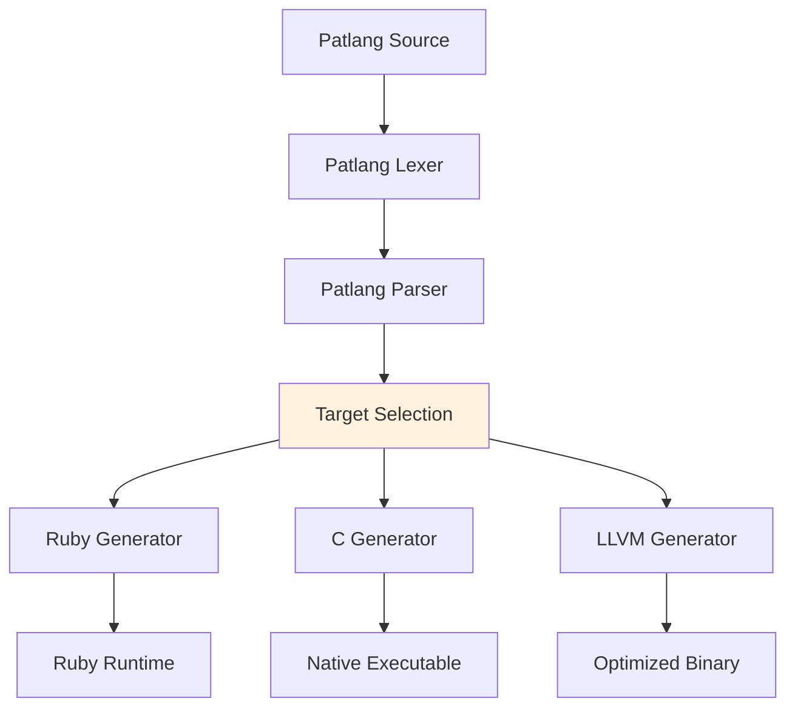

# Patlang Compilation Strategy Analysis

## Executive Summary

This document provides a comprehensive analysis of compilation approaches for Patlang, evaluating multiple target platforms and strategic paths to self-hosting. Based on current implementation progress and strategic objectives, **Ruby transpilation** is recommended as the primary approach for achieving self-hosting by v0.9.0.

**Strategic Recommendation**: Ruby transpilation for fastest self-hosting path  
**Timeline**: 2-3 weeks to basic transpilation vs. 3-6 months for native compilation  
**Risk Assessment**: Very low risk with proven Ruby runtime foundation  

## 1. Compilation Target Analysis

### 1.1 Ruby Transpilation (RECOMMENDED)

**Strategic Rationale**: Leverages existing 95%+ compatible Ruby codebase for fastest self-hosting path.

#### Advantages
- ✅ **Minimal Implementation Time**: 2-3 weeks vs. months for other approaches
- ✅ **Existing Codebase Leverage**: Current Ruby implementation provides direct translation patterns
- ✅ **Mature Runtime**: Ruby VM is battle-tested and performant
- ✅ **Rich Ecosystem**: Access to Ruby gems and development tools
- ✅ **Low Risk**: Proven technology stack with predictable outcomes
- ✅ **Debugging Support**: Excellent tooling for generated Ruby code
- ✅ **Cross-Platform**: Ruby runs on all major platforms

#### Disadvantages
- ⚠️ **Runtime Dependency**: Requires Ruby installation
- ⚠️ **Performance Overhead**: Interpreted language performance characteristics
- ⚠️ **Deployment Complexity**: Ruby ecosystem dependencies

#### Implementation Strategy
```patlang
# Patlang source
make a function called calculate {
  calculate takes:
    x - number
    y - number
  calculate returns:
    x + y * 2
}

result = calculate(5, 3)
```

Transpiles to:
```ruby
# Generated Ruby
def calculate(x, y)
  # Runtime type checking
  raise TypeError, "Expected number for 'x'" unless x.is_a?(Numeric)
  raise TypeError, "Expected number for 'y'" unless y.is_a?(Numeric)
  
  x + y * 2
end

# Function object wrapper for Patlang semantics
CALCULATE_FUNCTION = {
  name: "calculate",
  parameter_count: 2,
  call: method(:calculate)
}

# Generated call
result = calculate(5, 3)
```

#### Performance Characteristics
- **Startup Time**: Fast (Ruby VM initialization)
- **Execution Speed**: Good (Ruby performance baseline)
- **Memory Usage**: Moderate (Ruby object overhead)
- **Compilation Speed**: Excellent (direct text transformation)

### 1.2 C Compilation

**Strategic Position**: Post-v1.0.0 optimization target for performance-critical applications.

#### Advantages
- ✅ **Excellent Performance**: Native code execution speed
- ✅ **Minimal Dependencies**: System libc only
- ✅ **Small Runtime**: Compact executable size
- ✅ **Universal Compatibility**: GCC/Clang toolchain availability
- ✅ **Memory Efficiency**: Direct memory management
- ✅ **Debugging Support**: GDB and standard tools

#### Disadvantages
- ⚠️ **Implementation Complexity**: 2-3 months development time
- ⚠️ **Memory Management**: Manual allocation/deallocation required
- ⚠️ **Platform Specifics**: Architecture-specific considerations
- ⚠️ **Debugging Difficulty**: Source-level debugging complexity

#### Implementation Strategy
```c
// Generated C code
typedef struct {
    char* name;
    int parameter_count;
    void* (*call)(void**, int);
} patlang_function_t;

double calculate(double x, double y) {
    return x + y * 2.0;
}

patlang_function_t CALCULATE_FUNCTION = {
    .name = "calculate",
    .parameter_count = 2,
    .call = (void*(*)(void**, int))calculate
};
```

#### Performance Characteristics
- **Startup Time**: Excellent (native executable)
- **Execution Speed**: Excellent (optimized native code)
- **Memory Usage**: Excellent (minimal overhead)
- **Compilation Speed**: Moderate (C compilation time)

### 1.3 LLVM/Native Machine Code

**Strategic Position**: Ultimate performance target for v2.0+ enterprise applications.

#### Advantages
- ✅ **Maximum Performance**: Highly optimized machine code
- ✅ **Advanced Optimizations**: LLVM optimization passes
- ✅ **Cross-Platform**: LLVM targets multiple architectures
- ✅ **Modern Toolchain**: Excellent debugging and profiling support
- ✅ **Industry Standard**: Used by major language implementations

#### Disadvantages
- ⚠️ **High Complexity**: 4-6 months implementation time
- ⚠️ **LLVM Dependency**: Large toolchain requirement
- ⚠️ **Implementation Difficulty**: Complex IR generation
- ⚠️ **Debugging Complexity**: LLVM IR understanding required

#### Implementation Strategy
```llvm
; Generated LLVM IR
define double @calculate(double %x, double %y) {
entry:
  %mult = fmul double %y, 2.0
  %result = fadd double %x, %mult
  ret double %result
}

@CALCULATE_FUNCTION = global { i8*, i32, i8* } {
  i8* getelementptr ([10 x i8], [10 x i8]* @.str.calculate, i32 0, i32 0),
  i32 2,
  i8* bitcast (double (double, double)* @calculate to i8*)
}
```

#### Performance Characteristics
- **Startup Time**: Excellent (native executable)
- **Execution Speed**: Outstanding (LLVM optimizations)
- **Memory Usage**: Excellent (optimized memory layout)
- **Compilation Speed**: Slow (LLVM optimization passes)

### 1.4 .NET IL Compilation

**Strategic Position**: Windows/Enterprise ecosystem integration target.

#### Advantages
- ✅ **Enterprise Integration**: Seamless .NET ecosystem compatibility
- ✅ **Excellent Tooling**: Visual Studio and .NET debugging tools
- ✅ **Cross-Platform**: .NET 6+ runs on Windows, Linux, macOS
- ✅ **JIT Performance**: Runtime optimization benefits
- ✅ **Rich Libraries**: Access to .NET Base Class Library
- ✅ **Memory Management**: Automatic garbage collection

#### Disadvantages
- ⚠️ **Platform Dependency**: Requires .NET runtime
- ⚠️ **Implementation Time**: 3-4 months development
- ⚠️ **Runtime Size**: Large runtime footprint
- ⚠️ **Learning Curve**: IL generation complexity

#### Implementation Strategy
```csharp
// Generated C# (compiled to IL)
public static class PatlangFunctions {
    public static double Calculate(double x, double y) {
        return x + y * 2.0;
    }
}

public class FunctionObject {
    public string Name { get; set; }
    public int ParameterCount { get; set; }
    public Delegate Call { get; set; }
}

var CALCULATE_FUNCTION = new FunctionObject {
    Name = "calculate",
    ParameterCount = 2,
    Call = (Func<double, double, double>)PatlangFunctions.Calculate
};
```

#### Performance Characteristics
- **Startup Time**: Moderate (.NET runtime initialization)
- **Execution Speed**: Excellent (JIT optimization)
- **Memory Usage**: Moderate (.NET object overhead)
- **Compilation Speed**: Good (C# to IL compilation)

### 1.5 JVM Bytecode Compilation

**Strategic Position**: Java ecosystem integration and enterprise deployment.

#### Advantages
- ✅ **Enterprise Adoption**: Java ecosystem compatibility
- ✅ **JVM Performance**: Mature JIT compilation
- ✅ **Cross-Platform**: Write once, run anywhere
- ✅ **Rich Ecosystem**: Access to Java libraries
- ✅ **Excellent Tooling**: IDE support and debugging tools
- ✅ **Memory Management**: Automatic garbage collection

#### Disadvantages
- ⚠️ **JVM Dependency**: Requires Java runtime
- ⚠️ **Implementation Time**: 3-4 months development
- ⚠️ **Memory Overhead**: JVM memory requirements
- ⚠️ **Startup Time**: JVM initialization cost

#### Implementation Strategy
```java
// Generated Java (compiled to bytecode)
public class PatlangFunctions {
    public static double calculate(double x, double y) {
        return x + y * 2.0;
    }
}

public class FunctionObject {
    private String name;
    private int parameterCount;
    private Method method;
    
    public FunctionObject(String name, int parameterCount, Method method) {
        this.name = name;
        this.parameterCount = parameterCount;
        this.method = method;
    }
}
```

#### Performance Characteristics
- **Startup Time**: Slow (JVM initialization)
- **Execution Speed**: Excellent (HotSpot optimization)
- **Memory Usage**: High (JVM overhead)
- **Compilation Speed**: Good (javac compilation)

## 2. Compilation Approach Comparison Matrix

| Approach | Implementation Time | Performance | Ecosystem | Dependencies | Self-Hosting Risk | Strategic Fit |
|----------|-------------------|-------------|-----------|--------------|-------------------|---------------|
| **Ruby Transpilation** | **2-3 weeks** | Good | Excellent | Ruby | **Very Low** | **Perfect** |
| C Compilation | 2-3 months | Excellent | Good | libc/gcc | Medium | Future |
| LLVM/Native | 4-6 months | Outstanding | Limited | LLVM | High | Long-term |
| .NET IL | 3-4 months | Excellent | Excellent | .NET | Medium | Enterprise |
| JVM Bytecode | 3-4 months | Excellent | Excellent | JVM | Medium | Enterprise |

### Evaluation Criteria

#### 1. Time to Self-Hosting
- **Ruby**: 2-3 weeks (immediate impact)
- **Others**: 3-6 months (delayed self-hosting)

#### 2. Implementation Risk
- **Ruby**: Very low (proven patterns)
- **C/LLVM**: Medium to high (complex implementation)
- **.NET/JVM**: Medium (platform learning curve)

#### 3. Strategic Alignment
- **Ruby**: Perfect for current development velocity
- **Others**: Better for specific deployment scenarios

#### 4. Development Velocity
- **Ruby**: Maintains current rapid iteration
- **Others**: Significant development slowdown

## 3. Self-Hosting Bootstrap Process

### 3.1 Ruby Transpilation Bootstrap

**Phase 1: Direct Translation (Current → v0.9.0)**


**Phase 2: Self-Hosted Transpilation (v0.9.0+)**


**Phase 3: Alternative Target Support (v1.0+)**


### 3.2 Cross-Validation Strategy

```ruby
# Bootstrap validation approach
def validate_self_hosting
  # 1. Ruby implementation generates reference output
  ruby_result = ruby_patlang_interpreter.execute(source_code)
  
  # 2. Patlang implementation generates transpiled Ruby
  patlang_ruby_code = patlang_transpiler.transpile(source_code)
  transpiled_result = ruby_runtime.execute(patlang_ruby_code)
  
  # 3. Compare outputs for correctness
  assert_equal(ruby_result, transpiled_result)
  
  # 4. Performance benchmarking
  benchmark_transpilation_overhead(source_code)
end
```

### 3.3 Bootstrap Timeline

| Phase | Target Version | Duration | Milestone |
|-------|----------------|----------|-----------|
| Foundation Complete | v0.5.0 | ✅ Complete | Function implementation |
| Arrays/Collections | v0.6.0 | 3-4 weeks | Token/AST storage |
| File I/O | v0.7.0 | 3-4 weeks | Source file processing |
| Object System | v0.8.0 | 4-5 weeks | Clean AST hierarchy |
| **Self-Hosting Prototype** | **v0.9.0** | **3-4 weeks** | **Ruby transpilation** |
| Production Self-Hosting | v1.0.0 | 4-5 weeks | Optimization & polish |

## 4. Strategic Recommendations

### 4.1 Primary Recommendation: Ruby Transpilation First

**Rationale:**
1. **Immediate Self-Hosting**: Achieves strategic milestone in 2-3 weeks
2. **Proven Foundation**: 95%+ codebase compatibility with existing Ruby implementation
3. **Risk Mitigation**: Low-risk approach with predictable outcomes
4. **Development Velocity**: Maintains rapid iteration and feature development
5. **Future Flexibility**: Enables alternative targets post-self-hosting

**Implementation Priority:**
1. Complete v0.5.0 Functions (3 weeks remaining)
2. Implement v0.6.0 Arrays (3-4 weeks)
3. Add v0.7.0 File I/O (3-4 weeks)
4. Build v0.8.0 Object System (4-5 weeks)
5. **Achieve v0.9.0 Self-Hosting via Ruby transpilation**

### 4.2 Secondary Targets (Post-Self-Hosting)

**C Compilation (v1.1.0)**
- Target: Performance-critical applications
- Timeline: 2-3 months post-self-hosting
- Use case: Embedded systems, system programming

**LLVM Backend (v2.0.0)**
- Target: Maximum performance applications
- Timeline: 4-6 months post-self-hosting
- Use case: High-performance computing, production systems

**.NET IL (v1.2.0)**
- Target: Windows enterprise integration
- Timeline: 3-4 months post-self-hosting
- Use case: Enterprise applications, Windows ecosystem

**JVM Bytecode (v1.3.0)**
- Target: Java ecosystem integration
- Timeline: 3-4 months post-self-hosting
- Use case: Enterprise Java environments

### 4.3 Decision Framework

#### For Immediate Implementation (v0.9.0):
- **Choose Ruby transpilation** for fastest self-hosting
- Focus on language completeness over performance
- Establish self-hosting patterns and processes

#### For Future Targets (v1.0+):
- **Evaluate based on use case requirements**:
  - Performance-critical → C or LLVM
  - Enterprise integration → .NET or JVM
  - Cross-platform deployment → Multiple targets
  - Development productivity → Ruby (continue)

## 5. Implementation Roadmap

### 5.1 Ruby Transpilation Implementation

**Week 1-3: v0.5.0 Functions**
- Complete natural language function syntax
- Establish transpilation patterns for functions
- Test function call translation accuracy

**Week 4-7: v0.6.0 Arrays**
- Implement collection data structures
- Array/list transpilation to Ruby arrays
- Collection processing patterns

**Week 8-11: v0.7.0 File I/O**
- Source file reading capabilities
- Output file generation
- File-based compilation workflow

**Week 12-16: v0.8.0 Objects**
- Class and object system
- AST node hierarchy in Patlang
- Object-oriented transpilation patterns

**Week 17-20: v0.9.0 Self-Hosting**
- Complete Patlang-in-Patlang implementation
- Ruby code generation from Patlang
- Bootstrap validation and testing

### 5.2 Alternative Target Implementation

**Post-v1.0.0 Timeline:**
- **C Backend**: Q1 2026 (performance optimization)
- **LLVM Backend**: Q2-Q3 2026 (maximum performance)
- **.NET IL**: Q2 2026 (enterprise integration)
- **JVM Bytecode**: Q3 2026 (Java ecosystem)

## 6. Success Criteria

### 6.1 Ruby Transpilation Success Metrics

**Functional Completeness**
- [ ] All Patlang language features transpile correctly
- [ ] Generated Ruby code is readable and maintainable
- [ ] Performance within 10x of hand-written Ruby
- [ ] Full test suite passes on transpiled code

**Self-Hosting Validation**
- [ ] Patlang lexer implemented in Patlang compiles itself
- [ ] Patlang parser implemented in Patlang compiles itself
- [ ] Ruby code generator implemented in Patlang compiles itself
- [ ] Bootstrap process completes without manual intervention

**Quality Assurance**
- [ ] Generated code follows Ruby best practices
- [ ] Error messages map back to Patlang source
- [ ] Debugging support through Ruby tools
- [ ] Performance profiling and optimization

### 6.2 Alternative Target Success Metrics

**Performance Targets**
- C compilation: <50% performance overhead vs. hand-written C
- LLVM backend: <10% performance overhead vs. optimized C
- .NET IL: Comparable to C# performance
- JVM bytecode: Comparable to Java performance

**Integration Quality**
- Native platform conventions followed
- Ecosystem libraries accessible
- Standard debugging tools functional
- Deployment processes established

## 7. Risk Assessment and Mitigation

### 7.1 Ruby Transpilation Risks

**Technical Risks**
- **Patlang Semantics Mapping**: Some language features may not map cleanly to Ruby
- **Performance Overhead**: Transpiled code may be slower than native Ruby
- **Debugging Complexity**: Error messages may not map clearly to Patlang source

**Mitigation Strategies**
- **Incremental Validation**: Test each language feature individually
- **Ruby Reference**: Use existing Ruby implementation for correctness validation
- **Performance Benchmarking**: Establish acceptable performance baselines

### 7.2 Alternative Target Risks

**Implementation Complexity**
- C/LLVM: Memory management and low-level implementation complexity
- .NET/JVM: Platform-specific learning curves and ecosystem dependencies

**Timeline Risks**
- Delayed self-hosting if alternative targets pursued first
- Increased complexity affecting language development velocity

**Strategic Risks**
- Premature optimization: Focusing on performance before language completeness
- Resource dilution: Spreading effort across multiple targets

### 7.3 Mitigation Strategies

1. **Sequential Implementation**: Ruby first, alternatives after self-hosting
2. **Incremental Development**: Each target builds on previous experiences
3. **Community Feedback**: User requirements drive target prioritization
4. **Performance Monitoring**: Establish benchmarks for each compilation target

---

**Document Status**: Strategic Decision Document v1.0  
**Last Updated**: June 1, 2025  
**Decision Point**: Ruby transpilation recommended for v0.9.0 self-hosting  
**Review Date**: Post-v0.9.0 achievement  

This compilation strategy analysis establishes Ruby transpilation as the strategic path to self-hosting while providing a framework for evaluating and implementing alternative compilation targets based on specific use case requirements and performance needs.