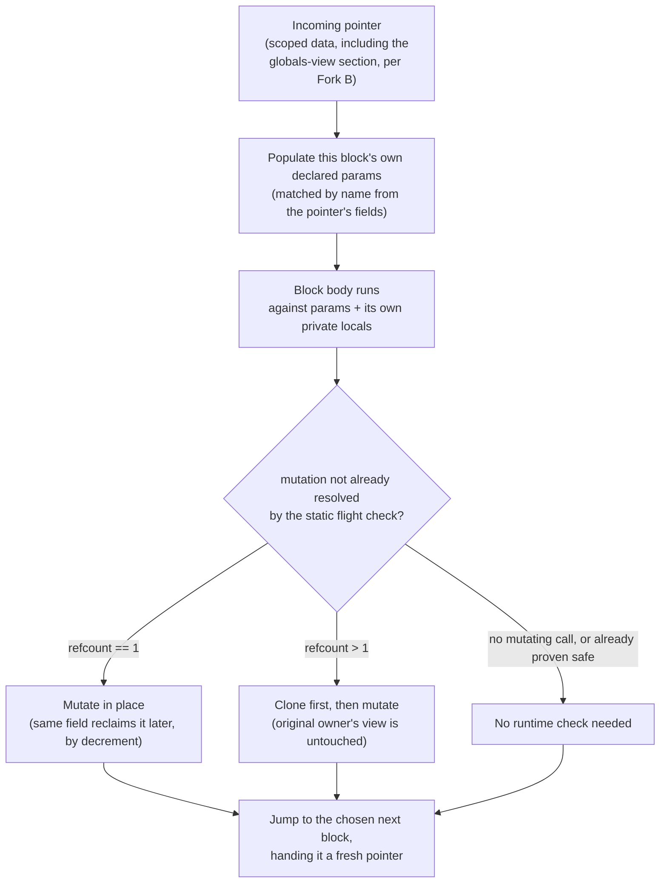

# Block Ownership Model

A block-structured execution model for PatLang, where every unit of code has
an explicit input/output contract by construction, and reference counting
gives it both real memory reclamation and a provable exclusivity check for
mutation — in one mechanism, built entirely in PatLang's own native codegen,
with no Rust involved.

**Status:** decisions recorded 2026-09-22, implementation not started.
**Scope:** a fresh, separate execution path — does not modify the existing
interpreter or native pipeline.
**Branch discipline:** a new branch only — nothing here lands on `main` until
built and proven there.
**Related:** PatParslow/PatLang #125–133.

This document is also published as a live Claude Artifact
(`https://claude.ai/artifact/3YaSLAP9L6NVtksRmP94jc`) for interactive reading;
this file is the durable, local copy of record.

---

## 1. Why

Three real, already-diagnosed problems in PatLang's current execution model
share one root cause: there is no principled answer to *who owns this piece
of data right now*.

- **Native list aliasing.** `list_push` mutates shared storage in place on
  the native x64 backend, while the interpreter treats the same operation as
  copy-on-write. Two backends silently disagree about whether a mutation is
  visible to anyone else still holding a reference.
- **Native list equality (issue #113).** `==` on two structurally identical
  `List` values returns `false` under native x64 codegen, even for two
  independently-built literals. A different symptom of the same underlying
  gap: nothing in the representation tracks identity or ownership
  consistently enough for even equality to be reasoned about safely.
- **The bump allocator never frees.** `rt_heap_alloc`, in its own header
  comment, is "a genuine bump allocator" — memory is claimed by advancing a
  pointer and never reclaimed. Every long-running PatLang program (a central
  dispatcher, a discovery daemon, anything in the direction of issues #128
  and #131–133) exhausts memory eventually, independent of anything else in
  this document.

This document is not a new feature sitting beside the current design. It is
a proposal to fix the shared cause of all three, once, rather than continue
patching each new symptom where it turns up.

There's a fourth reason this fits, alongside the three bugs, and it isn't a
bug at all: this completes a direction PatLang has already chosen, not one
being introduced here. A closure today is laid out as
`[code address][captured count][captured values...]` — `codegen_x64.patlang`'s
own comment on that layout is explicit that it was "deliberately chosen to
generalize toward 'everything is a function, everything is an object' rather
than being a closure-only special case," since a code pointer plus a bag of
values is already most of the way to a general object's own
`[vtable][fields]` shape — "both real, named future directions, not built
here, but the representation is chosen with them in view."

An object with no ownership story, though, is only half built: a
heap-allocated bag of values with no lifecycle isn't really an object in the
fuller sense that comment is reaching for, just data that happens to sit next
to some code. Reference counting supplies the missing half — a real
identity, a real lifetime, a real answer to who else can see this and change
it. Fork E's `inherited` section (§6) isn't a new shape competing with the
existing closure layout; it's the same captured-values shape already chosen,
finally given the ownership semantics "everything is an object" was always
going to need to mean something more than a heap allocation.

## 2. Where the current model actually stands

Verified against the source, not assumed:

- Lowered code is a flat instruction array per function —
  `["FuncIR", name, [params], [instrs], [lines]]`. Control flow is
  `["Jump", n]` / `["JumpIfFalse", n]`, where `n` is an absolute index into
  that same array. Function parameters are pre-populated entries in one flat
  per-call locals map, indistinguishable at runtime from a value the body
  computes for itself — only the static `params` list in the IR keeps the
  distinction.
- `Value::String` is `Arc<String>`; `Value::List` is `Arc<Vec<Value>>`. Both
  are already reference-counted pointers at the implementation level — that
  sharing is exactly what the native-backend aliasing bug exposed.
- `mut` already has real enforcement, just narrower than what this document
  needs: reassigning a `let`-bound local that wasn't declared `mut` lowers to
  a guaranteed-fail `contract_check` at the reassignment site. It governs
  whether a *name* can be rebound. It says nothing about whether the *data*
  behind a reference can be mutated through a primitive like `list_push`
  without ever rebinding anything.
- The native heap has no memory management at all — a bump allocator, no
  free, no GC, no refcount field on any object.

## 3. The model

### 3.1 Blocks, not calls

A block is a maximal straight-line run of instructions ending in a jump,
exactly as today's `Jump`/`JumpIfFalse` targets already define block
boundaries implicitly. The change is to transition between blocks by
**jumping** to the next one with a data reference in hand, not by
**calling** it. There is no stack frame, no return address, no argument
marshaling to speak of — a jump and a pointer swap, the same cost as today's
`Jump` instruction. Nothing about tail-call elimination needs solving,
because nothing here is a call to begin with.

### 3.2 Scoped data, not named globals-by-convention

A block receives exactly one thing from whoever jumps to it: a pointer to
the data it is allowed to see. Its own parameter list (already a distinct,
named part of `FuncIR` today) says which fields of that data it expects,
populated by name when the jump happens. Anything the block computes for
itself during its own execution is a private local, invisible to any other
block unless it is explicitly part of what gets handed forward in the next
jump.

### 3.3 Globals stay global — and map onto a vocabulary already built

This section describes the model's original working assumption: that it
does not try to eliminate PatLang's existing ambient state
(`set_var` / `get("__vars", ...)`), drawing the boundary around it
explicitly instead. **Fork B has since decided on full elimination
instead** — see §6 for the decision. It turns out to be cheaper than it
sounds: since `set_var`/`get` are host functions reached only via
`CallHost`, elimination is a lowering change (thread the current block's
globals-view section through automatically) rather than a migration of
every call site. The schema-vocabulary mapping below still holds, now
describing what "globals" become once eliminated rather than an unscoped
escape hatch.

That split is not new vocabulary. It is exactly the distinction a declared
schema (`self_hosting/lib/zs_schema.patlang`) already makes: globals (or,
under full elimination, whatever ambient state remains after migration) are
a schema's `state`; a block's incoming pointer and locals are an operation's
own `inputs`. A block's `require` is what it reads from state and its
pointer; its `ensure` is what it wrote back to either. Nothing about the
contract story needs reinventing — it is the same one this project already
shipped, read off the execution model's own boundaries instead of inferred
from prose afterward.

### 3.4 `mut`, extended to what it doesn't cover today

Extend `mut` from body-local `let` bindings to parameter declarations, and
extend what it enforces from "can this name be rebound" to "can the data
behind this reference be mutated through a primitive." A parameter without
`mut` grants read-only access to whatever it points at; a `mut` parameter
permits mutation, checked before it happens.

This document originally proposed the same template as today's reassignment
check — a guaranteed-fail `contract_check` at the violation site, not a
static proof — as a deliberate, honest match for every other PatLang
contract, none of which are compile-time guarantees today. **Fork C has
since decided on a static guarantee wherever it's provable** (§6), realized
as a pre-run flight check — with this section's own runtime check kept as
the fallback for whatever the flight check can't determine, not replaced
outright. See §6 for the real downsides that led to a hybrid rather than a
pure static system.

### 3.5 Reference counting: the mechanism both problems were waiting for

A count field in every heap object's header, incremented and decremented by
code the compiler emits at the points a reference is copied or a scope
exits. It does two jobs at once, not two separate pieces of work:

- **Ownership check.** Before a mutating primitive runs against a `mut`
  parameter, check the count. Exactly `1` means this is provably the only
  live reference right now — mutate in place. Anything higher means the data
  is aliased elsewhere — clone first, leaving whoever else holds a reference
  undisturbed. This is the same rule Rust's own `Arc::get_mut` already
  applies (returns a mutable reference only when the strong count is `1`) —
  not a Rust dependency, just the same well-understood technique,
  implemented directly in PatLang's own codegen and runtime. Per Fork C
  (§6), this runtime check is the fallback for whatever the static flight
  check can't resolve ahead of time, not the only mechanism — most mutations
  should be proven safe before this code ever runs.
- **Real memory reclamation.** A count that reaches `0` means nothing
  references the object any more — free it. This is the memory story the
  bump allocator has never had, arriving as a side effect of the same field
  rather than as separate scope.

Reference counting is not a Rust idea. CPython manages its own object model
this way in plain C (`Py_INCREF`/`Py_DECREF`); Objective-C's ARC and Swift do
the same at the language level. Nothing about it depends on a host
language's runtime — it is a counter and some generated arithmetic, squarely
within what `codegen_x64.patlang` already does elsewhere.

## 4. Nested blocks

"Nested" turns out to be three separable questions, not one, and they call
for different answers.

### 4.1 Forks don't need their own boundary; loops already are one

Verified in `lower_stmt`'s `If` arm: a then/else branch lowers through a
recursive `lower_block` call, and every jump it produces (`JumpIfFalse` past
the branch, `Jump` past the else) points strictly *forward* — a single fork
that rejoins once, never revisited. `match` lowers the same way, arm by arm.
Neither has, or needs, its own ownership boundary: a branch isn't an
independent unit of work with a contract worth stating, it's a conditional
continuation of the same one, and block-ifying every branch would explode
into tiny blocks each re-receiving the data the enclosing one already had.

`while` is structurally different, and it matters here specifically: its own
lowering ends with `vec_push(code, ["Jump", start])`, where `start` is a
position captured *before* the condition and body were even lowered — a
genuine back edge, a real cycle in the control-flow graph, which no
`if`/`match` ever produces. A back edge is exactly "jump to [the same
place], carrying updated data forward" — the model's own core mechanic
(§3.1–3.2) applied to the case where the next block happens to be the
current one. Nothing new needs inventing for a loop: a `while` body should
be lowered as its own block, entered afresh each iteration exactly like any
other jump target, with the loop's own accumulator threaded forward
explicitly as what one iteration hands to the next, and everything else it
declares discarded between iterations the same way any block's private
locals are discarded once it jumps onward. The same `mut`/refcount rules
from §3.4–3.5 apply to it unchanged.

A "block," in this document's sense, is therefore not one single grain —
it's PatLang's existing function boundaries, *and* every loop body nested
inside one, each entered by a jump carrying a pointer. Ordinary `if`/`match`
forking inside either stays exactly as flat as it is today.

A loop body's own threaded accumulator isn't necessarily everything it
needs, though: a `while` body that reads an outer local computed once before
the loop started — not part of its own accumulator, never reassigned by the
loop — needs to see it on every iteration. That's exactly the
closure-capture problem (§4.3, Fork E) applied to a loop body instead of a
closure literal, and it gets the same answer: an `inherited` section,
populated by the same free-variable analysis Fork E already decided on. A
loop body is a block that needs closure-*like* capture treatment; it isn't a
closure in the §4.3 sense of a first-class, storable value a program can
hold and pass around — it's compiler-synthesized, always jumped to directly
by the loop's own machinery, never exposed as something a programmer's code
can reference. §7's free-variable analysis work item covers both, not
closures alone.

### 4.2 PatLang has no real lexical scoping today, even without this model

Checked directly: `lower_block` never restores anything on scope exit. A
`let x` inside an `if`-branch overwrites an outer `x` for the rest of that
function call, not just for the branch — one flat namespace per function
call, regardless of nesting depth. "A block's locals are private" has to be
read as a property of each actual block boundary from §4.1: flat and shared
across an `if`/`match` fork (exactly as today, on purpose), but genuinely
fresh on each entry to a `while` body, since that entry is a real jump like
any other — a scratch variable declared inside the loop is a new
block-local each iteration, not a survivor from the last one, unless it's
explicitly part of what gets threaded forward.

### 4.3 Closures are the real version of this question, and aren't answered yet

A closure defined inside a block is genuinely a separate, later-invoked
unit — structurally exactly what should carry its own contract. Checked
directly (`lower_closure_literal`): capture happens by snapshot at creation
time — each currently-in-scope local is read once via `Load` and bundled
into `MakeClosure`; the closure's synthesized function then has its own,
entirely separate locals populated from that bundle. So a block that sees
only its incoming pointer plus globals doesn't actually need a third,
untracked category for a closure — the capture is already a real,
well-defined value, just not one this document had given a place to yet.
See Fork E for where it goes.

## 5. How a block runs

The mutation check below is the runtime fallback, not the primary
mechanism — per Fork C (§6), the flight check proves most cases before a
block ever runs this far. What's drawn here is what happens for whatever
the flight check couldn't resolve statically.

## 6. Decisions

Five forks this document originally left open, decided on 2026-09-22, all
now closed calls rather than a leaning. The reasoning that led to each is
kept below rather than discarded once the call is made, since the tradeoffs
it names still matter for how each is actually built. None of this is
implemented yet, and none of it lands on `main` before it is — see the
branch-discipline note above.

### Fork A — Reasoning representation vs. runtime execution

**Decided — all the way down.** The block/pointer structure is the literal
runtime execution mechanism, not a reasoning layer lowered to today's
bytecode.

Is the block/pointer structure a compile-time intermediate representation —
used for composition and analysis, then lowered to today's flat
jump-indexed bytecode for actual execution — or is it the runtime execution
mechanism all the way down? The first keeps today's interpreter and native
backend as the execution target and adds a reasoning layer above them. The
second is a genuinely new execution engine, front to back. Turtles all the
way down: the second.

Checked before listing this as a debugger-rebuild cost, since it isn't one:
the debugger (`interp.patlang`) pauses via `fiber_yield` on top of
`rust-runtime/src/ir/fiber.rs`'s cooperative fibers — real OS threads parked
on a mutex+condvar, where "the OS thread's own native stack IS the saved
coroutine state." That mechanism is representation-agnostic; it doesn't
know or care whether the paused code is flat-array-PC-based or
block/pointer-based, only that something calls `fiber_yield` with a
snapshot. What changes is the snapshot's own shape (block identity and its
own locals, replacing a PC index and a call's locals), not the
pause-and-resume machinery itself. The one real gap: `dbg_call_stack_snapshot()`
walks an actual call stack, which this model has none of (§3.1) — an
equivalent "how did we get here" view needs an explicit jump-history trail
kept on purpose, not something to build a whole new debugger for. That
trail only needs to exist in a debug build in the first place, and Fork D's
real reclamation (§6) is what makes keeping it bounded and freeing old
entries a straightforward thing to build, rather than another unbounded log
stacked on top of a bump allocator that was already going to run out.

### Fork B — Globals stay global vs. full elimination

**Decided — full elimination.** Fold all ambient state into explicit
pointers.

This document originally assumed globals remain an explicit, unscoped
escape hatch, mapped onto schema `state` (§3.3). The alternative — folding
all ambient state into explicit pointers, so *everything* a block touches
is structurally visible — gives a stronger guarantee, which is why it was
the leaning, and Fork C's own resolution below turned out to reinforce it
rather than suggest an alternative: a static exclusivity check can only
reason about who holds a reference to something that *is* a reference in
the first place. Ambient global state, reachable from literally anywhere,
is close to unanalyzable for that purpose — the flight check would have to
treat any global-touching code as permanently aliased, which is nearly
always true and nearly always useless as an answer. Making globals an
explicit, threaded pointer section is what lets the same points-to analysis
that already has to reason about everything else reason about them too,
rather than needing a separate, maximally-conservative special case.

Checked before assuming this meant migrating every call site: it doesn't.
`set_var`/`get` are genuine host functions
(`interp.host.insert("get", host_get)`, called via `CallHost`), not shared
PatLang-level code someone could patch once. That actually makes the cheap
path available rather than closing it off: the fix lives entirely in
lowering, the same way `contract_check` already gets `func_name`/`kind`/`text`
inserted ahead of its condition (§3.4) — teach the lowerer to insert the
current block's own globals-view reference as a hidden extra argument at
every `CallHost("set_var", ...)`/`CallHost("get", ...)` site. The PatLang
source someone actually wrote, `set_var("foo", val)`, never changes.

What this genuinely requires, and it's real compiler work rather than free:
every block's incoming pointer needs to structurally carry a globals-view
section, and every jump between blocks needs to forward it automatically,
not just at the two host-function call sites. That's the further
unification mentioned in passing under Fork E — globals as just another
named section of the one pointer every block already receives — which full
elimination, realized this way, requires adopting rather than merely
benefits from. The central-dispatcher pattern issue #128 depends on is one
caller of `set_var`/`get` among many, automatically covered once the
lowerer threads the section through, not a special case to migrate
separately.

`set_var`/`get` aren't the only ambient mechanism this needs to cover.
`new("Class", "instance_name", ...)` registers an object under a string
name in a global store (`OBJECTS` in `hosts.rs`); `send(name, "method", args...)`
reaches it by that name, from anywhere, resolved at runtime. Checked
broadly rather than assumed uniform, and it splits into two real cases, not
a uniformly hard one:

- **The overwhelming majority carries no meaning in the name at all.**
  Dozens of call sites across the codebase follow the pattern
  `new("Dict", "some_prefix_" + pr_next_id())` — a counter minted solely to
  dodge accidental aliasing, which only exists because identity is
  name-keyed in the first place. `primitive_registry.patlang` says so
  outright: "two calls with the same name alias the SAME object rather than
  creating independent ones. Every Dict this file creates therefore gets a
  fresh, process-unique name via this counter, never a fixed literal."
  That's a documented workaround, not a feature being used. These become
  real reference values directly — `Arc`-based, exactly like `List`/`Dict`
  already are — with no name, no counter, and no handler involved at all. A
  strict improvement independent of anything else in this document: it
  removes a working-around-our-own-design pattern and closes a real,
  currently-possible bug class (a collision between two unrelated counters
  silently aliasing objects that were never meant to share identity).
- **A real minority is deliberate** — fixed, meaningful names with no
  counter (`new("Dict", "snippets_patlang")`), `zs_registry()`/`schema_registry()`,
  a declared schema's own chosen name, and (checked directly)
  `signal_discovery.patlang`'s `signal_wrap`, whose own comment calls its
  name "the caller's own choice (the 'call it George' step)." These want
  name-based lookup on purpose. They get an explicit, ordinary object
  handler — a plain Dict-shaped value, not a hidden runtime primitive —
  with plain function calls (`handler_register(handler, name, ref)` /
  `handler_lookup(handler, name)`) doing what `new`'s built-in name-aliasing
  used to do implicitly.

Checked whether cross-process discovery (issues #131–133) needed its own,
third treatment here, and it doesn't — it was never built on this mechanism
to begin with. `task_registry.patlang` has zero calls to `new`/`send`; its
durability is already file-backed, via `queue.patlang`, a separate and
already-explicit mechanism. The one real `new`/`send` use anywhere near it
(`signal_wrap`, above) is a purely local, in-process proxy — the
deliberate-naming case, not a cross-process one. Nothing here needs to
change for it.

The object handler being an ordinary value rather than a hidden global
unlocks something today's design can't offer at all: it can live in the
globals-view section when it should be truly program-wide (`zs_registry()`),
or be created and passed around as an explicit, scoped pointer when its
visibility should be narrower than the whole program — a real, expressive
choice, where today every `new(...)` object goes into the same single,
undifferentiated, whole-process bucket with no way to scope it at all.

Method-call syntax on plain values (`2.34.to_s()`, via
`builtin_primitive_method`) is a separate, unrelated mechanism and needs no
change — it dispatches directly on the receiver value with no registry and
nothing ambient, already a clean instance of "a block receives a pointer to
the data it's allowed to see" rather than an exception to it.

### Fork C — How much `mut` actually proves

**Decided** on a static guarantee wherever it's provable, realized as a
pre-run flight check that fires before every execution of a program or a
dynamically-compiled fragment — falling back to the existing runtime
refcount check (§3.5) for whatever it can't determine.

A runtime, guaranteed-fail check (this document's original default,
consistent with every other PatLang contract) tells you a violation
happened, at the moment it happened. A static check — proving before the
program ever runs that no path can violate an exclusivity guarantee — is a
materially bigger undertaking, closer to a real borrow checker than a
parameter annotation. The static guarantee is the stronger, more useful
claim where it's achievable, which is why it's the decision here — but not
the whole decision, once its real downsides were considered rather than
just its build cost.

**Downsides of static checking, apart from the cost of building it:**

- **Soundness forces conservatism.** A checker that never lets a real
  violation through has to reject anything it can't prove safe, including
  programs that would have behaved correctly — the well-documented
  experience of Rust's own borrow checker.
- **Conservatism creates pressure for an escape hatch, which reopens
  exactly the risk being closed.** Once valid programs start getting
  rejected, the pressure is toward an `unsafe`-style override. Anywhere
  that gets reached for, the guarantee is gone and the violation is back to
  being discoverable only at runtime — just relocated to wherever the
  escape hatch is used.
- **Diagnostics are an ongoing cost, not a one-time one.** Explaining why a
  static aliasing checker believes two references might overlap,
  especially across several blocks, is notoriously hard to make legible —
  still considered the hardest part of learning Rust after years of
  dedicated work on exactly this.
- **PatLang's own `new`-in-a-loop pattern (§6, Fork B) is close to the hard
  case for this kind of analysis in general.** An unbounded,
  dynamically-sized population of objects created in a loop is genuinely
  difficult for points-to analysis to reason about precisely — not a
  PatLang-specific gap, close to research territory generally.

Given those, the decision is a hybrid, not a pure static system: prove
exclusivity statically wherever the flight check can, and fall back to the
existing runtime refcount check (§3.5) for whatever it genuinely can't
determine, rather than either rejecting a possibly-fine program outright or
requiring an escape hatch that undermines the guarantee for anyone who
reaches for it. The runtime check isn't eliminated by this decision — it's
demoted to the fallback for the residue the static pass can't resolve,
which is a more honest design than either extreme.

It's a natural fit for native compilation, which already has a step that
could reject a program before it runs. It is not a natural fit for
interpretation — neither the Rust interpreter being backgrounded nor the
canonical self-hosted `interp.patlang` has an equivalent "compile and
reject" step today. The resolution: a genuine pre-execution analysis
phase — a flight check — that verifies a program once, before *either* path
runs it, rather than something that falls naturally out of native
compilation alone. Feeding both paths from the same already-verified
program is what makes them equivalent; a phase built only for the native
path would recreate the exact interpreter/native divergence this whole
document exists to close, one level up.

"Before either path begins" turned out to be too narrow a framing on its
own: PatLang can also compile and run a fragment of code *during* a
program's own execution, via `run_ir` ("executes a freshly lowered IR shape
on a nested interpreter... the playground back end: no rustc"), used by the
REPL and the browser playground. A snippet compiled this way never went
through a whole-program flight check, because it was never part of one.
The flight check has to fire again at every such point, not just once at
the start of a statically-known program — whether the fragment is headed
for interpretation or, eventually, compilation.

Checked what the phase actually needs, rather than assuming it stays as
narrow as a parameter annotation: proving "this `list_push` definitely
mutates the same object `x` refers to" requires knowing `x` is list-shaped
in the first place, and PatLang is dynamically typed — that's not free
information sitting around, the flight check has to establish it. So the
phase needs a bounded points-to/shape analysis, sufficient to know which
mutating primitives can apply to which reference, as a genuine prerequisite
for soundness, not an optional extra. This is deliberately not a general
type-checking or inference system for the language (see §9) — a much
bigger, separate question, named but not answered here.

### Fork D — Refcounting's scope

**Decided — both.** One field, both jobs.

Refcounting does the ownership check and general memory reclamation
together, since they are the same field doing two jobs. A narrower version
could implement only the uniqueness check without ever freeing anything
(deferring the bump-allocator problem) — cheaper to build, but leaves a
real, independently-motivated problem (§1) unsolved for no clear reason once
the field already exists. Confirmed as the direction, not just the default.

### Fork E — How wide the inherited section should be

**Decided — real free-variable analysis**, not wholesale capture, despite
the added engineering cost.

A closure's incoming pointer isn't one flat blob — it's a compound object
with named sections: its own declared params, plus a separate `inherited`
section holding its creation-time snapshot, alongside globals as the third,
always-reachable category from §3.3. That keeps the visibility guarantee
intact exactly as stated (everything reachable is in the one pointer, or is
global) — a closure's pointer just has a richer shape than an ordinary
block's. And because that snapshot is a copy of an `Arc` pointer for any
heap-shaped value, capturing something automatically raises its reference
count the instant it happens, so §3.5's existing rule (mutate in place only
at refcount `== 1`, clone otherwise) already produces the right answer with
no special-casing for closures at all.

What was open was how wide `inherited` should be. Comparing the two
treatments directly across the axes that actually matter is what settled
it:

| Axis | Wholesale (today's capture, made safe) | Free-variable analysis (chosen) |
|---|---|---|
| Implementation cost | Essentially free — `lower_closure_literal` already grabs every in-scope local; this only formalizes that list as a named section and refcounts it. | A real, new compiler pass PatLang has never built: walk the closure body, collect every free reference, subtract what it binds itself, recursively through nested closures and match arms. Needs its own careful testing given this project's history with subtle self-hosting-fixpoint bugs. |
| Memory retention | Every value in scope at creation stays alive for the closure's entire lifetime, whether used or not. | Only actual dependencies stay alive; everything else in the enclosing scope is reclaimable on its own schedule. |
| Exclusivity cost | Every captured value's refcount rises above 1 on capture — including ones the closure never touches — forcing the *enclosing* block into clone-fallback on mutation attempts against them too. | Only variables actually captured become shared; everything else the enclosing block holds stays uniquely owned and mutates as cheaply as if no closure existed. |
| Contract clarity | A closure's declared input becomes "might depend on anything in scope" — not a real contract, undermining exactly the §8 discovery/composition goals for closures specifically. | A closure's `inherited` section becomes a real, inspectable declaration of what it depends on — a fully first-class block in the sense §3 and §8 are chasing, not an approximate one. |

One refinement changes how much the wholesale column's cost bites in
practice: it's concentrated entirely on heap-shaped captures. An extra
captured `Int` or `Bool` costs nothing — no `Arc`, no refcount, just a
copied primitive. A function whose in-scope locals are mostly small
primitives would see almost none of wholesale's downside; one juggling
several lists would see all of it. This narrowed the gap in some cases
without closing it, and didn't change the decision.

A middle ground was considered and set aside rather than chosen: a purely
syntactic scan — capture any name lexically mentioned anywhere in the
closure body's token stream, with no real scope resolution — catches most
of the tightening benefit at a fraction of the risk (it can over-capture a
shadowed name, but never under-captures, so it fails safe). Worth keeping
in mind as a cheaper interim step if the full analysis proves more costly
to build correctly than expected, but the target is the real analysis, not
this approximation.

## 7. What has to change

| Area | Change |
|---|---|
| `x64_runtime.patlang` | Every heap object gains a count field; `rt_heap_alloc`'s callers need increment/decrement/free logic, not just allocation. |
| `codegen_x64.patlang` | Emit increment/decrement code at every reference copy and scope exit; emit the refcount check before a mutating primitive on a `mut` parameter. |
| `lower.patlang` | `FuncIR`'s `params` gain a `mut`/immutable flag per entry, mirroring the existing per-local `mutables` tracking used for reassignment today. |
| `interp.patlang` | Needs the identical refcount and ownership-check semantics, or the interpreter and native backend disagree about mutation a third time, the same way they already do today. |
| Debugger tooling | The `fiber_yield`-based pause/resume mechanism carries over unchanged (§6, Fork A) — only the snapshot's own shape needs updating, plus an explicit jump-history trail to replace the call-stack view a real call stack currently gives for free. |
| `lower.patlang`, `set_var`/`get` call sites | Following Fork B's decision: teach the lowerer to insert the current block's globals-view section as a hidden argument at each `CallHost("set_var"/"get", ...)` site — not a migration of the call sites themselves, which are unaffected, including issue #128's dispatcher. |
| `new`/`send`, ephemeral uses (the majority) | Become real reference values — no name, no counter, no handler. Removes a documented workaround (`pr_next_id()` and its callers) rather than migrating it. |
| `new`/`send`, deliberate names (the minority) | An explicit object-handler value (plain Dict-shaped, ordinary function calls) replaces `new`'s built-in name-aliasing. Not designed yet. |
| A pre-run flight check | Following Fork C's decision: one verification phase ahead of *both* execution paths, including a bounded points-to/shape analysis (not general type inference) sufficient to prove exclusivity soundly — not designed yet. |
| Free-variable analysis for closures and loop bodies | Following Fork E's decision, a new compiler pass over closure bodies, reused for a `while` body's own `inherited` section (§4.1) — not built yet. |

## 8. What this connects to

Not required for any of these, but each becomes more natural once a block's
own signature is a structural fact rather than a claim:

- **#128** — Runtime conformance checking gets a uniform place to hook —
  every block boundary, not just points someone remembered to instrument by
  hand.
- **#131** — Capability discovery could read a block's real input/output
  shape instead of trusting a self-reported description string.
- **#132** — GOAP composition over discovered capabilities gets real,
  structural pre/postconditions to plan against, not ones inferred from
  prose.

One more, not tied to an issue: event dispatch already fits this model
almost for free. `EventIR`'s `[event_name, handler_fn_name]` table is
static, baked into the compiled program's own structure at build time
(`["ProgramIR", entry, [functions], [events]]`) — not a runtime-mutable
registry the way `new`/`send` is (§6, Fork B). A fired event is already, in
effect, "jump to a known block with a pointer carrying the event's
payload" — the same mechanic loops turned out to already be (§4.1), needing
little more than recognizing it as such.

## 9. Non-goals

Explicitly out of scope for this document: a full, general-purpose static
type-checking or inference system for PatLang. Fork C's flight check does
need a bounded points-to/shape analysis to prove exclusivity soundly, and
that's accepted as a real, in-scope prerequisite — but it is sized to
exactly what proving `mut` exclusivity requires, not a general system for
reasoning about arbitrary properties across the language, and PatLang has
no existing type infrastructure to build from either way (checked:
`ir/types.rs`'s `Type` enum has zero usages anywhere in the runtime, and the
only self-hosted "type inference" is a narrow, runtime-value-tagging trick
local to the enumerative synthesis engine). Whether PatLang should
separately get real, general type-checking is a genuinely open question
this document neither answers nor forecloses — worth its own dedicated
design document if there's appetite for it, not something to inherit by
proximity to the flight check.

Also out of scope: cross-machine trust or transport (a separate,
already-deferred question); and any retrofit of the existing Rust-anchored
interpreter or native pipeline, which this proposal deliberately treats as
a fresh, parallel path rather than a replacement to migrate toward on day
one.

Related, but also explicitly out of scope: unifying ordinary named
functions with closures, so a plain function becomes a closure with zero
captures, invoked uniformly through `CallValue` rather than through the
separate, static `Call` PatLang uses today. Nothing here depends on that
unification, and nothing here forecloses it — if anything, the block/pointer
model is a better substrate for it than today's split, since every block
already receives its data the same way whether or not it happens to have
captures. Named here so it isn't mistaken for something this document
actually changes.
