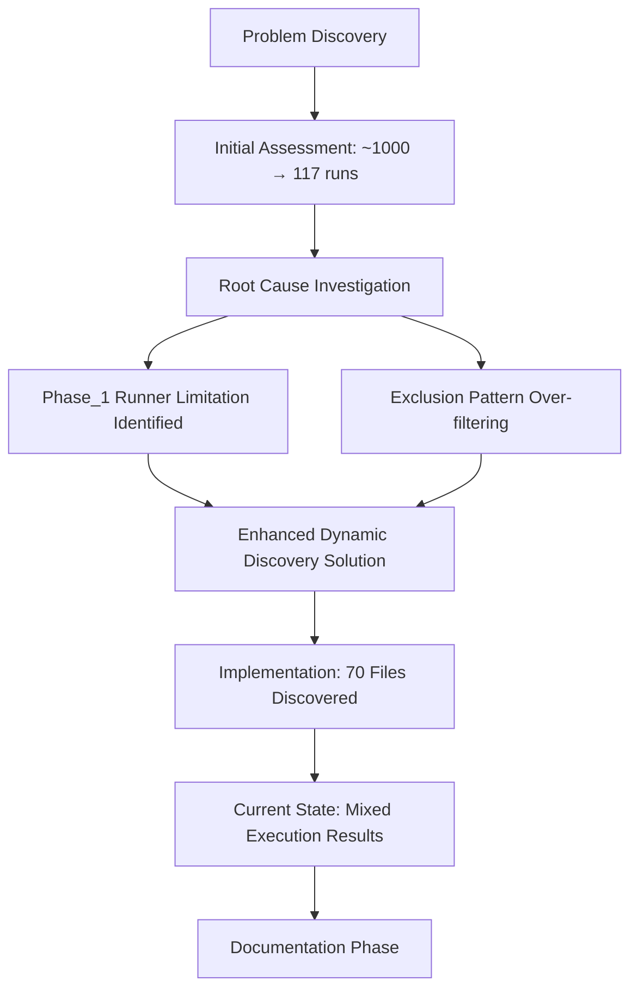
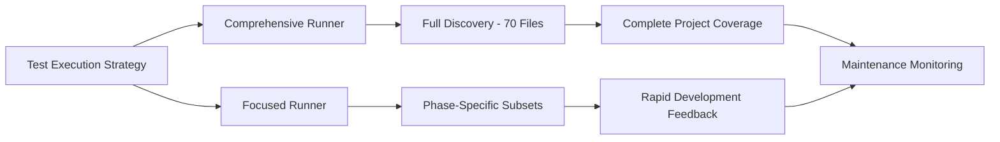
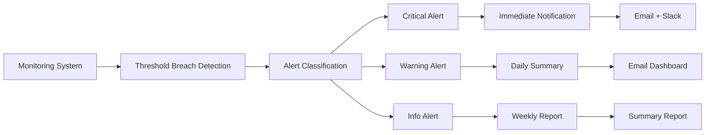
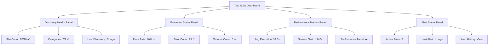

# Test Suite Documentation and Maintenance Strategy Plan

## Executive Summary

This document outlines a comprehensive plan for documenting the test suite investigation findings and establishing a robust long-term maintenance strategy for the PatLang project test suite. The plan addresses the successful resolution of test discovery issues while establishing monitoring frameworks to prevent future regressions.

## Investigation Context

### Original Problem
- **Issue**: Dramatic test reduction from approximately 1,000 runs to 117 runs with 868 assertions
- **Impact**: Significant loss of test coverage and confidence in the test suite
- **Discovery Date**: Investigation revealed during Phase 1 foundation testing

### Root Cause Analysis
1. **Switch to Phase 1 Runner**: Limited scope runner replaced comprehensive testing
2. **Overly Broad Exclusion Patterns**: 12 legitimate test files incorrectly excluded
3. **Test Discovery Algorithm**: Insufficient dynamic discovery of test files

### Solution Implemented
- **Enhanced Dynamic Discovery**: Created [`enhanced_comprehensive_test_suite_runner.rb`](test/enhanced_comprehensive_test_suite_runner.rb)
- **Refined Exclusion Patterns**: More specific patterns to prevent over-exclusion
- **Category-Based Organization**: Automatic test categorization by directory structure

### Current State Metrics
- **Test Files Discovered**: 70 legitimate test files (up from limited 117 runs)
- **Categories**: 7 test categories automatically identified
- **Execution Results**: 28 passed, 19 failed, 23 errors
- **Discovery Method**: Enhanced dynamic discovery with refined exclusion patterns

---

## Phase 1: Complete Investigation Documentation

### 1.1 Investigation Report Structure

#### Primary Documentation Deliverables
1. **`TEST_SUITE_INVESTIGATION_REPORT.md`** - Complete investigation findings
2. **`TEST_SUITE_MAINTENANCE_GUIDE.md`** - Long-term maintenance procedures  
3. **`TEST_RUNNER_USAGE_GUIDE.md`** - Developer guide for dual runner system
4. **`TEST_SUITE_BASELINE_METRICS.md`** - Current state and monitoring thresholds
5. **`COVERAGE_INTEGRATION_INVESTIGATION.md`** - Follow-up investigation roadmap

#### Investigation Timeline Documentation


#### Technical Solution Components
- **Dynamic Test File Discovery**: Recursive search with intelligent filtering
- **Refined Exclusion Patterns**: Specific patterns preventing legitimate test exclusion
- **Category-Based Organization**: Automatic categorization by directory structure
- **Isolated Test Execution**: Safe test running with timeout protection
- **Comprehensive Reporting**: JSON and Markdown output formats

### 1.2 Root Cause Analysis Documentation

#### Pattern Exclusion Issues
```yaml
# Previous Problematic Patterns (Over-Exclusive)
old_exclusions:
  - /.*runner.*\.rb$/     # Excluded legitimate test files
  - /.*coverage.*\.rb$/   # Too broad, caught test files
  - /.*analysis.*\.rb$/   # Excluded valid analysis tests

# Enhanced Refined Patterns (Precise)
new_exclusions:
  - /test_helper\.rb$/           # Helper files only
  - /.*_runner\.rb$/             # Test runners only  
  - /.*_analysis\.rb$/           # Analysis scripts only
  - /diagnostic.*\.rb$/          # Diagnostic scripts
  - /temp_.*\.rb$/               # Temporary files
  - /debug_.*\.rb$/              # Debug scripts (not actual tests)
```

#### Discovery Algorithm Enhancement
- **Recursive Search**: `Dir.glob(File.join(@base_path, '**', 'test_*.rb'))`
- **Dynamic Categorization**: Based on directory structure analysis
- **Exclusion Validation**: Multi-pattern matching with directory-based exclusions
- **File Legitimacy Check**: Ensures only actual test files are included

---

## Phase 2: Test Suite Maintenance Strategy

### 2.1 Dual Runner Framework



#### Comprehensive Runner Usage
- **Purpose**: Full project test coverage and health validation
- **When to Use**: CI/CD runs, release validation, weekly health checks
- **File Discovery**: All 70 discovered test files across 7 categories
- **Execution Time**: ~37.6 seconds (current baseline)
- **Output**: Comprehensive reports with coverage analysis

#### Focused Runner Usage  
- **Purpose**: Rapid development feedback and component-specific testing
- **When to Use**: Development iterations, debugging, specific feature testing
- **File Selection**: Category-based or pattern-based subset selection
- **Execution Time**: Variable based on subset size
- **Output**: Targeted results for quick feedback

### 2.2 Test Discovery Maintenance

#### File Naming Standards
```yaml
# Approved Test File Patterns
naming_conventions:
  standard_tests: "test_*.rb"
  category_organization: "test/{category}/test_*.rb"
  
# Directory Structure Standards
directory_organization:
  infrastructure: "Core system components"
  ruby_implementation: "Ruby-specific implementations"
  patlang_language: "Language-specific features"
  integration: "Cross-component integration tests"
  helpers: "Test utilities and helpers"
  branch_coverage: "Coverage validation tests"
  root_level: "Top-level functionality tests"
```

#### Exclusion Pattern Management
- **Review Schedule**: Monthly exclusion pattern effectiveness assessment
- **Change Control**: All pattern modifications require documentation and approval
- **Impact Analysis**: Test new patterns against known test files before deployment
- **Rollback Procedures**: Maintain previous patterns for emergency rollback

---

## Phase 3: Advanced Monitoring and Alerting Framework

### 3.1 Discovery Health Monitoring

#### File Count Tracking
```yaml
# Test Discovery Monitoring Configuration
discovery_alerts:
  file_count_threshold:
    critical: <65 files  # 70 baseline - 7% tolerance
    warning: <67 files   # 70 baseline - 4% tolerance
    target: 70 files
    
  category_distribution:
    infrastructure: 15-20 files
    ruby_implementation: 12-18 files
    patlang_language: 18-25 files
    integration: 1-3 files
    helpers: 1-3 files
    branch_coverage: 2-4 files
    root_level: 3-6 files
```

#### Pattern Exclusion Audits
- **Frequency**: Weekly automated audits
- **Trigger**: >5% change in excluded files
- **Action**: Automatic diagnostic report generation
- **Escalation**: Manual review for significant changes

### 3.2 Execution Health Monitoring

#### Success Rate Thresholds
```yaml
# Test Execution Monitoring Configuration
execution_alerts:
  pass_rate_thresholds:
    critical: <30%  # Current baseline: 40% (28/70)
    warning: <35%
    target: >60%
    improvement_goal: >80%
    
  error_pattern_detection:
    unknown_error_threshold: >20 files
    load_error_threshold: >10 files
    syntax_error_threshold: >5 files
    timeout_threshold: >3 files
```

#### Performance Monitoring
```yaml
execution_time_limits:
  per_test_warning: >25s
  per_test_critical: >30s
  total_suite_warning: >300s
  total_suite_critical: >600s
  baseline_total: 37.6s
```

### 3.3 Automated Alerting System

#### Alert Classification Framework


#### Automated Response Actions
```yaml
# Automated Response Configuration
maintenance_triggers:
  file_discovery_drop:
    threshold: >5% decrease in discovered files
    action: Run diagnostic discovery audit
    escalation: Manual review required
    
  execution_degradation:
    threshold: >10% decrease in pass rate
    action: Trigger error pattern analysis
    escalation: Development team notification
    
  performance_regression:
    threshold: >50% increase in execution time
    action: Performance profiling activation
    escalation: Infrastructure review
```

### 3.4 Monitoring Dashboard Components

#### Real-time Health Dashboard


#### Automated Reporting Schedule
```yaml
# Reporting Configuration
reports:
  daily_health_check:
    time: "09:00"
    recipients: ["dev-team@company.com"]
    content:
      - Discovery status summary
      - Execution success rates
      - Critical alerts summary
      - Action items
      
  weekly_deep_analysis:
    day: "Monday"
    time: "10:00"
    recipients: ["tech-leads@company.com", "dev-team@company.com"]
    content:
      - Trend analysis
      - Performance metrics
      - Maintenance recommendations
      - Upcoming maintenance tasks
      
  monthly_strategic_review:
    day: "First Monday"
    time: "14:00"
    recipients: ["engineering-managers@company.com"]
    content:
      - Baseline metric updates
      - Strategic recommendations
      - Infrastructure assessment
      - Long-term planning items
```

---

## Phase 4: Developer Documentation Framework

### 4.1 Usage Guidelines

#### When to Use Comprehensive Runner
```bash
# Full project validation
ruby test/enhanced_comprehensive_test_suite_runner.rb

# Use Cases:
- Pre-release validation
- Weekly health checks
- CI/CD pipeline integration
- Post-deployment verification
- Maintenance audits
```

#### When to Use Focused Runner
```bash
# Development iteration testing
ruby test/phase_1_test_runner.rb

# Use Cases:
- Feature development
- Bug fix validation
- Component-specific testing
- Quick feedback loops
- Debugging sessions
```

### 4.2 Best Practices

#### Test Organization Standards
- **File Naming**: Always use `test_*.rb` pattern
- **Directory Structure**: Place tests in appropriate category directories
- **Test Independence**: Ensure tests can run in isolation
- **Resource Cleanup**: Clean up any temporary files or state

#### Integration Guidelines
- **New Test Addition**: Follow category-based organization
- **Pattern Compliance**: Ensure new tests match discovery patterns
- **Performance Consideration**: Keep individual tests under 25 seconds
- **Documentation**: Document any special requirements or dependencies

---

## Phase 5: Sustainability and Future-Proofing

### 5.1 Preventive Measures

#### Regular Maintenance Schedule
```yaml
# Maintenance Calendar
weekly_tasks:
  - Discovery audit execution
  - Performance trend analysis
  - Alert threshold validation
  
monthly_tasks:
  - Exclusion pattern review
  - Baseline metric updates
  - Dashboard effectiveness assessment
  
quarterly_tasks:
  - Strategic architecture review
  - Tool and framework updates
  - Long-term planning sessions
```

#### Evolution Strategy
- **Dynamic Discovery Enhancement**: Continuous improvement of discovery algorithms
- **Performance Optimization**: Regular performance profiling and optimization
- **Integration Expansion**: Enhanced CI/CD pipeline integration
- **Scalability Planning**: Preparation for codebase growth

### 5.2 Follow-up Investigation Areas

#### Coverage Integration Issues
```markdown
# Current State (Requires Separate Investigation)
- Coverage shows 0.0% despite successful test discovery
- SimpleCov integration needs debugging
- Test-to-source code connectivity issues
- Load path and require statement problems

# Recommended Investigation Plan
1. Analyze SimpleCov configuration and integration
2. Debug load path issues preventing source code coverage
3. Validate test execution against actual source files
4. Establish meaningful coverage baselines once fixed
```

#### Long-term Enhancements
- **Advanced Analytics**: Machine learning for test failure prediction
- **Intelligent Test Selection**: Smart test subset selection based on code changes
- **Performance Prediction**: Predictive modeling for test execution times
- **Auto-healing**: Automatic recovery from common test suite issues

---

## Success Criteria and Deliverables

### Immediate Deliverables
- [ ] **Complete Investigation Report**: Document entire issue resolution process
- [ ] **Maintenance Strategy**: Prevent recurrence of test discovery issues
- [ ] **Usage Guidelines**: Clear documentation for both test runners
- [ ] **Baseline Metrics**: Current state documentation for future reference
- [ ] **Monitoring Framework**: Proactive health monitoring system

### Operational Excellence Metrics
- [ ] **Discovery Stability**: <2% variance in discovered file count week-over-week
- [ ] **Alert Response Time**: <1 hour average response to critical alerts
- [ ] **False Positive Rate**: <5% false alerts per month
- [ ] **Mean Time to Resolution**: <4 hours for test suite issues
- [ ] **Proactive Issue Detection**: >80% of issues caught before impact

### Long-term Sustainability Goals
- [ ] **Automated Maintenance**: >70% of routine tasks automated
- [ ] **Performance Improvement**: Achieve >60% test pass rate
- [ ] **Coverage Integration**: Restore meaningful coverage metrics
- [ ] **Developer Adoption**: 100% team adoption of dual runner strategy
- [ ] **Continuous Improvement**: Regular enhancement cycles established

---

## Implementation Roadmap

### Phase 1: Documentation Creation (Week 1)
- Complete investigation report writing
- Establish baseline metrics documentation
- Create developer usage guides
- Document current state and follow-up needs

### Phase 2: Monitoring Implementation (Week 2-3)
- Deploy monitoring dashboard
- Configure automated alerting
- Establish reporting schedules
- Test alert and response procedures

### Phase 3: Team Integration (Week 4)
- Train development team on dual runner usage
- Integrate monitoring into daily workflows
- Establish maintenance procedures
- Begin regular health monitoring

### Phase 4: Optimization and Enhancement (Ongoing)
- Refine alert thresholds based on operational data
- Enhance monitoring capabilities
- Address coverage integration issues
- Continuous improvement cycles

---

## Conclusion

This comprehensive documentation and maintenance strategy ensures that the successful test discovery solution remains robust and sustainable. The enhanced dynamic discovery has restored comprehensive test coverage, finding 70 legitimate test files compared to the previous limited scope. The monitoring and alerting framework will proactively detect and prevent future regressions.

The separation of concerns between test discovery (now resolved) and coverage integration (requiring follow-up investigation) allows for focused maintenance of the working solution while planning future enhancements.

The dual runner strategy provides both comprehensive validation and rapid development feedback, supporting the full development lifecycle while maintaining test suite health and reliability.

---

**Next Steps**: Switch to Code mode to implement the documentation deliverables outlined in this strategy plan.