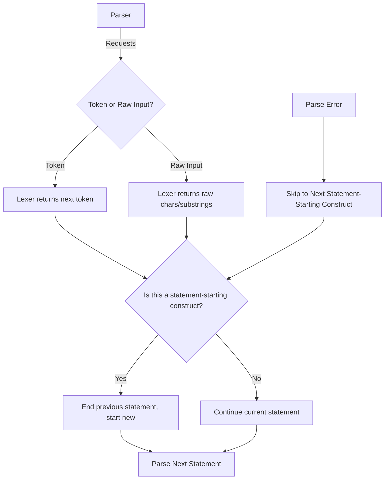

# Statement Boundary Detection and Hybrid Scannerless Parsing in Patlang

## Overview

This document describes the hybrid scannerless parsing approach used in the Patlang Rust runtime, focusing on how the parser detects statement boundaries and manages context-sensitive constructs. In this model, the parser is in full control of context-sensitive parsing and statement boundaries, while the lexer is retained as a utility. This approach enables flexible, natural-language-inspired syntax, robust error recovery, and modular code without a significant increase in parser complexity.

---

## Hybrid Scannerless Parsing Approach

- **Parser-driven control:** The parser manages all context-sensitive parsing and determines statement boundaries.
- **Lexer as a utility:** The parser requests the next token (or peeks ahead) from the lexer as needed, but can also request raw characters or substrings for context-sensitive constructs.
- **Whitespace, newlines, and filler words:** These are handled by the parser, not the lexer, except where required for string literals or comments.
- **Flexible integration:** The parser can seamlessly switch between token-based and character-based parsing, allowing for advanced language features and natural language constructs.

---

## Statement Boundaries and Newlines

- Statement boundaries are determined solely by the appearance of a new statement-starting construct, as identified by the parser.
- Newlines are never used to determine statement boundaries, regardless of context.
- Multi-line statements and expressions are supported by tracking context (e.g., inside parentheses, brackets, or strings).
- Newlines are preserved in strings and comments.

---

## Error Recovery Strategy

- On parsing error, the parser skips input (tokens or characters) until it finds a construct that can validly start a new statement.
- Newlines are not used as synchronization points for error recovery.
- This allows the parser to recover from errors and continue parsing subsequent statements.

---

## Support for Natural Language and Filler Words

- The parser can handle natural language and filler words, either ignoring them or treating them as part of statements, depending on context.
- Filler words do not disrupt statement boundary detection if they do not match statement-starting constructs.
- The parser may request raw input to resolve ambiguous or flexible syntax.

---

## Rationale and Benefits

- **Flexible syntax:** Enables natural-language-inspired and context-sensitive constructs that are difficult or impossible with traditional token-driven parsers.
- **Robust error recovery:** The parser can skip to the next valid statement-starting construct, improving resilience.
- **Modular code:** Lexer and parser are decoupled; the parser integrates lexer calls as needed.
- **No major complexity increase:** The parser simply integrates lexer calls and raw input requests as needed, without a significant increase in complexity.
- **Advanced features:** Supports features like context-sensitive keywords, embedded DSLs, and flexible whitespace handling.

---

## Examples

### Valid Code

**One-line statements:**
```
let a = 1
let b = 2
```

**Multi-line statement:**
```
let sum = add(
    1,
    2,
    3
)
```

**Natural language/filler:**
```
let result = calculate  // please compute the result
```

**Context-sensitive construct (parser requests raw input):**
```
let x = if condition then do_something else do_otherwise
```
*Here, the parser may request raw input to distinguish between keywords and identifiers based on context.*

### Invalid Code and Error Recovery

**Example with error:**
```
let x = 1
let y = 
oops this is not valid
let z = 3
```
- The parser skips `oops this is not valid` after the error and resumes at `let z = 3`.

### Edge Cases

- **Newlines in strings:**
  ```
  let s = "hello
  world"
  ```
  Newline inside string is preserved as part of the string and is not a statement boundary.

- **Ambiguous starts:**  
  ```
  let x = 1
  (2 + 3)
  ```
  If a line could be a continuation or a new statement, lookahead and context decide. This example would be an error (expression without any purpose).

---

## Mermaid Diagram: Hybrid Scannerless Parsing and Statement Boundary Detection



---

## Summary

- The parser is in control of all context-sensitive parsing and statement boundaries.
- The lexer is a utility: the parser requests tokens or raw input as needed.
- Newlines, whitespace, and filler words are handled by the parser, except in strings/comments.
- This approach enables flexible syntax, robust error recovery, and modular code.
- No major increase in parser complexity is expected.
- See above for rules, rationale, examples, and an updated diagram.